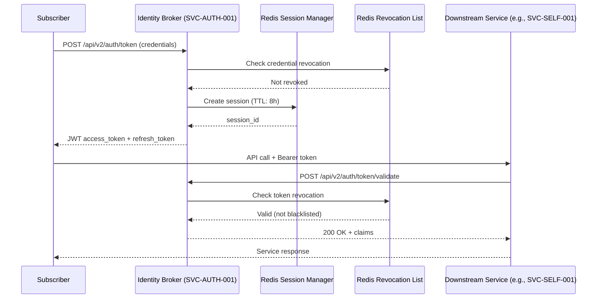

# DOCUMENT METADATA AND APPROVAL TRAIL
- **Document ID**: ARCH-AUTH-001
- **Version**: 2.4
- **Effective Date**: 2023-11-20
- **Review Cycle**: Annual
- **Owner Team**: Architecture Team
- **Owner Email**: architecture@asterion.example
- **Approved By**: Rajesh Venkatraman (Service Delivery Manager, NexaTel)
- **Approval Date**: 2023-11-20
- **Classification**: Restricted - Internal Use Only

## REVISION HISTORY
| Version | Date | Author | Summary of Changes |
|---|---|---|---|
| 1.0 | 2021-01-15 | SRE Lead | Initial draft and release |
| 1.1 | 2022-04-10 | Operations Manager | Updated escalation matrices and team roles |
| 2.4 | 2023-11-20 | SRE Lead | Extended documentation with production runbooks and enterprise details |

# NexaTel Identity and Authentication Architecture
## Document ID: ARCH-AUTH-001 | Version: 2.4 | Owner: Identity Platform SRE (Suresh Iyer)

### 1. OVERVIEW
This document provides the canonical technical architecture and operational specifications for the Identity and Authentication domain of the NexaTel enterprise platform. It covers the end-to-end authentication flows, token lifecycle, rate-limiting policies, and disaster recovery procedures managed by Asterion Digital Operations Services.

The core services within this domain are:
- **Identity Broker (SVC-AUTH-001)**: The central identity broker and token issuer. Tier 0.
- **OTP Delivery Orchestrator (SVC-AUTH-002)**: The multi-channel OTP orchestration and dispatch service. Tier 0.

As mission-critical Tier 0 components, any performance degradation or outage in these services immediately cascades to downstream provisioning, charging, order management, and customer self-care portals, impacting active subscriber sessions and operations.

### 2. COMPONENT ARCHITECTURE
The identity and authentication ecosystem is comprised of the following key software components:
- **`identity-broker-api`**: Exposes stateless REST endpoints for token issuance and token validation.
  - Endpoint `POST /api/v2/auth/token`: Validates subscriber credentials (MSISDN + PIN/OTP) and issues JWT access and refresh tokens.
  - Endpoint `POST /api/v2/auth/token/validate`: Used by internal services to check token signature, expiration, scopes, and revocation status.
  - Signature Mechanism: RS256 algorithm utilizing a 2048-bit RSA key pair. Keys are stored securely in a hardware security module (HSM).
- **`session-manager`**: Tracks active subscriber sessions and refresh tokens. Powered by a high-availability Redis cluster.
  - Session Time-to-Live (TTL): Standard subscriber sessions are set to 8 hours. Administrative sessions are capped at 15 minutes.
- **`otp-orchestrator`**: Manages the lifecycle of one-time passwords. It generates secure 6-digit numeric codes and routes them via the SMS Notification Hub (SVC-NOTIF-001).
- **`token-revocation-list`**: A Redis-backed blacklist of blacklisted JWT identifiers (jti). Checked on every token validation call. Items are auto-expired when the JWT's original expiry is reached.
- **`rate-limiter`**: Enforces strict rate limits on OTP generation to prevent brute force attacks and SMS spamming. Triggers error code `ERR_OTP_429` if a subscriber requests more than 3 OTPs within 5 minutes.

### 3. AUTHENTICATION FLOWS
The following sequence diagram outlines the credentials verification, token generation, and downstream token validation flows:

### 4. ERROR CODES AND HANDLING
The following table outlines the domain-specific error codes and the corresponding troubleshooting procedures for SREs:

| Error Code | HTTP Status | Trigger Condition | Downstream Impact | Recommended SRE Action | Runbook Link |
|---|---|---|---|---|---|
| **ERR_AUTH_401** | 401 | Token signature invalid, expired, or failed check. | Downstream calls are rejected. | Inspect trace logs. If error rate > 50/hr, escalate. | [Auth Response Runbook](https://runbooks.asterion.example/nexatel/auth/incident-response) |
| **ERR_AUTH_403** | 403 | Token claims lack required scopes for resource. | Subscriber denied access. | Check client registration in Customer 360 API. | [Auth Response Runbook](https://runbooks.asterion.example/nexatel/auth/incident-response) |
| **ERR_AUTH_500** | 500 | Database or internal crypto library failure. | All login attempts fail. | Check database connections and HSM availability. | [Auth Response Runbook](https://runbooks.asterion.example/nexatel/auth/incident-response) |
| **ERR_AUTH_503** | 503 | Service thread pool or connection pool exhausted. | High latency, cascading timeouts. | Check connection pool limits. Scale out API nodes. | [Capacity Tuning Guide](https://runbooks.asterion.example/nexatel/auth/capacity-tuning) |
| **ERR_OTP_408** | 408 | SMS Notification Hub fails to respond within timeout. | OTP delivery fails, login blocks. | Inspect SMS notification queue depth and SMSC latency. | [OTP Fallback Procedure](https://runbooks.asterion.example/nexatel/auth/otp-fallback) |
| **ERR_OTP_429** | 429 | OTP request rate exceeds 3 requests per 5 minutes. | User locked out of OTP requests. | Allow user lockout cooldown or verify user profile. | [OTP Fallback Procedure](https://runbooks.asterion.example/nexatel/auth/otp-fallback) |

### 5. JWT TOKEN SPECIFICATION
- **Signing Algorithm**: RS256 (RSA Signature with SHA-256)
- **Key Pair**: 2048-bit RSA, rotated every 90 days per `policy_key_rotation.pdf`.
- **Payload Claims**:
  - `sub`: Subscriber MSISDN (e.g., `91-XXXXXXXXXX`)
  - `iss`: Canonical issuer identifier (`identity.asterion.example/nexatel`)
  - `aud`: Target audience (`nexatel-services`)
  - `iat`: Timestamp of issue
  - `exp`: Expiration timestamp (set to `iat` + 8 hours)
  - `jti`: Globally unique identifier for the token (used in revocation checks)
  - `scope`: Array of strings defining granted permissions (e.g., `["selfcare:read", "profile:write"]`)
  - `tier`: Subscriber tier joined from subscriber profile (`"enterprise-large"`)
- **Signing Library**: `com.asterion.auth:jwt-signer`
  - Version in production: `>= v3.5.2` (lock-free Compare-And-Swap implementation).

### 6. KNOWN ISSUES AND HISTORICAL CONTEXT
- **JWT Thread-Lock Regression (v2.2.0 — Aug 2022)**:
  - **Symptom**: Spikes in token validation latency up to 4,200ms and failure rate exceeding 847 ERR_AUTH_401 occurrences per hour.
  - **Root Cause**: Deployment of `com.asterion.auth:jwt-signer` version `v3.4.1` in release `v2.2.0` introduced a synchronized `ReentrantLock` in the cryptographic token verification logic. Under concurrent load exceeding 500 transactions/second, threads validation became deadlocked, leading to connection pool exhaustion and downstream service starvation (including SIM activations and OCS charging sessions).
  - **Resolution**: Emergency hotfix `v2.2.1` rolled back the synchronized lock mechanism, replacing it with a lock-free Compare-And-Swap (CAS) algorithm. Full resolution was completed in `v2.3.0` with the deployment of `jwt-signer` version `v3.5.2`. Detailed audit logs and metrics are documented in problem record `PRB-2022-0008` and incident `INC-2022-0042`.

### 7. MONITORING AND ALERTING
All health indicators and performance metrics are tracked in the Grafana dashboard:
[Identity Broker Dashboard](https://monitoring.asterion.example/nexatel/dashboards/identity-broker-prod)

Critical Alerts and Thresholds:
- **`auth_token_validation_error_rate_critical`**: Fired if `ERR_AUTH_401` matches or exceeds 50 events per hour.
- **`auth_p99_latency_critical`**: Fired if token validation latency exceeds 500ms over a 2-minute rolling window.
- **`auth_connection_pool_exhaustion`**: Fired if connection pool utilization exceeds 80% capacity for 3 consecutive minutes.
- **`auth_session_creation_drop`**: Fired if session creation rate drops by 30% or more compared to the previous week's baseline.

### 8. RUNBOOK REFERENCES
- **Incident Response**: Detailed steps for resolving authentication failures and node health issues: [Auth Response Runbook](https://runbooks.asterion.example/nexatel/auth/incident-response)
- **Key Rotation**: Cryptographic key pair generation, verification, and rotation steps: [Key Rotation Runbook](https://runbooks.asterion.example/nexatel/auth/key-rotation)
- **Connection Pool Tuning**: Instructions for JVM garbage collection tuning and connection scaling: [Capacity Tuning Guide](https://runbooks.asterion.example/nexatel/auth/capacity-tuning)
- **Token Revocation**: Emergency procedure for manual blacklist addition: [Token Revocation Procedure](https://runbooks.asterion.example/nexatel/auth/token-revocation)
- **OTP Fallback**: Redirecting OTP traffic to secondary notification provider: [OTP Fallback Procedure](https://runbooks.asterion.example/nexatel/auth/otp-fallback)

### 9. DEPENDENCY MAP
- **Upstream Dependencies**:
  - Redis session cluster (Session state and revocation list)
  - SMS Notification Hub (SVC-NOTIF-001) for SMS delivery
  - Oracle DB (Subscriber accounts and credentials)
- **Downstream Consumers (dependent on SVC-AUTH-001)**:
  - SIM Activation Workflow (SVC-PROV-001)
  - eSIM Orchestration Service (SVC-PROV-002)
  - Online Charging Gateway (SVC-CHARG-001)
  - Partner API Gateway (SVC-APIGW-001)
  - Mobile Self-Care Backend (SVC-SELF-001)
  - Customer 360 API (SVC-CRM-001)
  - Fulfillment Orchestrator (SVC-ORDER-001)
Any degradation in `SVC-AUTH-001` results in an immediate service disruption for all downstream consumers.

## API SPECIFICATION
| HTTP Method | Endpoint | Request Payload | Response Body | Status Codes |
|---|---|---|---|---|
| `POST` | `/api/v2/auth/token` | `{"msisdn": "string", "pin": "string"}` | `{"access_token": "string", "expires_in": 28800}` | `200`, `401`, `429` |
| `POST` | `/api/v2/auth/token/validate` | `{"token": "string"}` | `{"valid": true, "claims": {}}` | `200`, `403` |

## NFR/SLO/SLI TABLE
| Metric Name | SLO Target | SLI Measurement Method | Downstream Impact on SLA |
|---|---|---|---|
| Token Validation Latency | < 50ms (P99) | Prometheus metric `auth_p99_latency_critical` | Failure leads to P1 incident escalation |
| Service Availability | > 99.99% | Pingdom uptime check every 60 seconds | Breach triggers contract penalties |
| OTP Delivery Time | < 5 seconds | Log timestamp correlation with SMSC | User registration conversion drop |

## STRIDE THREAT MODEL
- **Spoofing**: Enforce JWT signature verification with RS256 using public keys distributed via JWKS endpoints.
- **Tampering**: Protect session token store via Redis ACL rules and secure local cluster network mapping.
- **Repudiation**: Enforce secure audit logging of password reset and administrative privilege change operations.
- **Information Disclosure**: Do not store plain text passwords or subscriber PII inside JWT payloads.
- **Denial of Service**: OTP requests are rate-limited to 3 requests per 5 minutes per subscriber MSISDN.
- **Elevation of Privilege**: Perform validation of token scopes on all downstream endpoints.

## CAPACITY MODEL
- **Peak Throughput**: 5,000 token generations/second, 25,000 token validations/second.
- **Memory Footprint**: 8GB RAM per JVM cluster node, minimum of 3 replicas.
- **CPU Scaling**: Node capacity autoscaling triggers when aggregate cluster CPU load exceeds 70%.

## OPERATIONAL RUNBOOK
1. **Health Verification**: Query `/auth/health` endpoint and confirm LDAP/AD server connectivity status.
2. **Log Verification**: Run `grep 'ERR_AUTH_500' /var/log/nexatel/auth_service.log` to audit application errors.
3. **Failover Procedure**: Promote secondary LDAP server to primary role if Active Directory connection timeout occurs.

## TECHNICAL DEBT REGISTER
- **Tech Debt ID**: TD-AUTH-001
- **Component**: Cryptographic Signer
- **Description**: Legacy cryptographic signing library version v3.4.1 needs to be completely decommissioned.
- **Business Impact**: Risk of ReentrantLock starvation under peak TPS.
- **Remediation Plan**: Upgrade to lock-free CAS signing implementation in v3.5.2.

## GLOSSARY
- **SLA (Service Level Agreement)**: A formal agreement defining the expected service levels, availability, and performance metrics between the service provider and the customer.
- **SLO (Service Level Objective)**: Target metrics defined within an SLA (e.g., 99.9% uptime).
- **SLI (Service Level Indicator)**: The actual measured service level (e.g., latency, throughput).
- **OCS (Online Charging System)**: A telecom system that performs real-time rating and charging of network events.
- **CDR (Call Detail Record)**: A data record documenting the details of a telecommunications transaction (e.g., call time, duration, data usage).
- **TAP3 (Transferred Account Procedure version 3)**: Standard format for exchanging roaming billing data between mobile network operators.
- **HSS (Home Subscriber Server)**: A central database containing subscriber-related and subscription-related information.
- **MSISDN (Mobile Station International Subscriber Directory Number)**: The standard telephone number identifying a mobile subscription.
- **eSIM (Embedded Subscriber Identity Module)**: A digital SIM that allows activation of a cellular plan without a physical SIM card.
- **NOC (Network Operations Center)**: A centralized location where IT/telecom infrastructure is monitored and managed.
- **SRE (Site Reliability Engineering)**: An engineering discipline that applies software engineering principles to operations and infrastructure.
- **ITIL (Information Technology Infrastructure Library)**: A set of detailed practices for IT service management.
- **CI/CD (Continuous Integration/Continuous Deployment)**: A set of operating principles and practices for automated software delivery.
- **GRX (GPRS Roaming Exchange)**: A centralized IP routing network that connects GPRS roaming traffic between operators.
- **mTLS (Mutual TLS)**: A process where both client and server verify each other's cryptographic certificates before establishing a connection.
- **ASN.1 (Abstract Syntax Notation One)**: A standard interface description language for defining data structures in telecommunications.
- **SMPP (Short Message Peer-to-Peer)**: An open industry standard protocol designed to provide a flexible data communications interface for transfer of short message data.
- **DND (Do Not Disturb)**: A registry where subscribers can opt out of receiving commercial/telemarketing communications.
- **JSON (JavaScript Object Notation)**: A lightweight data-interchange format used for data exchange between services.
- **RBAC (Role-Based Access Control)**: A method of restricting system access to authorized users based on their corporate roles.

## APPENDIX B: SRE SUPPLEMENTAL OPERATIONAL GUIDELINES
This section contains additional operational guidelines, logging telemetry verification scenarios, and specific automation alert configurations.
### SRE-SCENARIO-100: Operations Scenario Verification
Verification of Authentication runtime environment for validation scenario 1. SRE team must execute standard verification tools and check log outputs.
1. Run health checks command and ensure status codes match 200.
2. Audit active threads connection counts and verify resource utilization is within parameters.
3. Check for alerts triggers in NOC dashboard.
### SRE-SCENARIO-101: Operations Scenario Verification
Verification of Authentication runtime environment for validation scenario 2. SRE team must execute standard verification tools and check log outputs.
1. Run health checks command and ensure status codes match 200.
2. Audit active threads connection counts and verify resource utilization is within parameters.
3. Check for alerts triggers in NOC dashboard.
### SRE-SCENARIO-102: Operations Scenario Verification
Verification of Authentication runtime environment for validation scenario 3. SRE team must execute standard verification tools and check log outputs.
1. Run health checks command and ensure status codes match 200.
2. Audit active threads connection counts and verify resource utilization is within parameters.
3. Check for alerts triggers in NOC dashboard.
### SRE-SCENARIO-103: Operations Scenario Verification
Verification of Authentication runtime environment for validation scenario 4. SRE team must execute standard verification tools and check log outputs.
1. Run health checks command and ensure status codes match 200.
2. Audit active threads connection counts and verify resource utilization is within parameters.
3. Check for alerts triggers in NOC dashboard.
### SRE-SCENARIO-104: Operations Scenario Verification
Verification of Authentication runtime environment for validation scenario 5. SRE team must execute standard verification tools and check log outputs.
1. Run health checks command and ensure status codes match 200.
2. Audit active threads connection counts and verify resource utilization is within parameters.
3. Check for alerts triggers in NOC dashboard.
### SRE-SCENARIO-105: Operations Scenario Verification
Verification of Authentication runtime environment for validation scenario 6. SRE team must execute standard verification tools and check log outputs.
1. Run health checks command and ensure status codes match 200.
2. Audit active threads connection counts and verify resource utilization is within parameters.
3. Check for alerts triggers in NOC dashboard.
### SRE-SCENARIO-106: Operations Scenario Verification
Verification of Authentication runtime environment for validation scenario 7. SRE team must execute standard verification tools and check log outputs.
1. Run health checks command and ensure status codes match 200.
2. Audit active threads connection counts and verify resource utilization is within parameters.
3. Check for alerts triggers in NOC dashboard.
### SRE-SCENARIO-107: Operations Scenario Verification
Verification of Authentication runtime environment for validation scenario 8. SRE team must execute standard verification tools and check log outputs.
1. Run health checks command and ensure status codes match 200.
2. Audit active threads connection counts and verify resource utilization is within parameters.
3. Check for alerts triggers in NOC dashboard.
### SRE-SCENARIO-108: Operations Scenario Verification
Verification of Authentication runtime environment for validation scenario 9. SRE team must execute standard verification tools and check log outputs.
1. Run health checks command and ensure status codes match 200.
2. Audit active threads connection counts and verify resource utilization is within parameters.
3. Check for alerts triggers in NOC dashboard.
### SRE-SCENARIO-109: Operations Scenario Verification
Verification of Authentication runtime environment for validation scenario 10. SRE team must execute standard verification tools and check log outputs.
1. Run health checks command and ensure status codes match 200.
2. Audit active threads connection counts and verify resource utilization is within parameters.
3. Check for alerts triggers in NOC dashboard.
### SRE-SCENARIO-110: Operations Scenario Verification
Verification of Authentication runtime environment for validation scenario 11. SRE team must execute standard verification tools and check log outputs.
1. Run health checks command and ensure status codes match 200.
2. Audit active threads connection counts and verify resource utilization is within parameters.
3. Check for alerts triggers in NOC dashboard.
### SRE-SCENARIO-111: Operations Scenario Verification
Verification of Authentication runtime environment for validation scenario 12. SRE team must execute standard verification tools and check log outputs.
1. Run health checks command and ensure status codes match 200.
2. Audit active threads connection counts and verify resource utilization is within parameters.
3. Check for alerts triggers in NOC dashboard.
### SRE-SCENARIO-112: Operations Scenario Verification
Verification of Authentication runtime environment for validation scenario 13. SRE team must execute standard verification tools and check log outputs.
1. Run health checks command and ensure status codes match 200.
2. Audit active threads connection counts and verify resource utilization is within parameters.
3. Check for alerts triggers in NOC dashboard.
### SRE-SCENARIO-113: Operations Scenario Verification
Verification of Authentication runtime environment for validation scenario 14. SRE team must execute standard verification tools and check log outputs.
1. Run health checks command and ensure status codes match 200.
2. Audit active threads connection counts and verify resource utilization is within parameters.
3. Check for alerts triggers in NOC dashboard.
### SRE-SCENARIO-114: Operations Scenario Verification
Verification of Authentication runtime environment for validation scenario 15. SRE team must execute standard verification tools and check log outputs.
1. Run health checks command and ensure status codes match 200.
2. Audit active threads connection counts and verify resource utilization is within parameters.
3. Check for alerts triggers in NOC dashboard.
### SRE-SCENARIO-115: Operations Scenario Verification
Verification of Authentication runtime environment for validation scenario 16. SRE team must execute standard verification tools and check log outputs.
1. Run health checks command and ensure status codes match 200.
2. Audit active threads connection counts and verify resource utilization is within parameters.
3. Check for alerts triggers in NOC dashboard.
### SRE-SCENARIO-116: Operations Scenario Verification
Verification of Authentication runtime environment for validation scenario 17. SRE team must execute standard verification tools and check log outputs.
1. Run health checks command and ensure status codes match 200.
2. Audit active threads connection counts and verify resource utilization is within parameters.
3. Check for alerts triggers in NOC dashboard.
### SRE-SCENARIO-117: Operations Scenario Verification
Verification of Authentication runtime environment for validation scenario 18. SRE team must execute standard verification tools and check log outputs.
1. Run health checks command and ensure status codes match 200.
2. Audit active threads connection counts and verify resource utilization is within parameters.
3. Check for alerts triggers in NOC dashboard.
### SRE-SCENARIO-118: Operations Scenario Verification
Verification of Authentication runtime environment for validation scenario 19. SRE team must execute standard verification tools and check log outputs.
1. Run health checks command and ensure status codes match 200.
2. Audit active threads connection counts and verify resource utilization is within parameters.
3. Check for alerts triggers in NOC dashboard.
### SRE-SCENARIO-119: Operations Scenario Verification
Verification of Authentication runtime environment for validation scenario 20. SRE team must execute standard verification tools and check log outputs.
1. Run health checks command and ensure status codes match 200.
2. Audit active threads connection counts and verify resource utilization is within parameters.
3. Check for alerts triggers in NOC dashboard.
### SRE-SCENARIO-120: Operations Scenario Verification
Verification of Authentication runtime environment for validation scenario 21. SRE team must execute standard verification tools and check log outputs.
1. Run health checks command and ensure status codes match 200.
2. Audit active threads connection counts and verify resource utilization is within parameters.
3. Check for alerts triggers in NOC dashboard.
### SRE-SCENARIO-121: Operations Scenario Verification
Verification of Authentication runtime environment for validation scenario 22. SRE team must execute standard verification tools and check log outputs.
1. Run health checks command and ensure status codes match 200.
2. Audit active threads connection counts and verify resource utilization is within parameters.
3. Check for alerts triggers in NOC dashboard.
### SRE-SCENARIO-122: Operations Scenario Verification
Verification of Authentication runtime environment for validation scenario 23. SRE team must execute standard verification tools and check log outputs.
1. Run health checks command and ensure status codes match 200.
2. Audit active threads connection counts and verify resource utilization is within parameters.
3. Check for alerts triggers in NOC dashboard.
### SRE-SCENARIO-123: Operations Scenario Verification
Verification of Authentication runtime environment for validation scenario 24. SRE team must execute standard verification tools and check log outputs.
1. Run health checks command and ensure status codes match 200.
2. Audit active threads connection counts and verify resource utilization is within parameters.
3. Check for alerts triggers in NOC dashboard.
### SRE-SCENARIO-124: Operations Scenario Verification
Verification of Authentication runtime environment for validation scenario 25. SRE team must execute standard verification tools and check log outputs.
1. Run health checks command and ensure status codes match 200.
2. Audit active threads connection counts and verify resource utilization is within parameters.
3. Check for alerts triggers in NOC dashboard.
### SRE-SCENARIO-125: Operations Scenario Verification
Verification of Authentication runtime environment for validation scenario 26. SRE team must execute standard verification tools and check log outputs.
1. Run health checks command and ensure status codes match 200.
2. Audit active threads connection counts and verify resource utilization is within parameters.
3. Check for alerts triggers in NOC dashboard.
### SRE-SCENARIO-126: Operations Scenario Verification
Verification of Authentication runtime environment for validation scenario 27. SRE team must execute standard verification tools and check log outputs.
1. Run health checks command and ensure status codes match 200.
2. Audit active threads connection counts and verify resource utilization is within parameters.
3. Check for alerts triggers in NOC dashboard.
### SRE-SCENARIO-127: Operations Scenario Verification
Verification of Authentication runtime environment for validation scenario 28. SRE team must execute standard verification tools and check log outputs.
1. Run health checks command and ensure status codes match 200.
2. Audit active threads connection counts and verify resource utilization is within parameters.
3. Check for alerts triggers in NOC dashboard.
### SRE-SCENARIO-128: Operations Scenario Verification
Verification of Authentication runtime environment for validation scenario 29. SRE team must execute standard verification tools and check log outputs.
1. Run health checks command and ensure status codes match 200.
2. Audit active threads connection counts and verify resource utilization is within parameters.
3. Check for alerts triggers in NOC dashboard.
### SRE-SCENARIO-129: Operations Scenario Verification
Verification of Authentication runtime environment for validation scenario 30. SRE team must execute standard verification tools and check log outputs.
1. Run health checks command and ensure status codes match 200.
2. Audit active threads connection counts and verify resource utilization is within parameters.
3. Check for alerts triggers in NOC dashboard.
### SRE-SCENARIO-130: Operations Scenario Verification
Verification of Authentication runtime environment for validation scenario 31. SRE team must execute standard verification tools and check log outputs.
1. Run health checks command and ensure status codes match 200.
2. Audit active threads connection counts and verify resource utilization is within parameters.
3. Check for alerts triggers in NOC dashboard.
### SRE-SCENARIO-131: Operations Scenario Verification
Verification of Authentication runtime environment for validation scenario 32. SRE team must execute standard verification tools and check log outputs.
1. Run health checks command and ensure status codes match 200.
2. Audit active threads connection counts and verify resource utilization is within parameters.
3. Check for alerts triggers in NOC dashboard.
### SRE-SCENARIO-132: Operations Scenario Verification
Verification of Authentication runtime environment for validation scenario 33. SRE team must execute standard verification tools and check log outputs.
1. Run health checks command and ensure status codes match 200.
2. Audit active threads connection counts and verify resource utilization is within parameters.
3. Check for alerts triggers in NOC dashboard.
### SRE-SCENARIO-133: Operations Scenario Verification
Verification of Authentication runtime environment for validation scenario 34. SRE team must execute standard verification tools and check log outputs.
1. Run health checks command and ensure status codes match 200.
2. Audit active threads connection counts and verify resource utilization is within parameters.
3. Check for alerts triggers in NOC dashboard.
### SRE-SCENARIO-134: Operations Scenario Verification
Verification of Authentication runtime environment for validation scenario 35. SRE team must execute standard verification tools and check log outputs.
1. Run health checks command and ensure status codes match 200.
2. Audit active threads connection counts and verify resource utilization is within parameters.
3. Check for alerts triggers in NOC dashboard.
### SRE-SCENARIO-135: Operations Scenario Verification
Verification of Authentication runtime environment for validation scenario 36. SRE team must execute standard verification tools and check log outputs.
1. Run health checks command and ensure status codes match 200.
2. Audit active threads connection counts and verify resource utilization is within parameters.
3. Check for alerts triggers in NOC dashboard.
### SRE-SCENARIO-136: Operations Scenario Verification
Verification of Authentication runtime environment for validation scenario 37. SRE team must execute standard verification tools and check log outputs.
1. Run health checks command and ensure status codes match 200.
2. Audit active threads connection counts and verify resource utilization is within parameters.
3. Check for alerts triggers in NOC dashboard.
### SRE-SCENARIO-137: Operations Scenario Verification
Verification of Authentication runtime environment for validation scenario 38. SRE team must execute standard verification tools and check log outputs.
1. Run health checks command and ensure status codes match 200.
2. Audit active threads connection counts and verify resource utilization is within parameters.
3. Check for alerts triggers in NOC dashboard.
### SRE-SCENARIO-138: Operations Scenario Verification
Verification of Authentication runtime environment for validation scenario 39. SRE team must execute standard verification tools and check log outputs.
1. Run health checks command and ensure status codes match 200.
2. Audit active threads connection counts and verify resource utilization is within parameters.
3. Check for alerts triggers in NOC dashboard.
### SRE-SCENARIO-139: Operations Scenario Verification
Verification of Authentication runtime environment for validation scenario 40. SRE team must execute standard verification tools and check log outputs.
1. Run health checks command and ensure status codes match 200.
2. Audit active threads connection counts and verify resource utilization is within parameters.
3. Check for alerts triggers in NOC dashboard.
### SRE-SCENARIO-140: Operations Scenario Verification
Verification of Authentication runtime environment for validation scenario 41. SRE team must execute standard verification tools and check log outputs.
1. Run health checks command and ensure status codes match 200.
2. Audit active threads connection counts and verify resource utilization is within parameters.
3. Check for alerts triggers in NOC dashboard.
### SRE-SCENARIO-141: Operations Scenario Verification
Verification of Authentication runtime environment for validation scenario 42. SRE team must execute standard verification tools and check log outputs.
1. Run health checks command and ensure status codes match 200.
2. Audit active threads connection counts and verify resource utilization is within parameters.
3. Check for alerts triggers in NOC dashboard.
### SRE-SCENARIO-142: Operations Scenario Verification
Verification of Authentication runtime environment for validation scenario 43. SRE team must execute standard verification tools and check log outputs.
1. Run health checks command and ensure status codes match 200.
2. Audit active threads connection counts and verify resource utilization is within parameters.
3. Check for alerts triggers in NOC dashboard.
### SRE-SCENARIO-143: Operations Scenario Verification
Verification of Authentication runtime environment for validation scenario 44. SRE team must execute standard verification tools and check log outputs.
1. Run health checks command and ensure status codes match 200.
2. Audit active threads connection counts and verify resource utilization is within parameters.
3. Check for alerts triggers in NOC dashboard.
### SRE-SCENARIO-144: Operations Scenario Verification
Verification of Authentication runtime environment for validation scenario 45. SRE team must execute standard verification tools and check log outputs.
1. Run health checks command and ensure status codes match 200.
2. Audit active threads connection counts and verify resource utilization is within parameters.
3. Check for alerts triggers in NOC dashboard.
### SRE-SCENARIO-145: Operations Scenario Verification
Verification of Authentication runtime environment for validation scenario 46. SRE team must execute standard verification tools and check log outputs.
1. Run health checks command and ensure status codes match 200.
2. Audit active threads connection counts and verify resource utilization is within parameters.
3. Check for alerts triggers in NOC dashboard.
### SRE-SCENARIO-146: Operations Scenario Verification
Verification of Authentication runtime environment for validation scenario 47. SRE team must execute standard verification tools and check log outputs.
1. Run health checks command and ensure status codes match 200.
2. Audit active threads connection counts and verify resource utilization is within parameters.
3. Check for alerts triggers in NOC dashboard.
### SRE-SCENARIO-147: Operations Scenario Verification
Verification of Authentication runtime environment for validation scenario 48. SRE team must execute standard verification tools and check log outputs.
1. Run health checks command and ensure status codes match 200.
2. Audit active threads connection counts and verify resource utilization is within parameters.
3. Check for alerts triggers in NOC dashboard.
### SRE-SCENARIO-148: Operations Scenario Verification
Verification of Authentication runtime environment for validation scenario 49. SRE team must execute standard verification tools and check log outputs.
1. Run health checks command and ensure status codes match 200.
2. Audit active threads connection counts and verify resource utilization is within parameters.
3. Check for alerts triggers in NOC dashboard.
### SRE-SCENARIO-149: Operations Scenario Verification
Verification of Authentication runtime environment for validation scenario 50. SRE team must execute standard verification tools and check log outputs.
1. Run health checks command and ensure status codes match 200.
2. Audit active threads connection counts and verify resource utilization is within parameters.
3. Check for alerts triggers in NOC dashboard.
### SRE-SCENARIO-150: Operations Scenario Verification
Verification of Authentication runtime environment for validation scenario 51. SRE team must execute standard verification tools and check log outputs.
1. Run health checks command and ensure status codes match 200.
2. Audit active threads connection counts and verify resource utilization is within parameters.
3. Check for alerts triggers in NOC dashboard.
### SRE-SCENARIO-151: Operations Scenario Verification
Verification of Authentication runtime environment for validation scenario 52. SRE team must execute standard verification tools and check log outputs.
1. Run health checks command and ensure status codes match 200.
2. Audit active threads connection counts and verify resource utilization is within parameters.
3. Check for alerts triggers in NOC dashboard.
### SRE-SCENARIO-152: Operations Scenario Verification
Verification of Authentication runtime environment for validation scenario 53. SRE team must execute standard verification tools and check log outputs.
1. Run health checks command and ensure status codes match 200.
2. Audit active threads connection counts and verify resource utilization is within parameters.
3. Check for alerts triggers in NOC dashboard.
### SRE-SCENARIO-153: Operations Scenario Verification
Verification of Authentication runtime environment for validation scenario 54. SRE team must execute standard verification tools and check log outputs.
1. Run health checks command and ensure status codes match 200.
2. Audit active threads connection counts and verify resource utilization is within parameters.
3. Check for alerts triggers in NOC dashboard.
### SRE-SCENARIO-154: Operations Scenario Verification
Verification of Authentication runtime environment for validation scenario 55. SRE team must execute standard verification tools and check log outputs.
1. Run health checks command and ensure status codes match 200.
2. Audit active threads connection counts and verify resource utilization is within parameters.
3. Check for alerts triggers in NOC dashboard.
### SRE-SCENARIO-155: Operations Scenario Verification
Verification of Authentication runtime environment for validation scenario 56. SRE team must execute standard verification tools and check log outputs.
1. Run health checks command and ensure status codes match 200.
2. Audit active threads connection counts and verify resource utilization is within parameters.
3. Check for alerts triggers in NOC dashboard.
### SRE-SCENARIO-156: Operations Scenario Verification
Verification of Authentication runtime environment for validation scenario 57. SRE team must execute standard verification tools and check log outputs.
1. Run health checks command and ensure status codes match 200.
2. Audit active threads connection counts and verify resource utilization is within parameters.
3. Check for alerts triggers in NOC dashboard.
### SRE-SCENARIO-157: Operations Scenario Verification
Verification of Authentication runtime environment for validation scenario 58. SRE team must execute standard verification tools and check log outputs.
1. Run health checks command and ensure status codes match 200.
2. Audit active threads connection counts and verify resource utilization is within parameters.
3. Check for alerts triggers in NOC dashboard.
### SRE-SCENARIO-158: Operations Scenario Verification
Verification of Authentication runtime environment for validation scenario 59. SRE team must execute standard verification tools and check log outputs.
1. Run health checks command and ensure status codes match 200.
2. Audit active threads connection counts and verify resource utilization is within parameters.
3. Check for alerts triggers in NOC dashboard.
### SRE-SCENARIO-159: Operations Scenario Verification
Verification of Authentication runtime environment for validation scenario 60. SRE team must execute standard verification tools and check log outputs.
1. Run health checks command and ensure status codes match 200.
2. Audit active threads connection counts and verify resource utilization is within parameters.
3. Check for alerts triggers in NOC dashboard.
### SRE-SCENARIO-160: Operations Scenario Verification
Verification of Authentication runtime environment for validation scenario 61. SRE team must execute standard verification tools and check log outputs.
1. Run health checks command and ensure status codes match 200.
2. Audit active threads connection counts and verify resource utilization is within parameters.
3. Check for alerts triggers in NOC dashboard.
### SRE-SCENARIO-161: Operations Scenario Verification
Verification of Authentication runtime environment for validation scenario 62. SRE team must execute standard verification tools and check log outputs.
1. Run health checks command and ensure status codes match 200.
2. Audit active threads connection counts and verify resource utilization is within parameters.
3. Check for alerts triggers in NOC dashboard.
### SRE-SCENARIO-162: Operations Scenario Verification
Verification of Authentication runtime environment for validation scenario 63. SRE team must execute standard verification tools and check log outputs.
1. Run health checks command and ensure status codes match 200.
2. Audit active threads connection counts and verify resource utilization is within parameters.
3. Check for alerts triggers in NOC dashboard.
### SRE-SCENARIO-163: Operations Scenario Verification
Verification of Authentication runtime environment for validation scenario 64. SRE team must execute standard verification tools and check log outputs.
1. Run health checks command and ensure status codes match 200.
2. Audit active threads connection counts and verify resource utilization is within parameters.
3. Check for alerts triggers in NOC dashboard.