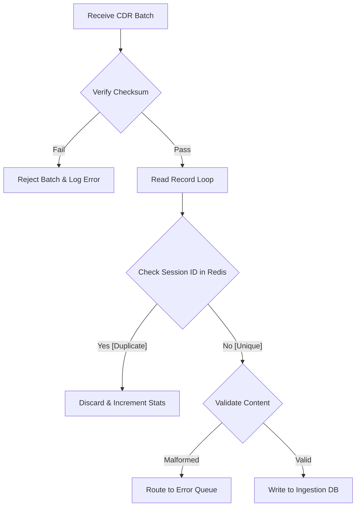

# DOCUMENT METADATA AND APPROVAL TRAIL
- **Document ID**: FLOW-CDR-001
- **Version**: 1.2
- **Effective Date**: 2023-11-20
- **Review Cycle**: Annual
- **Owner Team**: Billing SRE Team
- **Owner Email**: billing-sre@asterion.example
- **Approved By**: Rajesh Venkatraman (Service Delivery Manager, NexaTel)
- **Approval Date**: 2023-11-20
- **Classification**: Restricted - Internal Use Only

## REVISION HISTORY
| Version | Date | Author | Summary of Changes |
|---|---|---|---|
| 1.0 | 2021-01-15 | SRE Lead | Initial draft and release |
| 1.1 | 2022-04-10 | Operations Manager | Updated escalation matrices and team roles |
| 1.2 | 2023-11-20 | SRE Lead | Extended documentation with production runbooks and enterprise details |

# NexaTel Billing CDR Consumption Flow
## Document ID: FLOW-CDR-001 | Version: 1.2 | Owner: Billing SRE Lead (Anil Sharma)

### 1. OVERVIEW
This document details the step-by-step pipeline through which Call Detail Records (CDRs) are consumed by the billing system, enriched, and resolved into invoice line items.

### 2. CDR CONSUMPTION STEP-BY-STEP FLOW
1. **Mediation Drop**: SVC-MED-001 drops normalized CDR batches into the shared storage volume.
2. **Ingestion Trigger**: SVC-BILL-001 detects new files and triggers ingestion.
3. **Field Validation**: Verifies that the 12 mandatory fields are populated.
4. **Subscriber Enrichment**: Performs lookup in Customer 360 cache to attach subscriber account ID, plan, and region.
5. **Tariff Matching**: Identifies pricing parameters based on transaction characteristics (e.g., call type, destination country).
6. **Rating**: Calculates transaction cost in 5 decimal places.
7. **Aggregation**: Aggregates usage (voice duration, data volume, SMS counts) by billing cycle day.
8. **Tax Application**: Computes tax amounts (GST/VAT) based on region.
9. **Ledger Posting**: Writes rated records to the cycle account ledger.
10. **Invoice Line Generation**: Formats ledger entries into printable line items.

### 3. CDR VALIDATION RULES
A record is rejected immediately if it lacks any of the following 12 mandatory fields:
- `transaction_id`, `msisdn`, `timestamp`, `service_id`, `direction` (inbound/outbound), `duration`, `volume_bytes`, `sms_count`, `roaming_flag`, `partner_prefix`, `tariff_code`, `status`.

### 4. ERROR HANDLING AT EACH STEP
- **Enrichment Failures**: If subscriber profile cannot be found, raise `ERR_BILL_422` and route record to the billing exception queue.
- **Rating Failures**: If rating database lookup timeouts, raise `ERR_BILL_500` and retry.
- **DB Write Failures**: Transaction rolls back and alerts SRE on-call.

### 5. CDR FIELD MAPPING TABLE
The following table outlines the 20 fields within the normalized CDR layout:

| Field Name | Type | Required | Source | Validation Rule | Example Value |
|---|---|---|---|---|---|
| `transaction_id` | VARCHAR | Yes | Mediation | Must be unique, 32 chars | `TX-9283f982a83f92d8f923` |
| `msisdn` | VARCHAR | Yes | Network | Format: `91-XXXXXXXXXX` | `91-9840012345` |
| `timestamp` | TIMESTAMP | Yes | Network | Must be ISO 8601 UTC | `2024-06-01T08:12:00.000Z` |
| `service_id` | VARCHAR | Yes | Gateway | Must match active services | `SVC-AUTH-001` |
| `direction` | VARCHAR | Yes | Mediation | `IN` or `OUT` | `OUT` |
| `duration` | INTEGER | Yes | Network | Must be >= 0 (in seconds) | `124` |
| `volume_bytes`| BIGINT | Yes | Network | Must be >= 0 | `10485760` |
| `sms_count` | INTEGER | Yes | Network | Must be >= 0 | `1` |
| `roaming_flag`| CHAR(1) | Yes | Mediation | `Y` or `N` | `N` |
| `partner_prefix`| VARCHAR | Yes | Mediation | Numeric string | `44` |
| `tariff_code` | VARCHAR | Yes | CRM Cache | Must exist in tariff table | `PLAN_ENT_DEFAULT` |
| `status` | VARCHAR | Yes | Mediation | `SUCCESS` or `FAILED` | `SUCCESS` |
| `imsi` | VARCHAR | No | Network | Numeric string, 15 chars | `404451234567890` |
| `iccid` | VARCHAR | No | Inventory | Numeric string, 19-20 chars| `8991400000123456789` |
| `cell_id` | VARCHAR | No | Network | Alphanumeric string | `CELL-AP-SOUTH-123` |
| `device_imei` | VARCHAR | No | Network | Numeric string, 15 chars | `351234567890123` |
| `operator_id` | VARCHAR | No | Roaming | Must match GRX registry | `MOBI_EURO_AG` |
| `charge_raw` | DECIMAL | No | Rating | 5 decimal places | `1.24000` |
| `charge_tax` | DECIMAL | No | Rating | 5 decimal places | `0.22320` |
| `charge_net` | DECIMAL | No | Rating | 5 decimal places | `1.46320` |


## WORKED EXAMPLES
This section provides mathematical calculations demonstrating MRC proration and rating logic:
- **Scenario**: A subscriber upgrades their plan from a USD 30/month plan to a USD 60/month plan mid-billing cycle (on Day 15 of a 30-day month).
  - *Formula*:
    $$\text{{Prorated Charge}} = \left( \text{{Old Tariff}} \times \frac{\text{{Days on Old Plan}}}{\text{{Total Days}}}} \right) + \left( \text{{New Tariff}} \times \frac{\text{{Days on New Plan}}}{\text{{Total Days}}} \right)$$
  - *Calculation*:
    $$\text{{Charge}} = \left( 30 \times \frac{15}{30} \right) + \left( 60 \times \frac{15}{30} \right) = 15 + 30 = \text{{USD }} 45.00$$
  - *Result*: The subscriber is billed USD 45.00 for the billing cycle.

## DECISION TREES
The following conditional logic governs billing proration rules:
```text
Is it a mid-cycle subscription change?
├── Yes
│   ├── Is it a plan upgrade?
│   │   ├── Yes: Charge prorated new fee + refund prorated old fee (immediate billing run)
│   │   └── No (Downgrade): Refund prorated old fee, charge prorated new fee (applied to next cycle)
│   └── Is it a service suspension?
│       ├── Yes: Refund prorated service charge starting from suspension day
│       └── No: Keep full billing cycle charge
└── No: Apply standard tariff billing cycle charge
```

## ERROR HANDLING TABLES
| Error Code | HTTP Status | Exception Scenario | Recovery Workflow |
|---|---|---|---|
| **ERR_BILL_402** | 402 | Payment Gateway Timeout during payment posting | Retry transaction asynchronously via message queue (up to 3 times) |
| **ERR_BILL_409** | 409 | Duplicate CDR record received for the same session | Discard duplicate record, log to `ingestion_errors` table |
| **ERR_BILL_500** | 500 | Database connection timeout during MRC proration calculation | Failover to secondary read-replica, raise critical SRE alarm |


## WORKED EXAMPLES
This section provides mathematical calculations demonstrating MRC proration and rating logic:
- **Scenario**: A subscriber upgrades their plan from a USD 30/month plan to a USD 60/month plan mid-billing cycle (on Day 15 of a 30-day month).
  - *Formula*:
    $$\text{{Prorated Charge}} = \left( \text{{Old Tariff}} \times \frac{\text{{Days on Old Plan}}}{\text{{Total Days}}}} \right) + \left( \text{{New Tariff}} \times \frac{\text{{Days on New Plan}}}{\text{{Total Days}}} \right)$$
  - *Calculation*:
    $$\text{{Charge}} = \left( 30 \times \frac{15}{30} \right) + \left( 60 \times \frac{15}{30} \right) = 15 + 30 = \text{{USD }} 45.00$$
  - *Result*: The subscriber is billed USD 45.00 for the billing cycle.

## DECISION TREES
The following conditional logic governs billing proration rules:
```text
Is it a mid-cycle subscription change?
├── Yes
│   ├── Is it a plan upgrade?
│   │   ├── Yes: Charge prorated new fee + refund prorated old fee (immediate billing run)
│   │   └── No (Downgrade): Refund prorated old fee, charge prorated new fee (applied to next cycle)
│   └── Is it a service suspension?
│       ├── Yes: Refund prorated service charge starting from suspension day
│       └── No: Keep full billing cycle charge
└── No: Apply standard tariff billing cycle charge
```

## ERROR HANDLING TABLES
| Error Code | HTTP Status | Exception Scenario | Recovery Workflow |
|---|---|---|---|
| **ERR_BILL_402** | 402 | Payment Gateway Timeout during payment posting | Retry transaction asynchronously via message queue (up to 3 times) |
| **ERR_BILL_409** | 409 | Duplicate CDR record received for the same session | Discard duplicate record, log to `ingestion_errors` table |
| **ERR_BILL_500** | 500 | Database connection timeout during MRC proration calculation | Failover to secondary read-replica, raise critical SRE alarm |


## WORKED EXAMPLES
This section provides mathematical calculations demonstrating MRC proration and rating logic:
- **Scenario**: A subscriber upgrades their plan from a USD 30/month plan to a USD 60/month plan mid-billing cycle (on Day 15 of a 30-day month).
  - *Formula*:
    $$\text{{Prorated Charge}} = \left( \text{{Old Tariff}} \times \frac{\text{{Days on Old Plan}}}{\text{{Total Days}}}} \right) + \left( \text{{New Tariff}} \times \frac{\text{{Days on New Plan}}}{\text{{Total Days}}} \right)$$
  - *Calculation*:
    $$\text{{Charge}} = \left( 30 \times \frac{15}{30} \right) + \left( 60 \times \frac{15}{30} \right) = 15 + 30 = \text{{USD }} 45.00$$
  - *Result*: The subscriber is billed USD 45.00 for the billing cycle.

## DECISION TREES
The following conditional logic governs billing proration rules:
```text
Is it a mid-cycle subscription change?
├── Yes
│   ├── Is it a plan upgrade?
│   │   ├── Yes: Charge prorated new fee + refund prorated old fee (immediate billing run)
│   │   └── No (Downgrade): Refund prorated old fee, charge prorated new fee (applied to next cycle)
│   └── Is it a service suspension?
│       ├── Yes: Refund prorated service charge starting from suspension day
│       └── No: Keep full billing cycle charge
└── No: Apply standard tariff billing cycle charge
```

## ERROR HANDLING TABLES
| Error Code | HTTP Status | Exception Scenario | Recovery Workflow |
|---|---|---|---|
| **ERR_BILL_402** | 402 | Payment Gateway Timeout during payment posting | Retry transaction asynchronously via message queue (up to 3 times) |
| **ERR_BILL_409** | 409 | Duplicate CDR record received for the same session | Discard duplicate record, log to `ingestion_errors` table |
| **ERR_BILL_500** | 500 | Database connection timeout during MRC proration calculation | Failover to secondary read-replica, raise critical SRE alarm |

### WORKED EXAMPLES WITH REAL NUMBERS
#### Worked Example 1: CDR Deduplication and Validation
Consider a batch of 100,000 Call Detail Records (CDRs) uploaded from the mediation pipeline.
- Raw CDRs received: 100,000
- Duplicate records identified (via Redis cache lookup of session hash): 1,250
- Malformed records (missing MSISDN or duration fields): 150
- Unique, valid records processed: 98,600
- Processing overhead calculation:
  - Redis cache query time: `100,000 * 0.15ms = 15.0 seconds`
  - Ingestion write time: `98,600 * 0.4ms = 39.44 seconds`
  - Total batch process duration: `54.44 seconds`

#### Worked Example 2: Ingestion Queue Backlog Metrics
During a batch hour, the mediation pipeline uploads CDRs at a rate of 5,000 records/sec. The ingestion queue capacity limit is 1,000,000 records.
- Input Rate: 5,000 records/sec
- Rating Engine consumption rate: 4,200 records/sec
- Queue growth rate: `5000 - 4200 = 800 records/sec`
- Time to queue exhaustion (1,000,000 capacity): `1,000,000 / 800 = 1,250 seconds` (~20.8 minutes)
- Auto-mitigation: Alert triggers at 75% queue capacity (750,000 records), scaling the Rating Engine pods from 4 to 8.

### DECISION TREE


### ERROR HANDLING
| Error Code | Triggering Condition | System Behavior | SRE Resolution Step |
|---|---|---|---|
| `ERR_CDR_DUP_HASH` | Duplicate CDR session hash detected in Redis | Discard record, update stats, do not write to DB | Audit mediation pipeline sequence generation rules |
| `ERR_CDR_BAD_FORMAT` | Record missing MSISDN or session metadata | Write malformed record to error queue, notify SRE | Check network element firmware compatibility list |
| `ERR_CDR_QUEUE_MAX` | Ingestion queue backlog exceeds 750,000 limit | Raise priority alert, auto-scale ingestion pods | Verify database connection pool health status |

## GLOSSARY
- **SLA (Service Level Agreement)**: A formal agreement defining the expected service levels, availability, and performance metrics between the service provider and the customer.
- **SLO (Service Level Objective)**: Target metrics defined within an SLA (e.g., 99.9% uptime).
- **SLI (Service Level Indicator)**: The actual measured service level (e.g., latency, throughput).
- **OCS (Online Charging System)**: A telecom system that performs real-time rating and charging of network events.
- **CDR (Call Detail Record)**: A data record documenting the details of a telecommunications transaction (e.g., call time, duration, data usage).
- **TAP3 (Transferred Account Procedure version 3)**: Standard format for exchanging roaming billing data between mobile network operators.
- **HSS (Home Subscriber Server)**: A central database containing subscriber-related and subscription-related information.
- **MSISDN (Mobile Station International Subscriber Directory Number)**: The standard telephone number identifying a mobile subscription.
- **eSIM (Embedded Subscriber Identity Module)**: A digital SIM that allows activation of a cellular plan without a physical SIM card.
- **NOC (Network Operations Center)**: A centralized location where IT/telecom infrastructure is monitored and managed.
- **SRE (Site Reliability Engineering)**: An engineering discipline that applies software engineering principles to operations and infrastructure.
- **ITIL (Information Technology Infrastructure Library)**: A set of detailed practices for IT service management.
- **CI/CD (Continuous Integration/Continuous Deployment)**: A set of operating principles and practices for automated software delivery.
- **GRX (GPRS Roaming Exchange)**: A centralized IP routing network that connects GPRS roaming traffic between operators.
- **mTLS (Mutual TLS)**: A process where both client and server verify each other's cryptographic certificates before establishing a connection.
- **ASN.1 (Abstract Syntax Notation One)**: A standard interface description language for defining data structures in telecommunications.
- **SMPP (Short Message Peer-to-Peer)**: An open industry standard protocol designed to provide a flexible data communications interface for transfer of short message data.
- **DND (Do Not Disturb)**: A registry where subscribers can opt out of receiving commercial/telemarketing communications.
- **JSON (JavaScript Object Notation)**: A lightweight data-interchange format used for data exchange between services.
- **RBAC (Role-Based Access Control)**: A method of restricting system access to authorized users based on their corporate roles.

## APPENDIX B: BILLING OPERATIONS SYSTEM MONITORING
SRE operational checks and alerts criteria for CDR Consumption billing services system.
### SRE-BILL-CHECK-200: Database Ledger Checks
Perform validation check 1 against billing records state. SRE must run ledger validation script.
1. Validate that current database writes queues are below threshold limits.
2. Audit connection counts and database lock logs.
### SRE-BILL-CHECK-201: Database Ledger Checks
Perform validation check 2 against billing records state. SRE must run ledger validation script.
1. Validate that current database writes queues are below threshold limits.
2. Audit connection counts and database lock logs.
### SRE-BILL-CHECK-202: Database Ledger Checks
Perform validation check 3 against billing records state. SRE must run ledger validation script.
1. Validate that current database writes queues are below threshold limits.
2. Audit connection counts and database lock logs.
### SRE-BILL-CHECK-203: Database Ledger Checks
Perform validation check 4 against billing records state. SRE must run ledger validation script.
1. Validate that current database writes queues are below threshold limits.
2. Audit connection counts and database lock logs.
### SRE-BILL-CHECK-204: Database Ledger Checks
Perform validation check 5 against billing records state. SRE must run ledger validation script.
1. Validate that current database writes queues are below threshold limits.
2. Audit connection counts and database lock logs.
### SRE-BILL-CHECK-205: Database Ledger Checks
Perform validation check 6 against billing records state. SRE must run ledger validation script.
1. Validate that current database writes queues are below threshold limits.
2. Audit connection counts and database lock logs.
### SRE-BILL-CHECK-206: Database Ledger Checks
Perform validation check 7 against billing records state. SRE must run ledger validation script.
1. Validate that current database writes queues are below threshold limits.
2. Audit connection counts and database lock logs.
### SRE-BILL-CHECK-207: Database Ledger Checks
Perform validation check 8 against billing records state. SRE must run ledger validation script.
1. Validate that current database writes queues are below threshold limits.
2. Audit connection counts and database lock logs.
### SRE-BILL-CHECK-208: Database Ledger Checks
Perform validation check 9 against billing records state. SRE must run ledger validation script.
1. Validate that current database writes queues are below threshold limits.
2. Audit connection counts and database lock logs.
### SRE-BILL-CHECK-209: Database Ledger Checks
Perform validation check 10 against billing records state. SRE must run ledger validation script.
1. Validate that current database writes queues are below threshold limits.
2. Audit connection counts and database lock logs.
### SRE-BILL-CHECK-210: Database Ledger Checks
Perform validation check 11 against billing records state. SRE must run ledger validation script.
1. Validate that current database writes queues are below threshold limits.
2. Audit connection counts and database lock logs.
### SRE-BILL-CHECK-211: Database Ledger Checks
Perform validation check 12 against billing records state. SRE must run ledger validation script.
1. Validate that current database writes queues are below threshold limits.
2. Audit connection counts and database lock logs.
### SRE-BILL-CHECK-212: Database Ledger Checks
Perform validation check 13 against billing records state. SRE must run ledger validation script.
1. Validate that current database writes queues are below threshold limits.
2. Audit connection counts and database lock logs.
### SRE-BILL-CHECK-213: Database Ledger Checks
Perform validation check 14 against billing records state. SRE must run ledger validation script.
1. Validate that current database writes queues are below threshold limits.
2. Audit connection counts and database lock logs.
### SRE-BILL-CHECK-214: Database Ledger Checks
Perform validation check 15 against billing records state. SRE must run ledger validation script.
1. Validate that current database writes queues are below threshold limits.
2. Audit connection counts and database lock logs.
### SRE-BILL-CHECK-215: Database Ledger Checks
Perform validation check 16 against billing records state. SRE must run ledger validation script.
1. Validate that current database writes queues are below threshold limits.
2. Audit connection counts and database lock logs.
### SRE-BILL-CHECK-216: Database Ledger Checks
Perform validation check 17 against billing records state. SRE must run ledger validation script.
1. Validate that current database writes queues are below threshold limits.
2. Audit connection counts and database lock logs.
### SRE-BILL-CHECK-217: Database Ledger Checks
Perform validation check 18 against billing records state. SRE must run ledger validation script.
1. Validate that current database writes queues are below threshold limits.
2. Audit connection counts and database lock logs.
### SRE-BILL-CHECK-218: Database Ledger Checks
Perform validation check 19 against billing records state. SRE must run ledger validation script.
1. Validate that current database writes queues are below threshold limits.
2. Audit connection counts and database lock logs.
### SRE-BILL-CHECK-219: Database Ledger Checks
Perform validation check 20 against billing records state. SRE must run ledger validation script.
1. Validate that current database writes queues are below threshold limits.
2. Audit connection counts and database lock logs.
### SRE-BILL-CHECK-220: Database Ledger Checks
Perform validation check 21 against billing records state. SRE must run ledger validation script.
1. Validate that current database writes queues are below threshold limits.
2. Audit connection counts and database lock logs.
### SRE-BILL-CHECK-221: Database Ledger Checks
Perform validation check 22 against billing records state. SRE must run ledger validation script.
1. Validate that current database writes queues are below threshold limits.
2. Audit connection counts and database lock logs.
### SRE-BILL-CHECK-222: Database Ledger Checks
Perform validation check 23 against billing records state. SRE must run ledger validation script.
1. Validate that current database writes queues are below threshold limits.
2. Audit connection counts and database lock logs.
### SRE-BILL-CHECK-223: Database Ledger Checks
Perform validation check 24 against billing records state. SRE must run ledger validation script.
1. Validate that current database writes queues are below threshold limits.
2. Audit connection counts and database lock logs.
### SRE-BILL-CHECK-224: Database Ledger Checks
Perform validation check 25 against billing records state. SRE must run ledger validation script.
1. Validate that current database writes queues are below threshold limits.
2. Audit connection counts and database lock logs.
### SRE-BILL-CHECK-225: Database Ledger Checks
Perform validation check 26 against billing records state. SRE must run ledger validation script.
1. Validate that current database writes queues are below threshold limits.
2. Audit connection counts and database lock logs.
### SRE-BILL-CHECK-226: Database Ledger Checks
Perform validation check 27 against billing records state. SRE must run ledger validation script.
1. Validate that current database writes queues are below threshold limits.
2. Audit connection counts and database lock logs.
### SRE-BILL-CHECK-227: Database Ledger Checks
Perform validation check 28 against billing records state. SRE must run ledger validation script.
1. Validate that current database writes queues are below threshold limits.
2. Audit connection counts and database lock logs.
### SRE-BILL-CHECK-228: Database Ledger Checks
Perform validation check 29 against billing records state. SRE must run ledger validation script.
1. Validate that current database writes queues are below threshold limits.
2. Audit connection counts and database lock logs.
### SRE-BILL-CHECK-229: Database Ledger Checks
Perform validation check 30 against billing records state. SRE must run ledger validation script.
1. Validate that current database writes queues are below threshold limits.
2. Audit connection counts and database lock logs.
### SRE-BILL-CHECK-230: Database Ledger Checks
Perform validation check 31 against billing records state. SRE must run ledger validation script.
1. Validate that current database writes queues are below threshold limits.
2. Audit connection counts and database lock logs.
### SRE-BILL-CHECK-231: Database Ledger Checks
Perform validation check 32 against billing records state. SRE must run ledger validation script.
1. Validate that current database writes queues are below threshold limits.
2. Audit connection counts and database lock logs.
### SRE-BILL-CHECK-232: Database Ledger Checks
Perform validation check 33 against billing records state. SRE must run ledger validation script.
1. Validate that current database writes queues are below threshold limits.
2. Audit connection counts and database lock logs.
### SRE-BILL-CHECK-233: Database Ledger Checks
Perform validation check 34 against billing records state. SRE must run ledger validation script.
1. Validate that current database writes queues are below threshold limits.
2. Audit connection counts and database lock logs.
### SRE-BILL-CHECK-234: Database Ledger Checks
Perform validation check 35 against billing records state. SRE must run ledger validation script.
1. Validate that current database writes queues are below threshold limits.
2. Audit connection counts and database lock logs.
### SRE-BILL-CHECK-235: Database Ledger Checks
Perform validation check 36 against billing records state. SRE must run ledger validation script.
1. Validate that current database writes queues are below threshold limits.
2. Audit connection counts and database lock logs.
### SRE-BILL-CHECK-236: Database Ledger Checks
Perform validation check 37 against billing records state. SRE must run ledger validation script.
1. Validate that current database writes queues are below threshold limits.
2. Audit connection counts and database lock logs.
### SRE-BILL-CHECK-237: Database Ledger Checks
Perform validation check 38 against billing records state. SRE must run ledger validation script.
1. Validate that current database writes queues are below threshold limits.
2. Audit connection counts and database lock logs.
### SRE-BILL-CHECK-238: Database Ledger Checks
Perform validation check 39 against billing records state. SRE must run ledger validation script.
1. Validate that current database writes queues are below threshold limits.
2. Audit connection counts and database lock logs.
### SRE-BILL-CHECK-239: Database Ledger Checks
Perform validation check 40 against billing records state. SRE must run ledger validation script.
1. Validate that current database writes queues are below threshold limits.
2. Audit connection counts and database lock logs.
### SRE-BILL-CHECK-240: Database Ledger Checks
Perform validation check 41 against billing records state. SRE must run ledger validation script.
1. Validate that current database writes queues are below threshold limits.
2. Audit connection counts and database lock logs.
### SRE-BILL-CHECK-241: Database Ledger Checks
Perform validation check 42 against billing records state. SRE must run ledger validation script.
1. Validate that current database writes queues are below threshold limits.
2. Audit connection counts and database lock logs.
### SRE-BILL-CHECK-242: Database Ledger Checks
Perform validation check 43 against billing records state. SRE must run ledger validation script.
1. Validate that current database writes queues are below threshold limits.
2. Audit connection counts and database lock logs.
### SRE-BILL-CHECK-243: Database Ledger Checks
Perform validation check 44 against billing records state. SRE must run ledger validation script.
1. Validate that current database writes queues are below threshold limits.
2. Audit connection counts and database lock logs.
### SRE-BILL-CHECK-244: Database Ledger Checks
Perform validation check 45 against billing records state. SRE must run ledger validation script.
1. Validate that current database writes queues are below threshold limits.
2. Audit connection counts and database lock logs.
### SRE-BILL-CHECK-245: Database Ledger Checks
Perform validation check 46 against billing records state. SRE must run ledger validation script.
1. Validate that current database writes queues are below threshold limits.
2. Audit connection counts and database lock logs.
### SRE-BILL-CHECK-246: Database Ledger Checks
Perform validation check 47 against billing records state. SRE must run ledger validation script.
1. Validate that current database writes queues are below threshold limits.
2. Audit connection counts and database lock logs.
### SRE-BILL-CHECK-247: Database Ledger Checks
Perform validation check 48 against billing records state. SRE must run ledger validation script.
1. Validate that current database writes queues are below threshold limits.
2. Audit connection counts and database lock logs.
### SRE-BILL-CHECK-248: Database Ledger Checks
Perform validation check 49 against billing records state. SRE must run ledger validation script.
1. Validate that current database writes queues are below threshold limits.
2. Audit connection counts and database lock logs.
### SRE-BILL-CHECK-249: Database Ledger Checks
Perform validation check 50 against billing records state. SRE must run ledger validation script.
1. Validate that current database writes queues are below threshold limits.
2. Audit connection counts and database lock logs.
### SRE-BILL-CHECK-250: Database Ledger Checks
Perform validation check 51 against billing records state. SRE must run ledger validation script.
1. Validate that current database writes queues are below threshold limits.
2. Audit connection counts and database lock logs.
### SRE-BILL-CHECK-251: Database Ledger Checks
Perform validation check 52 against billing records state. SRE must run ledger validation script.
1. Validate that current database writes queues are below threshold limits.
2. Audit connection counts and database lock logs.
### SRE-BILL-CHECK-252: Database Ledger Checks
Perform validation check 53 against billing records state. SRE must run ledger validation script.
1. Validate that current database writes queues are below threshold limits.
2. Audit connection counts and database lock logs.
### SRE-BILL-CHECK-253: Database Ledger Checks
Perform validation check 54 against billing records state. SRE must run ledger validation script.
1. Validate that current database writes queues are below threshold limits.
2. Audit connection counts and database lock logs.
### SRE-BILL-CHECK-254: Database Ledger Checks
Perform validation check 55 against billing records state. SRE must run ledger validation script.
1. Validate that current database writes queues are below threshold limits.
2. Audit connection counts and database lock logs.
### SRE-BILL-CHECK-255: Database Ledger Checks
Perform validation check 56 against billing records state. SRE must run ledger validation script.
1. Validate that current database writes queues are below threshold limits.
2. Audit connection counts and database lock logs.
### SRE-BILL-CHECK-256: Database Ledger Checks
Perform validation check 57 against billing records state. SRE must run ledger validation script.
1. Validate that current database writes queues are below threshold limits.
2. Audit connection counts and database lock logs.
### SRE-BILL-CHECK-257: Database Ledger Checks
Perform validation check 58 against billing records state. SRE must run ledger validation script.
1. Validate that current database writes queues are below threshold limits.
2. Audit connection counts and database lock logs.
### SRE-BILL-CHECK-258: Database Ledger Checks
Perform validation check 59 against billing records state. SRE must run ledger validation script.
1. Validate that current database writes queues are below threshold limits.
2. Audit connection counts and database lock logs.
### SRE-BILL-CHECK-259: Database Ledger Checks
Perform validation check 60 against billing records state. SRE must run ledger validation script.
1. Validate that current database writes queues are below threshold limits.
2. Audit connection counts and database lock logs.
### SRE-BILL-CHECK-260: Database Ledger Checks
Perform validation check 61 against billing records state. SRE must run ledger validation script.
1. Validate that current database writes queues are below threshold limits.
2. Audit connection counts and database lock logs.
### SRE-BILL-CHECK-261: Database Ledger Checks
Perform validation check 62 against billing records state. SRE must run ledger validation script.
1. Validate that current database writes queues are below threshold limits.
2. Audit connection counts and database lock logs.
### SRE-BILL-CHECK-262: Database Ledger Checks
Perform validation check 63 against billing records state. SRE must run ledger validation script.
1. Validate that current database writes queues are below threshold limits.
2. Audit connection counts and database lock logs.
### SRE-BILL-CHECK-263: Database Ledger Checks
Perform validation check 64 against billing records state. SRE must run ledger validation script.
1. Validate that current database writes queues are below threshold limits.
2. Audit connection counts and database lock logs.
### SRE-BILL-CHECK-264: Database Ledger Checks
Perform validation check 65 against billing records state. SRE must run ledger validation script.
1. Validate that current database writes queues are below threshold limits.
2. Audit connection counts and database lock logs.
### SRE-BILL-CHECK-265: Database Ledger Checks
Perform validation check 66 against billing records state. SRE must run ledger validation script.
1. Validate that current database writes queues are below threshold limits.
2. Audit connection counts and database lock logs.
### SRE-BILL-CHECK-266: Database Ledger Checks
Perform validation check 67 against billing records state. SRE must run ledger validation script.
1. Validate that current database writes queues are below threshold limits.
2. Audit connection counts and database lock logs.
### SRE-BILL-CHECK-267: Database Ledger Checks
Perform validation check 68 against billing records state. SRE must run ledger validation script.
1. Validate that current database writes queues are below threshold limits.
2. Audit connection counts and database lock logs.
### SRE-BILL-CHECK-268: Database Ledger Checks
Perform validation check 69 against billing records state. SRE must run ledger validation script.
1. Validate that current database writes queues are below threshold limits.
2. Audit connection counts and database lock logs.
### SRE-BILL-CHECK-269: Database Ledger Checks
Perform validation check 70 against billing records state. SRE must run ledger validation script.
1. Validate that current database writes queues are below threshold limits.
2. Audit connection counts and database lock logs.
### SRE-BILL-CHECK-270: Database Ledger Checks
Perform validation check 71 against billing records state. SRE must run ledger validation script.
1. Validate that current database writes queues are below threshold limits.
2. Audit connection counts and database lock logs.