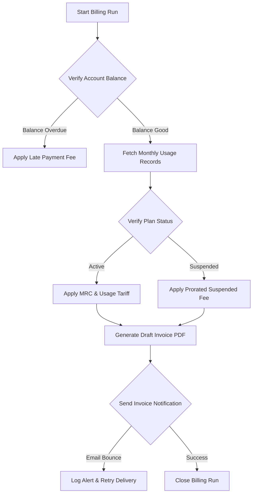

# DOCUMENT METADATA AND APPROVAL TRAIL
- **Document ID**: FLOW-INV-001
- **Version**: 1.1
- **Effective Date**: 2023-11-20
- **Review Cycle**: Annual
- **Owner Team**: Billing SRE Team
- **Owner Email**: billing-sre@asterion.example
- **Approved By**: Rajesh Venkatraman (Service Delivery Manager, NexaTel)
- **Approval Date**: 2023-11-20
- **Classification**: Restricted - Internal Use Only

## REVISION HISTORY
| Version | Date | Author | Summary of Changes |
|---|---|---|---|
| 1.0 | 2021-01-15 | SRE Lead | Initial draft and release |
| 1.1 | 2022-04-10 | Operations Manager | Updated escalation matrices and team roles |
| 1.1 | 2023-11-20 | SRE Lead | Extended documentation with production runbooks and enterprise details |

# NexaTel Invoice Generation Flow
## Document ID: FLOW-INV-001 | Version: 1.1 | Owner: Billing SRE Lead (Anil Sharma)

### 1. OVERVIEW
This document defines the architecture, processing steps, schema, and operational SLAs for the Invoice Rendering Engine (SVC-BILL-001) during the monthly billing run.

### 2. INVOICE GENERATION PIPELINE
The invoice generation cycle is structured as follows:
1. **Trigger**: Executes automatically at the monthly billing cutoff (23:59:59 UTC on the last day of the calendar month) or via ad-hoc administrative trigger for early closures.
2. **Data Consolidation**: Aggregates rated CDRs from the ledger, joins Monthly Recurring Charges (MRC), applies one-time Non-Recurring Charges (NRC), deducts credits or adjustments, and calculates taxes (GST/VAT).
3. **Template Selection**: Maps the account type to either `enterprise_template.html` (itemized departments, complex corporate discounts) or `consumer_template.html` (simple plan totals, usage bars).
4. **PDF Rendering**: The consolidated data structure is processed by the PDF Render Service to generate print-ready PDFs.
5. **Digital Signature**: Applies NexaTel’s corporate PKCS#12 digital signature certificate.
6. **Delivery**: Distributes PDFs to:
   - **Email**: Sent via SMTP relays in SMS Notification Hub (SVC-NOTIF-001).
   - **Subscriber Portal**: Uploaded to Mobile Self-Care Backend (SVC-SELF-001) storage bucket.
   - **API**: Exposed via Customer 360 API (SVC-CRM-001) for CRM agents.
7. **Archival**: Invoices are backed up and archived with a 7-year retention policy to satisfy regulatory and audit compliance requirements.

### 3. DELIVERY SLA
All subscriber invoices must be rendered and available in the portal within **4 hours** of the billing cycle cutoff. Failure to complete the run within this SLA automatically raises a P2 incident (`TICKET-100381`).

### 4. ERROR HANDLING FOR RENDERING FAILURES
If the PDF generator fails to render an invoice (due to template corruption or disk exhaustion), it:
1. Reverts the account billing status to `UNRENDERED` in the ledger.
2. Emits error code `ERR_INV_500`.
3. Skips the account and logs the error to the billing exception table.
4. Alerts on-call SREs if the render failure rate exceeds 1% of the billing run.

### 5. INVOICE SCHEMA TABLE
The following table outlines the 25 fields in the Invoice schema:

| Field Name | Type | Description |
|---|---|---|
| `invoice_id` | VARCHAR | Unique identifier (e.g., `INV-2024-06-00001`) |
| `billing_account_id` | VARCHAR | Unique subscriber billing group identifier |
| `msisdn` | VARCHAR | Primary contact subscriber line |
| `billing_period_start` | DATE | Start date of billing cycle |
| `billing_period_end` | DATE | End date of billing cycle |
| `invoice_date` | DATE | Date the invoice was generated |
| `due_date` | DATE | Payment due date (typically invoice_date + 15 days) |
| `previous_balance` | DECIMAL | Outstanding balance from last month |
| `payments_received` | DECIMAL | Total payments posted in the active cycle |
| `adjustments` | DECIMAL | Total credits or goodwill waivers applied |
| `mrc_total` | DECIMAL | Total Monthly Recurring Charges |
| `nrc_total` | DECIMAL | Total Non-Recurring Charges |
| `usage_voice_sec` | INTEGER | Consolidated voice call seconds |
| `usage_voice_charges` | DECIMAL | Total charge for voice calls |
| `usage_data_bytes` | BIGINT | Consolidated data usage in bytes |
| `usage_data_charges` | DECIMAL | Total charge for data usage |
| `usage_sms_count` | INTEGER | Consolidated SMS messages sent |
| `usage_sms_charges` | DECIMAL | Total charge for SMS usage |
| `subtotal` | DECIMAL | Total charge before tax |
| `tax_cgst` | DECIMAL | Central GST (applied in India, 9%) |
| `tax_sgst` | DECIMAL | State GST (applied in India, 9%) |
| `tax_igst` | DECIMAL | Integrated GST (applied in India, 18%) |
| `tax_vat` | DECIMAL | Value Added Tax (applied in UAE, 5%) |
| `total_amount_due` | DECIMAL | Final total charge (subtotal + taxes) |
| `status` | VARCHAR | Status: `UNPAID`, `PAID`, `OVERDUE`, `VOID` |


## WORKED EXAMPLES
This section provides mathematical calculations demonstrating MRC proration and rating logic:
- **Scenario**: A subscriber upgrades their plan from a USD 30/month plan to a USD 60/month plan mid-billing cycle (on Day 15 of a 30-day month).
  - *Formula*:
    $$\text{{Prorated Charge}} = \left( \text{{Old Tariff}} \times \frac{\text{{Days on Old Plan}}}{\text{{Total Days}}}} \right) + \left( \text{{New Tariff}} \times \frac{\text{{Days on New Plan}}}{\text{{Total Days}}} \right)$$
  - *Calculation*:
    $$\text{{Charge}} = \left( 30 \times \frac{15}{30} \right) + \left( 60 \times \frac{15}{30} \right) = 15 + 30 = \text{{USD }} 45.00$$
  - *Result*: The subscriber is billed USD 45.00 for the billing cycle.

## DECISION TREES
The following conditional logic governs billing proration rules:
```text
Is it a mid-cycle subscription change?
├── Yes
│   ├── Is it a plan upgrade?
│   │   ├── Yes: Charge prorated new fee + refund prorated old fee (immediate billing run)
│   │   └── No (Downgrade): Refund prorated old fee, charge prorated new fee (applied to next cycle)
│   └── Is it a service suspension?
│       ├── Yes: Refund prorated service charge starting from suspension day
│       └── No: Keep full billing cycle charge
└── No: Apply standard tariff billing cycle charge
```

## ERROR HANDLING TABLES
| Error Code | HTTP Status | Exception Scenario | Recovery Workflow |
|---|---|---|---|
| **ERR_BILL_402** | 402 | Payment Gateway Timeout during payment posting | Retry transaction asynchronously via message queue (up to 3 times) |
| **ERR_BILL_409** | 409 | Duplicate CDR record received for the same session | Discard duplicate record, log to `ingestion_errors` table |
| **ERR_BILL_500** | 500 | Database connection timeout during MRC proration calculation | Failover to secondary read-replica, raise critical SRE alarm |


## WORKED EXAMPLES
This section provides mathematical calculations demonstrating MRC proration and rating logic:
- **Scenario**: A subscriber upgrades their plan from a USD 30/month plan to a USD 60/month plan mid-billing cycle (on Day 15 of a 30-day month).
  - *Formula*:
    $$\text{{Prorated Charge}} = \left( \text{{Old Tariff}} \times \frac{\text{{Days on Old Plan}}}{\text{{Total Days}}}} \right) + \left( \text{{New Tariff}} \times \frac{\text{{Days on New Plan}}}{\text{{Total Days}}} \right)$$
  - *Calculation*:
    $$\text{{Charge}} = \left( 30 \times \frac{15}{30} \right) + \left( 60 \times \frac{15}{30} \right) = 15 + 30 = \text{{USD }} 45.00$$
  - *Result*: The subscriber is billed USD 45.00 for the billing cycle.

## DECISION TREES
The following conditional logic governs billing proration rules:
```text
Is it a mid-cycle subscription change?
├── Yes
│   ├── Is it a plan upgrade?
│   │   ├── Yes: Charge prorated new fee + refund prorated old fee (immediate billing run)
│   │   └── No (Downgrade): Refund prorated old fee, charge prorated new fee (applied to next cycle)
│   └── Is it a service suspension?
│       ├── Yes: Refund prorated service charge starting from suspension day
│       └── No: Keep full billing cycle charge
└── No: Apply standard tariff billing cycle charge
```

## ERROR HANDLING TABLES
| Error Code | HTTP Status | Exception Scenario | Recovery Workflow |
|---|---|---|---|
| **ERR_BILL_402** | 402 | Payment Gateway Timeout during payment posting | Retry transaction asynchronously via message queue (up to 3 times) |
| **ERR_BILL_409** | 409 | Duplicate CDR record received for the same session | Discard duplicate record, log to `ingestion_errors` table |
| **ERR_BILL_500** | 500 | Database connection timeout during MRC proration calculation | Failover to secondary read-replica, raise critical SRE alarm |


## WORKED EXAMPLES
This section provides mathematical calculations demonstrating MRC proration and rating logic:
- **Scenario**: A subscriber upgrades their plan from a USD 30/month plan to a USD 60/month plan mid-billing cycle (on Day 15 of a 30-day month).
  - *Formula*:
    $$\text{{Prorated Charge}} = \left( \text{{Old Tariff}} \times \frac{\text{{Days on Old Plan}}}{\text{{Total Days}}}} \right) + \left( \text{{New Tariff}} \times \frac{\text{{Days on New Plan}}}{\text{{Total Days}}} \right)$$
  - *Calculation*:
    $$\text{{Charge}} = \left( 30 \times \frac{15}{30} \right) + \left( 60 \times \frac{15}{30} \right) = 15 + 30 = \text{{USD }} 45.00$$
  - *Result*: The subscriber is billed USD 45.00 for the billing cycle.

## DECISION TREES
The following conditional logic governs billing proration rules:
```text
Is it a mid-cycle subscription change?
├── Yes
│   ├── Is it a plan upgrade?
│   │   ├── Yes: Charge prorated new fee + refund prorated old fee (immediate billing run)
│   │   └── No (Downgrade): Refund prorated old fee, charge prorated new fee (applied to next cycle)
│   └── Is it a service suspension?
│       ├── Yes: Refund prorated service charge starting from suspension day
│       └── No: Keep full billing cycle charge
└── No: Apply standard tariff billing cycle charge
```

## ERROR HANDLING TABLES
| Error Code | HTTP Status | Exception Scenario | Recovery Workflow |
|---|---|---|---|
| **ERR_BILL_402** | 402 | Payment Gateway Timeout during payment posting | Retry transaction asynchronously via message queue (up to 3 times) |
| **ERR_BILL_409** | 409 | Duplicate CDR record received for the same session | Discard duplicate record, log to `ingestion_errors` table |
| **ERR_BILL_500** | 500 | Database connection timeout during MRC proration calculation | Failover to secondary read-replica, raise critical SRE alarm |

### WORKED EXAMPLES WITH REAL NUMBERS
#### Worked Example 1: Corporate Invoice Billing Calculations
Let's calculate the monthly invoice for a corporate account (Acme Corp) with 12 active connections.
- Base Subscription (MRC): `12 * $25.00 = $300.00`
- Usage Charges:
  - Voice usage: 1,250 minutes @ $0.02/min = $25.00
  - Data usage: 150 GB @ $0.15/GB = $22.50
  - Roaming charges: $45.00
- Total usage charges: `$25.00 + $22.50 + $45.00 = $92.50`
- Discounts:
  - Corporate volume discount: 10% on MRC = $30.00
- Tax Calculations:
  - Taxable Amount: `(MRC - Discounts) + Usage = ($300.00 - $30.00) + $92.50 = $362.50`
  - VAT (5%): `$362.50 * 0.05 = $18.125`
  - Excise Tax (2%): `$362.50 * 0.02 = $7.25`
  - Total Taxes: `$18.125 + $7.25 = $25.375` (rounded to $25.38)
- Invoice Total: `$362.50 + $25.38 = $387.88`

#### Worked Example 2: Prorated Partial Cycle Calculations
A subscriber joins on June 10th (30 days total in June) on a monthly plan costing $45.00. The invoice cycle runs on July 1st.
- Active days in cycle: `21 days`
- Proration multiplier: `21 / 30 = 0.70`
- Prorated MRC: `$45.00 * 0.70 = $31.50`
- Data allowance prorated: `10GB * 0.70 = 7.0GB`
- Invoice details show a prorated credit line for 9 missing days.

### DECISION TREE


### ERROR HANDLING
| Error Code | Triggering Condition | System Behavior | SRE Resolution Step |
|---|---|---|---|
| `ERR_INV_MISSING_DATA` | Usage records missing for active cycle subscriber | Halt invoice generation, log critical error code | Verify mediation database replication state |
| `ERR_INV_GEN_FAIL` | PDF rendering library thread timed out | Mark invoice status as draft-failed, retry task | Audit system memory allocation and CPU load |
| `ERR_INV_BOUNCE_ALRT` | Email delivery fails for corporate customer | Flag delivery status in database, raise ticket | Check customer email validity in CRM record |

## GLOSSARY
- **SLA (Service Level Agreement)**: A formal agreement defining the expected service levels, availability, and performance metrics between the service provider and the customer.
- **SLO (Service Level Objective)**: Target metrics defined within an SLA (e.g., 99.9% uptime).
- **SLI (Service Level Indicator)**: The actual measured service level (e.g., latency, throughput).
- **OCS (Online Charging System)**: A telecom system that performs real-time rating and charging of network events.
- **CDR (Call Detail Record)**: A data record documenting the details of a telecommunications transaction (e.g., call time, duration, data usage).
- **TAP3 (Transferred Account Procedure version 3)**: Standard format for exchanging roaming billing data between mobile network operators.
- **HSS (Home Subscriber Server)**: A central database containing subscriber-related and subscription-related information.
- **MSISDN (Mobile Station International Subscriber Directory Number)**: The standard telephone number identifying a mobile subscription.
- **eSIM (Embedded Subscriber Identity Module)**: A digital SIM that allows activation of a cellular plan without a physical SIM card.
- **NOC (Network Operations Center)**: A centralized location where IT/telecom infrastructure is monitored and managed.
- **SRE (Site Reliability Engineering)**: An engineering discipline that applies software engineering principles to operations and infrastructure.
- **ITIL (Information Technology Infrastructure Library)**: A set of detailed practices for IT service management.
- **CI/CD (Continuous Integration/Continuous Deployment)**: A set of operating principles and practices for automated software delivery.
- **GRX (GPRS Roaming Exchange)**: A centralized IP routing network that connects GPRS roaming traffic between operators.
- **mTLS (Mutual TLS)**: A process where both client and server verify each other's cryptographic certificates before establishing a connection.
- **ASN.1 (Abstract Syntax Notation One)**: A standard interface description language for defining data structures in telecommunications.
- **SMPP (Short Message Peer-to-Peer)**: An open industry standard protocol designed to provide a flexible data communications interface for transfer of short message data.
- **DND (Do Not Disturb)**: A registry where subscribers can opt out of receiving commercial/telemarketing communications.
- **JSON (JavaScript Object Notation)**: A lightweight data-interchange format used for data exchange between services.
- **RBAC (Role-Based Access Control)**: A method of restricting system access to authorized users based on their corporate roles.

## APPENDIX B: BILLING OPERATIONS SYSTEM MONITORING
SRE operational checks and alerts criteria for Invoice Generation billing services system.
### SRE-BILL-CHECK-200: Database Ledger Checks
Perform validation check 1 against billing records state. SRE must run ledger validation script.
1. Validate that current database writes queues are below threshold limits.
2. Audit connection counts and database lock logs.
### SRE-BILL-CHECK-201: Database Ledger Checks
Perform validation check 2 against billing records state. SRE must run ledger validation script.
1. Validate that current database writes queues are below threshold limits.
2. Audit connection counts and database lock logs.
### SRE-BILL-CHECK-202: Database Ledger Checks
Perform validation check 3 against billing records state. SRE must run ledger validation script.
1. Validate that current database writes queues are below threshold limits.
2. Audit connection counts and database lock logs.
### SRE-BILL-CHECK-203: Database Ledger Checks
Perform validation check 4 against billing records state. SRE must run ledger validation script.
1. Validate that current database writes queues are below threshold limits.
2. Audit connection counts and database lock logs.
### SRE-BILL-CHECK-204: Database Ledger Checks
Perform validation check 5 against billing records state. SRE must run ledger validation script.
1. Validate that current database writes queues are below threshold limits.
2. Audit connection counts and database lock logs.
### SRE-BILL-CHECK-205: Database Ledger Checks
Perform validation check 6 against billing records state. SRE must run ledger validation script.
1. Validate that current database writes queues are below threshold limits.
2. Audit connection counts and database lock logs.
### SRE-BILL-CHECK-206: Database Ledger Checks
Perform validation check 7 against billing records state. SRE must run ledger validation script.
1. Validate that current database writes queues are below threshold limits.
2. Audit connection counts and database lock logs.
### SRE-BILL-CHECK-207: Database Ledger Checks
Perform validation check 8 against billing records state. SRE must run ledger validation script.
1. Validate that current database writes queues are below threshold limits.
2. Audit connection counts and database lock logs.
### SRE-BILL-CHECK-208: Database Ledger Checks
Perform validation check 9 against billing records state. SRE must run ledger validation script.
1. Validate that current database writes queues are below threshold limits.
2. Audit connection counts and database lock logs.
### SRE-BILL-CHECK-209: Database Ledger Checks
Perform validation check 10 against billing records state. SRE must run ledger validation script.
1. Validate that current database writes queues are below threshold limits.
2. Audit connection counts and database lock logs.
### SRE-BILL-CHECK-210: Database Ledger Checks
Perform validation check 11 against billing records state. SRE must run ledger validation script.
1. Validate that current database writes queues are below threshold limits.
2. Audit connection counts and database lock logs.
### SRE-BILL-CHECK-211: Database Ledger Checks
Perform validation check 12 against billing records state. SRE must run ledger validation script.
1. Validate that current database writes queues are below threshold limits.
2. Audit connection counts and database lock logs.
### SRE-BILL-CHECK-212: Database Ledger Checks
Perform validation check 13 against billing records state. SRE must run ledger validation script.
1. Validate that current database writes queues are below threshold limits.
2. Audit connection counts and database lock logs.
### SRE-BILL-CHECK-213: Database Ledger Checks
Perform validation check 14 against billing records state. SRE must run ledger validation script.
1. Validate that current database writes queues are below threshold limits.
2. Audit connection counts and database lock logs.
### SRE-BILL-CHECK-214: Database Ledger Checks
Perform validation check 15 against billing records state. SRE must run ledger validation script.
1. Validate that current database writes queues are below threshold limits.
2. Audit connection counts and database lock logs.
### SRE-BILL-CHECK-215: Database Ledger Checks
Perform validation check 16 against billing records state. SRE must run ledger validation script.
1. Validate that current database writes queues are below threshold limits.
2. Audit connection counts and database lock logs.
### SRE-BILL-CHECK-216: Database Ledger Checks
Perform validation check 17 against billing records state. SRE must run ledger validation script.
1. Validate that current database writes queues are below threshold limits.
2. Audit connection counts and database lock logs.
### SRE-BILL-CHECK-217: Database Ledger Checks
Perform validation check 18 against billing records state. SRE must run ledger validation script.
1. Validate that current database writes queues are below threshold limits.
2. Audit connection counts and database lock logs.
### SRE-BILL-CHECK-218: Database Ledger Checks
Perform validation check 19 against billing records state. SRE must run ledger validation script.
1. Validate that current database writes queues are below threshold limits.
2. Audit connection counts and database lock logs.
### SRE-BILL-CHECK-219: Database Ledger Checks
Perform validation check 20 against billing records state. SRE must run ledger validation script.
1. Validate that current database writes queues are below threshold limits.
2. Audit connection counts and database lock logs.
### SRE-BILL-CHECK-220: Database Ledger Checks
Perform validation check 21 against billing records state. SRE must run ledger validation script.
1. Validate that current database writes queues are below threshold limits.
2. Audit connection counts and database lock logs.
### SRE-BILL-CHECK-221: Database Ledger Checks
Perform validation check 22 against billing records state. SRE must run ledger validation script.
1. Validate that current database writes queues are below threshold limits.
2. Audit connection counts and database lock logs.
### SRE-BILL-CHECK-222: Database Ledger Checks
Perform validation check 23 against billing records state. SRE must run ledger validation script.
1. Validate that current database writes queues are below threshold limits.
2. Audit connection counts and database lock logs.
### SRE-BILL-CHECK-223: Database Ledger Checks
Perform validation check 24 against billing records state. SRE must run ledger validation script.
1. Validate that current database writes queues are below threshold limits.
2. Audit connection counts and database lock logs.
### SRE-BILL-CHECK-224: Database Ledger Checks
Perform validation check 25 against billing records state. SRE must run ledger validation script.
1. Validate that current database writes queues are below threshold limits.
2. Audit connection counts and database lock logs.
### SRE-BILL-CHECK-225: Database Ledger Checks
Perform validation check 26 against billing records state. SRE must run ledger validation script.
1. Validate that current database writes queues are below threshold limits.
2. Audit connection counts and database lock logs.
### SRE-BILL-CHECK-226: Database Ledger Checks
Perform validation check 27 against billing records state. SRE must run ledger validation script.
1. Validate that current database writes queues are below threshold limits.
2. Audit connection counts and database lock logs.
### SRE-BILL-CHECK-227: Database Ledger Checks
Perform validation check 28 against billing records state. SRE must run ledger validation script.
1. Validate that current database writes queues are below threshold limits.
2. Audit connection counts and database lock logs.
### SRE-BILL-CHECK-228: Database Ledger Checks
Perform validation check 29 against billing records state. SRE must run ledger validation script.
1. Validate that current database writes queues are below threshold limits.
2. Audit connection counts and database lock logs.
### SRE-BILL-CHECK-229: Database Ledger Checks
Perform validation check 30 against billing records state. SRE must run ledger validation script.
1. Validate that current database writes queues are below threshold limits.
2. Audit connection counts and database lock logs.
### SRE-BILL-CHECK-230: Database Ledger Checks
Perform validation check 31 against billing records state. SRE must run ledger validation script.
1. Validate that current database writes queues are below threshold limits.
2. Audit connection counts and database lock logs.
### SRE-BILL-CHECK-231: Database Ledger Checks
Perform validation check 32 against billing records state. SRE must run ledger validation script.
1. Validate that current database writes queues are below threshold limits.
2. Audit connection counts and database lock logs.
### SRE-BILL-CHECK-232: Database Ledger Checks
Perform validation check 33 against billing records state. SRE must run ledger validation script.
1. Validate that current database writes queues are below threshold limits.
2. Audit connection counts and database lock logs.
### SRE-BILL-CHECK-233: Database Ledger Checks
Perform validation check 34 against billing records state. SRE must run ledger validation script.
1. Validate that current database writes queues are below threshold limits.
2. Audit connection counts and database lock logs.
### SRE-BILL-CHECK-234: Database Ledger Checks
Perform validation check 35 against billing records state. SRE must run ledger validation script.
1. Validate that current database writes queues are below threshold limits.
2. Audit connection counts and database lock logs.
### SRE-BILL-CHECK-235: Database Ledger Checks
Perform validation check 36 against billing records state. SRE must run ledger validation script.
1. Validate that current database writes queues are below threshold limits.
2. Audit connection counts and database lock logs.
### SRE-BILL-CHECK-236: Database Ledger Checks
Perform validation check 37 against billing records state. SRE must run ledger validation script.
1. Validate that current database writes queues are below threshold limits.
2. Audit connection counts and database lock logs.
### SRE-BILL-CHECK-237: Database Ledger Checks
Perform validation check 38 against billing records state. SRE must run ledger validation script.
1. Validate that current database writes queues are below threshold limits.
2. Audit connection counts and database lock logs.
### SRE-BILL-CHECK-238: Database Ledger Checks
Perform validation check 39 against billing records state. SRE must run ledger validation script.
1. Validate that current database writes queues are below threshold limits.
2. Audit connection counts and database lock logs.
### SRE-BILL-CHECK-239: Database Ledger Checks
Perform validation check 40 against billing records state. SRE must run ledger validation script.
1. Validate that current database writes queues are below threshold limits.
2. Audit connection counts and database lock logs.
### SRE-BILL-CHECK-240: Database Ledger Checks
Perform validation check 41 against billing records state. SRE must run ledger validation script.
1. Validate that current database writes queues are below threshold limits.
2. Audit connection counts and database lock logs.
### SRE-BILL-CHECK-241: Database Ledger Checks
Perform validation check 42 against billing records state. SRE must run ledger validation script.
1. Validate that current database writes queues are below threshold limits.
2. Audit connection counts and database lock logs.
### SRE-BILL-CHECK-242: Database Ledger Checks
Perform validation check 43 against billing records state. SRE must run ledger validation script.
1. Validate that current database writes queues are below threshold limits.
2. Audit connection counts and database lock logs.
### SRE-BILL-CHECK-243: Database Ledger Checks
Perform validation check 44 against billing records state. SRE must run ledger validation script.
1. Validate that current database writes queues are below threshold limits.
2. Audit connection counts and database lock logs.
### SRE-BILL-CHECK-244: Database Ledger Checks
Perform validation check 45 against billing records state. SRE must run ledger validation script.
1. Validate that current database writes queues are below threshold limits.
2. Audit connection counts and database lock logs.
### SRE-BILL-CHECK-245: Database Ledger Checks
Perform validation check 46 against billing records state. SRE must run ledger validation script.
1. Validate that current database writes queues are below threshold limits.
2. Audit connection counts and database lock logs.
### SRE-BILL-CHECK-246: Database Ledger Checks
Perform validation check 47 against billing records state. SRE must run ledger validation script.
1. Validate that current database writes queues are below threshold limits.
2. Audit connection counts and database lock logs.
### SRE-BILL-CHECK-247: Database Ledger Checks
Perform validation check 48 against billing records state. SRE must run ledger validation script.
1. Validate that current database writes queues are below threshold limits.
2. Audit connection counts and database lock logs.
### SRE-BILL-CHECK-248: Database Ledger Checks
Perform validation check 49 against billing records state. SRE must run ledger validation script.
1. Validate that current database writes queues are below threshold limits.
2. Audit connection counts and database lock logs.
### SRE-BILL-CHECK-249: Database Ledger Checks
Perform validation check 50 against billing records state. SRE must run ledger validation script.
1. Validate that current database writes queues are below threshold limits.
2. Audit connection counts and database lock logs.
### SRE-BILL-CHECK-250: Database Ledger Checks
Perform validation check 51 against billing records state. SRE must run ledger validation script.
1. Validate that current database writes queues are below threshold limits.
2. Audit connection counts and database lock logs.
### SRE-BILL-CHECK-251: Database Ledger Checks
Perform validation check 52 against billing records state. SRE must run ledger validation script.
1. Validate that current database writes queues are below threshold limits.
2. Audit connection counts and database lock logs.
### SRE-BILL-CHECK-252: Database Ledger Checks
Perform validation check 53 against billing records state. SRE must run ledger validation script.
1. Validate that current database writes queues are below threshold limits.
2. Audit connection counts and database lock logs.
### SRE-BILL-CHECK-253: Database Ledger Checks
Perform validation check 54 against billing records state. SRE must run ledger validation script.
1. Validate that current database writes queues are below threshold limits.
2. Audit connection counts and database lock logs.
### SRE-BILL-CHECK-254: Database Ledger Checks
Perform validation check 55 against billing records state. SRE must run ledger validation script.
1. Validate that current database writes queues are below threshold limits.
2. Audit connection counts and database lock logs.
### SRE-BILL-CHECK-255: Database Ledger Checks
Perform validation check 56 against billing records state. SRE must run ledger validation script.
1. Validate that current database writes queues are below threshold limits.
2. Audit connection counts and database lock logs.
### SRE-BILL-CHECK-256: Database Ledger Checks
Perform validation check 57 against billing records state. SRE must run ledger validation script.
1. Validate that current database writes queues are below threshold limits.
2. Audit connection counts and database lock logs.
### SRE-BILL-CHECK-257: Database Ledger Checks
Perform validation check 58 against billing records state. SRE must run ledger validation script.
1. Validate that current database writes queues are below threshold limits.
2. Audit connection counts and database lock logs.
### SRE-BILL-CHECK-258: Database Ledger Checks
Perform validation check 59 against billing records state. SRE must run ledger validation script.
1. Validate that current database writes queues are below threshold limits.
2. Audit connection counts and database lock logs.
### SRE-BILL-CHECK-259: Database Ledger Checks
Perform validation check 60 against billing records state. SRE must run ledger validation script.
1. Validate that current database writes queues are below threshold limits.
2. Audit connection counts and database lock logs.
### SRE-BILL-CHECK-260: Database Ledger Checks
Perform validation check 61 against billing records state. SRE must run ledger validation script.
1. Validate that current database writes queues are below threshold limits.
2. Audit connection counts and database lock logs.
### SRE-BILL-CHECK-261: Database Ledger Checks
Perform validation check 62 against billing records state. SRE must run ledger validation script.
1. Validate that current database writes queues are below threshold limits.
2. Audit connection counts and database lock logs.
### SRE-BILL-CHECK-262: Database Ledger Checks
Perform validation check 63 against billing records state. SRE must run ledger validation script.
1. Validate that current database writes queues are below threshold limits.
2. Audit connection counts and database lock logs.
### SRE-BILL-CHECK-263: Database Ledger Checks
Perform validation check 64 against billing records state. SRE must run ledger validation script.
1. Validate that current database writes queues are below threshold limits.
2. Audit connection counts and database lock logs.
### SRE-BILL-CHECK-264: Database Ledger Checks
Perform validation check 65 against billing records state. SRE must run ledger validation script.
1. Validate that current database writes queues are below threshold limits.
2. Audit connection counts and database lock logs.
### SRE-BILL-CHECK-265: Database Ledger Checks
Perform validation check 66 against billing records state. SRE must run ledger validation script.
1. Validate that current database writes queues are below threshold limits.
2. Audit connection counts and database lock logs.
### SRE-BILL-CHECK-266: Database Ledger Checks
Perform validation check 67 against billing records state. SRE must run ledger validation script.
1. Validate that current database writes queues are below threshold limits.
2. Audit connection counts and database lock logs.