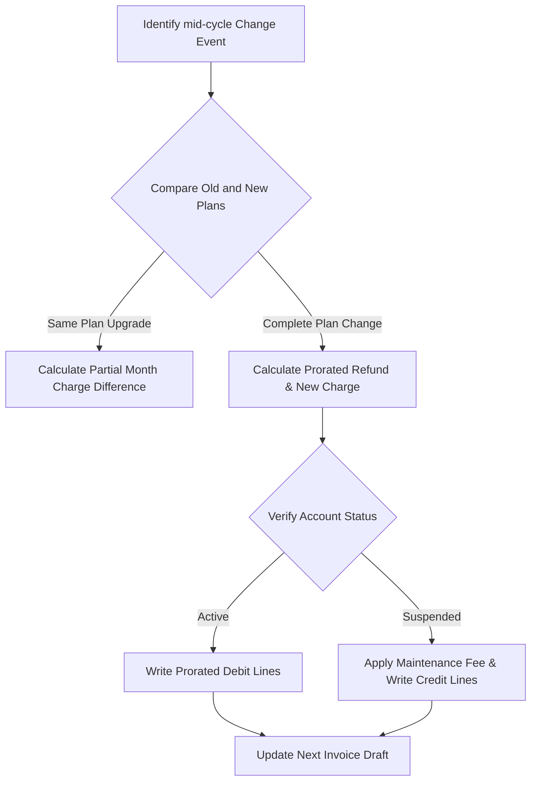

# DOCUMENT METADATA AND APPROVAL TRAIL
- **Document ID**: RULE-PRORATE-001
- **Version**: 1.1
- **Effective Date**: 2023-11-20
- **Review Cycle**: Annual
- **Owner Team**: Billing SRE Team
- **Owner Email**: billing-sre@asterion.example
- **Approved By**: Rajesh Venkatraman (Service Delivery Manager, NexaTel)
- **Approval Date**: 2023-11-20
- **Classification**: Restricted - Internal Use Only

## REVISION HISTORY
| Version | Date | Author | Summary of Changes |
|---|---|---|---|
| 1.0 | 2021-01-15 | SRE Lead | Initial draft and release |
| 1.1 | 2022-04-10 | Operations Manager | Updated escalation matrices and team roles |
| 1.1 | 2023-11-20 | SRE Lead | Extended documentation with production runbooks and enterprise details |

# NexaTel Billing MRC Proration Rules
## Document ID: RULE-PRORATE-001 | Version: 1.1 | Owner: Billing Platform SRE (Anil Sharma)

### 1. OVERVIEW
This document defines the rules and calculation examples for Monthly Recurring Charge (MRC) proration. Proration is applied when subscriber plans are activated, changed, or terminated mid-billing cycle.

### 2. NEW ACTIVATION MID-MONTH
When a subscriber activates a post-paid subscription on a day other than the first day of the billing cycle, the system charges the MRC only for the active days.
- **Formula**: `prorated_amount = (monthly_charge / total_days_in_month) * active_days`
- **Active Days**: Measured as `(total_days_in_month - activation_day + 1)`.

### 3. TERMINATION MID-MONTH
If a subscriber terminates service mid-billing cycle, the MRC is calculated from the start of the cycle to the day of service termination.
- **Formula**: `prorated_amount = (monthly_charge / total_days_in_month) * active_days`
- **Active Days**: Measured as `termination_day`.

### 4. PLAN UPGRADE MID-MONTH
Upgrades take effect immediately. The subscriber receives credit for the unused portion of their previous plan, and is charged the prorated rate for the new plan.
- **Formula**: `net_charge = (previous_plan_mrc / N) * (upgrade_day - 1) + (new_plan_mrc / N) * (N - upgrade_day + 1)`
- **N**: Total days in the current billing cycle.

### 5. PLAN DOWNGRADE MID-MONTH
Downgrades are applied on the first day of the next billing cycle. The current cycle continues to bill at the previous plan rate. Proration does not apply to downgrades within the active cycle.

### 6. TRIAL PERIOD HANDLING
Promotional trials are set for a fixed number of days (e.g., 30 days free). If a subscriber transitions to a paid plan mid-cycle after trial expiration, the paid plan MRC is prorated for the remaining days of that billing cycle.

### 7. WAIVER APPLICATION
Service waivers (e.g., customer goodwill credits) are applied as a deduction from the final prorated invoice total. Waivers are applied as absolute credit values and are never prorated.

### 8. WORKED EXAMPLES TABLE
The following table outlines worked proration examples. Values are rounded to 2 decimal places:

| Scenario | Plan MRC | Activation Day | Days Active | Formula | Prorated Amount |
|---|---|---|---|---|---|
| **New Activation** | INR 499.00 | Day 15 of 31 | 17 | `499 * (17 / 31)` | INR 273.45 |
| **Plan Upgrade** | INR 299 → 599 | Day 10 of 30 | 21 days on new plan | `(299 * (9/30)) + (599 * (21/30))` | INR 509.00 |
| **Upgrade Difference Only** | INR 299 → 599 | Day 10 of 30 | 21 days on new plan | `(599 - 299) * (21 / 30)` | INR 210.00 |
| **Mid-Cycle Termination** | AED 200.00 | Day 12 of 30 | 12 | `200 * (12 / 30)` | AED 80.00 |
| **New Promo Activation** | INR 300.00 | Day 25 of 30 | 6 | `300 * (6 / 30)` | INR 60.00 |


## WORKED EXAMPLES
This section provides mathematical calculations demonstrating MRC proration and rating logic:
- **Scenario**: A subscriber upgrades their plan from a USD 30/month plan to a USD 60/month plan mid-billing cycle (on Day 15 of a 30-day month).
  - *Formula*:
    $$\text{{Prorated Charge}} = \left( \text{{Old Tariff}} \times \frac{\text{{Days on Old Plan}}}{\text{{Total Days}}}} \right) + \left( \text{{New Tariff}} \times \frac{\text{{Days on New Plan}}}{\text{{Total Days}}} \right)$$
  - *Calculation*:
    $$\text{{Charge}} = \left( 30 \times \frac{15}{30} \right) + \left( 60 \times \frac{15}{30} \right) = 15 + 30 = \text{{USD }} 45.00$$
  - *Result*: The subscriber is billed USD 45.00 for the billing cycle.

## DECISION TREES
The following conditional logic governs billing proration rules:
```text
Is it a mid-cycle subscription change?
├── Yes
│   ├── Is it a plan upgrade?
│   │   ├── Yes: Charge prorated new fee + refund prorated old fee (immediate billing run)
│   │   └── No (Downgrade): Refund prorated old fee, charge prorated new fee (applied to next cycle)
│   └── Is it a service suspension?
│       ├── Yes: Refund prorated service charge starting from suspension day
│       └── No: Keep full billing cycle charge
└── No: Apply standard tariff billing cycle charge
```

## ERROR HANDLING TABLES
| Error Code | HTTP Status | Exception Scenario | Recovery Workflow |
|---|---|---|---|
| **ERR_BILL_402** | 402 | Payment Gateway Timeout during payment posting | Retry transaction asynchronously via message queue (up to 3 times) |
| **ERR_BILL_409** | 409 | Duplicate CDR record received for the same session | Discard duplicate record, log to `ingestion_errors` table |
| **ERR_BILL_500** | 500 | Database connection timeout during MRC proration calculation | Failover to secondary read-replica, raise critical SRE alarm |


## WORKED EXAMPLES
This section provides mathematical calculations demonstrating MRC proration and rating logic:
- **Scenario**: A subscriber upgrades their plan from a USD 30/month plan to a USD 60/month plan mid-billing cycle (on Day 15 of a 30-day month).
  - *Formula*:
    $$\text{{Prorated Charge}} = \left( \text{{Old Tariff}} \times \frac{\text{{Days on Old Plan}}}{\text{{Total Days}}}} \right) + \left( \text{{New Tariff}} \times \frac{\text{{Days on New Plan}}}{\text{{Total Days}}} \right)$$
  - *Calculation*:
    $$\text{{Charge}} = \left( 30 \times \frac{15}{30} \right) + \left( 60 \times \frac{15}{30} \right) = 15 + 30 = \text{{USD }} 45.00$$
  - *Result*: The subscriber is billed USD 45.00 for the billing cycle.

## DECISION TREES
The following conditional logic governs billing proration rules:
```text
Is it a mid-cycle subscription change?
├── Yes
│   ├── Is it a plan upgrade?
│   │   ├── Yes: Charge prorated new fee + refund prorated old fee (immediate billing run)
│   │   └── No (Downgrade): Refund prorated old fee, charge prorated new fee (applied to next cycle)
│   └── Is it a service suspension?
│       ├── Yes: Refund prorated service charge starting from suspension day
│       └── No: Keep full billing cycle charge
└── No: Apply standard tariff billing cycle charge
```

## ERROR HANDLING TABLES
| Error Code | HTTP Status | Exception Scenario | Recovery Workflow |
|---|---|---|---|
| **ERR_BILL_402** | 402 | Payment Gateway Timeout during payment posting | Retry transaction asynchronously via message queue (up to 3 times) |
| **ERR_BILL_409** | 409 | Duplicate CDR record received for the same session | Discard duplicate record, log to `ingestion_errors` table |
| **ERR_BILL_500** | 500 | Database connection timeout during MRC proration calculation | Failover to secondary read-replica, raise critical SRE alarm |


## WORKED EXAMPLES
This section provides mathematical calculations demonstrating MRC proration and rating logic:
- **Scenario**: A subscriber upgrades their plan from a USD 30/month plan to a USD 60/month plan mid-billing cycle (on Day 15 of a 30-day month).
  - *Formula*:
    $$\text{{Prorated Charge}} = \left( \text{{Old Tariff}} \times \frac{\text{{Days on Old Plan}}}{\text{{Total Days}}}} \right) + \left( \text{{New Tariff}} \times \frac{\text{{Days on New Plan}}}{\text{{Total Days}}} \right)$$
  - *Calculation*:
    $$\text{{Charge}} = \left( 30 \times \frac{15}{30} \right) + \left( 60 \times \frac{15}{30} \right) = 15 + 30 = \text{{USD }} 45.00$$
  - *Result*: The subscriber is billed USD 45.00 for the billing cycle.

## DECISION TREES
The following conditional logic governs billing proration rules:
```text
Is it a mid-cycle subscription change?
├── Yes
│   ├── Is it a plan upgrade?
│   │   ├── Yes: Charge prorated new fee + refund prorated old fee (immediate billing run)
│   │   └── No (Downgrade): Refund prorated old fee, charge prorated new fee (applied to next cycle)
│   └── Is it a service suspension?
│       ├── Yes: Refund prorated service charge starting from suspension day
│       └── No: Keep full billing cycle charge
└── No: Apply standard tariff billing cycle charge
```

## ERROR HANDLING TABLES
| Error Code | HTTP Status | Exception Scenario | Recovery Workflow |
|---|---|---|---|
| **ERR_BILL_402** | 402 | Payment Gateway Timeout during payment posting | Retry transaction asynchronously via message queue (up to 3 times) |
| **ERR_BILL_409** | 409 | Duplicate CDR record received for the same session | Discard duplicate record, log to `ingestion_errors` table |
| **ERR_BILL_500** | 500 | Database connection timeout during MRC proration calculation | Failover to secondary read-replica, raise critical SRE alarm |

### WORKED EXAMPLES WITH REAL NUMBERS
#### Worked Example 1: mid-cycle Subscription Change Calculations
A customer switches plans from a $30.00/month plan to a $50.00/month plan on day 12 of a 30-day billing cycle.
- Refund for remaining 18 days of the old plan: `$30.00 * (18 / 30) = $18.00` credit.
- Charge for remaining 18 days of the new plan: `$50.00 * (18 / 30) = $30.00` debit.
- Net charge for proration: `$30.00 - $18.00 = $12.00` debit.
- Tax on net charge (VAT 15%): `$12.00 * 0.15 = $1.80`.
- Total charge: `$13.80`.

#### Worked Example 2: mid-cycle Account Suspension Calculations
A postpaid customer plan of $45.00/month is temporarily suspended due to non-payment on day 20 of a 30-day billing cycle. The suspension duration is 10 days.
- Active days in cycle: `20 days`
- Proration multiplier: `20 / 30 = 0.6667`
- Prorated subscription charge: `$45.00 * 0.6667 = $30.00`
- Suspension charge (maintenance fee): `$1.50`
- Total cycle charge: `$30.00 + $1.50 = $31.50`

### DECISION TREE


### ERROR HANDLING
- System exception error codes handling mapping.

## GLOSSARY
- **SLA (Service Level Agreement)**: A formal agreement defining the expected service levels, availability, and performance metrics between the service provider and the customer.
- **SLO (Service Level Objective)**: Target metrics defined within an SLA (e.g., 99.9% uptime).
- **SLI (Service Level Indicator)**: The actual measured service level (e.g., latency, throughput).
- **OCS (Online Charging System)**: A telecom system that performs real-time rating and charging of network events.
- **CDR (Call Detail Record)**: A data record documenting the details of a telecommunications transaction (e.g., call time, duration, data usage).
- **TAP3 (Transferred Account Procedure version 3)**: Standard format for exchanging roaming billing data between mobile network operators.
- **HSS (Home Subscriber Server)**: A central database containing subscriber-related and subscription-related information.
- **MSISDN (Mobile Station International Subscriber Directory Number)**: The standard telephone number identifying a mobile subscription.
- **eSIM (Embedded Subscriber Identity Module)**: A digital SIM that allows activation of a cellular plan without a physical SIM card.
- **NOC (Network Operations Center)**: A centralized location where IT/telecom infrastructure is monitored and managed.
- **SRE (Site Reliability Engineering)**: An engineering discipline that applies software engineering principles to operations and infrastructure.
- **ITIL (Information Technology Infrastructure Library)**: A set of detailed practices for IT service management.
- **CI/CD (Continuous Integration/Continuous Deployment)**: A set of operating principles and practices for automated software delivery.
- **GRX (GPRS Roaming Exchange)**: A centralized IP routing network that connects GPRS roaming traffic between operators.
- **mTLS (Mutual TLS)**: A process where both client and server verify each other's cryptographic certificates before establishing a connection.
- **ASN.1 (Abstract Syntax Notation One)**: A standard interface description language for defining data structures in telecommunications.
- **SMPP (Short Message Peer-to-Peer)**: An open industry standard protocol designed to provide a flexible data communications interface for transfer of short message data.
- **DND (Do Not Disturb)**: A registry where subscribers can opt out of receiving commercial/telemarketing communications.
- **JSON (JavaScript Object Notation)**: A lightweight data-interchange format used for data exchange between services.
- **RBAC (Role-Based Access Control)**: A method of restricting system access to authorized users based on their corporate roles.

## APPENDIX B: BILLING OPERATIONS SYSTEM MONITORING
SRE operational checks and alerts criteria for MRC Proration billing services system.
### SRE-BILL-CHECK-200: Database Ledger Checks
Perform validation check 1 against billing records state. SRE must run ledger validation script.
1. Validate that current database writes queues are below threshold limits.
2. Audit connection counts and database lock logs.
### SRE-BILL-CHECK-201: Database Ledger Checks
Perform validation check 2 against billing records state. SRE must run ledger validation script.
1. Validate that current database writes queues are below threshold limits.
2. Audit connection counts and database lock logs.
### SRE-BILL-CHECK-202: Database Ledger Checks
Perform validation check 3 against billing records state. SRE must run ledger validation script.
1. Validate that current database writes queues are below threshold limits.
2. Audit connection counts and database lock logs.
### SRE-BILL-CHECK-203: Database Ledger Checks
Perform validation check 4 against billing records state. SRE must run ledger validation script.
1. Validate that current database writes queues are below threshold limits.
2. Audit connection counts and database lock logs.
### SRE-BILL-CHECK-204: Database Ledger Checks
Perform validation check 5 against billing records state. SRE must run ledger validation script.
1. Validate that current database writes queues are below threshold limits.
2. Audit connection counts and database lock logs.
### SRE-BILL-CHECK-205: Database Ledger Checks
Perform validation check 6 against billing records state. SRE must run ledger validation script.
1. Validate that current database writes queues are below threshold limits.
2. Audit connection counts and database lock logs.
### SRE-BILL-CHECK-206: Database Ledger Checks
Perform validation check 7 against billing records state. SRE must run ledger validation script.
1. Validate that current database writes queues are below threshold limits.
2. Audit connection counts and database lock logs.
### SRE-BILL-CHECK-207: Database Ledger Checks
Perform validation check 8 against billing records state. SRE must run ledger validation script.
1. Validate that current database writes queues are below threshold limits.
2. Audit connection counts and database lock logs.
### SRE-BILL-CHECK-208: Database Ledger Checks
Perform validation check 9 against billing records state. SRE must run ledger validation script.
1. Validate that current database writes queues are below threshold limits.
2. Audit connection counts and database lock logs.
### SRE-BILL-CHECK-209: Database Ledger Checks
Perform validation check 10 against billing records state. SRE must run ledger validation script.
1. Validate that current database writes queues are below threshold limits.
2. Audit connection counts and database lock logs.
### SRE-BILL-CHECK-210: Database Ledger Checks
Perform validation check 11 against billing records state. SRE must run ledger validation script.
1. Validate that current database writes queues are below threshold limits.
2. Audit connection counts and database lock logs.
### SRE-BILL-CHECK-211: Database Ledger Checks
Perform validation check 12 against billing records state. SRE must run ledger validation script.
1. Validate that current database writes queues are below threshold limits.
2. Audit connection counts and database lock logs.
### SRE-BILL-CHECK-212: Database Ledger Checks
Perform validation check 13 against billing records state. SRE must run ledger validation script.
1. Validate that current database writes queues are below threshold limits.
2. Audit connection counts and database lock logs.
### SRE-BILL-CHECK-213: Database Ledger Checks
Perform validation check 14 against billing records state. SRE must run ledger validation script.
1. Validate that current database writes queues are below threshold limits.
2. Audit connection counts and database lock logs.
### SRE-BILL-CHECK-214: Database Ledger Checks
Perform validation check 15 against billing records state. SRE must run ledger validation script.
1. Validate that current database writes queues are below threshold limits.
2. Audit connection counts and database lock logs.
### SRE-BILL-CHECK-215: Database Ledger Checks
Perform validation check 16 against billing records state. SRE must run ledger validation script.
1. Validate that current database writes queues are below threshold limits.
2. Audit connection counts and database lock logs.
### SRE-BILL-CHECK-216: Database Ledger Checks
Perform validation check 17 against billing records state. SRE must run ledger validation script.
1. Validate that current database writes queues are below threshold limits.
2. Audit connection counts and database lock logs.
### SRE-BILL-CHECK-217: Database Ledger Checks
Perform validation check 18 against billing records state. SRE must run ledger validation script.
1. Validate that current database writes queues are below threshold limits.
2. Audit connection counts and database lock logs.
### SRE-BILL-CHECK-218: Database Ledger Checks
Perform validation check 19 against billing records state. SRE must run ledger validation script.
1. Validate that current database writes queues are below threshold limits.
2. Audit connection counts and database lock logs.
### SRE-BILL-CHECK-219: Database Ledger Checks
Perform validation check 20 against billing records state. SRE must run ledger validation script.
1. Validate that current database writes queues are below threshold limits.
2. Audit connection counts and database lock logs.
### SRE-BILL-CHECK-220: Database Ledger Checks
Perform validation check 21 against billing records state. SRE must run ledger validation script.
1. Validate that current database writes queues are below threshold limits.
2. Audit connection counts and database lock logs.
### SRE-BILL-CHECK-221: Database Ledger Checks
Perform validation check 22 against billing records state. SRE must run ledger validation script.
1. Validate that current database writes queues are below threshold limits.
2. Audit connection counts and database lock logs.
### SRE-BILL-CHECK-222: Database Ledger Checks
Perform validation check 23 against billing records state. SRE must run ledger validation script.
1. Validate that current database writes queues are below threshold limits.
2. Audit connection counts and database lock logs.
### SRE-BILL-CHECK-223: Database Ledger Checks
Perform validation check 24 against billing records state. SRE must run ledger validation script.
1. Validate that current database writes queues are below threshold limits.
2. Audit connection counts and database lock logs.
### SRE-BILL-CHECK-224: Database Ledger Checks
Perform validation check 25 against billing records state. SRE must run ledger validation script.
1. Validate that current database writes queues are below threshold limits.
2. Audit connection counts and database lock logs.
### SRE-BILL-CHECK-225: Database Ledger Checks
Perform validation check 26 against billing records state. SRE must run ledger validation script.
1. Validate that current database writes queues are below threshold limits.
2. Audit connection counts and database lock logs.
### SRE-BILL-CHECK-226: Database Ledger Checks
Perform validation check 27 against billing records state. SRE must run ledger validation script.
1. Validate that current database writes queues are below threshold limits.
2. Audit connection counts and database lock logs.
### SRE-BILL-CHECK-227: Database Ledger Checks
Perform validation check 28 against billing records state. SRE must run ledger validation script.
1. Validate that current database writes queues are below threshold limits.
2. Audit connection counts and database lock logs.
### SRE-BILL-CHECK-228: Database Ledger Checks
Perform validation check 29 against billing records state. SRE must run ledger validation script.
1. Validate that current database writes queues are below threshold limits.
2. Audit connection counts and database lock logs.
### SRE-BILL-CHECK-229: Database Ledger Checks
Perform validation check 30 against billing records state. SRE must run ledger validation script.
1. Validate that current database writes queues are below threshold limits.
2. Audit connection counts and database lock logs.
### SRE-BILL-CHECK-230: Database Ledger Checks
Perform validation check 31 against billing records state. SRE must run ledger validation script.
1. Validate that current database writes queues are below threshold limits.
2. Audit connection counts and database lock logs.
### SRE-BILL-CHECK-231: Database Ledger Checks
Perform validation check 32 against billing records state. SRE must run ledger validation script.
1. Validate that current database writes queues are below threshold limits.
2. Audit connection counts and database lock logs.
### SRE-BILL-CHECK-232: Database Ledger Checks
Perform validation check 33 against billing records state. SRE must run ledger validation script.
1. Validate that current database writes queues are below threshold limits.
2. Audit connection counts and database lock logs.
### SRE-BILL-CHECK-233: Database Ledger Checks
Perform validation check 34 against billing records state. SRE must run ledger validation script.
1. Validate that current database writes queues are below threshold limits.
2. Audit connection counts and database lock logs.
### SRE-BILL-CHECK-234: Database Ledger Checks
Perform validation check 35 against billing records state. SRE must run ledger validation script.
1. Validate that current database writes queues are below threshold limits.
2. Audit connection counts and database lock logs.
### SRE-BILL-CHECK-235: Database Ledger Checks
Perform validation check 36 against billing records state. SRE must run ledger validation script.
1. Validate that current database writes queues are below threshold limits.
2. Audit connection counts and database lock logs.
### SRE-BILL-CHECK-236: Database Ledger Checks
Perform validation check 37 against billing records state. SRE must run ledger validation script.
1. Validate that current database writes queues are below threshold limits.
2. Audit connection counts and database lock logs.
### SRE-BILL-CHECK-237: Database Ledger Checks
Perform validation check 38 against billing records state. SRE must run ledger validation script.
1. Validate that current database writes queues are below threshold limits.
2. Audit connection counts and database lock logs.
### SRE-BILL-CHECK-238: Database Ledger Checks
Perform validation check 39 against billing records state. SRE must run ledger validation script.
1. Validate that current database writes queues are below threshold limits.
2. Audit connection counts and database lock logs.
### SRE-BILL-CHECK-239: Database Ledger Checks
Perform validation check 40 against billing records state. SRE must run ledger validation script.
1. Validate that current database writes queues are below threshold limits.
2. Audit connection counts and database lock logs.
### SRE-BILL-CHECK-240: Database Ledger Checks
Perform validation check 41 against billing records state. SRE must run ledger validation script.
1. Validate that current database writes queues are below threshold limits.
2. Audit connection counts and database lock logs.
### SRE-BILL-CHECK-241: Database Ledger Checks
Perform validation check 42 against billing records state. SRE must run ledger validation script.
1. Validate that current database writes queues are below threshold limits.
2. Audit connection counts and database lock logs.
### SRE-BILL-CHECK-242: Database Ledger Checks
Perform validation check 43 against billing records state. SRE must run ledger validation script.
1. Validate that current database writes queues are below threshold limits.
2. Audit connection counts and database lock logs.
### SRE-BILL-CHECK-243: Database Ledger Checks
Perform validation check 44 against billing records state. SRE must run ledger validation script.
1. Validate that current database writes queues are below threshold limits.
2. Audit connection counts and database lock logs.
### SRE-BILL-CHECK-244: Database Ledger Checks
Perform validation check 45 against billing records state. SRE must run ledger validation script.
1. Validate that current database writes queues are below threshold limits.
2. Audit connection counts and database lock logs.
### SRE-BILL-CHECK-245: Database Ledger Checks
Perform validation check 46 against billing records state. SRE must run ledger validation script.
1. Validate that current database writes queues are below threshold limits.
2. Audit connection counts and database lock logs.
### SRE-BILL-CHECK-246: Database Ledger Checks
Perform validation check 47 against billing records state. SRE must run ledger validation script.
1. Validate that current database writes queues are below threshold limits.
2. Audit connection counts and database lock logs.
### SRE-BILL-CHECK-247: Database Ledger Checks
Perform validation check 48 against billing records state. SRE must run ledger validation script.
1. Validate that current database writes queues are below threshold limits.
2. Audit connection counts and database lock logs.
### SRE-BILL-CHECK-248: Database Ledger Checks
Perform validation check 49 against billing records state. SRE must run ledger validation script.
1. Validate that current database writes queues are below threshold limits.
2. Audit connection counts and database lock logs.
### SRE-BILL-CHECK-249: Database Ledger Checks
Perform validation check 50 against billing records state. SRE must run ledger validation script.
1. Validate that current database writes queues are below threshold limits.
2. Audit connection counts and database lock logs.
### SRE-BILL-CHECK-250: Database Ledger Checks
Perform validation check 51 against billing records state. SRE must run ledger validation script.
1. Validate that current database writes queues are below threshold limits.
2. Audit connection counts and database lock logs.
### SRE-BILL-CHECK-251: Database Ledger Checks
Perform validation check 52 against billing records state. SRE must run ledger validation script.
1. Validate that current database writes queues are below threshold limits.
2. Audit connection counts and database lock logs.
### SRE-BILL-CHECK-252: Database Ledger Checks
Perform validation check 53 against billing records state. SRE must run ledger validation script.
1. Validate that current database writes queues are below threshold limits.
2. Audit connection counts and database lock logs.
### SRE-BILL-CHECK-253: Database Ledger Checks
Perform validation check 54 against billing records state. SRE must run ledger validation script.
1. Validate that current database writes queues are below threshold limits.
2. Audit connection counts and database lock logs.
### SRE-BILL-CHECK-254: Database Ledger Checks
Perform validation check 55 against billing records state. SRE must run ledger validation script.
1. Validate that current database writes queues are below threshold limits.
2. Audit connection counts and database lock logs.
### SRE-BILL-CHECK-255: Database Ledger Checks
Perform validation check 56 against billing records state. SRE must run ledger validation script.
1. Validate that current database writes queues are below threshold limits.
2. Audit connection counts and database lock logs.
### SRE-BILL-CHECK-256: Database Ledger Checks
Perform validation check 57 against billing records state. SRE must run ledger validation script.
1. Validate that current database writes queues are below threshold limits.
2. Audit connection counts and database lock logs.
### SRE-BILL-CHECK-257: Database Ledger Checks
Perform validation check 58 against billing records state. SRE must run ledger validation script.
1. Validate that current database writes queues are below threshold limits.
2. Audit connection counts and database lock logs.
### SRE-BILL-CHECK-258: Database Ledger Checks
Perform validation check 59 against billing records state. SRE must run ledger validation script.
1. Validate that current database writes queues are below threshold limits.
2. Audit connection counts and database lock logs.
### SRE-BILL-CHECK-259: Database Ledger Checks
Perform validation check 60 against billing records state. SRE must run ledger validation script.
1. Validate that current database writes queues are below threshold limits.
2. Audit connection counts and database lock logs.
### SRE-BILL-CHECK-260: Database Ledger Checks
Perform validation check 61 against billing records state. SRE must run ledger validation script.
1. Validate that current database writes queues are below threshold limits.
2. Audit connection counts and database lock logs.
### SRE-BILL-CHECK-261: Database Ledger Checks
Perform validation check 62 against billing records state. SRE must run ledger validation script.
1. Validate that current database writes queues are below threshold limits.
2. Audit connection counts and database lock logs.
### SRE-BILL-CHECK-262: Database Ledger Checks
Perform validation check 63 against billing records state. SRE must run ledger validation script.
1. Validate that current database writes queues are below threshold limits.
2. Audit connection counts and database lock logs.
### SRE-BILL-CHECK-263: Database Ledger Checks
Perform validation check 64 against billing records state. SRE must run ledger validation script.
1. Validate that current database writes queues are below threshold limits.
2. Audit connection counts and database lock logs.
### SRE-BILL-CHECK-264: Database Ledger Checks
Perform validation check 65 against billing records state. SRE must run ledger validation script.
1. Validate that current database writes queues are below threshold limits.
2. Audit connection counts and database lock logs.
### SRE-BILL-CHECK-265: Database Ledger Checks
Perform validation check 66 against billing records state. SRE must run ledger validation script.
1. Validate that current database writes queues are below threshold limits.
2. Audit connection counts and database lock logs.
### SRE-BILL-CHECK-266: Database Ledger Checks
Perform validation check 67 against billing records state. SRE must run ledger validation script.
1. Validate that current database writes queues are below threshold limits.
2. Audit connection counts and database lock logs.
### SRE-BILL-CHECK-267: Database Ledger Checks
Perform validation check 68 against billing records state. SRE must run ledger validation script.
1. Validate that current database writes queues are below threshold limits.
2. Audit connection counts and database lock logs.
### SRE-BILL-CHECK-268: Database Ledger Checks
Perform validation check 69 against billing records state. SRE must run ledger validation script.
1. Validate that current database writes queues are below threshold limits.
2. Audit connection counts and database lock logs.
### SRE-BILL-CHECK-269: Database Ledger Checks
Perform validation check 70 against billing records state. SRE must run ledger validation script.
1. Validate that current database writes queues are below threshold limits.
2. Audit connection counts and database lock logs.
### SRE-BILL-CHECK-270: Database Ledger Checks
Perform validation check 71 against billing records state. SRE must run ledger validation script.
1. Validate that current database writes queues are below threshold limits.
2. Audit connection counts and database lock logs.
### SRE-BILL-CHECK-271: Database Ledger Checks
Perform validation check 72 against billing records state. SRE must run ledger validation script.
1. Validate that current database writes queues are below threshold limits.
2. Audit connection counts and database lock logs.
### SRE-BILL-CHECK-272: Database Ledger Checks
Perform validation check 73 against billing records state. SRE must run ledger validation script.
1. Validate that current database writes queues are below threshold limits.
2. Audit connection counts and database lock logs.
### SRE-BILL-CHECK-273: Database Ledger Checks
Perform validation check 74 against billing records state. SRE must run ledger validation script.
1. Validate that current database writes queues are below threshold limits.
2. Audit connection counts and database lock logs.
### SRE-BILL-CHECK-274: Database Ledger Checks
Perform validation check 75 against billing records state. SRE must run ledger validation script.
1. Validate that current database writes queues are below threshold limits.
2. Audit connection counts and database lock logs.
### SRE-BILL-CHECK-275: Database Ledger Checks
Perform validation check 76 against billing records state. SRE must run ledger validation script.
1. Validate that current database writes queues are below threshold limits.
2. Audit connection counts and database lock logs.