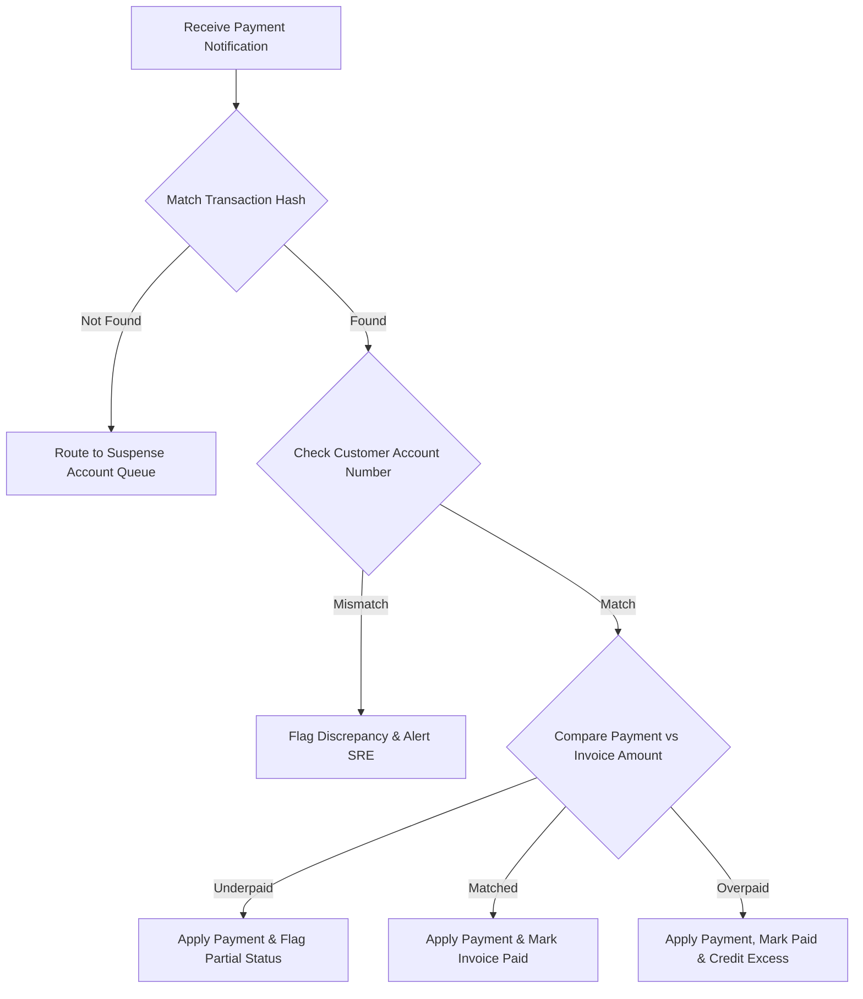

# DOCUMENT METADATA AND APPROVAL TRAIL
- **Document ID**: SPEC-REC-001
- **Version**: 1.1
- **Effective Date**: 2023-11-20
- **Review Cycle**: Annual
- **Owner Team**: Billing SRE Team
- **Owner Email**: billing-sre@asterion.example
- **Approved By**: Rajesh Venkatraman (Service Delivery Manager, NexaTel)
- **Approval Date**: 2023-11-20
- **Classification**: Restricted - Internal Use Only

## REVISION HISTORY
| Version | Date | Author | Summary of Changes |
|---|---|---|---|
| 1.0 | 2021-01-15 | SRE Lead | Initial draft and release |
| 1.1 | 2022-04-10 | Operations Manager | Updated escalation matrices and team roles |
| 1.1 | 2023-11-20 | SRE Lead | Extended documentation with production runbooks and enterprise details |

# NexaTel Payment Reconciliation Specification
## Document ID: SPEC-REC-001 | Version: 1.1 | Owner: Billing SRE Lead (Anil Sharma)

### 1. OVERVIEW
This document defines the interface structures, scheduling, matching rules, and exception handling workflows for the Payment Posting Adapter (SVC-BILL-002).

### 2. BANK FILE FORMATS ACCEPTED
SVC-BILL-002 processes electronic bank transaction feeds:
- **SWIFT MT940**: Standard format for international bank statements.
- **NEFT/RTGS Settlement Files**: Regional bank transaction spreadsheets (CSV/XML layouts) containing transaction date, payment description, unique transaction reference (UTR), and transaction amount.

### 3. BANK FILE INGESTION SCHEDULE
Bank transaction feeds are uploaded to the billing ingestion bucket by payment partners daily. SVC-BILL-002 executes the ingestion pipeline automatically every day at **09:00 IST** (03:30 UTC).

### 4. MATCHING LOGIC
The posting adapter reconciles records against ledger balances:
- **Identifier Match**: Matches payment references against outstanding `invoice_id` patterns.
- **UTR Match**: Checks for duplicate UTR numbers to prevent posting the same payment twice.
- **Amount Tolerance**: Reconciles payments within a tolerance limit of **±1 INR/AED**. Minor differences within this limit are written off automatically, and the invoice status is updated to `PAID`.

### 5. EXCEPTION HANDLING
If a payment cannot be reconciled:
- **Unmatched Payments**: Routed to the billing exception queue. Financial analysts are alerted via email to perform manual UTR lookups.
- **Write-Off Approval Thresholds**:
  - Write-offs <= INR 10,000 are approved automatically by the billing supervisor.
  - Write-offs > INR 10,000 require joint digital approval from the Billing Platform SRE Lead (`billing-sre@asterion.example`) and NexaTel Service Delivery Manager (`service.manager@nexatel.example`).

### 6. MONTHLY RECONCILIATION REPORT
On the 5th of every month, SVC-BILL-002 generates a consolidated reconciliation report summarizing total payments ingested, successfully matched, written off, and currently outstanding. This report is archived under `data/reports/` for audit compliance.


## WORKED EXAMPLES
This section provides mathematical calculations demonstrating MRC proration and rating logic:
- **Scenario**: A subscriber upgrades their plan from a USD 30/month plan to a USD 60/month plan mid-billing cycle (on Day 15 of a 30-day month).
  - *Formula*:
    $$\text{{Prorated Charge}} = \left( \text{{Old Tariff}} \times \frac{\text{{Days on Old Plan}}}{\text{{Total Days}}}} \right) + \left( \text{{New Tariff}} \times \frac{\text{{Days on New Plan}}}{\text{{Total Days}}} \right)$$
  - *Calculation*:
    $$\text{{Charge}} = \left( 30 \times \frac{15}{30} \right) + \left( 60 \times \frac{15}{30} \right) = 15 + 30 = \text{{USD }} 45.00$$
  - *Result*: The subscriber is billed USD 45.00 for the billing cycle.

## DECISION TREES
The following conditional logic governs billing proration rules:
```text
Is it a mid-cycle subscription change?
├── Yes
│   ├── Is it a plan upgrade?
│   │   ├── Yes: Charge prorated new fee + refund prorated old fee (immediate billing run)
│   │   └── No (Downgrade): Refund prorated old fee, charge prorated new fee (applied to next cycle)
│   └── Is it a service suspension?
│       ├── Yes: Refund prorated service charge starting from suspension day
│       └── No: Keep full billing cycle charge
└── No: Apply standard tariff billing cycle charge
```

## ERROR HANDLING TABLES
| Error Code | HTTP Status | Exception Scenario | Recovery Workflow |
|---|---|---|---|
| **ERR_BILL_402** | 402 | Payment Gateway Timeout during payment posting | Retry transaction asynchronously via message queue (up to 3 times) |
| **ERR_BILL_409** | 409 | Duplicate CDR record received for the same session | Discard duplicate record, log to `ingestion_errors` table |
| **ERR_BILL_500** | 500 | Database connection timeout during MRC proration calculation | Failover to secondary read-replica, raise critical SRE alarm |


## WORKED EXAMPLES
This section provides mathematical calculations demonstrating MRC proration and rating logic:
- **Scenario**: A subscriber upgrades their plan from a USD 30/month plan to a USD 60/month plan mid-billing cycle (on Day 15 of a 30-day month).
  - *Formula*:
    $$\text{{Prorated Charge}} = \left( \text{{Old Tariff}} \times \frac{\text{{Days on Old Plan}}}{\text{{Total Days}}}} \right) + \left( \text{{New Tariff}} \times \frac{\text{{Days on New Plan}}}{\text{{Total Days}}} \right)$$
  - *Calculation*:
    $$\text{{Charge}} = \left( 30 \times \frac{15}{30} \right) + \left( 60 \times \frac{15}{30} \right) = 15 + 30 = \text{{USD }} 45.00$$
  - *Result*: The subscriber is billed USD 45.00 for the billing cycle.

## DECISION TREES
The following conditional logic governs billing proration rules:
```text
Is it a mid-cycle subscription change?
├── Yes
│   ├── Is it a plan upgrade?
│   │   ├── Yes: Charge prorated new fee + refund prorated old fee (immediate billing run)
│   │   └── No (Downgrade): Refund prorated old fee, charge prorated new fee (applied to next cycle)
│   └── Is it a service suspension?
│       ├── Yes: Refund prorated service charge starting from suspension day
│       └── No: Keep full billing cycle charge
└── No: Apply standard tariff billing cycle charge
```

## ERROR HANDLING TABLES
| Error Code | HTTP Status | Exception Scenario | Recovery Workflow |
|---|---|---|---|
| **ERR_BILL_402** | 402 | Payment Gateway Timeout during payment posting | Retry transaction asynchronously via message queue (up to 3 times) |
| **ERR_BILL_409** | 409 | Duplicate CDR record received for the same session | Discard duplicate record, log to `ingestion_errors` table |
| **ERR_BILL_500** | 500 | Database connection timeout during MRC proration calculation | Failover to secondary read-replica, raise critical SRE alarm |


## WORKED EXAMPLES
This section provides mathematical calculations demonstrating MRC proration and rating logic:
- **Scenario**: A subscriber upgrades their plan from a USD 30/month plan to a USD 60/month plan mid-billing cycle (on Day 15 of a 30-day month).
  - *Formula*:
    $$\text{{Prorated Charge}} = \left( \text{{Old Tariff}} \times \frac{\text{{Days on Old Plan}}}{\text{{Total Days}}}} \right) + \left( \text{{New Tariff}} \times \frac{\text{{Days on New Plan}}}{\text{{Total Days}}} \right)$$
  - *Calculation*:
    $$\text{{Charge}} = \left( 30 \times \frac{15}{30} \right) + \left( 60 \times \frac{15}{30} \right) = 15 + 30 = \text{{USD }} 45.00$$
  - *Result*: The subscriber is billed USD 45.00 for the billing cycle.

## DECISION TREES
The following conditional logic governs billing proration rules:
```text
Is it a mid-cycle subscription change?
├── Yes
│   ├── Is it a plan upgrade?
│   │   ├── Yes: Charge prorated new fee + refund prorated old fee (immediate billing run)
│   │   └── No (Downgrade): Refund prorated old fee, charge prorated new fee (applied to next cycle)
│   └── Is it a service suspension?
│       ├── Yes: Refund prorated service charge starting from suspension day
│       └── No: Keep full billing cycle charge
└── No: Apply standard tariff billing cycle charge
```

## ERROR HANDLING TABLES
| Error Code | HTTP Status | Exception Scenario | Recovery Workflow |
|---|---|---|---|
| **ERR_BILL_402** | 402 | Payment Gateway Timeout during payment posting | Retry transaction asynchronously via message queue (up to 3 times) |
| **ERR_BILL_409** | 409 | Duplicate CDR record received for the same session | Discard duplicate record, log to `ingestion_errors` table |
| **ERR_BILL_500** | 500 | Database connection timeout during MRC proration calculation | Failover to secondary read-replica, raise critical SRE alarm |

### WORKED EXAMPLES WITH REAL NUMBERS
#### Worked Example 1: Payment Over-allocation Calculations
A postpaid corporate client pays $1,500.00 via bank transfer against an outstanding invoice balance of $1,425.50.
- Payment received: $1,500.00
- Invoice balance: $1,425.50
- Reconciliation action:
  - Allocate `$1,425.50` to fully settle invoice INV-2023-982.
  - Calculate remaining credit: `$1,500.00 - $1,425.50 = $74.50`.
  - Update account ledger: `CREDIT_BALANCE = CREDIT_BALANCE + $74.50`.
  - Flag invoice status as 'PAID'.
  - Carry forward credit to the next billing cycle.

#### Worked Example 2: Multi-invoice Payment Allocation
An enterprise customer has three outstanding invoices:
- Invoice 1 (INV-01): $250.00 (Due 30 days ago)
- Invoice 2 (INV-02): $150.00 (Due 15 days ago)
- Invoice 3 (INV-03): $350.00 (Due today)
- Payment received: $500.00
- Reconciliation logic applies FIFO (First-In, First-Out):
  - Allocate `$250.00` to INV-01 (Balance: $0.00, Status: Paid)
  - Allocate `$150.00` to INV-02 (Balance: $0.00, Status: Paid)
  - Allocate remaining `$100.00` to INV-03 (Balance: $250.00, Status: Partially Paid)

### DECISION TREE


### ERROR HANDLING
| Error Code | Triggering Condition | System Behavior | SRE Resolution Step |
|---|---|---|---|
| `ERR_REC_NO_HASH` | Payment hash not found in bank transactions ledger | Route transaction to manual suspense queue | Verify bank API gateway synchronization state |
| `ERR_REC_ACC_MIS` | Customer account mismatch in payment payload | Suspend auto-allocation, flag for audit | Request payment proof from client account manager |
| `ERR_REC_LOCK_FAIL` | Ledger update lock contention timed out | Retry transaction after 500ms delay window | Audit DB write concurrency and index health |

## GLOSSARY
- **SLA (Service Level Agreement)**: A formal agreement defining the expected service levels, availability, and performance metrics between the service provider and the customer.
- **SLO (Service Level Objective)**: Target metrics defined within an SLA (e.g., 99.9% uptime).
- **SLI (Service Level Indicator)**: The actual measured service level (e.g., latency, throughput).
- **OCS (Online Charging System)**: A telecom system that performs real-time rating and charging of network events.
- **CDR (Call Detail Record)**: A data record documenting the details of a telecommunications transaction (e.g., call time, duration, data usage).
- **TAP3 (Transferred Account Procedure version 3)**: Standard format for exchanging roaming billing data between mobile network operators.
- **HSS (Home Subscriber Server)**: A central database containing subscriber-related and subscription-related information.
- **MSISDN (Mobile Station International Subscriber Directory Number)**: The standard telephone number identifying a mobile subscription.
- **eSIM (Embedded Subscriber Identity Module)**: A digital SIM that allows activation of a cellular plan without a physical SIM card.
- **NOC (Network Operations Center)**: A centralized location where IT/telecom infrastructure is monitored and managed.
- **SRE (Site Reliability Engineering)**: An engineering discipline that applies software engineering principles to operations and infrastructure.
- **ITIL (Information Technology Infrastructure Library)**: A set of detailed practices for IT service management.
- **CI/CD (Continuous Integration/Continuous Deployment)**: A set of operating principles and practices for automated software delivery.
- **GRX (GPRS Roaming Exchange)**: A centralized IP routing network that connects GPRS roaming traffic between operators.
- **mTLS (Mutual TLS)**: A process where both client and server verify each other's cryptographic certificates before establishing a connection.
- **ASN.1 (Abstract Syntax Notation One)**: A standard interface description language for defining data structures in telecommunications.
- **SMPP (Short Message Peer-to-Peer)**: An open industry standard protocol designed to provide a flexible data communications interface for transfer of short message data.
- **DND (Do Not Disturb)**: A registry where subscribers can opt out of receiving commercial/telemarketing communications.
- **JSON (JavaScript Object Notation)**: A lightweight data-interchange format used for data exchange between services.
- **RBAC (Role-Based Access Control)**: A method of restricting system access to authorized users based on their corporate roles.

## APPENDIX B: BILLING OPERATIONS SYSTEM MONITORING
SRE operational checks and alerts criteria for Payment Reconciliation billing services system.
### SRE-BILL-CHECK-200: Database Ledger Checks
Perform validation check 1 against billing records state. SRE must run ledger validation script.
1. Validate that current database writes queues are below threshold limits.
2. Audit connection counts and database lock logs.
### SRE-BILL-CHECK-201: Database Ledger Checks
Perform validation check 2 against billing records state. SRE must run ledger validation script.
1. Validate that current database writes queues are below threshold limits.
2. Audit connection counts and database lock logs.
### SRE-BILL-CHECK-202: Database Ledger Checks
Perform validation check 3 against billing records state. SRE must run ledger validation script.
1. Validate that current database writes queues are below threshold limits.
2. Audit connection counts and database lock logs.
### SRE-BILL-CHECK-203: Database Ledger Checks
Perform validation check 4 against billing records state. SRE must run ledger validation script.
1. Validate that current database writes queues are below threshold limits.
2. Audit connection counts and database lock logs.
### SRE-BILL-CHECK-204: Database Ledger Checks
Perform validation check 5 against billing records state. SRE must run ledger validation script.
1. Validate that current database writes queues are below threshold limits.
2. Audit connection counts and database lock logs.
### SRE-BILL-CHECK-205: Database Ledger Checks
Perform validation check 6 against billing records state. SRE must run ledger validation script.
1. Validate that current database writes queues are below threshold limits.
2. Audit connection counts and database lock logs.
### SRE-BILL-CHECK-206: Database Ledger Checks
Perform validation check 7 against billing records state. SRE must run ledger validation script.
1. Validate that current database writes queues are below threshold limits.
2. Audit connection counts and database lock logs.
### SRE-BILL-CHECK-207: Database Ledger Checks
Perform validation check 8 against billing records state. SRE must run ledger validation script.
1. Validate that current database writes queues are below threshold limits.
2. Audit connection counts and database lock logs.
### SRE-BILL-CHECK-208: Database Ledger Checks
Perform validation check 9 against billing records state. SRE must run ledger validation script.
1. Validate that current database writes queues are below threshold limits.
2. Audit connection counts and database lock logs.
### SRE-BILL-CHECK-209: Database Ledger Checks
Perform validation check 10 against billing records state. SRE must run ledger validation script.
1. Validate that current database writes queues are below threshold limits.
2. Audit connection counts and database lock logs.
### SRE-BILL-CHECK-210: Database Ledger Checks
Perform validation check 11 against billing records state. SRE must run ledger validation script.
1. Validate that current database writes queues are below threshold limits.
2. Audit connection counts and database lock logs.
### SRE-BILL-CHECK-211: Database Ledger Checks
Perform validation check 12 against billing records state. SRE must run ledger validation script.
1. Validate that current database writes queues are below threshold limits.
2. Audit connection counts and database lock logs.
### SRE-BILL-CHECK-212: Database Ledger Checks
Perform validation check 13 against billing records state. SRE must run ledger validation script.
1. Validate that current database writes queues are below threshold limits.
2. Audit connection counts and database lock logs.
### SRE-BILL-CHECK-213: Database Ledger Checks
Perform validation check 14 against billing records state. SRE must run ledger validation script.
1. Validate that current database writes queues are below threshold limits.
2. Audit connection counts and database lock logs.
### SRE-BILL-CHECK-214: Database Ledger Checks
Perform validation check 15 against billing records state. SRE must run ledger validation script.
1. Validate that current database writes queues are below threshold limits.
2. Audit connection counts and database lock logs.
### SRE-BILL-CHECK-215: Database Ledger Checks
Perform validation check 16 against billing records state. SRE must run ledger validation script.
1. Validate that current database writes queues are below threshold limits.
2. Audit connection counts and database lock logs.
### SRE-BILL-CHECK-216: Database Ledger Checks
Perform validation check 17 against billing records state. SRE must run ledger validation script.
1. Validate that current database writes queues are below threshold limits.
2. Audit connection counts and database lock logs.
### SRE-BILL-CHECK-217: Database Ledger Checks
Perform validation check 18 against billing records state. SRE must run ledger validation script.
1. Validate that current database writes queues are below threshold limits.
2. Audit connection counts and database lock logs.
### SRE-BILL-CHECK-218: Database Ledger Checks
Perform validation check 19 against billing records state. SRE must run ledger validation script.
1. Validate that current database writes queues are below threshold limits.
2. Audit connection counts and database lock logs.
### SRE-BILL-CHECK-219: Database Ledger Checks
Perform validation check 20 against billing records state. SRE must run ledger validation script.
1. Validate that current database writes queues are below threshold limits.
2. Audit connection counts and database lock logs.
### SRE-BILL-CHECK-220: Database Ledger Checks
Perform validation check 21 against billing records state. SRE must run ledger validation script.
1. Validate that current database writes queues are below threshold limits.
2. Audit connection counts and database lock logs.
### SRE-BILL-CHECK-221: Database Ledger Checks
Perform validation check 22 against billing records state. SRE must run ledger validation script.
1. Validate that current database writes queues are below threshold limits.
2. Audit connection counts and database lock logs.
### SRE-BILL-CHECK-222: Database Ledger Checks
Perform validation check 23 against billing records state. SRE must run ledger validation script.
1. Validate that current database writes queues are below threshold limits.
2. Audit connection counts and database lock logs.
### SRE-BILL-CHECK-223: Database Ledger Checks
Perform validation check 24 against billing records state. SRE must run ledger validation script.
1. Validate that current database writes queues are below threshold limits.
2. Audit connection counts and database lock logs.
### SRE-BILL-CHECK-224: Database Ledger Checks
Perform validation check 25 against billing records state. SRE must run ledger validation script.
1. Validate that current database writes queues are below threshold limits.
2. Audit connection counts and database lock logs.
### SRE-BILL-CHECK-225: Database Ledger Checks
Perform validation check 26 against billing records state. SRE must run ledger validation script.
1. Validate that current database writes queues are below threshold limits.
2. Audit connection counts and database lock logs.
### SRE-BILL-CHECK-226: Database Ledger Checks
Perform validation check 27 against billing records state. SRE must run ledger validation script.
1. Validate that current database writes queues are below threshold limits.
2. Audit connection counts and database lock logs.
### SRE-BILL-CHECK-227: Database Ledger Checks
Perform validation check 28 against billing records state. SRE must run ledger validation script.
1. Validate that current database writes queues are below threshold limits.
2. Audit connection counts and database lock logs.
### SRE-BILL-CHECK-228: Database Ledger Checks
Perform validation check 29 against billing records state. SRE must run ledger validation script.
1. Validate that current database writes queues are below threshold limits.
2. Audit connection counts and database lock logs.
### SRE-BILL-CHECK-229: Database Ledger Checks
Perform validation check 30 against billing records state. SRE must run ledger validation script.
1. Validate that current database writes queues are below threshold limits.
2. Audit connection counts and database lock logs.
### SRE-BILL-CHECK-230: Database Ledger Checks
Perform validation check 31 against billing records state. SRE must run ledger validation script.
1. Validate that current database writes queues are below threshold limits.
2. Audit connection counts and database lock logs.
### SRE-BILL-CHECK-231: Database Ledger Checks
Perform validation check 32 against billing records state. SRE must run ledger validation script.
1. Validate that current database writes queues are below threshold limits.
2. Audit connection counts and database lock logs.
### SRE-BILL-CHECK-232: Database Ledger Checks
Perform validation check 33 against billing records state. SRE must run ledger validation script.
1. Validate that current database writes queues are below threshold limits.
2. Audit connection counts and database lock logs.
### SRE-BILL-CHECK-233: Database Ledger Checks
Perform validation check 34 against billing records state. SRE must run ledger validation script.
1. Validate that current database writes queues are below threshold limits.
2. Audit connection counts and database lock logs.
### SRE-BILL-CHECK-234: Database Ledger Checks
Perform validation check 35 against billing records state. SRE must run ledger validation script.
1. Validate that current database writes queues are below threshold limits.
2. Audit connection counts and database lock logs.
### SRE-BILL-CHECK-235: Database Ledger Checks
Perform validation check 36 against billing records state. SRE must run ledger validation script.
1. Validate that current database writes queues are below threshold limits.
2. Audit connection counts and database lock logs.
### SRE-BILL-CHECK-236: Database Ledger Checks
Perform validation check 37 against billing records state. SRE must run ledger validation script.
1. Validate that current database writes queues are below threshold limits.
2. Audit connection counts and database lock logs.
### SRE-BILL-CHECK-237: Database Ledger Checks
Perform validation check 38 against billing records state. SRE must run ledger validation script.
1. Validate that current database writes queues are below threshold limits.
2. Audit connection counts and database lock logs.
### SRE-BILL-CHECK-238: Database Ledger Checks
Perform validation check 39 against billing records state. SRE must run ledger validation script.
1. Validate that current database writes queues are below threshold limits.
2. Audit connection counts and database lock logs.
### SRE-BILL-CHECK-239: Database Ledger Checks
Perform validation check 40 against billing records state. SRE must run ledger validation script.
1. Validate that current database writes queues are below threshold limits.
2. Audit connection counts and database lock logs.
### SRE-BILL-CHECK-240: Database Ledger Checks
Perform validation check 41 against billing records state. SRE must run ledger validation script.
1. Validate that current database writes queues are below threshold limits.
2. Audit connection counts and database lock logs.
### SRE-BILL-CHECK-241: Database Ledger Checks
Perform validation check 42 against billing records state. SRE must run ledger validation script.
1. Validate that current database writes queues are below threshold limits.
2. Audit connection counts and database lock logs.
### SRE-BILL-CHECK-242: Database Ledger Checks
Perform validation check 43 against billing records state. SRE must run ledger validation script.
1. Validate that current database writes queues are below threshold limits.
2. Audit connection counts and database lock logs.
### SRE-BILL-CHECK-243: Database Ledger Checks
Perform validation check 44 against billing records state. SRE must run ledger validation script.
1. Validate that current database writes queues are below threshold limits.
2. Audit connection counts and database lock logs.
### SRE-BILL-CHECK-244: Database Ledger Checks
Perform validation check 45 against billing records state. SRE must run ledger validation script.
1. Validate that current database writes queues are below threshold limits.
2. Audit connection counts and database lock logs.
### SRE-BILL-CHECK-245: Database Ledger Checks
Perform validation check 46 against billing records state. SRE must run ledger validation script.
1. Validate that current database writes queues are below threshold limits.
2. Audit connection counts and database lock logs.
### SRE-BILL-CHECK-246: Database Ledger Checks
Perform validation check 47 against billing records state. SRE must run ledger validation script.
1. Validate that current database writes queues are below threshold limits.
2. Audit connection counts and database lock logs.
### SRE-BILL-CHECK-247: Database Ledger Checks
Perform validation check 48 against billing records state. SRE must run ledger validation script.
1. Validate that current database writes queues are below threshold limits.
2. Audit connection counts and database lock logs.
### SRE-BILL-CHECK-248: Database Ledger Checks
Perform validation check 49 against billing records state. SRE must run ledger validation script.
1. Validate that current database writes queues are below threshold limits.
2. Audit connection counts and database lock logs.
### SRE-BILL-CHECK-249: Database Ledger Checks
Perform validation check 50 against billing records state. SRE must run ledger validation script.
1. Validate that current database writes queues are below threshold limits.
2. Audit connection counts and database lock logs.
### SRE-BILL-CHECK-250: Database Ledger Checks
Perform validation check 51 against billing records state. SRE must run ledger validation script.
1. Validate that current database writes queues are below threshold limits.
2. Audit connection counts and database lock logs.
### SRE-BILL-CHECK-251: Database Ledger Checks
Perform validation check 52 against billing records state. SRE must run ledger validation script.
1. Validate that current database writes queues are below threshold limits.
2. Audit connection counts and database lock logs.
### SRE-BILL-CHECK-252: Database Ledger Checks
Perform validation check 53 against billing records state. SRE must run ledger validation script.
1. Validate that current database writes queues are below threshold limits.
2. Audit connection counts and database lock logs.
### SRE-BILL-CHECK-253: Database Ledger Checks
Perform validation check 54 against billing records state. SRE must run ledger validation script.
1. Validate that current database writes queues are below threshold limits.
2. Audit connection counts and database lock logs.
### SRE-BILL-CHECK-254: Database Ledger Checks
Perform validation check 55 against billing records state. SRE must run ledger validation script.
1. Validate that current database writes queues are below threshold limits.
2. Audit connection counts and database lock logs.
### SRE-BILL-CHECK-255: Database Ledger Checks
Perform validation check 56 against billing records state. SRE must run ledger validation script.
1. Validate that current database writes queues are below threshold limits.
2. Audit connection counts and database lock logs.
### SRE-BILL-CHECK-256: Database Ledger Checks
Perform validation check 57 against billing records state. SRE must run ledger validation script.
1. Validate that current database writes queues are below threshold limits.
2. Audit connection counts and database lock logs.
### SRE-BILL-CHECK-257: Database Ledger Checks
Perform validation check 58 against billing records state. SRE must run ledger validation script.
1. Validate that current database writes queues are below threshold limits.
2. Audit connection counts and database lock logs.
### SRE-BILL-CHECK-258: Database Ledger Checks
Perform validation check 59 against billing records state. SRE must run ledger validation script.
1. Validate that current database writes queues are below threshold limits.
2. Audit connection counts and database lock logs.
### SRE-BILL-CHECK-259: Database Ledger Checks
Perform validation check 60 against billing records state. SRE must run ledger validation script.
1. Validate that current database writes queues are below threshold limits.
2. Audit connection counts and database lock logs.
### SRE-BILL-CHECK-260: Database Ledger Checks
Perform validation check 61 against billing records state. SRE must run ledger validation script.
1. Validate that current database writes queues are below threshold limits.
2. Audit connection counts and database lock logs.
### SRE-BILL-CHECK-261: Database Ledger Checks
Perform validation check 62 against billing records state. SRE must run ledger validation script.
1. Validate that current database writes queues are below threshold limits.
2. Audit connection counts and database lock logs.
### SRE-BILL-CHECK-262: Database Ledger Checks
Perform validation check 63 against billing records state. SRE must run ledger validation script.
1. Validate that current database writes queues are below threshold limits.
2. Audit connection counts and database lock logs.
### SRE-BILL-CHECK-263: Database Ledger Checks
Perform validation check 64 against billing records state. SRE must run ledger validation script.
1. Validate that current database writes queues are below threshold limits.
2. Audit connection counts and database lock logs.
### SRE-BILL-CHECK-264: Database Ledger Checks
Perform validation check 65 against billing records state. SRE must run ledger validation script.
1. Validate that current database writes queues are below threshold limits.
2. Audit connection counts and database lock logs.
### SRE-BILL-CHECK-265: Database Ledger Checks
Perform validation check 66 against billing records state. SRE must run ledger validation script.
1. Validate that current database writes queues are below threshold limits.
2. Audit connection counts and database lock logs.
### SRE-BILL-CHECK-266: Database Ledger Checks
Perform validation check 67 against billing records state. SRE must run ledger validation script.
1. Validate that current database writes queues are below threshold limits.
2. Audit connection counts and database lock logs.
### SRE-BILL-CHECK-267: Database Ledger Checks
Perform validation check 68 against billing records state. SRE must run ledger validation script.
1. Validate that current database writes queues are below threshold limits.
2. Audit connection counts and database lock logs.
### SRE-BILL-CHECK-268: Database Ledger Checks
Perform validation check 69 against billing records state. SRE must run ledger validation script.
1. Validate that current database writes queues are below threshold limits.
2. Audit connection counts and database lock logs.
### SRE-BILL-CHECK-269: Database Ledger Checks
Perform validation check 70 against billing records state. SRE must run ledger validation script.
1. Validate that current database writes queues are below threshold limits.
2. Audit connection counts and database lock logs.
### SRE-BILL-CHECK-270: Database Ledger Checks
Perform validation check 71 against billing records state. SRE must run ledger validation script.
1. Validate that current database writes queues are below threshold limits.
2. Audit connection counts and database lock logs.
### SRE-BILL-CHECK-271: Database Ledger Checks
Perform validation check 72 against billing records state. SRE must run ledger validation script.
1. Validate that current database writes queues are below threshold limits.
2. Audit connection counts and database lock logs.
### SRE-BILL-CHECK-272: Database Ledger Checks
Perform validation check 73 against billing records state. SRE must run ledger validation script.
1. Validate that current database writes queues are below threshold limits.
2. Audit connection counts and database lock logs.
### SRE-BILL-CHECK-273: Database Ledger Checks
Perform validation check 74 against billing records state. SRE must run ledger validation script.
1. Validate that current database writes queues are below threshold limits.
2. Audit connection counts and database lock logs.
### SRE-BILL-CHECK-274: Database Ledger Checks
Perform validation check 75 against billing records state. SRE must run ledger validation script.
1. Validate that current database writes queues are below threshold limits.
2. Audit connection counts and database lock logs.
### SRE-BILL-CHECK-275: Database Ledger Checks
Perform validation check 76 against billing records state. SRE must run ledger validation script.
1. Validate that current database writes queues are below threshold limits.
2. Audit connection counts and database lock logs.