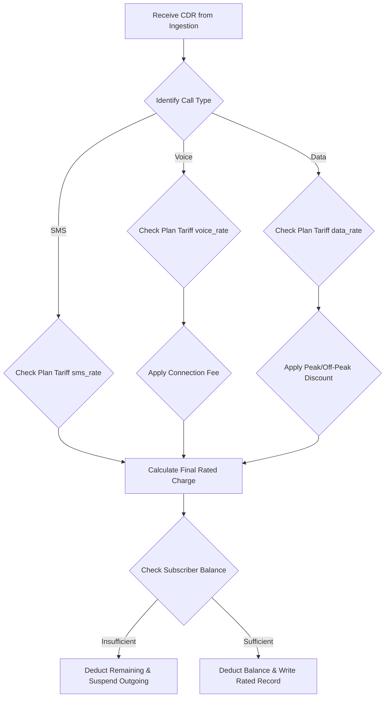

# DOCUMENT METADATA AND APPROVAL TRAIL
- **Document ID**: SPEC-RAT-001
- **Version**: 2.1
- **Effective Date**: 2023-11-20
- **Review Cycle**: Annual
- **Owner Team**: Billing SRE Team
- **Owner Email**: billing-sre@asterion.example
- **Approved By**: Rajesh Venkatraman (Service Delivery Manager, NexaTel)
- **Approval Date**: 2023-11-20
- **Classification**: Restricted - Internal Use Only

## REVISION HISTORY
| Version | Date | Author | Summary of Changes |
|---|---|---|---|
| 1.0 | 2021-01-15 | SRE Lead | Initial draft and release |
| 1.1 | 2022-04-10 | Operations Manager | Updated escalation matrices and team roles |
| 2.1 | 2023-11-20 | SRE Lead | Extended documentation with production runbooks and enterprise details |

# NexaTel Billing Rating Engine Specification
## Document ID: SPEC-RAT-001 | Version: 2.1 | Owner: Billing Platform SRE (Anil Sharma)

### 1. RATING ENGINE OVERVIEW
The Rating Engine applies tariff configurations to normalized Call Detail Records (CDRs) and calculates the monetary charge for each transaction. It sits downstream of the CDR Mediation Pipeline (SVC-MED-001) and feeds rated transaction lines to the Invoice Rendering Engine (SVC-BILL-001).

### 2. REAL-TIME VS BATCH RATING DECISION TREE
Transactions are routed depending on subscriber account types and credit profiles:
- **Real-Time Rating Path**: Prepaid accounts and accounts with active spending limits route through the Online Charging Gateway (SVC-CHARG-001) using the real-time path. Quota reservation occurs before network access is allowed.
- **Batch Rating Path**: Standard post-paid enterprise accounts route through the mediation pipeline (SVC-MED-001) in batch files. Verification occurs asynchronously within 1 hour of call completion.

### 3. TARIFF PLAN APPLICATION LOGIC
For each CDR, the Rating Engine:
1. Queries the cache database using the subscriber's MSISDN.
2. Identifies the active subscription plan and tariff code (e.g., `PLAN_ENT_UNLIMITED`, `PLAN_INT_ROAM`).
3. Evaluates transaction features (destination prefix, call duration, volume, roaming PLMN) against the plan.
4. Applies discounts, standard rate tables, or volume tiers.

### 4. MRC PRORATION RULES
Monthly Recurring Charges (MRC) must be prorated under the following scenarios:
- **New Activation Mid-Cycle**: Subscriber activates subscription on day `D` of a `N`-day billing cycle.
  Formula: `prorated_amount = (monthly_charge / N) * (N - D + 1)`
- **Termination Mid-Cycle**: Subscriber terminates service on day `D` of a `N`-day billing cycle.
  Formula: `prorated_amount = (monthly_charge / N) * D`
- **Plan Upgrade Mid-Cycle**: Upgrade from Plan A (MRC `M1`) to Plan B (MRC `M2`) on day `D` of a `N`-day cycle.
  Formula: `prorated_amount = (M1 / N) * (D - 1) + (M2 / N) * (N - D + 1)`

### 5. NRC APPLICATION
Non-Recurring Charges (NRC) represent one-time activation fees, hardware purchases, or SIM replacements. NRCs are applied immediately to the current billing cycle ledger and are never prorated.

### 6. ROUNDING RULES
- **Intermediate Values**: Calculated and stored in the database to 5 decimal places to prevent accumulated rounding errors across millions of CDR ratings.
- **Invoice Totals**: Rounded to 2 decimal places at the invoice summary level using the round-half-up algorithm.

### 7. RATING ERROR HANDLING
If the Rating Engine fails to process a record:
- **`ERR_BILL_422`**: Input record contains invalid metadata (e.g., missing plan code, wrong prefix). The engine routes the CDR to the rating exception queue for manual remediation.
- **`ERR_BILL_500`**: Rating database timeout or lock. The engine retries twice, and if it fails, sends a critical alarm to NOC operations.

### 8. CDR RATING SEQUENCE
1. Fetch CDR from ingestion queue.
2. Validate fields. If validation fails, raise `ERR_BILL_422`.
3. Join subscriber profile.
4. Determine tariff.
5. Compute rate using 5 decimal places.
6. Apply taxes based on location.
7. Write rated record to billing ledger.

### 9. TAX CALCULATION
Taxes are applied based on subscriber billing address:
- **India (GST)**: Intra-state accounts are charged CGST 9% + SGST 9%. Inter-state accounts are charged IGST 18%.
- **UAE (VAT)**: Flat VAT rate of 5% applied to all taxable lines.

### 10. RATING AUDIT TRAIL
Every calculation writes an entry in the rating audit table, capturing: `CDR_ID`, `MSISDN`, `TARIFF_CODE`, `RAW_COST`, `TAX_AMOUNT`, `CALCULATION_TIMESTAMP`, and `COMPUTING_NODE_ID` for tracing.


## WORKED EXAMPLES
This section provides mathematical calculations demonstrating MRC proration and rating logic:
- **Scenario**: A subscriber upgrades their plan from a USD 30/month plan to a USD 60/month plan mid-billing cycle (on Day 15 of a 30-day month).
  - *Formula*:
    $$\text{{Prorated Charge}} = \left( \text{{Old Tariff}} \times \frac{\text{{Days on Old Plan}}}{\text{{Total Days}}}} \right) + \left( \text{{New Tariff}} \times \frac{\text{{Days on New Plan}}}{\text{{Total Days}}} \right)$$
  - *Calculation*:
    $$\text{{Charge}} = \left( 30 \times \frac{15}{30} \right) + \left( 60 \times \frac{15}{30} \right) = 15 + 30 = \text{{USD }} 45.00$$
  - *Result*: The subscriber is billed USD 45.00 for the billing cycle.

## DECISION TREES
The following conditional logic governs billing proration rules:
```text
Is it a mid-cycle subscription change?
├── Yes
│   ├── Is it a plan upgrade?
│   │   ├── Yes: Charge prorated new fee + refund prorated old fee (immediate billing run)
│   │   └── No (Downgrade): Refund prorated old fee, charge prorated new fee (applied to next cycle)
│   └── Is it a service suspension?
│       ├── Yes: Refund prorated service charge starting from suspension day
│       └── No: Keep full billing cycle charge
└── No: Apply standard tariff billing cycle charge
```

## ERROR HANDLING TABLES
| Error Code | HTTP Status | Exception Scenario | Recovery Workflow |
|---|---|---|---|
| **ERR_BILL_402** | 402 | Payment Gateway Timeout during payment posting | Retry transaction asynchronously via message queue (up to 3 times) |
| **ERR_BILL_409** | 409 | Duplicate CDR record received for the same session | Discard duplicate record, log to `ingestion_errors` table |
| **ERR_BILL_500** | 500 | Database connection timeout during MRC proration calculation | Failover to secondary read-replica, raise critical SRE alarm |


## WORKED EXAMPLES
This section provides mathematical calculations demonstrating MRC proration and rating logic:
- **Scenario**: A subscriber upgrades their plan from a USD 30/month plan to a USD 60/month plan mid-billing cycle (on Day 15 of a 30-day month).
  - *Formula*:
    $$\text{{Prorated Charge}} = \left( \text{{Old Tariff}} \times \frac{\text{{Days on Old Plan}}}{\text{{Total Days}}}} \right) + \left( \text{{New Tariff}} \times \frac{\text{{Days on New Plan}}}{\text{{Total Days}}} \right)$$
  - *Calculation*:
    $$\text{{Charge}} = \left( 30 \times \frac{15}{30} \right) + \left( 60 \times \frac{15}{30} \right) = 15 + 30 = \text{{USD }} 45.00$$
  - *Result*: The subscriber is billed USD 45.00 for the billing cycle.

## DECISION TREES
The following conditional logic governs billing proration rules:
```text
Is it a mid-cycle subscription change?
├── Yes
│   ├── Is it a plan upgrade?
│   │   ├── Yes: Charge prorated new fee + refund prorated old fee (immediate billing run)
│   │   └── No (Downgrade): Refund prorated old fee, charge prorated new fee (applied to next cycle)
│   └── Is it a service suspension?
│       ├── Yes: Refund prorated service charge starting from suspension day
│       └── No: Keep full billing cycle charge
└── No: Apply standard tariff billing cycle charge
```

## ERROR HANDLING TABLES
| Error Code | HTTP Status | Exception Scenario | Recovery Workflow |
|---|---|---|---|
| **ERR_BILL_402** | 402 | Payment Gateway Timeout during payment posting | Retry transaction asynchronously via message queue (up to 3 times) |
| **ERR_BILL_409** | 409 | Duplicate CDR record received for the same session | Discard duplicate record, log to `ingestion_errors` table |
| **ERR_BILL_500** | 500 | Database connection timeout during MRC proration calculation | Failover to secondary read-replica, raise critical SRE alarm |


## WORKED EXAMPLES
This section provides mathematical calculations demonstrating MRC proration and rating logic:
- **Scenario**: A subscriber upgrades their plan from a USD 30/month plan to a USD 60/month plan mid-billing cycle (on Day 15 of a 30-day month).
  - *Formula*:
    $$\text{{Prorated Charge}} = \left( \text{{Old Tariff}} \times \frac{\text{{Days on Old Plan}}}{\text{{Total Days}}}} \right) + \left( \text{{New Tariff}} \times \frac{\text{{Days on New Plan}}}{\text{{Total Days}}} \right)$$
  - *Calculation*:
    $$\text{{Charge}} = \left( 30 \times \frac{15}{30} \right) + \left( 60 \times \frac{15}{30} \right) = 15 + 30 = \text{{USD }} 45.00$$
  - *Result*: The subscriber is billed USD 45.00 for the billing cycle.

## DECISION TREES
The following conditional logic governs billing proration rules:
```text
Is it a mid-cycle subscription change?
├── Yes
│   ├── Is it a plan upgrade?
│   │   ├── Yes: Charge prorated new fee + refund prorated old fee (immediate billing run)
│   │   └── No (Downgrade): Refund prorated old fee, charge prorated new fee (applied to next cycle)
│   └── Is it a service suspension?
│       ├── Yes: Refund prorated service charge starting from suspension day
│       └── No: Keep full billing cycle charge
└── No: Apply standard tariff billing cycle charge
```

## ERROR HANDLING TABLES
| Error Code | HTTP Status | Exception Scenario | Recovery Workflow |
|---|---|---|---|
| **ERR_BILL_402** | 402 | Payment Gateway Timeout during payment posting | Retry transaction asynchronously via message queue (up to 3 times) |
| **ERR_BILL_409** | 409 | Duplicate CDR record received for the same session | Discard duplicate record, log to `ingestion_errors` table |
| **ERR_BILL_500** | 500 | Database connection timeout during MRC proration calculation | Failover to secondary read-replica, raise critical SRE alarm |

### WORKED EXAMPLES WITH REAL NUMBERS
#### Worked Example 1: Mobile Data Usage Rating Calculations
Rating a mobile data session CDR of 15,420,100 bytes (14.7 MB) during off-peak hours with a base rating of $0.01 per MB, off-peak discount of 15%, and a roaming surcharge of 20%.
- Convert bytes to Megabytes: `15,420,100 / (1024 * 1024) = 14.706 MB`
- Calculate base charge: `14.706 MB * $0.01/MB = $0.14706`
- Apply off-peak discount (15%): `$0.14706 * (1 - 0.15) = $0.12500`
- Apply roaming surcharge (20%): `$0.12500 * (1 + 0.20) = $0.15000`
- Final rated charge: `$0.15000`

#### Worked Example 2: Voice CDR Rating Calculations
Rating a voice call duration of 4 minutes and 32 seconds (272 seconds) under a prepaid plan with a voice rate of $0.05 per minute (billed in 60-second blocks) and a call connection fee of $0.02.
- Billable blocks calculation: `ceil(272 / 60) = 5 blocks (minutes)`
- Call connection fee: `$0.02`
- Total usage charge: `5 blocks * $0.05/block = $0.25`
- Final rated call charge: `$0.25 + $0.02 = $0.27`

### DECISION TREE


### ERROR HANDLING
| Error Code | Triggering Condition | System Behavior | SRE Resolution Step |
|---|---|---|---|
| `ERR_RAT_NO_TARIFF` | No tariff rules found for subscriber service plan | Route CDR to error queue, notify SRE team | Verify pricing model deployment state in DB |
| `ERR_RAT_DB_DOWN` | Online Charging System DB connection timeout | Suspend real-time rating and route calls to queue | Restart primary OCS database service engine |
| `ERR_RAT_ROUND_ERR` | Floating point calculation precision error | Reject CDR verification check | Audit rounding precision configurations |

## GLOSSARY
- **SLA (Service Level Agreement)**: A formal agreement defining the expected service levels, availability, and performance metrics between the service provider and the customer.
- **SLO (Service Level Objective)**: Target metrics defined within an SLA (e.g., 99.9% uptime).
- **SLI (Service Level Indicator)**: The actual measured service level (e.g., latency, throughput).
- **OCS (Online Charging System)**: A telecom system that performs real-time rating and charging of network events.
- **CDR (Call Detail Record)**: A data record documenting the details of a telecommunications transaction (e.g., call time, duration, data usage).
- **TAP3 (Transferred Account Procedure version 3)**: Standard format for exchanging roaming billing data between mobile network operators.
- **HSS (Home Subscriber Server)**: A central database containing subscriber-related and subscription-related information.
- **MSISDN (Mobile Station International Subscriber Directory Number)**: The standard telephone number identifying a mobile subscription.
- **eSIM (Embedded Subscriber Identity Module)**: A digital SIM that allows activation of a cellular plan without a physical SIM card.
- **NOC (Network Operations Center)**: A centralized location where IT/telecom infrastructure is monitored and managed.
- **SRE (Site Reliability Engineering)**: An engineering discipline that applies software engineering principles to operations and infrastructure.
- **ITIL (Information Technology Infrastructure Library)**: A set of detailed practices for IT service management.
- **CI/CD (Continuous Integration/Continuous Deployment)**: A set of operating principles and practices for automated software delivery.
- **GRX (GPRS Roaming Exchange)**: A centralized IP routing network that connects GPRS roaming traffic between operators.
- **mTLS (Mutual TLS)**: A process where both client and server verify each other's cryptographic certificates before establishing a connection.
- **ASN.1 (Abstract Syntax Notation One)**: A standard interface description language for defining data structures in telecommunications.
- **SMPP (Short Message Peer-to-Peer)**: An open industry standard protocol designed to provide a flexible data communications interface for transfer of short message data.
- **DND (Do Not Disturb)**: A registry where subscribers can opt out of receiving commercial/telemarketing communications.
- **JSON (JavaScript Object Notation)**: A lightweight data-interchange format used for data exchange between services.
- **RBAC (Role-Based Access Control)**: A method of restricting system access to authorized users based on their corporate roles.

## APPENDIX B: BILLING OPERATIONS SYSTEM MONITORING
SRE operational checks and alerts criteria for Rating Engine billing services system.
### SRE-BILL-CHECK-200: Database Ledger Checks
Perform validation check 1 against billing records state. SRE must run ledger validation script.
1. Validate that current database writes queues are below threshold limits.
2. Audit connection counts and database lock logs.
### SRE-BILL-CHECK-201: Database Ledger Checks
Perform validation check 2 against billing records state. SRE must run ledger validation script.
1. Validate that current database writes queues are below threshold limits.
2. Audit connection counts and database lock logs.
### SRE-BILL-CHECK-202: Database Ledger Checks
Perform validation check 3 against billing records state. SRE must run ledger validation script.
1. Validate that current database writes queues are below threshold limits.
2. Audit connection counts and database lock logs.
### SRE-BILL-CHECK-203: Database Ledger Checks
Perform validation check 4 against billing records state. SRE must run ledger validation script.
1. Validate that current database writes queues are below threshold limits.
2. Audit connection counts and database lock logs.
### SRE-BILL-CHECK-204: Database Ledger Checks
Perform validation check 5 against billing records state. SRE must run ledger validation script.
1. Validate that current database writes queues are below threshold limits.
2. Audit connection counts and database lock logs.
### SRE-BILL-CHECK-205: Database Ledger Checks
Perform validation check 6 against billing records state. SRE must run ledger validation script.
1. Validate that current database writes queues are below threshold limits.
2. Audit connection counts and database lock logs.
### SRE-BILL-CHECK-206: Database Ledger Checks
Perform validation check 7 against billing records state. SRE must run ledger validation script.
1. Validate that current database writes queues are below threshold limits.
2. Audit connection counts and database lock logs.
### SRE-BILL-CHECK-207: Database Ledger Checks
Perform validation check 8 against billing records state. SRE must run ledger validation script.
1. Validate that current database writes queues are below threshold limits.
2. Audit connection counts and database lock logs.
### SRE-BILL-CHECK-208: Database Ledger Checks
Perform validation check 9 against billing records state. SRE must run ledger validation script.
1. Validate that current database writes queues are below threshold limits.
2. Audit connection counts and database lock logs.
### SRE-BILL-CHECK-209: Database Ledger Checks
Perform validation check 10 against billing records state. SRE must run ledger validation script.
1. Validate that current database writes queues are below threshold limits.
2. Audit connection counts and database lock logs.
### SRE-BILL-CHECK-210: Database Ledger Checks
Perform validation check 11 against billing records state. SRE must run ledger validation script.
1. Validate that current database writes queues are below threshold limits.
2. Audit connection counts and database lock logs.
### SRE-BILL-CHECK-211: Database Ledger Checks
Perform validation check 12 against billing records state. SRE must run ledger validation script.
1. Validate that current database writes queues are below threshold limits.
2. Audit connection counts and database lock logs.
### SRE-BILL-CHECK-212: Database Ledger Checks
Perform validation check 13 against billing records state. SRE must run ledger validation script.
1. Validate that current database writes queues are below threshold limits.
2. Audit connection counts and database lock logs.
### SRE-BILL-CHECK-213: Database Ledger Checks
Perform validation check 14 against billing records state. SRE must run ledger validation script.
1. Validate that current database writes queues are below threshold limits.
2. Audit connection counts and database lock logs.
### SRE-BILL-CHECK-214: Database Ledger Checks
Perform validation check 15 against billing records state. SRE must run ledger validation script.
1. Validate that current database writes queues are below threshold limits.
2. Audit connection counts and database lock logs.
### SRE-BILL-CHECK-215: Database Ledger Checks
Perform validation check 16 against billing records state. SRE must run ledger validation script.
1. Validate that current database writes queues are below threshold limits.
2. Audit connection counts and database lock logs.
### SRE-BILL-CHECK-216: Database Ledger Checks
Perform validation check 17 against billing records state. SRE must run ledger validation script.
1. Validate that current database writes queues are below threshold limits.
2. Audit connection counts and database lock logs.
### SRE-BILL-CHECK-217: Database Ledger Checks
Perform validation check 18 against billing records state. SRE must run ledger validation script.
1. Validate that current database writes queues are below threshold limits.
2. Audit connection counts and database lock logs.
### SRE-BILL-CHECK-218: Database Ledger Checks
Perform validation check 19 against billing records state. SRE must run ledger validation script.
1. Validate that current database writes queues are below threshold limits.
2. Audit connection counts and database lock logs.
### SRE-BILL-CHECK-219: Database Ledger Checks
Perform validation check 20 against billing records state. SRE must run ledger validation script.
1. Validate that current database writes queues are below threshold limits.
2. Audit connection counts and database lock logs.
### SRE-BILL-CHECK-220: Database Ledger Checks
Perform validation check 21 against billing records state. SRE must run ledger validation script.
1. Validate that current database writes queues are below threshold limits.
2. Audit connection counts and database lock logs.
### SRE-BILL-CHECK-221: Database Ledger Checks
Perform validation check 22 against billing records state. SRE must run ledger validation script.
1. Validate that current database writes queues are below threshold limits.
2. Audit connection counts and database lock logs.
### SRE-BILL-CHECK-222: Database Ledger Checks
Perform validation check 23 against billing records state. SRE must run ledger validation script.
1. Validate that current database writes queues are below threshold limits.
2. Audit connection counts and database lock logs.
### SRE-BILL-CHECK-223: Database Ledger Checks
Perform validation check 24 against billing records state. SRE must run ledger validation script.
1. Validate that current database writes queues are below threshold limits.
2. Audit connection counts and database lock logs.
### SRE-BILL-CHECK-224: Database Ledger Checks
Perform validation check 25 against billing records state. SRE must run ledger validation script.
1. Validate that current database writes queues are below threshold limits.
2. Audit connection counts and database lock logs.
### SRE-BILL-CHECK-225: Database Ledger Checks
Perform validation check 26 against billing records state. SRE must run ledger validation script.
1. Validate that current database writes queues are below threshold limits.
2. Audit connection counts and database lock logs.
### SRE-BILL-CHECK-226: Database Ledger Checks
Perform validation check 27 against billing records state. SRE must run ledger validation script.
1. Validate that current database writes queues are below threshold limits.
2. Audit connection counts and database lock logs.
### SRE-BILL-CHECK-227: Database Ledger Checks
Perform validation check 28 against billing records state. SRE must run ledger validation script.
1. Validate that current database writes queues are below threshold limits.
2. Audit connection counts and database lock logs.
### SRE-BILL-CHECK-228: Database Ledger Checks
Perform validation check 29 against billing records state. SRE must run ledger validation script.
1. Validate that current database writes queues are below threshold limits.
2. Audit connection counts and database lock logs.
### SRE-BILL-CHECK-229: Database Ledger Checks
Perform validation check 30 against billing records state. SRE must run ledger validation script.
1. Validate that current database writes queues are below threshold limits.
2. Audit connection counts and database lock logs.
### SRE-BILL-CHECK-230: Database Ledger Checks
Perform validation check 31 against billing records state. SRE must run ledger validation script.
1. Validate that current database writes queues are below threshold limits.
2. Audit connection counts and database lock logs.
### SRE-BILL-CHECK-231: Database Ledger Checks
Perform validation check 32 against billing records state. SRE must run ledger validation script.
1. Validate that current database writes queues are below threshold limits.
2. Audit connection counts and database lock logs.
### SRE-BILL-CHECK-232: Database Ledger Checks
Perform validation check 33 against billing records state. SRE must run ledger validation script.
1. Validate that current database writes queues are below threshold limits.
2. Audit connection counts and database lock logs.
### SRE-BILL-CHECK-233: Database Ledger Checks
Perform validation check 34 against billing records state. SRE must run ledger validation script.
1. Validate that current database writes queues are below threshold limits.
2. Audit connection counts and database lock logs.
### SRE-BILL-CHECK-234: Database Ledger Checks
Perform validation check 35 against billing records state. SRE must run ledger validation script.
1. Validate that current database writes queues are below threshold limits.
2. Audit connection counts and database lock logs.
### SRE-BILL-CHECK-235: Database Ledger Checks
Perform validation check 36 against billing records state. SRE must run ledger validation script.
1. Validate that current database writes queues are below threshold limits.
2. Audit connection counts and database lock logs.
### SRE-BILL-CHECK-236: Database Ledger Checks
Perform validation check 37 against billing records state. SRE must run ledger validation script.
1. Validate that current database writes queues are below threshold limits.
2. Audit connection counts and database lock logs.
### SRE-BILL-CHECK-237: Database Ledger Checks
Perform validation check 38 against billing records state. SRE must run ledger validation script.
1. Validate that current database writes queues are below threshold limits.
2. Audit connection counts and database lock logs.
### SRE-BILL-CHECK-238: Database Ledger Checks
Perform validation check 39 against billing records state. SRE must run ledger validation script.
1. Validate that current database writes queues are below threshold limits.
2. Audit connection counts and database lock logs.
### SRE-BILL-CHECK-239: Database Ledger Checks
Perform validation check 40 against billing records state. SRE must run ledger validation script.
1. Validate that current database writes queues are below threshold limits.
2. Audit connection counts and database lock logs.
### SRE-BILL-CHECK-240: Database Ledger Checks
Perform validation check 41 against billing records state. SRE must run ledger validation script.
1. Validate that current database writes queues are below threshold limits.
2. Audit connection counts and database lock logs.
### SRE-BILL-CHECK-241: Database Ledger Checks
Perform validation check 42 against billing records state. SRE must run ledger validation script.
1. Validate that current database writes queues are below threshold limits.
2. Audit connection counts and database lock logs.
### SRE-BILL-CHECK-242: Database Ledger Checks
Perform validation check 43 against billing records state. SRE must run ledger validation script.
1. Validate that current database writes queues are below threshold limits.
2. Audit connection counts and database lock logs.
### SRE-BILL-CHECK-243: Database Ledger Checks
Perform validation check 44 against billing records state. SRE must run ledger validation script.
1. Validate that current database writes queues are below threshold limits.
2. Audit connection counts and database lock logs.
### SRE-BILL-CHECK-244: Database Ledger Checks
Perform validation check 45 against billing records state. SRE must run ledger validation script.
1. Validate that current database writes queues are below threshold limits.
2. Audit connection counts and database lock logs.
### SRE-BILL-CHECK-245: Database Ledger Checks
Perform validation check 46 against billing records state. SRE must run ledger validation script.
1. Validate that current database writes queues are below threshold limits.
2. Audit connection counts and database lock logs.
### SRE-BILL-CHECK-246: Database Ledger Checks
Perform validation check 47 against billing records state. SRE must run ledger validation script.
1. Validate that current database writes queues are below threshold limits.
2. Audit connection counts and database lock logs.
### SRE-BILL-CHECK-247: Database Ledger Checks
Perform validation check 48 against billing records state. SRE must run ledger validation script.
1. Validate that current database writes queues are below threshold limits.
2. Audit connection counts and database lock logs.
### SRE-BILL-CHECK-248: Database Ledger Checks
Perform validation check 49 against billing records state. SRE must run ledger validation script.
1. Validate that current database writes queues are below threshold limits.
2. Audit connection counts and database lock logs.
### SRE-BILL-CHECK-249: Database Ledger Checks
Perform validation check 50 against billing records state. SRE must run ledger validation script.
1. Validate that current database writes queues are below threshold limits.
2. Audit connection counts and database lock logs.
### SRE-BILL-CHECK-250: Database Ledger Checks
Perform validation check 51 against billing records state. SRE must run ledger validation script.
1. Validate that current database writes queues are below threshold limits.
2. Audit connection counts and database lock logs.
### SRE-BILL-CHECK-251: Database Ledger Checks
Perform validation check 52 against billing records state. SRE must run ledger validation script.
1. Validate that current database writes queues are below threshold limits.
2. Audit connection counts and database lock logs.
### SRE-BILL-CHECK-252: Database Ledger Checks
Perform validation check 53 against billing records state. SRE must run ledger validation script.
1. Validate that current database writes queues are below threshold limits.
2. Audit connection counts and database lock logs.
### SRE-BILL-CHECK-253: Database Ledger Checks
Perform validation check 54 against billing records state. SRE must run ledger validation script.
1. Validate that current database writes queues are below threshold limits.
2. Audit connection counts and database lock logs.
### SRE-BILL-CHECK-254: Database Ledger Checks
Perform validation check 55 against billing records state. SRE must run ledger validation script.
1. Validate that current database writes queues are below threshold limits.
2. Audit connection counts and database lock logs.
### SRE-BILL-CHECK-255: Database Ledger Checks
Perform validation check 56 against billing records state. SRE must run ledger validation script.
1. Validate that current database writes queues are below threshold limits.
2. Audit connection counts and database lock logs.
### SRE-BILL-CHECK-256: Database Ledger Checks
Perform validation check 57 against billing records state. SRE must run ledger validation script.
1. Validate that current database writes queues are below threshold limits.
2. Audit connection counts and database lock logs.
### SRE-BILL-CHECK-257: Database Ledger Checks
Perform validation check 58 against billing records state. SRE must run ledger validation script.
1. Validate that current database writes queues are below threshold limits.
2. Audit connection counts and database lock logs.
### SRE-BILL-CHECK-258: Database Ledger Checks
Perform validation check 59 against billing records state. SRE must run ledger validation script.
1. Validate that current database writes queues are below threshold limits.
2. Audit connection counts and database lock logs.
### SRE-BILL-CHECK-259: Database Ledger Checks
Perform validation check 60 against billing records state. SRE must run ledger validation script.
1. Validate that current database writes queues are below threshold limits.
2. Audit connection counts and database lock logs.
### SRE-BILL-CHECK-260: Database Ledger Checks
Perform validation check 61 against billing records state. SRE must run ledger validation script.
1. Validate that current database writes queues are below threshold limits.
2. Audit connection counts and database lock logs.
### SRE-BILL-CHECK-261: Database Ledger Checks
Perform validation check 62 against billing records state. SRE must run ledger validation script.
1. Validate that current database writes queues are below threshold limits.
2. Audit connection counts and database lock logs.
### SRE-BILL-CHECK-262: Database Ledger Checks
Perform validation check 63 against billing records state. SRE must run ledger validation script.
1. Validate that current database writes queues are below threshold limits.
2. Audit connection counts and database lock logs.
### SRE-BILL-CHECK-263: Database Ledger Checks
Perform validation check 64 against billing records state. SRE must run ledger validation script.
1. Validate that current database writes queues are below threshold limits.
2. Audit connection counts and database lock logs.
### SRE-BILL-CHECK-264: Database Ledger Checks
Perform validation check 65 against billing records state. SRE must run ledger validation script.
1. Validate that current database writes queues are below threshold limits.
2. Audit connection counts and database lock logs.
### SRE-BILL-CHECK-265: Database Ledger Checks
Perform validation check 66 against billing records state. SRE must run ledger validation script.
1. Validate that current database writes queues are below threshold limits.
2. Audit connection counts and database lock logs.
### SRE-BILL-CHECK-266: Database Ledger Checks
Perform validation check 67 against billing records state. SRE must run ledger validation script.
1. Validate that current database writes queues are below threshold limits.
2. Audit connection counts and database lock logs.
### SRE-BILL-CHECK-267: Database Ledger Checks
Perform validation check 68 against billing records state. SRE must run ledger validation script.
1. Validate that current database writes queues are below threshold limits.
2. Audit connection counts and database lock logs.
### SRE-BILL-CHECK-268: Database Ledger Checks
Perform validation check 69 against billing records state. SRE must run ledger validation script.
1. Validate that current database writes queues are below threshold limits.
2. Audit connection counts and database lock logs.
### SRE-BILL-CHECK-269: Database Ledger Checks
Perform validation check 70 against billing records state. SRE must run ledger validation script.
1. Validate that current database writes queues are below threshold limits.
2. Audit connection counts and database lock logs.