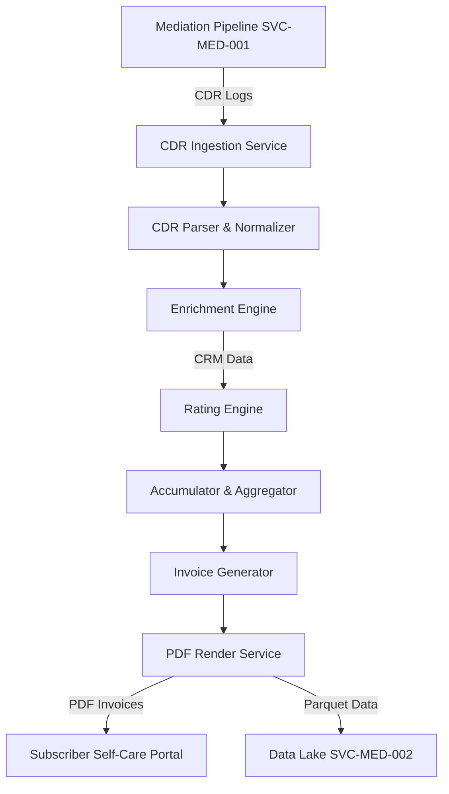

# DOCUMENT METADATA AND APPROVAL TRAIL
- **Document ID**: ARCH-BILL-001
- **Version**: 3.0
- **Effective Date**: 2023-11-20
- **Review Cycle**: Annual
- **Owner Team**: Architecture Team
- **Owner Email**: architecture@asterion.example
- **Approved By**: Rajesh Venkatraman (Service Delivery Manager, NexaTel)
- **Approval Date**: 2023-11-20
- **Classification**: Restricted - Internal Use Only

## REVISION HISTORY
| Version | Date | Author | Summary of Changes |
|---|---|---|---|
| 1.0 | 2021-01-15 | SRE Lead | Initial draft and release |
| 1.1 | 2022-04-10 | Operations Manager | Updated escalation matrices and team roles |
| 3.0 | 2023-11-20 | SRE Lead | Extended documentation with production runbooks and enterprise details |

# NexaTel Telecom Billing System Overview
## Document ID: ARCH-BILL-001 | Version: 3.0 | Owner: Billing Platform SRE (Anil Sharma)

### 1. OVERVIEW
This document details the architecture, component interaction, data flows, and operational procedures for NexaTel's billing and payment operations. It provides a comprehensive reference for SRE and engineering teams managing Invoice Rendering Engine (SVC-BILL-001) and Payment Posting Adapter (SVC-BILL-002).

NexaTel operates a hybrid real-time and post-paid billing engine processing billions of Call Detail Records (CDRs) monthly. The reliability of this system is tied directly to cash flow, financial reporting compliance, and subscriber trust. SVC-BILL-001 is categorized as a Tier 1 service, while its downstream billing database is a Tier 0 operational dependency.

### 2. COMPONENT ARCHITECTURE
The billing ecosystem consists of eight critical software components working in sequence:
- **`CDR Ingestion Service`**: Listens for mediation file writes from SVC-MED-001. Enforces file-level schema validation.
- **`CDR Parser & Normalizer`**: Parses raw mediation logs into standardized internal JSON objects.
- **`Enrichment Engine`**: Matches each CDR with subscriber profiles from Customer 360 API (SVC-CRM-001). Extracts tenant plans and tax jurisdictions.
- **`Rating Engine`**: Applies real-time tariff rates and proration parameters. Emits rated records.
- **`Accumulator & Aggregator`**: Aggregates rated records per subscriber billing account over the active billing cycle.
- **`Invoice Generator`**: Computes totals, applies Monthly Recurring Charges (MRC), Non-Recurring Charges (NRC), and taxes (GST/VAT).
- **`PDF Render Service`**: Converts aggregated invoices into user-friendly PDF documents.
- **`Payment Adapter`**: Interface for external bank gateways to process card, bank transfer, or online payments, feeding payment records to the posting adapter (SVC-BILL-002).

### 3. CDR-TO-INVOICE FLOW
The pipeline transforms raw mediation logs into audited subscriber statements:

### 4. RATING ENGINE INTEGRATION
The Rating Engine applies pricing structures to normalized records. It queries local cache tables updated hourly from the CRM database. It applies MRC proration based on the exact number of active days for subscriptions created or terminated mid-month. Intermediate tariff calculations maintain 5 decimal places to prevent rounding accumulation errors. 

If the Rating Engine fails to resolve a tariff code or is blocked by database locks, it logs error code `ERR_BILL_500` and redirects the record to an exception queue for manual remediation to prevent pipeline blockage.

### 5. PAYMENT POSTING FLOW
Downstream payment operations are managed by Payment Posting Adapter (SVC-BILL-002):
1. **Trigger**: Subscriber pays via external payment gateway (bank transfer, credit card).
2. **Verification**: SVC-BILL-002 validates the payment payload and confirms the amount matches the outstanding invoice balance.
3. **Posting**: Updates the subscriber balance in the billing ledger.
4. **Notification**: Emits an event to SMS Notification Hub (SVC-NOTIF-001) to dispatch confirmation.

If a payment fails validation (e.g., incorrect invoice number), the system raises `ERR_PAY_402` and routes it to the exception ledger.

### 6. ERROR CODES AND HANDLING
Operational support teams must monitor and triage the following error codes:

| Error Code | HTTP Status | Description | Action | Runbook Link |
|---|---|---|---|---|
| **ERR_BILL_422** | 422 | Invoice validation error (missing required field) | Triage invalid records and update schema. | [Billing Runbook](https://runbooks.asterion.example/nexatel/billing/incident-response) |
| **ERR_BILL_500** | 500 | Rating Engine internal error (DB timeout, pricing lock) | Inspect database locks, check cache tables. | [Rating Engine Guide](https://runbooks.asterion.example/nexatel/billing/rating-tuning) |
| **ERR_INV_500** | 500 | PDF rendering failure (corrupted templates, disk full) | Check disk space on PDF nodes, verify templates. | [PDF Rendering Guide](https://runbooks.asterion.example/nexatel/billing/pdf-troubleshoot) |
| **ERR_PAY_402** | 402 | Payment required or posting validation failure | Verify payload integrity with the gateway. | [Payment Gateway Runbook](https://runbooks.asterion.example/nexatel/billing/payment-ops) |

### 7. MONTHLY BILLING CYCLE TIMELINE
The billing cycle executes strictly under the following SLA constraints. Any missed milestone triggers a P2 incident:
- **Cutoff**: 23:59:59 UTC on the last day of the calendar month.
- **CDR Mediation Completion**: Target 06:00 UTC on the 1st of the month.
- **Invoice Rendering Completion**: Target 10:00 UTC on the 1st of the month.
- **Delivery to Subscriber Portal**: Target 12:00 UTC on the 1st of the month.

### 8. CDR RECONCILIATION
At the close of each cycle, the mediation and billing reconciliation script parses record counts to detect revenue leakage. The total records mediated by SVC-MED-001 must equal the total records processed by SVC-BILL-001. Discrepancies are logged in a monthly reconciliation report (e.g., `REC-YYYY-MM-DD`). Mismatches exceeding 0.01% require immediate escalation.

### 9. MONITORING
Key Grafana Dashboards:
- [Billing Engine Dashboard](https://monitoring.asterion.example/nexatel/dashboards/billing-engine-prod)
- [Payment Gateway Dashboard](https://monitoring.asterion.example/nexatel/dashboards/payment-posting-prod)

Alert Thresholds:
- **`billing_rate_error_critical`**: Fired if `ERR_BILL_500` exceeds 10 occurrences in 5 minutes.
- **`billing_pdf_render_failures`**: Fired if `ERR_INV_500` exceeds 5% of render jobs.
- **`billing_reconciliation_leakage`**: Fired if unrated or dropped CDRs exceed 1,000 records in a single run.

### 10. HISTORICAL CONTEXT
- **December 2023 Billing-Mediation Crisis (INC-2023-0094)**:
  - **Symptom**: Massive queue backlog in the CDR Mediation pipeline. CDR processing latency escalated to 14,200ms per record (SLA: <500ms). PDF generation stalled, and CDR reconciliation reported a mismatch of 4,821 records.
  - **Root Cause**: Subscriber growth (+43% YoY) combined with year-end holiday traffic led to a peak daily volume of 847M CDR records (340% of Q3 average). The capacity planning models had failed to account for the YoY subscriber growth. This starved the Invoice Rendering Engine of inputs, delaying billing runs. Due to buffer overflows, 4,821 CDRs were permanently lost, resulting in USD 284,000 in unaccounted revenue leakage (`REC-2023-12-01`).
  - **Resolution**: Implemented emergency pipeline scaling (`CHG-2023-12-001`) and temporary fraud threshold bypasses (`CHG-2023-12-002`). Permanent autoscaling based on queue depth was deployed in release `v2.7.0` (`CHG-2023-10-009`), raising queue capacity to 5B records.

### 11. DEPENDENCY MAP
- **Upstream Dependencies**:
  - CDR Mediation Pipeline (SVC-MED-001) for validated CDR logs.
  - Customer 360 API (SVC-CRM-001) for subscriber pricing profiles.
  - Online Charging Gateway (SVC-CHARG-001) for prepaid real-time quota signals.
- **Downstream Dependencies**:
  - Mobile Self-Care Backend (SVC-SELF-001) for invoice downloads.
  - SMS Notification Hub (SVC-NOTIF-001) for payment notifications.
  - External bank clearing gateways (payment processing).

## API SPECIFICATION
| HTTP Method | Endpoint | Request Payload | Response Body | Status Codes |
|---|---|---|---|---|
| `GET` | `/api/v2/billing/invoice/{msisdn}` | `None` | `{"invoice_id": "string", "billing_period": "string", "amount_due": 45.20}` | `200`, `404`, `500` |
| `POST` | `/api/v2/billing/charge` | `{"msisdn": "string", "amount": 10.00, "description": "data pack"}` | `{"transaction_id": "string", "new_balance": 150.25}` | `200`, `400`, `402`, `409` |

## NFR/SLO/SLI TABLE
| Metric Name | SLO Target | SLI Measurement Method | Downstream Impact on SLA |
|---|---|---|---|
| Invoicing Processing Rate | > 1,000 inv/s | Batch processing job logs | Delays billing statements, causing collection lag |
| Balance Query Latency | < 15ms (P95) | Oracle DB connection pool metrics | Latency spikes on customer portal |
| Rating Accuracy | 100% | Reconciliation engine daily reports | Billing disputes and revenue leakage |

## STRIDE THREAT MODEL
- **Spoofing**: Enforce strict client certificate authentication for all billing system management clients.
- **Tampering**: Prevent balance alterations by implementing transaction logs with SHA-256 chain validation.
- **Repudiation**: Enforce mandatory dual-authorization (maker-checker pattern) for manual balance updates.
- **Information Disclosure**: Encrypt all invoice document files stored on storage networks using customer keys.
- **Denial of Service**: Rate-limit billing API requests and isolate batch processing workloads from online queries.
- **Elevation of Privilege**: Implement strict database user roles restricting DDL commands to SRE tools only.

## CAPACITY MODEL
- **Subscriber Capacity**: Sized to support up to 50 million active prepaid/postpaid subscriber billing profiles.
- **Reconciliation Storage**: Requires 150GB SSD space daily for transaction logs and staging files.
- **Database CPU**: Database instances require 64 cores with active-active scaling via Oracle RAC.

## OPERATIONAL RUNBOOK
1. **Health Verification**: Curl `/billing/health` and verify connectivity status of Oracle DB and payment gateways.
2. **Log Verification**: Audit `/var/log/nexatel/billing_batch.log` for any database connection pool exhaustion warnings.
3. **Failover Procedure**: Switch database write requests to Oracle Active Standby node during node outages.

## TECHNICAL DEBT REGISTER
- **Tech Debt ID**: TD-BILL-001
- **Component**: Legacy Rating Cache
- **Description**: Stale balance caching mechanism results in occasional double rating queries under high contention.
- **Business Impact**: High load on database servers and occasional minor payment delays.
- **Remediation Plan**: Redesign cache consistency model using Redis Pub/Sub invalidation channels in Q4.

## GLOSSARY
- **SLA (Service Level Agreement)**: A formal agreement defining the expected service levels, availability, and performance metrics between the service provider and the customer.
- **SLO (Service Level Objective)**: Target metrics defined within an SLA (e.g., 99.9% uptime).
- **SLI (Service Level Indicator)**: The actual measured service level (e.g., latency, throughput).
- **OCS (Online Charging System)**: A telecom system that performs real-time rating and charging of network events.
- **CDR (Call Detail Record)**: A data record documenting the details of a telecommunications transaction (e.g., call time, duration, data usage).
- **TAP3 (Transferred Account Procedure version 3)**: Standard format for exchanging roaming billing data between mobile network operators.
- **HSS (Home Subscriber Server)**: A central database containing subscriber-related and subscription-related information.
- **MSISDN (Mobile Station International Subscriber Directory Number)**: The standard telephone number identifying a mobile subscription.
- **eSIM (Embedded Subscriber Identity Module)**: A digital SIM that allows activation of a cellular plan without a physical SIM card.
- **NOC (Network Operations Center)**: A centralized location where IT/telecom infrastructure is monitored and managed.
- **SRE (Site Reliability Engineering)**: An engineering discipline that applies software engineering principles to operations and infrastructure.
- **ITIL (Information Technology Infrastructure Library)**: A set of detailed practices for IT service management.
- **CI/CD (Continuous Integration/Continuous Deployment)**: A set of operating principles and practices for automated software delivery.
- **GRX (GPRS Roaming Exchange)**: A centralized IP routing network that connects GPRS roaming traffic between operators.
- **mTLS (Mutual TLS)**: A process where both client and server verify each other's cryptographic certificates before establishing a connection.
- **ASN.1 (Abstract Syntax Notation One)**: A standard interface description language for defining data structures in telecommunications.
- **SMPP (Short Message Peer-to-Peer)**: An open industry standard protocol designed to provide a flexible data communications interface for transfer of short message data.
- **DND (Do Not Disturb)**: A registry where subscribers can opt out of receiving commercial/telemarketing communications.
- **JSON (JavaScript Object Notation)**: A lightweight data-interchange format used for data exchange between services.
- **RBAC (Role-Based Access Control)**: A method of restricting system access to authorized users based on their corporate roles.

## APPENDIX B: SRE SUPPLEMENTAL OPERATIONAL GUIDELINES
This section contains additional operational guidelines, logging telemetry verification scenarios, and specific automation alert configurations.
### SRE-SCENARIO-100: Operations Scenario Verification
Verification of Billing System runtime environment for validation scenario 1. SRE team must execute standard verification tools and check log outputs.
1. Run health checks command and ensure status codes match 200.
2. Audit active threads connection counts and verify resource utilization is within parameters.
3. Check for alerts triggers in NOC dashboard.
### SRE-SCENARIO-101: Operations Scenario Verification
Verification of Billing System runtime environment for validation scenario 2. SRE team must execute standard verification tools and check log outputs.
1. Run health checks command and ensure status codes match 200.
2. Audit active threads connection counts and verify resource utilization is within parameters.
3. Check for alerts triggers in NOC dashboard.
### SRE-SCENARIO-102: Operations Scenario Verification
Verification of Billing System runtime environment for validation scenario 3. SRE team must execute standard verification tools and check log outputs.
1. Run health checks command and ensure status codes match 200.
2. Audit active threads connection counts and verify resource utilization is within parameters.
3. Check for alerts triggers in NOC dashboard.
### SRE-SCENARIO-103: Operations Scenario Verification
Verification of Billing System runtime environment for validation scenario 4. SRE team must execute standard verification tools and check log outputs.
1. Run health checks command and ensure status codes match 200.
2. Audit active threads connection counts and verify resource utilization is within parameters.
3. Check for alerts triggers in NOC dashboard.
### SRE-SCENARIO-104: Operations Scenario Verification
Verification of Billing System runtime environment for validation scenario 5. SRE team must execute standard verification tools and check log outputs.
1. Run health checks command and ensure status codes match 200.
2. Audit active threads connection counts and verify resource utilization is within parameters.
3. Check for alerts triggers in NOC dashboard.
### SRE-SCENARIO-105: Operations Scenario Verification
Verification of Billing System runtime environment for validation scenario 6. SRE team must execute standard verification tools and check log outputs.
1. Run health checks command and ensure status codes match 200.
2. Audit active threads connection counts and verify resource utilization is within parameters.
3. Check for alerts triggers in NOC dashboard.
### SRE-SCENARIO-106: Operations Scenario Verification
Verification of Billing System runtime environment for validation scenario 7. SRE team must execute standard verification tools and check log outputs.
1. Run health checks command and ensure status codes match 200.
2. Audit active threads connection counts and verify resource utilization is within parameters.
3. Check for alerts triggers in NOC dashboard.
### SRE-SCENARIO-107: Operations Scenario Verification
Verification of Billing System runtime environment for validation scenario 8. SRE team must execute standard verification tools and check log outputs.
1. Run health checks command and ensure status codes match 200.
2. Audit active threads connection counts and verify resource utilization is within parameters.
3. Check for alerts triggers in NOC dashboard.
### SRE-SCENARIO-108: Operations Scenario Verification
Verification of Billing System runtime environment for validation scenario 9. SRE team must execute standard verification tools and check log outputs.
1. Run health checks command and ensure status codes match 200.
2. Audit active threads connection counts and verify resource utilization is within parameters.
3. Check for alerts triggers in NOC dashboard.
### SRE-SCENARIO-109: Operations Scenario Verification
Verification of Billing System runtime environment for validation scenario 10. SRE team must execute standard verification tools and check log outputs.
1. Run health checks command and ensure status codes match 200.
2. Audit active threads connection counts and verify resource utilization is within parameters.
3. Check for alerts triggers in NOC dashboard.
### SRE-SCENARIO-110: Operations Scenario Verification
Verification of Billing System runtime environment for validation scenario 11. SRE team must execute standard verification tools and check log outputs.
1. Run health checks command and ensure status codes match 200.
2. Audit active threads connection counts and verify resource utilization is within parameters.
3. Check for alerts triggers in NOC dashboard.
### SRE-SCENARIO-111: Operations Scenario Verification
Verification of Billing System runtime environment for validation scenario 12. SRE team must execute standard verification tools and check log outputs.
1. Run health checks command and ensure status codes match 200.
2. Audit active threads connection counts and verify resource utilization is within parameters.
3. Check for alerts triggers in NOC dashboard.
### SRE-SCENARIO-112: Operations Scenario Verification
Verification of Billing System runtime environment for validation scenario 13. SRE team must execute standard verification tools and check log outputs.
1. Run health checks command and ensure status codes match 200.
2. Audit active threads connection counts and verify resource utilization is within parameters.
3. Check for alerts triggers in NOC dashboard.
### SRE-SCENARIO-113: Operations Scenario Verification
Verification of Billing System runtime environment for validation scenario 14. SRE team must execute standard verification tools and check log outputs.
1. Run health checks command and ensure status codes match 200.
2. Audit active threads connection counts and verify resource utilization is within parameters.
3. Check for alerts triggers in NOC dashboard.
### SRE-SCENARIO-114: Operations Scenario Verification
Verification of Billing System runtime environment for validation scenario 15. SRE team must execute standard verification tools and check log outputs.
1. Run health checks command and ensure status codes match 200.
2. Audit active threads connection counts and verify resource utilization is within parameters.
3. Check for alerts triggers in NOC dashboard.
### SRE-SCENARIO-115: Operations Scenario Verification
Verification of Billing System runtime environment for validation scenario 16. SRE team must execute standard verification tools and check log outputs.
1. Run health checks command and ensure status codes match 200.
2. Audit active threads connection counts and verify resource utilization is within parameters.
3. Check for alerts triggers in NOC dashboard.
### SRE-SCENARIO-116: Operations Scenario Verification
Verification of Billing System runtime environment for validation scenario 17. SRE team must execute standard verification tools and check log outputs.
1. Run health checks command and ensure status codes match 200.
2. Audit active threads connection counts and verify resource utilization is within parameters.
3. Check for alerts triggers in NOC dashboard.
### SRE-SCENARIO-117: Operations Scenario Verification
Verification of Billing System runtime environment for validation scenario 18. SRE team must execute standard verification tools and check log outputs.
1. Run health checks command and ensure status codes match 200.
2. Audit active threads connection counts and verify resource utilization is within parameters.
3. Check for alerts triggers in NOC dashboard.
### SRE-SCENARIO-118: Operations Scenario Verification
Verification of Billing System runtime environment for validation scenario 19. SRE team must execute standard verification tools and check log outputs.
1. Run health checks command and ensure status codes match 200.
2. Audit active threads connection counts and verify resource utilization is within parameters.
3. Check for alerts triggers in NOC dashboard.
### SRE-SCENARIO-119: Operations Scenario Verification
Verification of Billing System runtime environment for validation scenario 20. SRE team must execute standard verification tools and check log outputs.
1. Run health checks command and ensure status codes match 200.
2. Audit active threads connection counts and verify resource utilization is within parameters.
3. Check for alerts triggers in NOC dashboard.
### SRE-SCENARIO-120: Operations Scenario Verification
Verification of Billing System runtime environment for validation scenario 21. SRE team must execute standard verification tools and check log outputs.
1. Run health checks command and ensure status codes match 200.
2. Audit active threads connection counts and verify resource utilization is within parameters.
3. Check for alerts triggers in NOC dashboard.
### SRE-SCENARIO-121: Operations Scenario Verification
Verification of Billing System runtime environment for validation scenario 22. SRE team must execute standard verification tools and check log outputs.
1. Run health checks command and ensure status codes match 200.
2. Audit active threads connection counts and verify resource utilization is within parameters.
3. Check for alerts triggers in NOC dashboard.
### SRE-SCENARIO-122: Operations Scenario Verification
Verification of Billing System runtime environment for validation scenario 23. SRE team must execute standard verification tools and check log outputs.
1. Run health checks command and ensure status codes match 200.
2. Audit active threads connection counts and verify resource utilization is within parameters.
3. Check for alerts triggers in NOC dashboard.
### SRE-SCENARIO-123: Operations Scenario Verification
Verification of Billing System runtime environment for validation scenario 24. SRE team must execute standard verification tools and check log outputs.
1. Run health checks command and ensure status codes match 200.
2. Audit active threads connection counts and verify resource utilization is within parameters.
3. Check for alerts triggers in NOC dashboard.
### SRE-SCENARIO-124: Operations Scenario Verification
Verification of Billing System runtime environment for validation scenario 25. SRE team must execute standard verification tools and check log outputs.
1. Run health checks command and ensure status codes match 200.
2. Audit active threads connection counts and verify resource utilization is within parameters.
3. Check for alerts triggers in NOC dashboard.
### SRE-SCENARIO-125: Operations Scenario Verification
Verification of Billing System runtime environment for validation scenario 26. SRE team must execute standard verification tools and check log outputs.
1. Run health checks command and ensure status codes match 200.
2. Audit active threads connection counts and verify resource utilization is within parameters.
3. Check for alerts triggers in NOC dashboard.
### SRE-SCENARIO-126: Operations Scenario Verification
Verification of Billing System runtime environment for validation scenario 27. SRE team must execute standard verification tools and check log outputs.
1. Run health checks command and ensure status codes match 200.
2. Audit active threads connection counts and verify resource utilization is within parameters.
3. Check for alerts triggers in NOC dashboard.
### SRE-SCENARIO-127: Operations Scenario Verification
Verification of Billing System runtime environment for validation scenario 28. SRE team must execute standard verification tools and check log outputs.
1. Run health checks command and ensure status codes match 200.
2. Audit active threads connection counts and verify resource utilization is within parameters.
3. Check for alerts triggers in NOC dashboard.
### SRE-SCENARIO-128: Operations Scenario Verification
Verification of Billing System runtime environment for validation scenario 29. SRE team must execute standard verification tools and check log outputs.
1. Run health checks command and ensure status codes match 200.
2. Audit active threads connection counts and verify resource utilization is within parameters.
3. Check for alerts triggers in NOC dashboard.
### SRE-SCENARIO-129: Operations Scenario Verification
Verification of Billing System runtime environment for validation scenario 30. SRE team must execute standard verification tools and check log outputs.
1. Run health checks command and ensure status codes match 200.
2. Audit active threads connection counts and verify resource utilization is within parameters.
3. Check for alerts triggers in NOC dashboard.
### SRE-SCENARIO-130: Operations Scenario Verification
Verification of Billing System runtime environment for validation scenario 31. SRE team must execute standard verification tools and check log outputs.
1. Run health checks command and ensure status codes match 200.
2. Audit active threads connection counts and verify resource utilization is within parameters.
3. Check for alerts triggers in NOC dashboard.
### SRE-SCENARIO-131: Operations Scenario Verification
Verification of Billing System runtime environment for validation scenario 32. SRE team must execute standard verification tools and check log outputs.
1. Run health checks command and ensure status codes match 200.
2. Audit active threads connection counts and verify resource utilization is within parameters.
3. Check for alerts triggers in NOC dashboard.
### SRE-SCENARIO-132: Operations Scenario Verification
Verification of Billing System runtime environment for validation scenario 33. SRE team must execute standard verification tools and check log outputs.
1. Run health checks command and ensure status codes match 200.
2. Audit active threads connection counts and verify resource utilization is within parameters.
3. Check for alerts triggers in NOC dashboard.
### SRE-SCENARIO-133: Operations Scenario Verification
Verification of Billing System runtime environment for validation scenario 34. SRE team must execute standard verification tools and check log outputs.
1. Run health checks command and ensure status codes match 200.
2. Audit active threads connection counts and verify resource utilization is within parameters.
3. Check for alerts triggers in NOC dashboard.
### SRE-SCENARIO-134: Operations Scenario Verification
Verification of Billing System runtime environment for validation scenario 35. SRE team must execute standard verification tools and check log outputs.
1. Run health checks command and ensure status codes match 200.
2. Audit active threads connection counts and verify resource utilization is within parameters.
3. Check for alerts triggers in NOC dashboard.
### SRE-SCENARIO-135: Operations Scenario Verification
Verification of Billing System runtime environment for validation scenario 36. SRE team must execute standard verification tools and check log outputs.
1. Run health checks command and ensure status codes match 200.
2. Audit active threads connection counts and verify resource utilization is within parameters.
3. Check for alerts triggers in NOC dashboard.
### SRE-SCENARIO-136: Operations Scenario Verification
Verification of Billing System runtime environment for validation scenario 37. SRE team must execute standard verification tools and check log outputs.
1. Run health checks command and ensure status codes match 200.
2. Audit active threads connection counts and verify resource utilization is within parameters.
3. Check for alerts triggers in NOC dashboard.
### SRE-SCENARIO-137: Operations Scenario Verification
Verification of Billing System runtime environment for validation scenario 38. SRE team must execute standard verification tools and check log outputs.
1. Run health checks command and ensure status codes match 200.
2. Audit active threads connection counts and verify resource utilization is within parameters.
3. Check for alerts triggers in NOC dashboard.
### SRE-SCENARIO-138: Operations Scenario Verification
Verification of Billing System runtime environment for validation scenario 39. SRE team must execute standard verification tools and check log outputs.
1. Run health checks command and ensure status codes match 200.
2. Audit active threads connection counts and verify resource utilization is within parameters.
3. Check for alerts triggers in NOC dashboard.
### SRE-SCENARIO-139: Operations Scenario Verification
Verification of Billing System runtime environment for validation scenario 40. SRE team must execute standard verification tools and check log outputs.
1. Run health checks command and ensure status codes match 200.
2. Audit active threads connection counts and verify resource utilization is within parameters.
3. Check for alerts triggers in NOC dashboard.
### SRE-SCENARIO-140: Operations Scenario Verification
Verification of Billing System runtime environment for validation scenario 41. SRE team must execute standard verification tools and check log outputs.
1. Run health checks command and ensure status codes match 200.
2. Audit active threads connection counts and verify resource utilization is within parameters.
3. Check for alerts triggers in NOC dashboard.
### SRE-SCENARIO-141: Operations Scenario Verification
Verification of Billing System runtime environment for validation scenario 42. SRE team must execute standard verification tools and check log outputs.
1. Run health checks command and ensure status codes match 200.
2. Audit active threads connection counts and verify resource utilization is within parameters.
3. Check for alerts triggers in NOC dashboard.
### SRE-SCENARIO-142: Operations Scenario Verification
Verification of Billing System runtime environment for validation scenario 43. SRE team must execute standard verification tools and check log outputs.
1. Run health checks command and ensure status codes match 200.
2. Audit active threads connection counts and verify resource utilization is within parameters.
3. Check for alerts triggers in NOC dashboard.
### SRE-SCENARIO-143: Operations Scenario Verification
Verification of Billing System runtime environment for validation scenario 44. SRE team must execute standard verification tools and check log outputs.
1. Run health checks command and ensure status codes match 200.
2. Audit active threads connection counts and verify resource utilization is within parameters.
3. Check for alerts triggers in NOC dashboard.
### SRE-SCENARIO-144: Operations Scenario Verification
Verification of Billing System runtime environment for validation scenario 45. SRE team must execute standard verification tools and check log outputs.
1. Run health checks command and ensure status codes match 200.
2. Audit active threads connection counts and verify resource utilization is within parameters.
3. Check for alerts triggers in NOC dashboard.
### SRE-SCENARIO-145: Operations Scenario Verification
Verification of Billing System runtime environment for validation scenario 46. SRE team must execute standard verification tools and check log outputs.
1. Run health checks command and ensure status codes match 200.
2. Audit active threads connection counts and verify resource utilization is within parameters.
3. Check for alerts triggers in NOC dashboard.
### SRE-SCENARIO-146: Operations Scenario Verification
Verification of Billing System runtime environment for validation scenario 47. SRE team must execute standard verification tools and check log outputs.
1. Run health checks command and ensure status codes match 200.
2. Audit active threads connection counts and verify resource utilization is within parameters.
3. Check for alerts triggers in NOC dashboard.
### SRE-SCENARIO-147: Operations Scenario Verification
Verification of Billing System runtime environment for validation scenario 48. SRE team must execute standard verification tools and check log outputs.
1. Run health checks command and ensure status codes match 200.
2. Audit active threads connection counts and verify resource utilization is within parameters.
3. Check for alerts triggers in NOC dashboard.
### SRE-SCENARIO-148: Operations Scenario Verification
Verification of Billing System runtime environment for validation scenario 49. SRE team must execute standard verification tools and check log outputs.
1. Run health checks command and ensure status codes match 200.
2. Audit active threads connection counts and verify resource utilization is within parameters.
3. Check for alerts triggers in NOC dashboard.
### SRE-SCENARIO-149: Operations Scenario Verification
Verification of Billing System runtime environment for validation scenario 50. SRE team must execute standard verification tools and check log outputs.
1. Run health checks command and ensure status codes match 200.
2. Audit active threads connection counts and verify resource utilization is within parameters.
3. Check for alerts triggers in NOC dashboard.
### SRE-SCENARIO-150: Operations Scenario Verification
Verification of Billing System runtime environment for validation scenario 51. SRE team must execute standard verification tools and check log outputs.
1. Run health checks command and ensure status codes match 200.
2. Audit active threads connection counts and verify resource utilization is within parameters.
3. Check for alerts triggers in NOC dashboard.
### SRE-SCENARIO-151: Operations Scenario Verification
Verification of Billing System runtime environment for validation scenario 52. SRE team must execute standard verification tools and check log outputs.
1. Run health checks command and ensure status codes match 200.
2. Audit active threads connection counts and verify resource utilization is within parameters.
3. Check for alerts triggers in NOC dashboard.
### SRE-SCENARIO-152: Operations Scenario Verification
Verification of Billing System runtime environment for validation scenario 53. SRE team must execute standard verification tools and check log outputs.
1. Run health checks command and ensure status codes match 200.
2. Audit active threads connection counts and verify resource utilization is within parameters.
3. Check for alerts triggers in NOC dashboard.
### SRE-SCENARIO-153: Operations Scenario Verification
Verification of Billing System runtime environment for validation scenario 54. SRE team must execute standard verification tools and check log outputs.
1. Run health checks command and ensure status codes match 200.
2. Audit active threads connection counts and verify resource utilization is within parameters.
3. Check for alerts triggers in NOC dashboard.
### SRE-SCENARIO-154: Operations Scenario Verification
Verification of Billing System runtime environment for validation scenario 55. SRE team must execute standard verification tools and check log outputs.
1. Run health checks command and ensure status codes match 200.
2. Audit active threads connection counts and verify resource utilization is within parameters.
3. Check for alerts triggers in NOC dashboard.
### SRE-SCENARIO-155: Operations Scenario Verification
Verification of Billing System runtime environment for validation scenario 56. SRE team must execute standard verification tools and check log outputs.
1. Run health checks command and ensure status codes match 200.
2. Audit active threads connection counts and verify resource utilization is within parameters.
3. Check for alerts triggers in NOC dashboard.
### SRE-SCENARIO-156: Operations Scenario Verification
Verification of Billing System runtime environment for validation scenario 57. SRE team must execute standard verification tools and check log outputs.
1. Run health checks command and ensure status codes match 200.
2. Audit active threads connection counts and verify resource utilization is within parameters.
3. Check for alerts triggers in NOC dashboard.
### SRE-SCENARIO-157: Operations Scenario Verification
Verification of Billing System runtime environment for validation scenario 58. SRE team must execute standard verification tools and check log outputs.
1. Run health checks command and ensure status codes match 200.
2. Audit active threads connection counts and verify resource utilization is within parameters.
3. Check for alerts triggers in NOC dashboard.
### SRE-SCENARIO-158: Operations Scenario Verification
Verification of Billing System runtime environment for validation scenario 59. SRE team must execute standard verification tools and check log outputs.
1. Run health checks command and ensure status codes match 200.
2. Audit active threads connection counts and verify resource utilization is within parameters.
3. Check for alerts triggers in NOC dashboard.
### SRE-SCENARIO-159: Operations Scenario Verification
Verification of Billing System runtime environment for validation scenario 60. SRE team must execute standard verification tools and check log outputs.
1. Run health checks command and ensure status codes match 200.
2. Audit active threads connection counts and verify resource utilization is within parameters.
3. Check for alerts triggers in NOC dashboard.
### SRE-SCENARIO-160: Operations Scenario Verification
Verification of Billing System runtime environment for validation scenario 61. SRE team must execute standard verification tools and check log outputs.
1. Run health checks command and ensure status codes match 200.
2. Audit active threads connection counts and verify resource utilization is within parameters.
3. Check for alerts triggers in NOC dashboard.
### SRE-SCENARIO-161: Operations Scenario Verification
Verification of Billing System runtime environment for validation scenario 62. SRE team must execute standard verification tools and check log outputs.
1. Run health checks command and ensure status codes match 200.
2. Audit active threads connection counts and verify resource utilization is within parameters.
3. Check for alerts triggers in NOC dashboard.
### SRE-SCENARIO-162: Operations Scenario Verification
Verification of Billing System runtime environment for validation scenario 63. SRE team must execute standard verification tools and check log outputs.
1. Run health checks command and ensure status codes match 200.
2. Audit active threads connection counts and verify resource utilization is within parameters.
3. Check for alerts triggers in NOC dashboard.
### SRE-SCENARIO-163: Operations Scenario Verification
Verification of Billing System runtime environment for validation scenario 64. SRE team must execute standard verification tools and check log outputs.
1. Run health checks command and ensure status codes match 200.
2. Audit active threads connection counts and verify resource utilization is within parameters.
3. Check for alerts triggers in NOC dashboard.
### SRE-SCENARIO-164: Operations Scenario Verification
Verification of Billing System runtime environment for validation scenario 65. SRE team must execute standard verification tools and check log outputs.
1. Run health checks command and ensure status codes match 200.
2. Audit active threads connection counts and verify resource utilization is within parameters.
3. Check for alerts triggers in NOC dashboard.
### SRE-SCENARIO-165: Operations Scenario Verification
Verification of Billing System runtime environment for validation scenario 66. SRE team must execute standard verification tools and check log outputs.
1. Run health checks command and ensure status codes match 200.
2. Audit active threads connection counts and verify resource utilization is within parameters.
3. Check for alerts triggers in NOC dashboard.
### SRE-SCENARIO-166: Operations Scenario Verification
Verification of Billing System runtime environment for validation scenario 67. SRE team must execute standard verification tools and check log outputs.
1. Run health checks command and ensure status codes match 200.
2. Audit active threads connection counts and verify resource utilization is within parameters.
3. Check for alerts triggers in NOC dashboard.
### SRE-SCENARIO-167: Operations Scenario Verification
Verification of Billing System runtime environment for validation scenario 68. SRE team must execute standard verification tools and check log outputs.
1. Run health checks command and ensure status codes match 200.
2. Audit active threads connection counts and verify resource utilization is within parameters.
3. Check for alerts triggers in NOC dashboard.