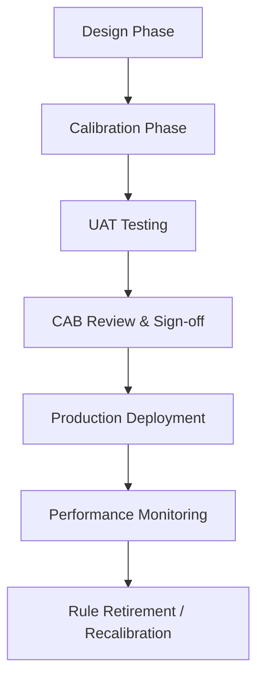

# DOCUMENT METADATA AND APPROVAL TRAIL
- **Document ID**: ARCH-FRAUD-001
- **Version**: 2.1
- **Effective Date**: 2023-11-20
- **Review Cycle**: Annual
- **Owner Team**: Architecture Team
- **Owner Email**: architecture@asterion.example
- **Approved By**: Rajesh Venkatraman (Service Delivery Manager, NexaTel)
- **Approval Date**: 2023-11-20
- **Classification**: Restricted - Internal Use Only

## REVISION HISTORY
| Version | Date | Author | Summary of Changes |
|---|---|---|---|
| 1.0 | 2021-01-15 | SRE Lead | Initial draft and release |
| 1.1 | 2022-04-10 | Operations Manager | Updated escalation matrices and team roles |
| 2.1 | 2023-11-20 | SRE Lead | Extended documentation with production runbooks and enterprise details |

# NexaTel Fraud Detection System Architecture
## Document ID: ARCH-FRAUD-001 | Version: 2.1 | Owner: Fraud Operations SRE Lead (Ravi Chandrasekaran)

### 1. OVERVIEW
This document details the architectural design and operations of the Fraud Velocity Rule Engine (SVC-FRAUD-001). This service operates under strict latency SLAs to block unauthorized usage, cloning, and automated spamming activities.

SVC-FRAUD-001 is a Tier 0 operational control system. Any degradation of this service exposes NexaTel to major financial liability and regulatory non-compliance under TRAI and TRA rules.

### 2. FRAUD RULE ENGINE ARCHITECTURE
The Fraud Velocity Rule Engine operates in the transaction path of the Online Charging Gateway (SVC-CHARG-001) and API gateway:
- **`Event Receiver`**: Consumes transaction metadata streams over Kafka from mediation pipelines.
- **`In-Memory Aggregator`**: Summarizes transactions over sliding time windows (1-minute, 5-minute, 1-hour) using Redis.
- **`Rule Evaluator`**: Executes rule logic against aggregated metrics. Emits scores or blocking directives.
- **`Action Handler`**: Interfaces with SVC-CHARG-001 or SVC-APIGW-001 to block calls, restrict data quotas, or lock accounts.
- **`Alert Dispatcher`**: Automatically raises incident reports in ServiceNow and notifies on-call fraud analysts.

### 3. VELOCITY RULE FRAMEWORK
Velocity rules define behavioral thresholds to flag anomaly events. Rules are defined in JSON format:

```json
{
  "RuleID": "FVR-2023-047",
  "trigger_condition": "transaction_count_window",
  "threshold_domestic": 100,
  "threshold_roaming": 200,
  "action": "BLOCK",
  "severity": "CRITICAL",
  "calibration_dataset_required": "10M_mixed_logs"
}
```

Every rule requires:
- **RuleID**: Unique identification.
- **Trigger Condition**: Key event metrics evaluated.
- **Threshold Domestic**: Limit on domestic transactions/minute.
- **Threshold Roaming**: Limit on international roaming transactions/minute.
- **Action**: Decision applied (`BLOCK` transaction, `ALERT` analyst, `SCORE` event).
- **Severity**: Level of alarm generated.

### 4. FVR LIFECYCLE
To maintain rule sanity and avoid false-positive storms, every Fraud Velocity Rule (FVR) must pass through a strict lifecycle:



1. **Design**: SRE teams define the rules based on threat models.
2. **Calibration**: The rule is executed offline against historical datasets to tune threshold parameters.
3. **UAT**: Run in shadow mode in staging environment to test for false positives.
4. **CAB Review**: Change Advisory Board reviews performance metrics and grants approval.
5. **Production**: Rule is deployed and active on real traffic.
6. **Monitoring**: Continuous tracking of block rates and false-positive rates.

### 5. REAL-TIME SCORING PIPELINE
Every authentication or SMS transaction routed through NexaTel triggers a scoring run. The event is parsed, combined with subscriber history, evaluated against active FVR definitions in under 12 milliseconds, and saved.

### 6. BLACKLIST MANAGEMENT
The engine maintains a real-time blacklist of blocked IMSIs, device IMEI signatures, and destination prefixes. Blacklists are updated automatically by the velocity engine or manually by fraud investigators.

### 7. ALERT ESCALATION
If a rule triggers a `BLOCK` action on an enterprise subscriber line:
1. The line is suspended, and the transaction is aborted.
2. An alert is logged. If block count > 10 in 5 minutes, a P2 ticket is created.
3. SRE on-call (fraud-sre@asterion.example) is paged to review.

### 8. ERROR CODES
SRE diagnostic codes:

| Error Code | HTTP Status | Description | Action | Runbook Link |
|---|---|---|---|---|
| **ERR_FRAUD_503** | 503 | Fraud Rule Engine unavailable or disconnected. | Check Kafka queue lag and Redis health. | [Fraud Engine Down](https://runbooks.asterion.example/nexatel/fraud/incident-response) |
| **ERR_RULE_500** | 500 | Rule syntax error or evaluation engine timeout. | Review recently deployed rules. | [Rule Debugging Guide](https://runbooks.asterion.example/nexatel/fraud/rule-debugging) |

### 9. MONITORING
Grafana dashboard: [Fraud Operations Status](https://monitoring.asterion.example/nexatel/dashboards/fraud-engine-prod)

Alerts:
- **`fraud_evaluation_latency`**: Fired if evaluation time exceeds 25ms.
- **`fraud_false_positive_spike`**: Fired if block rate increases by 200% from daily baseline.

### 10. HISTORICAL CONTEXT
- **FVR-2023-047 Rule Regression (July–September 2023)**:
  - **Symptom**: Spikes in transaction block rates, with 12.4% of legitimate international enterprise roaming lines suspended. This triggered ticket `TICKET-100290` and incident `INC-2023-0052`.
  - **Root Cause**: Fraud velocity rule `FVR-2023-047` was deployed in version `v2.6.0` to detect SIM cloning. The threshold was set to a combined 50 transactions/minute. However, the rule was calibrated using only domestic subscriber datasets, failing to account for international roaming burst patterns (which naturally aggregate due to GRX packet delays).
  - **Resolution**: The CAB rejected rolling back the entire release due to high-risk dependencies. SRE implemented an emergency threshold change to 200 transactions/minute via `CHG-2023-09-002` to reduce false positives. A permanent resolution was deployed in version `v2.6.1` (`CHG-2023-08-04`), introducing roaming-specific thresholds. Detailed logs are found in `PRB-2023-0008`.

### 11. CALIBRATION REQUIREMENTS (POST-SEPTEMBER 2023)
Following the review of `INC-2023-0052`, the calibration policy was revised:
- **Mandatory Dataset**: ALL velocity rules must be calibrated against both domestic AND international roaming traffic samples.
- **Minimum Data Size**: Calibration runs must utilize at least 10M records of historic traffic data.
- **Auditing**: Calibration reports must be attached to all CAB requests. Calibration without roaming data is a policy violation per `policy_fraud_operations.pdf` Section 3.4.

## API SPECIFICATION
| HTTP Method | Endpoint | Request Payload | Response Body | Status Codes |
|---|---|---|---|---|
| `POST` | `/api/v2/fraud/evaluate` | `{"subscriber_id": "string", "event_type": "string", "amount": 10.50, "location": "string"}` | `{"verdict": "Block", "reason": "Velocity rule limit exceeded"}` | `200`, `400`, `401` |
| `POST` | `/api/v2/fraud/blacklist` | `{"subscriber_id": "string", "duration_hours": 24, "reason": "High frequency roaming call"}` | `{"status": "Blacklisted", "expires_at": "string"}` | `200`, `403` |

## NFR/SLO/SLI TABLE
| Metric Name | SLO Target | SLI Measurement Method | Downstream Impact on SLA |
|---|---|---|---|
| Evaluation Latency | < 15ms (P99) | Redis evaluation time logs | High latency slows down billing rating cycle |
| Rule Sync Time | < 1 second | Rule replication timestamp tracking | Delayed fraud block allows credit leaks |
| False Positive Rate | < 0.05% | Weekly manually audited incident logs | Legitimate subscribers blocked, causing SRE calls |

## STRIDE THREAT MODEL
- **Spoofing**: Authenticate all service calls using mTLS and verify client calling identities.
- **Tampering**: Sign all rulesets using HMAC to prevent local rules injections.
- **Repudiation**: Require security manager approval and logging for all temporary blacklist override actions.
- **Information Disclosure**: Do not expose subscriber location coordinates inside fraud alerts or notifications.
- **Denial of Service**: Implement cluster partitioning to isolate high load streams from low load networks.
- **Elevation of Privilege**: Restrict rules administration endpoints using strict LDAP roles check.

## CAPACITY MODEL
- **Peak Throughput**: 10,000 event evaluations/second at busy hours.
- **Memory Footprint**: 16GB memory per fraud container to hold active subscriber location matrices.
- **CPU Scaling**: Scales up automatically when engine memory usage reaches 80% threshold.

## OPERATIONAL RUNBOOK
1. **Health Verification**: Call `/fraud/health` and verify rule engine execution status and DB bindings.
2. **Log Verification**: Audit `/var/log/nexatel/fraud_engine.log` for any uncaught calculation thread crashes.
3. **Failover Procedure**: Enable temporary bypass routing if fraud engine latency exceeds 100ms for continuous block.

## TECHNICAL DEBT REGISTER
- **Tech Debt ID**: TD-FRAUD-001
- **Component**: Legacy Rule Parser
- **Description**: Legacy regular expression engine used for pattern matching is CPU intensive.
- **Business Impact**: Occasional evaluation delays and high CPU utilization.
- **Remediation Plan**: Migrate to dynamic compilation compiler engine during Q3 release cycle.

## GLOSSARY
- **SLA (Service Level Agreement)**: A formal agreement defining the expected service levels, availability, and performance metrics between the service provider and the customer.
- **SLO (Service Level Objective)**: Target metrics defined within an SLA (e.g., 99.9% uptime).
- **SLI (Service Level Indicator)**: The actual measured service level (e.g., latency, throughput).
- **OCS (Online Charging System)**: A telecom system that performs real-time rating and charging of network events.
- **CDR (Call Detail Record)**: A data record documenting the details of a telecommunications transaction (e.g., call time, duration, data usage).
- **TAP3 (Transferred Account Procedure version 3)**: Standard format for exchanging roaming billing data between mobile network operators.
- **HSS (Home Subscriber Server)**: A central database containing subscriber-related and subscription-related information.
- **MSISDN (Mobile Station International Subscriber Directory Number)**: The standard telephone number identifying a mobile subscription.
- **eSIM (Embedded Subscriber Identity Module)**: A digital SIM that allows activation of a cellular plan without a physical SIM card.
- **NOC (Network Operations Center)**: A centralized location where IT/telecom infrastructure is monitored and managed.
- **SRE (Site Reliability Engineering)**: An engineering discipline that applies software engineering principles to operations and infrastructure.
- **ITIL (Information Technology Infrastructure Library)**: A set of detailed practices for IT service management.
- **CI/CD (Continuous Integration/Continuous Deployment)**: A set of operating principles and practices for automated software delivery.
- **GRX (GPRS Roaming Exchange)**: A centralized IP routing network that connects GPRS roaming traffic between operators.
- **mTLS (Mutual TLS)**: A process where both client and server verify each other's cryptographic certificates before establishing a connection.
- **ASN.1 (Abstract Syntax Notation One)**: A standard interface description language for defining data structures in telecommunications.
- **SMPP (Short Message Peer-to-Peer)**: An open industry standard protocol designed to provide a flexible data communications interface for transfer of short message data.
- **DND (Do Not Disturb)**: A registry where subscribers can opt out of receiving commercial/telemarketing communications.
- **JSON (JavaScript Object Notation)**: A lightweight data-interchange format used for data exchange between services.
- **RBAC (Role-Based Access Control)**: A method of restricting system access to authorized users based on their corporate roles.

## APPENDIX B: SRE SUPPLEMENTAL OPERATIONAL GUIDELINES
This section contains additional operational guidelines, logging telemetry verification scenarios, and specific automation alert configurations.
### SRE-SCENARIO-100: Operations Scenario Verification
Verification of Fraud Detection runtime environment for validation scenario 1. SRE team must execute standard verification tools and check log outputs.
1. Run health checks command and ensure status codes match 200.
2. Audit active threads connection counts and verify resource utilization is within parameters.
3. Check for alerts triggers in NOC dashboard.
### SRE-SCENARIO-101: Operations Scenario Verification
Verification of Fraud Detection runtime environment for validation scenario 2. SRE team must execute standard verification tools and check log outputs.
1. Run health checks command and ensure status codes match 200.
2. Audit active threads connection counts and verify resource utilization is within parameters.
3. Check for alerts triggers in NOC dashboard.
### SRE-SCENARIO-102: Operations Scenario Verification
Verification of Fraud Detection runtime environment for validation scenario 3. SRE team must execute standard verification tools and check log outputs.
1. Run health checks command and ensure status codes match 200.
2. Audit active threads connection counts and verify resource utilization is within parameters.
3. Check for alerts triggers in NOC dashboard.
### SRE-SCENARIO-103: Operations Scenario Verification
Verification of Fraud Detection runtime environment for validation scenario 4. SRE team must execute standard verification tools and check log outputs.
1. Run health checks command and ensure status codes match 200.
2. Audit active threads connection counts and verify resource utilization is within parameters.
3. Check for alerts triggers in NOC dashboard.
### SRE-SCENARIO-104: Operations Scenario Verification
Verification of Fraud Detection runtime environment for validation scenario 5. SRE team must execute standard verification tools and check log outputs.
1. Run health checks command and ensure status codes match 200.
2. Audit active threads connection counts and verify resource utilization is within parameters.
3. Check for alerts triggers in NOC dashboard.
### SRE-SCENARIO-105: Operations Scenario Verification
Verification of Fraud Detection runtime environment for validation scenario 6. SRE team must execute standard verification tools and check log outputs.
1. Run health checks command and ensure status codes match 200.
2. Audit active threads connection counts and verify resource utilization is within parameters.
3. Check for alerts triggers in NOC dashboard.
### SRE-SCENARIO-106: Operations Scenario Verification
Verification of Fraud Detection runtime environment for validation scenario 7. SRE team must execute standard verification tools and check log outputs.
1. Run health checks command and ensure status codes match 200.
2. Audit active threads connection counts and verify resource utilization is within parameters.
3. Check for alerts triggers in NOC dashboard.
### SRE-SCENARIO-107: Operations Scenario Verification
Verification of Fraud Detection runtime environment for validation scenario 8. SRE team must execute standard verification tools and check log outputs.
1. Run health checks command and ensure status codes match 200.
2. Audit active threads connection counts and verify resource utilization is within parameters.
3. Check for alerts triggers in NOC dashboard.
### SRE-SCENARIO-108: Operations Scenario Verification
Verification of Fraud Detection runtime environment for validation scenario 9. SRE team must execute standard verification tools and check log outputs.
1. Run health checks command and ensure status codes match 200.
2. Audit active threads connection counts and verify resource utilization is within parameters.
3. Check for alerts triggers in NOC dashboard.
### SRE-SCENARIO-109: Operations Scenario Verification
Verification of Fraud Detection runtime environment for validation scenario 10. SRE team must execute standard verification tools and check log outputs.
1. Run health checks command and ensure status codes match 200.
2. Audit active threads connection counts and verify resource utilization is within parameters.
3. Check for alerts triggers in NOC dashboard.
### SRE-SCENARIO-110: Operations Scenario Verification
Verification of Fraud Detection runtime environment for validation scenario 11. SRE team must execute standard verification tools and check log outputs.
1. Run health checks command and ensure status codes match 200.
2. Audit active threads connection counts and verify resource utilization is within parameters.
3. Check for alerts triggers in NOC dashboard.
### SRE-SCENARIO-111: Operations Scenario Verification
Verification of Fraud Detection runtime environment for validation scenario 12. SRE team must execute standard verification tools and check log outputs.
1. Run health checks command and ensure status codes match 200.
2. Audit active threads connection counts and verify resource utilization is within parameters.
3. Check for alerts triggers in NOC dashboard.
### SRE-SCENARIO-112: Operations Scenario Verification
Verification of Fraud Detection runtime environment for validation scenario 13. SRE team must execute standard verification tools and check log outputs.
1. Run health checks command and ensure status codes match 200.
2. Audit active threads connection counts and verify resource utilization is within parameters.
3. Check for alerts triggers in NOC dashboard.
### SRE-SCENARIO-113: Operations Scenario Verification
Verification of Fraud Detection runtime environment for validation scenario 14. SRE team must execute standard verification tools and check log outputs.
1. Run health checks command and ensure status codes match 200.
2. Audit active threads connection counts and verify resource utilization is within parameters.
3. Check for alerts triggers in NOC dashboard.
### SRE-SCENARIO-114: Operations Scenario Verification
Verification of Fraud Detection runtime environment for validation scenario 15. SRE team must execute standard verification tools and check log outputs.
1. Run health checks command and ensure status codes match 200.
2. Audit active threads connection counts and verify resource utilization is within parameters.
3. Check for alerts triggers in NOC dashboard.
### SRE-SCENARIO-115: Operations Scenario Verification
Verification of Fraud Detection runtime environment for validation scenario 16. SRE team must execute standard verification tools and check log outputs.
1. Run health checks command and ensure status codes match 200.
2. Audit active threads connection counts and verify resource utilization is within parameters.
3. Check for alerts triggers in NOC dashboard.
### SRE-SCENARIO-116: Operations Scenario Verification
Verification of Fraud Detection runtime environment for validation scenario 17. SRE team must execute standard verification tools and check log outputs.
1. Run health checks command and ensure status codes match 200.
2. Audit active threads connection counts and verify resource utilization is within parameters.
3. Check for alerts triggers in NOC dashboard.
### SRE-SCENARIO-117: Operations Scenario Verification
Verification of Fraud Detection runtime environment for validation scenario 18. SRE team must execute standard verification tools and check log outputs.
1. Run health checks command and ensure status codes match 200.
2. Audit active threads connection counts and verify resource utilization is within parameters.
3. Check for alerts triggers in NOC dashboard.
### SRE-SCENARIO-118: Operations Scenario Verification
Verification of Fraud Detection runtime environment for validation scenario 19. SRE team must execute standard verification tools and check log outputs.
1. Run health checks command and ensure status codes match 200.
2. Audit active threads connection counts and verify resource utilization is within parameters.
3. Check for alerts triggers in NOC dashboard.
### SRE-SCENARIO-119: Operations Scenario Verification
Verification of Fraud Detection runtime environment for validation scenario 20. SRE team must execute standard verification tools and check log outputs.
1. Run health checks command and ensure status codes match 200.
2. Audit active threads connection counts and verify resource utilization is within parameters.
3. Check for alerts triggers in NOC dashboard.
### SRE-SCENARIO-120: Operations Scenario Verification
Verification of Fraud Detection runtime environment for validation scenario 21. SRE team must execute standard verification tools and check log outputs.
1. Run health checks command and ensure status codes match 200.
2. Audit active threads connection counts and verify resource utilization is within parameters.
3. Check for alerts triggers in NOC dashboard.
### SRE-SCENARIO-121: Operations Scenario Verification
Verification of Fraud Detection runtime environment for validation scenario 22. SRE team must execute standard verification tools and check log outputs.
1. Run health checks command and ensure status codes match 200.
2. Audit active threads connection counts and verify resource utilization is within parameters.
3. Check for alerts triggers in NOC dashboard.
### SRE-SCENARIO-122: Operations Scenario Verification
Verification of Fraud Detection runtime environment for validation scenario 23. SRE team must execute standard verification tools and check log outputs.
1. Run health checks command and ensure status codes match 200.
2. Audit active threads connection counts and verify resource utilization is within parameters.
3. Check for alerts triggers in NOC dashboard.
### SRE-SCENARIO-123: Operations Scenario Verification
Verification of Fraud Detection runtime environment for validation scenario 24. SRE team must execute standard verification tools and check log outputs.
1. Run health checks command and ensure status codes match 200.
2. Audit active threads connection counts and verify resource utilization is within parameters.
3. Check for alerts triggers in NOC dashboard.
### SRE-SCENARIO-124: Operations Scenario Verification
Verification of Fraud Detection runtime environment for validation scenario 25. SRE team must execute standard verification tools and check log outputs.
1. Run health checks command and ensure status codes match 200.
2. Audit active threads connection counts and verify resource utilization is within parameters.
3. Check for alerts triggers in NOC dashboard.
### SRE-SCENARIO-125: Operations Scenario Verification
Verification of Fraud Detection runtime environment for validation scenario 26. SRE team must execute standard verification tools and check log outputs.
1. Run health checks command and ensure status codes match 200.
2. Audit active threads connection counts and verify resource utilization is within parameters.
3. Check for alerts triggers in NOC dashboard.
### SRE-SCENARIO-126: Operations Scenario Verification
Verification of Fraud Detection runtime environment for validation scenario 27. SRE team must execute standard verification tools and check log outputs.
1. Run health checks command and ensure status codes match 200.
2. Audit active threads connection counts and verify resource utilization is within parameters.
3. Check for alerts triggers in NOC dashboard.
### SRE-SCENARIO-127: Operations Scenario Verification
Verification of Fraud Detection runtime environment for validation scenario 28. SRE team must execute standard verification tools and check log outputs.
1. Run health checks command and ensure status codes match 200.
2. Audit active threads connection counts and verify resource utilization is within parameters.
3. Check for alerts triggers in NOC dashboard.
### SRE-SCENARIO-128: Operations Scenario Verification
Verification of Fraud Detection runtime environment for validation scenario 29. SRE team must execute standard verification tools and check log outputs.
1. Run health checks command and ensure status codes match 200.
2. Audit active threads connection counts and verify resource utilization is within parameters.
3. Check for alerts triggers in NOC dashboard.
### SRE-SCENARIO-129: Operations Scenario Verification
Verification of Fraud Detection runtime environment for validation scenario 30. SRE team must execute standard verification tools and check log outputs.
1. Run health checks command and ensure status codes match 200.
2. Audit active threads connection counts and verify resource utilization is within parameters.
3. Check for alerts triggers in NOC dashboard.
### SRE-SCENARIO-130: Operations Scenario Verification
Verification of Fraud Detection runtime environment for validation scenario 31. SRE team must execute standard verification tools and check log outputs.
1. Run health checks command and ensure status codes match 200.
2. Audit active threads connection counts and verify resource utilization is within parameters.
3. Check for alerts triggers in NOC dashboard.
### SRE-SCENARIO-131: Operations Scenario Verification
Verification of Fraud Detection runtime environment for validation scenario 32. SRE team must execute standard verification tools and check log outputs.
1. Run health checks command and ensure status codes match 200.
2. Audit active threads connection counts and verify resource utilization is within parameters.
3. Check for alerts triggers in NOC dashboard.
### SRE-SCENARIO-132: Operations Scenario Verification
Verification of Fraud Detection runtime environment for validation scenario 33. SRE team must execute standard verification tools and check log outputs.
1. Run health checks command and ensure status codes match 200.
2. Audit active threads connection counts and verify resource utilization is within parameters.
3. Check for alerts triggers in NOC dashboard.
### SRE-SCENARIO-133: Operations Scenario Verification
Verification of Fraud Detection runtime environment for validation scenario 34. SRE team must execute standard verification tools and check log outputs.
1. Run health checks command and ensure status codes match 200.
2. Audit active threads connection counts and verify resource utilization is within parameters.
3. Check for alerts triggers in NOC dashboard.
### SRE-SCENARIO-134: Operations Scenario Verification
Verification of Fraud Detection runtime environment for validation scenario 35. SRE team must execute standard verification tools and check log outputs.
1. Run health checks command and ensure status codes match 200.
2. Audit active threads connection counts and verify resource utilization is within parameters.
3. Check for alerts triggers in NOC dashboard.
### SRE-SCENARIO-135: Operations Scenario Verification
Verification of Fraud Detection runtime environment for validation scenario 36. SRE team must execute standard verification tools and check log outputs.
1. Run health checks command and ensure status codes match 200.
2. Audit active threads connection counts and verify resource utilization is within parameters.
3. Check for alerts triggers in NOC dashboard.
### SRE-SCENARIO-136: Operations Scenario Verification
Verification of Fraud Detection runtime environment for validation scenario 37. SRE team must execute standard verification tools and check log outputs.
1. Run health checks command and ensure status codes match 200.
2. Audit active threads connection counts and verify resource utilization is within parameters.
3. Check for alerts triggers in NOC dashboard.
### SRE-SCENARIO-137: Operations Scenario Verification
Verification of Fraud Detection runtime environment for validation scenario 38. SRE team must execute standard verification tools and check log outputs.
1. Run health checks command and ensure status codes match 200.
2. Audit active threads connection counts and verify resource utilization is within parameters.
3. Check for alerts triggers in NOC dashboard.
### SRE-SCENARIO-138: Operations Scenario Verification
Verification of Fraud Detection runtime environment for validation scenario 39. SRE team must execute standard verification tools and check log outputs.
1. Run health checks command and ensure status codes match 200.
2. Audit active threads connection counts and verify resource utilization is within parameters.
3. Check for alerts triggers in NOC dashboard.
### SRE-SCENARIO-139: Operations Scenario Verification
Verification of Fraud Detection runtime environment for validation scenario 40. SRE team must execute standard verification tools and check log outputs.
1. Run health checks command and ensure status codes match 200.
2. Audit active threads connection counts and verify resource utilization is within parameters.
3. Check for alerts triggers in NOC dashboard.
### SRE-SCENARIO-140: Operations Scenario Verification
Verification of Fraud Detection runtime environment for validation scenario 41. SRE team must execute standard verification tools and check log outputs.
1. Run health checks command and ensure status codes match 200.
2. Audit active threads connection counts and verify resource utilization is within parameters.
3. Check for alerts triggers in NOC dashboard.
### SRE-SCENARIO-141: Operations Scenario Verification
Verification of Fraud Detection runtime environment for validation scenario 42. SRE team must execute standard verification tools and check log outputs.
1. Run health checks command and ensure status codes match 200.
2. Audit active threads connection counts and verify resource utilization is within parameters.
3. Check for alerts triggers in NOC dashboard.
### SRE-SCENARIO-142: Operations Scenario Verification
Verification of Fraud Detection runtime environment for validation scenario 43. SRE team must execute standard verification tools and check log outputs.
1. Run health checks command and ensure status codes match 200.
2. Audit active threads connection counts and verify resource utilization is within parameters.
3. Check for alerts triggers in NOC dashboard.
### SRE-SCENARIO-143: Operations Scenario Verification
Verification of Fraud Detection runtime environment for validation scenario 44. SRE team must execute standard verification tools and check log outputs.
1. Run health checks command and ensure status codes match 200.
2. Audit active threads connection counts and verify resource utilization is within parameters.
3. Check for alerts triggers in NOC dashboard.
### SRE-SCENARIO-144: Operations Scenario Verification
Verification of Fraud Detection runtime environment for validation scenario 45. SRE team must execute standard verification tools and check log outputs.
1. Run health checks command and ensure status codes match 200.
2. Audit active threads connection counts and verify resource utilization is within parameters.
3. Check for alerts triggers in NOC dashboard.
### SRE-SCENARIO-145: Operations Scenario Verification
Verification of Fraud Detection runtime environment for validation scenario 46. SRE team must execute standard verification tools and check log outputs.
1. Run health checks command and ensure status codes match 200.
2. Audit active threads connection counts and verify resource utilization is within parameters.
3. Check for alerts triggers in NOC dashboard.
### SRE-SCENARIO-146: Operations Scenario Verification
Verification of Fraud Detection runtime environment for validation scenario 47. SRE team must execute standard verification tools and check log outputs.
1. Run health checks command and ensure status codes match 200.
2. Audit active threads connection counts and verify resource utilization is within parameters.
3. Check for alerts triggers in NOC dashboard.
### SRE-SCENARIO-147: Operations Scenario Verification
Verification of Fraud Detection runtime environment for validation scenario 48. SRE team must execute standard verification tools and check log outputs.
1. Run health checks command and ensure status codes match 200.
2. Audit active threads connection counts and verify resource utilization is within parameters.
3. Check for alerts triggers in NOC dashboard.
### SRE-SCENARIO-148: Operations Scenario Verification
Verification of Fraud Detection runtime environment for validation scenario 49. SRE team must execute standard verification tools and check log outputs.
1. Run health checks command and ensure status codes match 200.
2. Audit active threads connection counts and verify resource utilization is within parameters.
3. Check for alerts triggers in NOC dashboard.
### SRE-SCENARIO-149: Operations Scenario Verification
Verification of Fraud Detection runtime environment for validation scenario 50. SRE team must execute standard verification tools and check log outputs.
1. Run health checks command and ensure status codes match 200.
2. Audit active threads connection counts and verify resource utilization is within parameters.
3. Check for alerts triggers in NOC dashboard.
### SRE-SCENARIO-150: Operations Scenario Verification
Verification of Fraud Detection runtime environment for validation scenario 51. SRE team must execute standard verification tools and check log outputs.
1. Run health checks command and ensure status codes match 200.
2. Audit active threads connection counts and verify resource utilization is within parameters.
3. Check for alerts triggers in NOC dashboard.
### SRE-SCENARIO-151: Operations Scenario Verification
Verification of Fraud Detection runtime environment for validation scenario 52. SRE team must execute standard verification tools and check log outputs.
1. Run health checks command and ensure status codes match 200.
2. Audit active threads connection counts and verify resource utilization is within parameters.
3. Check for alerts triggers in NOC dashboard.
### SRE-SCENARIO-152: Operations Scenario Verification
Verification of Fraud Detection runtime environment for validation scenario 53. SRE team must execute standard verification tools and check log outputs.
1. Run health checks command and ensure status codes match 200.
2. Audit active threads connection counts and verify resource utilization is within parameters.
3. Check for alerts triggers in NOC dashboard.
### SRE-SCENARIO-153: Operations Scenario Verification
Verification of Fraud Detection runtime environment for validation scenario 54. SRE team must execute standard verification tools and check log outputs.
1. Run health checks command and ensure status codes match 200.
2. Audit active threads connection counts and verify resource utilization is within parameters.
3. Check for alerts triggers in NOC dashboard.
### SRE-SCENARIO-154: Operations Scenario Verification
Verification of Fraud Detection runtime environment for validation scenario 55. SRE team must execute standard verification tools and check log outputs.
1. Run health checks command and ensure status codes match 200.
2. Audit active threads connection counts and verify resource utilization is within parameters.
3. Check for alerts triggers in NOC dashboard.
### SRE-SCENARIO-155: Operations Scenario Verification
Verification of Fraud Detection runtime environment for validation scenario 56. SRE team must execute standard verification tools and check log outputs.
1. Run health checks command and ensure status codes match 200.
2. Audit active threads connection counts and verify resource utilization is within parameters.
3. Check for alerts triggers in NOC dashboard.
### SRE-SCENARIO-156: Operations Scenario Verification
Verification of Fraud Detection runtime environment for validation scenario 57. SRE team must execute standard verification tools and check log outputs.
1. Run health checks command and ensure status codes match 200.
2. Audit active threads connection counts and verify resource utilization is within parameters.
3. Check for alerts triggers in NOC dashboard.
### SRE-SCENARIO-157: Operations Scenario Verification
Verification of Fraud Detection runtime environment for validation scenario 58. SRE team must execute standard verification tools and check log outputs.
1. Run health checks command and ensure status codes match 200.
2. Audit active threads connection counts and verify resource utilization is within parameters.
3. Check for alerts triggers in NOC dashboard.
### SRE-SCENARIO-158: Operations Scenario Verification
Verification of Fraud Detection runtime environment for validation scenario 59. SRE team must execute standard verification tools and check log outputs.
1. Run health checks command and ensure status codes match 200.
2. Audit active threads connection counts and verify resource utilization is within parameters.
3. Check for alerts triggers in NOC dashboard.
### SRE-SCENARIO-159: Operations Scenario Verification
Verification of Fraud Detection runtime environment for validation scenario 60. SRE team must execute standard verification tools and check log outputs.
1. Run health checks command and ensure status codes match 200.
2. Audit active threads connection counts and verify resource utilization is within parameters.
3. Check for alerts triggers in NOC dashboard.
### SRE-SCENARIO-160: Operations Scenario Verification
Verification of Fraud Detection runtime environment for validation scenario 61. SRE team must execute standard verification tools and check log outputs.
1. Run health checks command and ensure status codes match 200.
2. Audit active threads connection counts and verify resource utilization is within parameters.
3. Check for alerts triggers in NOC dashboard.
### SRE-SCENARIO-161: Operations Scenario Verification
Verification of Fraud Detection runtime environment for validation scenario 62. SRE team must execute standard verification tools and check log outputs.
1. Run health checks command and ensure status codes match 200.
2. Audit active threads connection counts and verify resource utilization is within parameters.
3. Check for alerts triggers in NOC dashboard.
### SRE-SCENARIO-162: Operations Scenario Verification
Verification of Fraud Detection runtime environment for validation scenario 63. SRE team must execute standard verification tools and check log outputs.
1. Run health checks command and ensure status codes match 200.
2. Audit active threads connection counts and verify resource utilization is within parameters.
3. Check for alerts triggers in NOC dashboard.
### SRE-SCENARIO-163: Operations Scenario Verification
Verification of Fraud Detection runtime environment for validation scenario 64. SRE team must execute standard verification tools and check log outputs.
1. Run health checks command and ensure status codes match 200.
2. Audit active threads connection counts and verify resource utilization is within parameters.
3. Check for alerts triggers in NOC dashboard.
### SRE-SCENARIO-164: Operations Scenario Verification
Verification of Fraud Detection runtime environment for validation scenario 65. SRE team must execute standard verification tools and check log outputs.
1. Run health checks command and ensure status codes match 200.
2. Audit active threads connection counts and verify resource utilization is within parameters.
3. Check for alerts triggers in NOC dashboard.
### SRE-SCENARIO-165: Operations Scenario Verification
Verification of Fraud Detection runtime environment for validation scenario 66. SRE team must execute standard verification tools and check log outputs.
1. Run health checks command and ensure status codes match 200.
2. Audit active threads connection counts and verify resource utilization is within parameters.
3. Check for alerts triggers in NOC dashboard.
### SRE-SCENARIO-166: Operations Scenario Verification
Verification of Fraud Detection runtime environment for validation scenario 67. SRE team must execute standard verification tools and check log outputs.
1. Run health checks command and ensure status codes match 200.
2. Audit active threads connection counts and verify resource utilization is within parameters.
3. Check for alerts triggers in NOC dashboard.