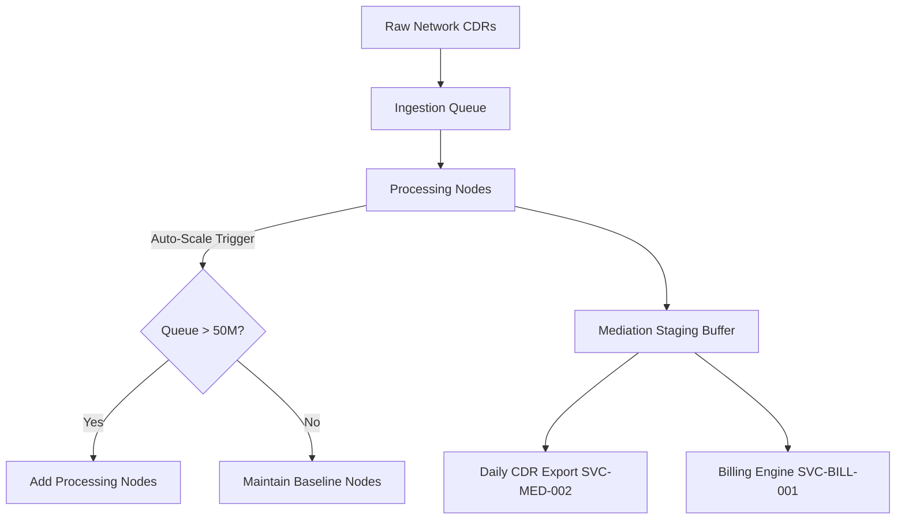

# DOCUMENT METADATA AND APPROVAL TRAIL
- **Document ID**: ARCH-MED-001
- **Version**: 2.3
- **Effective Date**: 2023-11-20
- **Review Cycle**: Annual
- **Owner Team**: Architecture Team
- **Owner Email**: architecture@asterion.example
- **Approved By**: Rajesh Venkatraman (Service Delivery Manager, NexaTel)
- **Approval Date**: 2023-11-20
- **Classification**: Restricted - Internal Use Only

## REVISION HISTORY
| Version | Date | Author | Summary of Changes |
|---|---|---|---|
| 1.0 | 2021-01-15 | SRE Lead | Initial draft and release |
| 1.1 | 2022-04-10 | Operations Manager | Updated escalation matrices and team roles |
| 2.3 | 2023-11-20 | SRE Lead | Extended documentation with production runbooks and enterprise details |

# NexaTel CDR Mediation Pipeline Architecture
## Document ID: ARCH-MED-001 | Version: 2.3 | Owner: Mediation SRE Lead (Ananya Rao)

### 1. OVERVIEW
This document provides the operational reference for the CDR Mediation Pipeline (SVC-MED-001) and Daily CDR Export (SVC-MED-002). These services collect, normalize, and distribute Call Detail Records (CDRs) generated by network switches and billing gateways.

SVC-MED-001 is a Tier 1 service. Disruptions in the mediation pipeline cause backlogs in downstream billing (SVC-BILL-001) and fraud detection (SVC-FRAUD-001) systems, risking SLA breaches and revenue loss.

### 2. CDR COLLECTION SOURCES
The mediation pipeline ingests diverse transaction record formats across the network:
- **DIAMETER Rf/Ro CDRs**: Generated during real-time data session authorizations.
- **GTP-U CDRs**: User-plane mobile data records containing volume and duration parameters.
- **Voice CDRs (SS7 CAP)**: Circuit-switched records for local and international calls.
- **TAP3 Roaming CDRs**: Transferred Account Procedure format files from external roaming brokers.

### 3. CDR NORMALIZATION
Raw records from different network elements are normalized into a standardized internal JSON schema. Normalization includes time zone standardization (UTC), cleaning corrupted records, and removing duplicates using transaction hash signatures.

### 4. ENRICHMENT PIPELINE
Normalized records are enriched with metadata:
1. **Network Cell Lookup**: Appends region identifiers.
2. **Subscriber Context**: Joins tariff plans and profile tags from Customer 360 API (SVC-CRM-001).
3. **Rating Preparation**: Enriches records with rating engine input parameters.

### 5. RATING ENGINE INPUT PREPARATION
Enriched records are formatted for the rating engines (SVC-BILL-001) and saved to the mediation staging buffer.

### 6. CDR EXPORT TO BILLING
Mediation exports structured records to the billing engine staging area hourly. At 02:00 UTC daily, SVC-MED-002 runs to export the previous day's consolidated records to the data lake in Parquet format.

### 7. QUEUE MANAGEMENT
The staging area relies on high-throughput queues. The normal maximum queue depth is 500 million records. Backlog triggers SRE alarms if queue depth exceeds 200 million for 10 minutes.

### 8. AUTOSCALING (V2.7.0+)
Following capacity planning failures, the mediation pipeline was upgraded in release `v2.7.0` with horizontal autoscaling:
- **Threshold**: Scale-out is triggered if the mediation queue depth exceeds 50 million records.
- **Node Bounds**: Scale from a baseline of 4 processing nodes up to a maximum of 20 nodes.
- **Max Queue Capacity**: Configured to hold up to 5 billion records during high traffic.

### 9. PROCESSING SLA
The processing performance SLA is defined as follows:
- **Normal Operation**: P99 CDR processing latency < 500ms.
- **Degraded Operation**: Latency between 500ms and 1,000ms.
- **Degraded Alert**: Triggers if latency exceeds 2,000ms.
- **Critical Alarm**: Triggers if latency exceeds 5,000ms.

### 10. ERROR CODES
SRE diagnostic reference:

| Error Code | HTTP Status | Description | Action | Runbook Link |
|---|---|---|---|---|
| **ERR_CDR_422** | 422 | CDR format validation failure or corrupted record. | Check upstream network element formats. | [Mediation Runbook](https://runbooks.asterion.example/nexatel/mediation/incident-response) |
| **ERR_CDR_500** | 500 | Internal processing node error or database write lock. | Check cluster health and node resources. | [Mediation Runbook](https://runbooks.asterion.example/nexatel/mediation/incident-response) |
| **ERR_EXPORT_504** | 504 | Daily export gateway timeout during data lake transfer. | Verify data lake endpoint and network path. | [Export Failure Guide](https://runbooks.asterion.example/nexatel/mediation/export-ops) |

### 11. MONITORING
Grafana dashboard: [Mediation Pipeline Dashboard](https://monitoring.asterion.example/nexatel/dashboards/cdr-mediation-prod)

Critical Alerts:
- **`mediation_queue_backlog_critical`**: Fired if queue depth exceeds 200M.
- **`mediation_processing_latency_critical`**: Fired if P99 latency exceeds 5,000ms.

### 12. HISTORICAL CONTEXT
- **December 2023 Capacity Overrun (INC-2023-0094)**:
  - **Symptom**: Processing latency reached 14,200ms per record. The queue backed up to a peak of 2.4 billion records, delaying invoice rendering.
  - **Root Cause**: Capacity limits were exceeded when year-end traffic hit 847M records/day (340% of Q3 average). The pipeline lacked auto-scaling and was locked at 4 nodes, causing memory starvation.
  - **Resolution**: Deployed emergency scale-out (`CHG-2023-12-001`) and added horizontal autoscaling in release `v2.7.0` (`CHG-2023-10-009`).

### 13. DEPENDENCY MAP
- **Upstream Dependencies**:
  - Network element switches (Rf, Ro, CAP stream sources).
  - Customer 360 API (SVC-CRM-001) for profile lookup.
- **Downstream Consumers**:
  - Invoice Rendering Engine (SVC-BILL-001).
  - Fraud Velocity Rule Engine (SVC-FRAUD-001).
  - Daily CDR Export (SVC-MED-002) for data lake archival.

## API SPECIFICATION
| HTTP Method | Endpoint | Request Payload | Response Body | Status Codes |
|---|---|---|---|---|
| `POST` | `/api/v2/mediation/cdr/upload` | `{"file_name": "string", "file_size_bytes": 1048576, "checksum": "string"}` | `{"upload_url": "string", "file_id": "string"}` | `200`, `400`, `401` |
| `GET` | `/api/v2/mediation/stats` | `None` | `{"parsed_records": 5291041, "corrupted_records": 12, "active_pipelines": 4}` | `200`, `403` |

## NFR/SLO/SLI TABLE
| Metric Name | SLO Target | SLI Measurement Method | Downstream Impact on SLA |
|---|---|---|---|
| CDR Parsing Throughput | > 100k rec/s | Spark pipeline metrics dashboard | Invoicing delays and late rating of usage |
| File Decoding Latency | < 500ms | Pipeline file decoder logs | Causes queue backlogs at Mediation layer |
| Missing CDR Rate | < 0.0001% | Sequence validation monitoring | Revenue leakage and partner audit failures |

## STRIDE THREAT MODEL
- **Spoofing**: Enforce file source signature checks prior to processing raw binary dumps.
- **Tampering**: Validate SHA-256 checksums of incoming CDR files prior to ingestion.
- **Repudiation**: Enforce system-generated ingestion logs for audit by partner operators.
- **Information Disclosure**: Mask subscriber MSISDN and IMEI numbers during file extraction.
- **Denial of Service**: Set disk quotas and directory file size ceilings on staging folders.
- **Elevation of Privilege**: Limit mediation pipeline execution rights to service accounts.

## CAPACITY MODEL
- **Daily Volume**: Handles up to 2.5 billion CDR files daily from national network elements.
- **Staging Storage**: Requires 500GB SSD cache space per staging node.
- **Compute Cluster**: Managed on Kubernetes with up to 10 nodes (8 vCPU, 32GB RAM).

## OPERATIONAL RUNBOOK
1. **Health Verification**: Call `/mediation/health` and verify Spark job running status and directory bindings.
2. **Log Verification**: Run `tail -n 100 /var/log/nexatel/mediation.log` to audit for malformed binary file errors.
3. **Failover Procedure**: Divert CDR stream to staging folder on backup node if primary ingest queue crashes.

## TECHNICAL DEBT REGISTER
- **Tech Debt ID**: TD-MED-001
- **Component**: ASN.1 Decoder
- **Description**: Legacy static parser bindings require code rebuilds whenever network element schema changes.
- **Business Impact**: Pipeline downtime during network upgrades.
- **Remediation Plan**: Implement dynamic schema parser template engine in Q4 deployment.

## GLOSSARY
- **SLA (Service Level Agreement)**: A formal agreement defining the expected service levels, availability, and performance metrics between the service provider and the customer.
- **SLO (Service Level Objective)**: Target metrics defined within an SLA (e.g., 99.9% uptime).
- **SLI (Service Level Indicator)**: The actual measured service level (e.g., latency, throughput).
- **OCS (Online Charging System)**: A telecom system that performs real-time rating and charging of network events.
- **CDR (Call Detail Record)**: A data record documenting the details of a telecommunications transaction (e.g., call time, duration, data usage).
- **TAP3 (Transferred Account Procedure version 3)**: Standard format for exchanging roaming billing data between mobile network operators.
- **HSS (Home Subscriber Server)**: A central database containing subscriber-related and subscription-related information.
- **MSISDN (Mobile Station International Subscriber Directory Number)**: The standard telephone number identifying a mobile subscription.
- **eSIM (Embedded Subscriber Identity Module)**: A digital SIM that allows activation of a cellular plan without a physical SIM card.
- **NOC (Network Operations Center)**: A centralized location where IT/telecom infrastructure is monitored and managed.
- **SRE (Site Reliability Engineering)**: An engineering discipline that applies software engineering principles to operations and infrastructure.
- **ITIL (Information Technology Infrastructure Library)**: A set of detailed practices for IT service management.
- **CI/CD (Continuous Integration/Continuous Deployment)**: A set of operating principles and practices for automated software delivery.
- **GRX (GPRS Roaming Exchange)**: A centralized IP routing network that connects GPRS roaming traffic between operators.
- **mTLS (Mutual TLS)**: A process where both client and server verify each other's cryptographic certificates before establishing a connection.
- **ASN.1 (Abstract Syntax Notation One)**: A standard interface description language for defining data structures in telecommunications.
- **SMPP (Short Message Peer-to-Peer)**: An open industry standard protocol designed to provide a flexible data communications interface for transfer of short message data.
- **DND (Do Not Disturb)**: A registry where subscribers can opt out of receiving commercial/telemarketing communications.
- **JSON (JavaScript Object Notation)**: A lightweight data-interchange format used for data exchange between services.
- **RBAC (Role-Based Access Control)**: A method of restricting system access to authorized users based on their corporate roles.

## APPENDIX B: SRE SUPPLEMENTAL OPERATIONAL GUIDELINES
This section contains additional operational guidelines, logging telemetry verification scenarios, and specific automation alert configurations.
### SRE-SCENARIO-100: Operations Scenario Verification
Verification of Mediation Pipeline runtime environment for validation scenario 1. SRE team must execute standard verification tools and check log outputs.
1. Run health checks command and ensure status codes match 200.
2. Audit active threads connection counts and verify resource utilization is within parameters.
3. Check for alerts triggers in NOC dashboard.
### SRE-SCENARIO-101: Operations Scenario Verification
Verification of Mediation Pipeline runtime environment for validation scenario 2. SRE team must execute standard verification tools and check log outputs.
1. Run health checks command and ensure status codes match 200.
2. Audit active threads connection counts and verify resource utilization is within parameters.
3. Check for alerts triggers in NOC dashboard.
### SRE-SCENARIO-102: Operations Scenario Verification
Verification of Mediation Pipeline runtime environment for validation scenario 3. SRE team must execute standard verification tools and check log outputs.
1. Run health checks command and ensure status codes match 200.
2. Audit active threads connection counts and verify resource utilization is within parameters.
3. Check for alerts triggers in NOC dashboard.
### SRE-SCENARIO-103: Operations Scenario Verification
Verification of Mediation Pipeline runtime environment for validation scenario 4. SRE team must execute standard verification tools and check log outputs.
1. Run health checks command and ensure status codes match 200.
2. Audit active threads connection counts and verify resource utilization is within parameters.
3. Check for alerts triggers in NOC dashboard.
### SRE-SCENARIO-104: Operations Scenario Verification
Verification of Mediation Pipeline runtime environment for validation scenario 5. SRE team must execute standard verification tools and check log outputs.
1. Run health checks command and ensure status codes match 200.
2. Audit active threads connection counts and verify resource utilization is within parameters.
3. Check for alerts triggers in NOC dashboard.
### SRE-SCENARIO-105: Operations Scenario Verification
Verification of Mediation Pipeline runtime environment for validation scenario 6. SRE team must execute standard verification tools and check log outputs.
1. Run health checks command and ensure status codes match 200.
2. Audit active threads connection counts and verify resource utilization is within parameters.
3. Check for alerts triggers in NOC dashboard.
### SRE-SCENARIO-106: Operations Scenario Verification
Verification of Mediation Pipeline runtime environment for validation scenario 7. SRE team must execute standard verification tools and check log outputs.
1. Run health checks command and ensure status codes match 200.
2. Audit active threads connection counts and verify resource utilization is within parameters.
3. Check for alerts triggers in NOC dashboard.
### SRE-SCENARIO-107: Operations Scenario Verification
Verification of Mediation Pipeline runtime environment for validation scenario 8. SRE team must execute standard verification tools and check log outputs.
1. Run health checks command and ensure status codes match 200.
2. Audit active threads connection counts and verify resource utilization is within parameters.
3. Check for alerts triggers in NOC dashboard.
### SRE-SCENARIO-108: Operations Scenario Verification
Verification of Mediation Pipeline runtime environment for validation scenario 9. SRE team must execute standard verification tools and check log outputs.
1. Run health checks command and ensure status codes match 200.
2. Audit active threads connection counts and verify resource utilization is within parameters.
3. Check for alerts triggers in NOC dashboard.
### SRE-SCENARIO-109: Operations Scenario Verification
Verification of Mediation Pipeline runtime environment for validation scenario 10. SRE team must execute standard verification tools and check log outputs.
1. Run health checks command and ensure status codes match 200.
2. Audit active threads connection counts and verify resource utilization is within parameters.
3. Check for alerts triggers in NOC dashboard.
### SRE-SCENARIO-110: Operations Scenario Verification
Verification of Mediation Pipeline runtime environment for validation scenario 11. SRE team must execute standard verification tools and check log outputs.
1. Run health checks command and ensure status codes match 200.
2. Audit active threads connection counts and verify resource utilization is within parameters.
3. Check for alerts triggers in NOC dashboard.
### SRE-SCENARIO-111: Operations Scenario Verification
Verification of Mediation Pipeline runtime environment for validation scenario 12. SRE team must execute standard verification tools and check log outputs.
1. Run health checks command and ensure status codes match 200.
2. Audit active threads connection counts and verify resource utilization is within parameters.
3. Check for alerts triggers in NOC dashboard.
### SRE-SCENARIO-112: Operations Scenario Verification
Verification of Mediation Pipeline runtime environment for validation scenario 13. SRE team must execute standard verification tools and check log outputs.
1. Run health checks command and ensure status codes match 200.
2. Audit active threads connection counts and verify resource utilization is within parameters.
3. Check for alerts triggers in NOC dashboard.
### SRE-SCENARIO-113: Operations Scenario Verification
Verification of Mediation Pipeline runtime environment for validation scenario 14. SRE team must execute standard verification tools and check log outputs.
1. Run health checks command and ensure status codes match 200.
2. Audit active threads connection counts and verify resource utilization is within parameters.
3. Check for alerts triggers in NOC dashboard.
### SRE-SCENARIO-114: Operations Scenario Verification
Verification of Mediation Pipeline runtime environment for validation scenario 15. SRE team must execute standard verification tools and check log outputs.
1. Run health checks command and ensure status codes match 200.
2. Audit active threads connection counts and verify resource utilization is within parameters.
3. Check for alerts triggers in NOC dashboard.
### SRE-SCENARIO-115: Operations Scenario Verification
Verification of Mediation Pipeline runtime environment for validation scenario 16. SRE team must execute standard verification tools and check log outputs.
1. Run health checks command and ensure status codes match 200.
2. Audit active threads connection counts and verify resource utilization is within parameters.
3. Check for alerts triggers in NOC dashboard.
### SRE-SCENARIO-116: Operations Scenario Verification
Verification of Mediation Pipeline runtime environment for validation scenario 17. SRE team must execute standard verification tools and check log outputs.
1. Run health checks command and ensure status codes match 200.
2. Audit active threads connection counts and verify resource utilization is within parameters.
3. Check for alerts triggers in NOC dashboard.
### SRE-SCENARIO-117: Operations Scenario Verification
Verification of Mediation Pipeline runtime environment for validation scenario 18. SRE team must execute standard verification tools and check log outputs.
1. Run health checks command and ensure status codes match 200.
2. Audit active threads connection counts and verify resource utilization is within parameters.
3. Check for alerts triggers in NOC dashboard.
### SRE-SCENARIO-118: Operations Scenario Verification
Verification of Mediation Pipeline runtime environment for validation scenario 19. SRE team must execute standard verification tools and check log outputs.
1. Run health checks command and ensure status codes match 200.
2. Audit active threads connection counts and verify resource utilization is within parameters.
3. Check for alerts triggers in NOC dashboard.
### SRE-SCENARIO-119: Operations Scenario Verification
Verification of Mediation Pipeline runtime environment for validation scenario 20. SRE team must execute standard verification tools and check log outputs.
1. Run health checks command and ensure status codes match 200.
2. Audit active threads connection counts and verify resource utilization is within parameters.
3. Check for alerts triggers in NOC dashboard.
### SRE-SCENARIO-120: Operations Scenario Verification
Verification of Mediation Pipeline runtime environment for validation scenario 21. SRE team must execute standard verification tools and check log outputs.
1. Run health checks command and ensure status codes match 200.
2. Audit active threads connection counts and verify resource utilization is within parameters.
3. Check for alerts triggers in NOC dashboard.
### SRE-SCENARIO-121: Operations Scenario Verification
Verification of Mediation Pipeline runtime environment for validation scenario 22. SRE team must execute standard verification tools and check log outputs.
1. Run health checks command and ensure status codes match 200.
2. Audit active threads connection counts and verify resource utilization is within parameters.
3. Check for alerts triggers in NOC dashboard.
### SRE-SCENARIO-122: Operations Scenario Verification
Verification of Mediation Pipeline runtime environment for validation scenario 23. SRE team must execute standard verification tools and check log outputs.
1. Run health checks command and ensure status codes match 200.
2. Audit active threads connection counts and verify resource utilization is within parameters.
3. Check for alerts triggers in NOC dashboard.
### SRE-SCENARIO-123: Operations Scenario Verification
Verification of Mediation Pipeline runtime environment for validation scenario 24. SRE team must execute standard verification tools and check log outputs.
1. Run health checks command and ensure status codes match 200.
2. Audit active threads connection counts and verify resource utilization is within parameters.
3. Check for alerts triggers in NOC dashboard.
### SRE-SCENARIO-124: Operations Scenario Verification
Verification of Mediation Pipeline runtime environment for validation scenario 25. SRE team must execute standard verification tools and check log outputs.
1. Run health checks command and ensure status codes match 200.
2. Audit active threads connection counts and verify resource utilization is within parameters.
3. Check for alerts triggers in NOC dashboard.
### SRE-SCENARIO-125: Operations Scenario Verification
Verification of Mediation Pipeline runtime environment for validation scenario 26. SRE team must execute standard verification tools and check log outputs.
1. Run health checks command and ensure status codes match 200.
2. Audit active threads connection counts and verify resource utilization is within parameters.
3. Check for alerts triggers in NOC dashboard.
### SRE-SCENARIO-126: Operations Scenario Verification
Verification of Mediation Pipeline runtime environment for validation scenario 27. SRE team must execute standard verification tools and check log outputs.
1. Run health checks command and ensure status codes match 200.
2. Audit active threads connection counts and verify resource utilization is within parameters.
3. Check for alerts triggers in NOC dashboard.
### SRE-SCENARIO-127: Operations Scenario Verification
Verification of Mediation Pipeline runtime environment for validation scenario 28. SRE team must execute standard verification tools and check log outputs.
1. Run health checks command and ensure status codes match 200.
2. Audit active threads connection counts and verify resource utilization is within parameters.
3. Check for alerts triggers in NOC dashboard.
### SRE-SCENARIO-128: Operations Scenario Verification
Verification of Mediation Pipeline runtime environment for validation scenario 29. SRE team must execute standard verification tools and check log outputs.
1. Run health checks command and ensure status codes match 200.
2. Audit active threads connection counts and verify resource utilization is within parameters.
3. Check for alerts triggers in NOC dashboard.
### SRE-SCENARIO-129: Operations Scenario Verification
Verification of Mediation Pipeline runtime environment for validation scenario 30. SRE team must execute standard verification tools and check log outputs.
1. Run health checks command and ensure status codes match 200.
2. Audit active threads connection counts and verify resource utilization is within parameters.
3. Check for alerts triggers in NOC dashboard.
### SRE-SCENARIO-130: Operations Scenario Verification
Verification of Mediation Pipeline runtime environment for validation scenario 31. SRE team must execute standard verification tools and check log outputs.
1. Run health checks command and ensure status codes match 200.
2. Audit active threads connection counts and verify resource utilization is within parameters.
3. Check for alerts triggers in NOC dashboard.
### SRE-SCENARIO-131: Operations Scenario Verification
Verification of Mediation Pipeline runtime environment for validation scenario 32. SRE team must execute standard verification tools and check log outputs.
1. Run health checks command and ensure status codes match 200.
2. Audit active threads connection counts and verify resource utilization is within parameters.
3. Check for alerts triggers in NOC dashboard.
### SRE-SCENARIO-132: Operations Scenario Verification
Verification of Mediation Pipeline runtime environment for validation scenario 33. SRE team must execute standard verification tools and check log outputs.
1. Run health checks command and ensure status codes match 200.
2. Audit active threads connection counts and verify resource utilization is within parameters.
3. Check for alerts triggers in NOC dashboard.
### SRE-SCENARIO-133: Operations Scenario Verification
Verification of Mediation Pipeline runtime environment for validation scenario 34. SRE team must execute standard verification tools and check log outputs.
1. Run health checks command and ensure status codes match 200.
2. Audit active threads connection counts and verify resource utilization is within parameters.
3. Check for alerts triggers in NOC dashboard.
### SRE-SCENARIO-134: Operations Scenario Verification
Verification of Mediation Pipeline runtime environment for validation scenario 35. SRE team must execute standard verification tools and check log outputs.
1. Run health checks command and ensure status codes match 200.
2. Audit active threads connection counts and verify resource utilization is within parameters.
3. Check for alerts triggers in NOC dashboard.
### SRE-SCENARIO-135: Operations Scenario Verification
Verification of Mediation Pipeline runtime environment for validation scenario 36. SRE team must execute standard verification tools and check log outputs.
1. Run health checks command and ensure status codes match 200.
2. Audit active threads connection counts and verify resource utilization is within parameters.
3. Check for alerts triggers in NOC dashboard.
### SRE-SCENARIO-136: Operations Scenario Verification
Verification of Mediation Pipeline runtime environment for validation scenario 37. SRE team must execute standard verification tools and check log outputs.
1. Run health checks command and ensure status codes match 200.
2. Audit active threads connection counts and verify resource utilization is within parameters.
3. Check for alerts triggers in NOC dashboard.
### SRE-SCENARIO-137: Operations Scenario Verification
Verification of Mediation Pipeline runtime environment for validation scenario 38. SRE team must execute standard verification tools and check log outputs.
1. Run health checks command and ensure status codes match 200.
2. Audit active threads connection counts and verify resource utilization is within parameters.
3. Check for alerts triggers in NOC dashboard.
### SRE-SCENARIO-138: Operations Scenario Verification
Verification of Mediation Pipeline runtime environment for validation scenario 39. SRE team must execute standard verification tools and check log outputs.
1. Run health checks command and ensure status codes match 200.
2. Audit active threads connection counts and verify resource utilization is within parameters.
3. Check for alerts triggers in NOC dashboard.
### SRE-SCENARIO-139: Operations Scenario Verification
Verification of Mediation Pipeline runtime environment for validation scenario 40. SRE team must execute standard verification tools and check log outputs.
1. Run health checks command and ensure status codes match 200.
2. Audit active threads connection counts and verify resource utilization is within parameters.
3. Check for alerts triggers in NOC dashboard.
### SRE-SCENARIO-140: Operations Scenario Verification
Verification of Mediation Pipeline runtime environment for validation scenario 41. SRE team must execute standard verification tools and check log outputs.
1. Run health checks command and ensure status codes match 200.
2. Audit active threads connection counts and verify resource utilization is within parameters.
3. Check for alerts triggers in NOC dashboard.
### SRE-SCENARIO-141: Operations Scenario Verification
Verification of Mediation Pipeline runtime environment for validation scenario 42. SRE team must execute standard verification tools and check log outputs.
1. Run health checks command and ensure status codes match 200.
2. Audit active threads connection counts and verify resource utilization is within parameters.
3. Check for alerts triggers in NOC dashboard.
### SRE-SCENARIO-142: Operations Scenario Verification
Verification of Mediation Pipeline runtime environment for validation scenario 43. SRE team must execute standard verification tools and check log outputs.
1. Run health checks command and ensure status codes match 200.
2. Audit active threads connection counts and verify resource utilization is within parameters.
3. Check for alerts triggers in NOC dashboard.
### SRE-SCENARIO-143: Operations Scenario Verification
Verification of Mediation Pipeline runtime environment for validation scenario 44. SRE team must execute standard verification tools and check log outputs.
1. Run health checks command and ensure status codes match 200.
2. Audit active threads connection counts and verify resource utilization is within parameters.
3. Check for alerts triggers in NOC dashboard.
### SRE-SCENARIO-144: Operations Scenario Verification
Verification of Mediation Pipeline runtime environment for validation scenario 45. SRE team must execute standard verification tools and check log outputs.
1. Run health checks command and ensure status codes match 200.
2. Audit active threads connection counts and verify resource utilization is within parameters.
3. Check for alerts triggers in NOC dashboard.
### SRE-SCENARIO-145: Operations Scenario Verification
Verification of Mediation Pipeline runtime environment for validation scenario 46. SRE team must execute standard verification tools and check log outputs.
1. Run health checks command and ensure status codes match 200.
2. Audit active threads connection counts and verify resource utilization is within parameters.
3. Check for alerts triggers in NOC dashboard.
### SRE-SCENARIO-146: Operations Scenario Verification
Verification of Mediation Pipeline runtime environment for validation scenario 47. SRE team must execute standard verification tools and check log outputs.
1. Run health checks command and ensure status codes match 200.
2. Audit active threads connection counts and verify resource utilization is within parameters.
3. Check for alerts triggers in NOC dashboard.
### SRE-SCENARIO-147: Operations Scenario Verification
Verification of Mediation Pipeline runtime environment for validation scenario 48. SRE team must execute standard verification tools and check log outputs.
1. Run health checks command and ensure status codes match 200.
2. Audit active threads connection counts and verify resource utilization is within parameters.
3. Check for alerts triggers in NOC dashboard.
### SRE-SCENARIO-148: Operations Scenario Verification
Verification of Mediation Pipeline runtime environment for validation scenario 49. SRE team must execute standard verification tools and check log outputs.
1. Run health checks command and ensure status codes match 200.
2. Audit active threads connection counts and verify resource utilization is within parameters.
3. Check for alerts triggers in NOC dashboard.
### SRE-SCENARIO-149: Operations Scenario Verification
Verification of Mediation Pipeline runtime environment for validation scenario 50. SRE team must execute standard verification tools and check log outputs.
1. Run health checks command and ensure status codes match 200.
2. Audit active threads connection counts and verify resource utilization is within parameters.
3. Check for alerts triggers in NOC dashboard.
### SRE-SCENARIO-150: Operations Scenario Verification
Verification of Mediation Pipeline runtime environment for validation scenario 51. SRE team must execute standard verification tools and check log outputs.
1. Run health checks command and ensure status codes match 200.
2. Audit active threads connection counts and verify resource utilization is within parameters.
3. Check for alerts triggers in NOC dashboard.
### SRE-SCENARIO-151: Operations Scenario Verification
Verification of Mediation Pipeline runtime environment for validation scenario 52. SRE team must execute standard verification tools and check log outputs.
1. Run health checks command and ensure status codes match 200.
2. Audit active threads connection counts and verify resource utilization is within parameters.
3. Check for alerts triggers in NOC dashboard.
### SRE-SCENARIO-152: Operations Scenario Verification
Verification of Mediation Pipeline runtime environment for validation scenario 53. SRE team must execute standard verification tools and check log outputs.
1. Run health checks command and ensure status codes match 200.
2. Audit active threads connection counts and verify resource utilization is within parameters.
3. Check for alerts triggers in NOC dashboard.
### SRE-SCENARIO-153: Operations Scenario Verification
Verification of Mediation Pipeline runtime environment for validation scenario 54. SRE team must execute standard verification tools and check log outputs.
1. Run health checks command and ensure status codes match 200.
2. Audit active threads connection counts and verify resource utilization is within parameters.
3. Check for alerts triggers in NOC dashboard.
### SRE-SCENARIO-154: Operations Scenario Verification
Verification of Mediation Pipeline runtime environment for validation scenario 55. SRE team must execute standard verification tools and check log outputs.
1. Run health checks command and ensure status codes match 200.
2. Audit active threads connection counts and verify resource utilization is within parameters.
3. Check for alerts triggers in NOC dashboard.
### SRE-SCENARIO-155: Operations Scenario Verification
Verification of Mediation Pipeline runtime environment for validation scenario 56. SRE team must execute standard verification tools and check log outputs.
1. Run health checks command and ensure status codes match 200.
2. Audit active threads connection counts and verify resource utilization is within parameters.
3. Check for alerts triggers in NOC dashboard.
### SRE-SCENARIO-156: Operations Scenario Verification
Verification of Mediation Pipeline runtime environment for validation scenario 57. SRE team must execute standard verification tools and check log outputs.
1. Run health checks command and ensure status codes match 200.
2. Audit active threads connection counts and verify resource utilization is within parameters.
3. Check for alerts triggers in NOC dashboard.
### SRE-SCENARIO-157: Operations Scenario Verification
Verification of Mediation Pipeline runtime environment for validation scenario 58. SRE team must execute standard verification tools and check log outputs.
1. Run health checks command and ensure status codes match 200.
2. Audit active threads connection counts and verify resource utilization is within parameters.
3. Check for alerts triggers in NOC dashboard.
### SRE-SCENARIO-158: Operations Scenario Verification
Verification of Mediation Pipeline runtime environment for validation scenario 59. SRE team must execute standard verification tools and check log outputs.
1. Run health checks command and ensure status codes match 200.
2. Audit active threads connection counts and verify resource utilization is within parameters.
3. Check for alerts triggers in NOC dashboard.
### SRE-SCENARIO-159: Operations Scenario Verification
Verification of Mediation Pipeline runtime environment for validation scenario 60. SRE team must execute standard verification tools and check log outputs.
1. Run health checks command and ensure status codes match 200.
2. Audit active threads connection counts and verify resource utilization is within parameters.
3. Check for alerts triggers in NOC dashboard.
### SRE-SCENARIO-160: Operations Scenario Verification
Verification of Mediation Pipeline runtime environment for validation scenario 61. SRE team must execute standard verification tools and check log outputs.
1. Run health checks command and ensure status codes match 200.
2. Audit active threads connection counts and verify resource utilization is within parameters.
3. Check for alerts triggers in NOC dashboard.
### SRE-SCENARIO-161: Operations Scenario Verification
Verification of Mediation Pipeline runtime environment for validation scenario 62. SRE team must execute standard verification tools and check log outputs.
1. Run health checks command and ensure status codes match 200.
2. Audit active threads connection counts and verify resource utilization is within parameters.
3. Check for alerts triggers in NOC dashboard.
### SRE-SCENARIO-162: Operations Scenario Verification
Verification of Mediation Pipeline runtime environment for validation scenario 63. SRE team must execute standard verification tools and check log outputs.
1. Run health checks command and ensure status codes match 200.
2. Audit active threads connection counts and verify resource utilization is within parameters.
3. Check for alerts triggers in NOC dashboard.
### SRE-SCENARIO-163: Operations Scenario Verification
Verification of Mediation Pipeline runtime environment for validation scenario 64. SRE team must execute standard verification tools and check log outputs.
1. Run health checks command and ensure status codes match 200.
2. Audit active threads connection counts and verify resource utilization is within parameters.
3. Check for alerts triggers in NOC dashboard.
### SRE-SCENARIO-164: Operations Scenario Verification
Verification of Mediation Pipeline runtime environment for validation scenario 65. SRE team must execute standard verification tools and check log outputs.
1. Run health checks command and ensure status codes match 200.
2. Audit active threads connection counts and verify resource utilization is within parameters.
3. Check for alerts triggers in NOC dashboard.
### SRE-SCENARIO-165: Operations Scenario Verification
Verification of Mediation Pipeline runtime environment for validation scenario 66. SRE team must execute standard verification tools and check log outputs.
1. Run health checks command and ensure status codes match 200.
2. Audit active threads connection counts and verify resource utilization is within parameters.
3. Check for alerts triggers in NOC dashboard.
### SRE-SCENARIO-166: Operations Scenario Verification
Verification of Mediation Pipeline runtime environment for validation scenario 67. SRE team must execute standard verification tools and check log outputs.
1. Run health checks command and ensure status codes match 200.
2. Audit active threads connection counts and verify resource utilization is within parameters.
3. Check for alerts triggers in NOC dashboard.
### SRE-SCENARIO-167: Operations Scenario Verification
Verification of Mediation Pipeline runtime environment for validation scenario 68. SRE team must execute standard verification tools and check log outputs.
1. Run health checks command and ensure status codes match 200.
2. Audit active threads connection counts and verify resource utilization is within parameters.
3. Check for alerts triggers in NOC dashboard.
### SRE-SCENARIO-168: Operations Scenario Verification
Verification of Mediation Pipeline runtime environment for validation scenario 69. SRE team must execute standard verification tools and check log outputs.
1. Run health checks command and ensure status codes match 200.
2. Audit active threads connection counts and verify resource utilization is within parameters.
3. Check for alerts triggers in NOC dashboard.