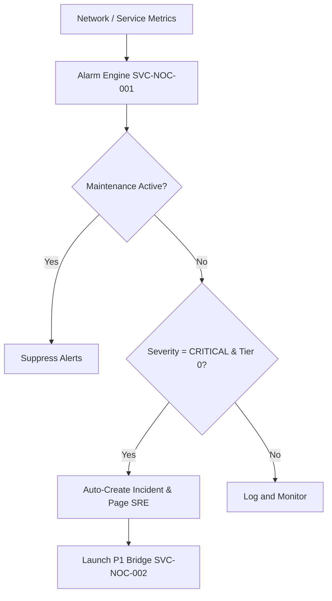

# DOCUMENT METADATA AND APPROVAL TRAIL
- **Document ID**: ARCH-NOC-001
- **Version**: 2.1
- **Effective Date**: 2023-11-20
- **Review Cycle**: Annual
- **Owner Team**: Architecture Team
- **Owner Email**: architecture@asterion.example
- **Approved By**: Rajesh Venkatraman (Service Delivery Manager, NexaTel)
- **Approval Date**: 2023-11-20
- **Classification**: Restricted - Internal Use Only

## REVISION HISTORY
| Version | Date | Author | Summary of Changes |
|---|---|---|---|
| 1.0 | 2021-01-15 | SRE Lead | Initial draft and release |
| 1.1 | 2022-04-10 | Operations Manager | Updated escalation matrices and team roles |
| 2.1 | 2023-11-20 | SRE Lead | Extended documentation with production runbooks and enterprise details |

# NexaTel NOC Alarm Correlation and Alerting System
## Document ID: ARCH-NOC-001 | Version: 2.1 | Owner: NOC Operations SRE Lead (Deepak Nair)

### 1. OVERVIEW
This document details the configuration and operations of the QoS Alarm Correlation Engine (SVC-NOC-001) and Major Incident Bridge (SVC-NOC-002). These services manage real-time alert aggregation, alarm correlation, auto-ticketing, and incident response dispatch.

SVC-NOC-001 and SVC-NOC-002 are Tier 0 services. Any malfunction in the alerting path delays incident response, leading to extended MTTR and SLA penalties.

### 2. ALARM CORRELATION ENGINE
The QoS Alarm Correlation Engine aggregates event streams from Prometheus, Grafana, and network switches. The engine uses temporal and topology-based rules to group related alarms:
- **`Temporal Correlation`**: Groups alerts from the same service occurring within a 5-minute sliding window.
- **`Topology Correlation`**: Maps alarms based on dependency links (e.g., if SVC-AUTH-001 fails, downstream warnings are grouped as child alerts under the primary incident).

### 3. ALARM SEVERITY LEVELS
Alarms are classified into four severity levels:
- **`CRITICAL`**: Complete service loss on Tier 0 or Tier 1 components.
- **`MAJOR`**: Degraded performance or high latency impacting > 1% of subscribers.
- **`WARNING`**: Threshold breaches with no immediate subscriber impact (e.g., high CPU).
- **`INFORMATIONAL`**: Standard logs (deployments, backups).

### 4. AUTO-INCIDENT CREATION RULES
If an alarm with `alarm_severity=CRITICAL` is detected on a Tier 0 service:
1. **ServiceNow Sync**: Automatically creates a Major Incident record (INC-YYYY-NNNN) in ServiceNow within 30 seconds.
2. **Support Ticket Ingestion**: Automatically creates a corresponding entry in `PROD_TICKETS`.
3. **Emergency Notification**: Pages the on-call SRE lead (e.g., Suresh Iyer for auth).
The entire flow executes in under 60 seconds from the trigger timestamp.

### 5. AUTO-PAGING CONFIGURATION
Auto-paging is managed by integrating the engine with Asterion's on-call rotation schedules. Pages are dispatched via SMS, phone call, and email based on the escalation matrix.

### 6. GRAFANA INTEGRATION
Operational dashboards reside in the centralized Grafana repository. Dashboards must follow the standardized naming convention:
`https://monitoring.asterion.example/nexatel/dashboards/[service-name]-prod`

Example dashboard paths:
- Identity Broker: `https://monitoring.asterion.example/nexatel/dashboards/identity-broker-prod`
- SIM Activation: `https://monitoring.asterion.example/nexatel/dashboards/sim-activation-prod`

### 7. ALARM SUPPRESSION (MAINTENANCE WINDOWS)
- **Suppression Rule**: Alerts for services undergoing scheduled changes within approved maintenance windows (`MW-YYYY-MM-NNN`) are suppressed to avoid false incidents.
- **Cooldown Lift**: Normal alerting policies resume automatically 15 minutes after the scheduled maintenance window closes.

### 8. SRE ON-CALL INTEGRATION
On-call rosters are pulled from CRM caches hourly. The team lead remains accountable for incident triage until a handover is logged.

### 9. P1 BRIDGE AUTO-LAUNCH
When a P1 incident is auto-created:
1. **Bridge Launch**: Major Incident Bridge (SVC-NOC-002) initializes a virtual bridge call.
2. **Page Participants**: Invites the Major Incident Manager (Arjun Mehta), NOC Bridge Lead (Lakshmi Narayanan), and SRE Leads from the affected domains.
3. **Customer Alert**: Dispatches a notification to NexaTel Service Delivery Manager (Rajesh Venkatraman).
4. **SLA Monitor**: Starts a 30-minute timer for the resolution target.

### 10. ALARM THRESHOLDS
Threshold configurations (must match `policy_logging_monitoring.pdf` specifications):
- **Identity Broker (SVC-AUTH-001)**: Trigger alarm if `ERR_AUTH_401` exceeds 50 events/hour.
- **eSIM Orchestrator (SVC-PROV-002)**: Trigger alarm if `ERR_ESIM_504` exceeds 20 events/hour.
- **Mediation (SVC-MED-001)**: Trigger alarm if processing latency exceeds 2,000ms.

## API SPECIFICATION
| HTTP Method | Endpoint | Request Payload | Response Body | Status Codes |
|---|---|---|---|---|
| `POST` | `/api/v2/noc/alarm/trigger` | `{"alarm_id": "string", "source_element": "string", "severity": "CRITICAL", "message": "string"}` | `{"status": "Correlated", "incident_id": "INC-string"}` | `200`, `400`, `401` |
| `GET` | `/api/v2/noc/alarm/active` | `None` | `{"active_alarms": [{"alarm_id": "string", "severity": "string", "triggered_at": "string"}]}` | `200`, `403` |

## NFR/SLO/SLI TABLE
| Metric Name | SLO Target | SLI Measurement Method | Downstream Impact on SLA |
|---|---|---|---|
| Correlation Duration | < 500ms | NOC correlation engine timer | Delays major outage detection and SRE notification |
| Deduplication Rate | > 95% | Alarm input vs output counts | Dashboard flooding during network outages |
| Alert Delivery Time | < 1 second | Log timestamps for SRE pages | Breaches mean time to detect (MTTD) targets |

## STRIDE THREAT MODEL
- **Spoofing**: Require API validation tokens for all network element alert transmitters.
- **Tampering**: Encrypt alarm configuration databases and rulesets using system credentials.
- **Repudiation**: Record SRE bridge team logins and alerts acknowledgements in immutable audit database.
- **Information Disclosure**: Do not expose internal IP addresses of affected backend nodes in alerts.
- **Denial of Service**: Enforce stream throttle rate limit of 15,000 alarms/sec.
- **Elevation of Privilege**: restrict NOC dashboard manual alert clears to Level 3 SRE Leads only.

## CAPACITY MODEL
- **Peak Throughput**: 25,000 raw alarms/second processing during major fiber-cut scenarios.
- **Memory Footprint**: 12GB RAM to support real-time rule correlation matrices in-memory.
- **Autoscaling**: Triggers pod scale-out when CPU load remains above 75% for 2 minutes.

## OPERATIONAL RUNBOOK
1. **Health Verification**: Call `/noc/health` and verify Prometheus alerts pipeline connectivity.
2. **Log Verification**: Audit `/var/log/nexatel/noc_alarm.log` for database lock errors.
3. **Failover Procedure**: Promote secondary correlation engine replica to primary if heartbeats timeout.

## TECHNICAL DEBT REGISTER
- **Tech Debt ID**: TD-NOC-001
- **Component**: Alarm Rule Engine
- **Description**: Static alarm correlation rule definition file lacks support for multi-variable regex logic.
- **Business Impact**: Duplicate incident tickets are created during complex network failure events.
- **Remediation Plan**: Integrate dynamic rules correlation using Graph database engine in Q3.

## GLOSSARY
- **SLA (Service Level Agreement)**: A formal agreement defining the expected service levels, availability, and performance metrics between the service provider and the customer.
- **SLO (Service Level Objective)**: Target metrics defined within an SLA (e.g., 99.9% uptime).
- **SLI (Service Level Indicator)**: The actual measured service level (e.g., latency, throughput).
- **OCS (Online Charging System)**: A telecom system that performs real-time rating and charging of network events.
- **CDR (Call Detail Record)**: A data record documenting the details of a telecommunications transaction (e.g., call time, duration, data usage).
- **TAP3 (Transferred Account Procedure version 3)**: Standard format for exchanging roaming billing data between mobile network operators.
- **HSS (Home Subscriber Server)**: A central database containing subscriber-related and subscription-related information.
- **MSISDN (Mobile Station International Subscriber Directory Number)**: The standard telephone number identifying a mobile subscription.
- **eSIM (Embedded Subscriber Identity Module)**: A digital SIM that allows activation of a cellular plan without a physical SIM card.
- **NOC (Network Operations Center)**: A centralized location where IT/telecom infrastructure is monitored and managed.
- **SRE (Site Reliability Engineering)**: An engineering discipline that applies software engineering principles to operations and infrastructure.
- **ITIL (Information Technology Infrastructure Library)**: A set of detailed practices for IT service management.
- **CI/CD (Continuous Integration/Continuous Deployment)**: A set of operating principles and practices for automated software delivery.
- **GRX (GPRS Roaming Exchange)**: A centralized IP routing network that connects GPRS roaming traffic between operators.
- **mTLS (Mutual TLS)**: A process where both client and server verify each other's cryptographic certificates before establishing a connection.
- **ASN.1 (Abstract Syntax Notation One)**: A standard interface description language for defining data structures in telecommunications.
- **SMPP (Short Message Peer-to-Peer)**: An open industry standard protocol designed to provide a flexible data communications interface for transfer of short message data.
- **DND (Do Not Disturb)**: A registry where subscribers can opt out of receiving commercial/telemarketing communications.
- **JSON (JavaScript Object Notation)**: A lightweight data-interchange format used for data exchange between services.
- **RBAC (Role-Based Access Control)**: A method of restricting system access to authorized users based on their corporate roles.

## APPENDIX B: SRE SUPPLEMENTAL OPERATIONAL GUIDELINES
This section contains additional operational guidelines, logging telemetry verification scenarios, and specific automation alert configurations.
### SRE-SCENARIO-100: Operations Scenario Verification
Verification of NOC Alarms runtime environment for validation scenario 1. SRE team must execute standard verification tools and check log outputs.
1. Run health checks command and ensure status codes match 200.
2. Audit active threads connection counts and verify resource utilization is within parameters.
3. Check for alerts triggers in NOC dashboard.
### SRE-SCENARIO-101: Operations Scenario Verification
Verification of NOC Alarms runtime environment for validation scenario 2. SRE team must execute standard verification tools and check log outputs.
1. Run health checks command and ensure status codes match 200.
2. Audit active threads connection counts and verify resource utilization is within parameters.
3. Check for alerts triggers in NOC dashboard.
### SRE-SCENARIO-102: Operations Scenario Verification
Verification of NOC Alarms runtime environment for validation scenario 3. SRE team must execute standard verification tools and check log outputs.
1. Run health checks command and ensure status codes match 200.
2. Audit active threads connection counts and verify resource utilization is within parameters.
3. Check for alerts triggers in NOC dashboard.
### SRE-SCENARIO-103: Operations Scenario Verification
Verification of NOC Alarms runtime environment for validation scenario 4. SRE team must execute standard verification tools and check log outputs.
1. Run health checks command and ensure status codes match 200.
2. Audit active threads connection counts and verify resource utilization is within parameters.
3. Check for alerts triggers in NOC dashboard.
### SRE-SCENARIO-104: Operations Scenario Verification
Verification of NOC Alarms runtime environment for validation scenario 5. SRE team must execute standard verification tools and check log outputs.
1. Run health checks command and ensure status codes match 200.
2. Audit active threads connection counts and verify resource utilization is within parameters.
3. Check for alerts triggers in NOC dashboard.
### SRE-SCENARIO-105: Operations Scenario Verification
Verification of NOC Alarms runtime environment for validation scenario 6. SRE team must execute standard verification tools and check log outputs.
1. Run health checks command and ensure status codes match 200.
2. Audit active threads connection counts and verify resource utilization is within parameters.
3. Check for alerts triggers in NOC dashboard.
### SRE-SCENARIO-106: Operations Scenario Verification
Verification of NOC Alarms runtime environment for validation scenario 7. SRE team must execute standard verification tools and check log outputs.
1. Run health checks command and ensure status codes match 200.
2. Audit active threads connection counts and verify resource utilization is within parameters.
3. Check for alerts triggers in NOC dashboard.
### SRE-SCENARIO-107: Operations Scenario Verification
Verification of NOC Alarms runtime environment for validation scenario 8. SRE team must execute standard verification tools and check log outputs.
1. Run health checks command and ensure status codes match 200.
2. Audit active threads connection counts and verify resource utilization is within parameters.
3. Check for alerts triggers in NOC dashboard.
### SRE-SCENARIO-108: Operations Scenario Verification
Verification of NOC Alarms runtime environment for validation scenario 9. SRE team must execute standard verification tools and check log outputs.
1. Run health checks command and ensure status codes match 200.
2. Audit active threads connection counts and verify resource utilization is within parameters.
3. Check for alerts triggers in NOC dashboard.
### SRE-SCENARIO-109: Operations Scenario Verification
Verification of NOC Alarms runtime environment for validation scenario 10. SRE team must execute standard verification tools and check log outputs.
1. Run health checks command and ensure status codes match 200.
2. Audit active threads connection counts and verify resource utilization is within parameters.
3. Check for alerts triggers in NOC dashboard.
### SRE-SCENARIO-110: Operations Scenario Verification
Verification of NOC Alarms runtime environment for validation scenario 11. SRE team must execute standard verification tools and check log outputs.
1. Run health checks command and ensure status codes match 200.
2. Audit active threads connection counts and verify resource utilization is within parameters.
3. Check for alerts triggers in NOC dashboard.
### SRE-SCENARIO-111: Operations Scenario Verification
Verification of NOC Alarms runtime environment for validation scenario 12. SRE team must execute standard verification tools and check log outputs.
1. Run health checks command and ensure status codes match 200.
2. Audit active threads connection counts and verify resource utilization is within parameters.
3. Check for alerts triggers in NOC dashboard.
### SRE-SCENARIO-112: Operations Scenario Verification
Verification of NOC Alarms runtime environment for validation scenario 13. SRE team must execute standard verification tools and check log outputs.
1. Run health checks command and ensure status codes match 200.
2. Audit active threads connection counts and verify resource utilization is within parameters.
3. Check for alerts triggers in NOC dashboard.
### SRE-SCENARIO-113: Operations Scenario Verification
Verification of NOC Alarms runtime environment for validation scenario 14. SRE team must execute standard verification tools and check log outputs.
1. Run health checks command and ensure status codes match 200.
2. Audit active threads connection counts and verify resource utilization is within parameters.
3. Check for alerts triggers in NOC dashboard.
### SRE-SCENARIO-114: Operations Scenario Verification
Verification of NOC Alarms runtime environment for validation scenario 15. SRE team must execute standard verification tools and check log outputs.
1. Run health checks command and ensure status codes match 200.
2. Audit active threads connection counts and verify resource utilization is within parameters.
3. Check for alerts triggers in NOC dashboard.
### SRE-SCENARIO-115: Operations Scenario Verification
Verification of NOC Alarms runtime environment for validation scenario 16. SRE team must execute standard verification tools and check log outputs.
1. Run health checks command and ensure status codes match 200.
2. Audit active threads connection counts and verify resource utilization is within parameters.
3. Check for alerts triggers in NOC dashboard.
### SRE-SCENARIO-116: Operations Scenario Verification
Verification of NOC Alarms runtime environment for validation scenario 17. SRE team must execute standard verification tools and check log outputs.
1. Run health checks command and ensure status codes match 200.
2. Audit active threads connection counts and verify resource utilization is within parameters.
3. Check for alerts triggers in NOC dashboard.
### SRE-SCENARIO-117: Operations Scenario Verification
Verification of NOC Alarms runtime environment for validation scenario 18. SRE team must execute standard verification tools and check log outputs.
1. Run health checks command and ensure status codes match 200.
2. Audit active threads connection counts and verify resource utilization is within parameters.
3. Check for alerts triggers in NOC dashboard.
### SRE-SCENARIO-118: Operations Scenario Verification
Verification of NOC Alarms runtime environment for validation scenario 19. SRE team must execute standard verification tools and check log outputs.
1. Run health checks command and ensure status codes match 200.
2. Audit active threads connection counts and verify resource utilization is within parameters.
3. Check for alerts triggers in NOC dashboard.
### SRE-SCENARIO-119: Operations Scenario Verification
Verification of NOC Alarms runtime environment for validation scenario 20. SRE team must execute standard verification tools and check log outputs.
1. Run health checks command and ensure status codes match 200.
2. Audit active threads connection counts and verify resource utilization is within parameters.
3. Check for alerts triggers in NOC dashboard.
### SRE-SCENARIO-120: Operations Scenario Verification
Verification of NOC Alarms runtime environment for validation scenario 21. SRE team must execute standard verification tools and check log outputs.
1. Run health checks command and ensure status codes match 200.
2. Audit active threads connection counts and verify resource utilization is within parameters.
3. Check for alerts triggers in NOC dashboard.
### SRE-SCENARIO-121: Operations Scenario Verification
Verification of NOC Alarms runtime environment for validation scenario 22. SRE team must execute standard verification tools and check log outputs.
1. Run health checks command and ensure status codes match 200.
2. Audit active threads connection counts and verify resource utilization is within parameters.
3. Check for alerts triggers in NOC dashboard.
### SRE-SCENARIO-122: Operations Scenario Verification
Verification of NOC Alarms runtime environment for validation scenario 23. SRE team must execute standard verification tools and check log outputs.
1. Run health checks command and ensure status codes match 200.
2. Audit active threads connection counts and verify resource utilization is within parameters.
3. Check for alerts triggers in NOC dashboard.
### SRE-SCENARIO-123: Operations Scenario Verification
Verification of NOC Alarms runtime environment for validation scenario 24. SRE team must execute standard verification tools and check log outputs.
1. Run health checks command and ensure status codes match 200.
2. Audit active threads connection counts and verify resource utilization is within parameters.
3. Check for alerts triggers in NOC dashboard.
### SRE-SCENARIO-124: Operations Scenario Verification
Verification of NOC Alarms runtime environment for validation scenario 25. SRE team must execute standard verification tools and check log outputs.
1. Run health checks command and ensure status codes match 200.
2. Audit active threads connection counts and verify resource utilization is within parameters.
3. Check for alerts triggers in NOC dashboard.
### SRE-SCENARIO-125: Operations Scenario Verification
Verification of NOC Alarms runtime environment for validation scenario 26. SRE team must execute standard verification tools and check log outputs.
1. Run health checks command and ensure status codes match 200.
2. Audit active threads connection counts and verify resource utilization is within parameters.
3. Check for alerts triggers in NOC dashboard.
### SRE-SCENARIO-126: Operations Scenario Verification
Verification of NOC Alarms runtime environment for validation scenario 27. SRE team must execute standard verification tools and check log outputs.
1. Run health checks command and ensure status codes match 200.
2. Audit active threads connection counts and verify resource utilization is within parameters.
3. Check for alerts triggers in NOC dashboard.
### SRE-SCENARIO-127: Operations Scenario Verification
Verification of NOC Alarms runtime environment for validation scenario 28. SRE team must execute standard verification tools and check log outputs.
1. Run health checks command and ensure status codes match 200.
2. Audit active threads connection counts and verify resource utilization is within parameters.
3. Check for alerts triggers in NOC dashboard.
### SRE-SCENARIO-128: Operations Scenario Verification
Verification of NOC Alarms runtime environment for validation scenario 29. SRE team must execute standard verification tools and check log outputs.
1. Run health checks command and ensure status codes match 200.
2. Audit active threads connection counts and verify resource utilization is within parameters.
3. Check for alerts triggers in NOC dashboard.
### SRE-SCENARIO-129: Operations Scenario Verification
Verification of NOC Alarms runtime environment for validation scenario 30. SRE team must execute standard verification tools and check log outputs.
1. Run health checks command and ensure status codes match 200.
2. Audit active threads connection counts and verify resource utilization is within parameters.
3. Check for alerts triggers in NOC dashboard.
### SRE-SCENARIO-130: Operations Scenario Verification
Verification of NOC Alarms runtime environment for validation scenario 31. SRE team must execute standard verification tools and check log outputs.
1. Run health checks command and ensure status codes match 200.
2. Audit active threads connection counts and verify resource utilization is within parameters.
3. Check for alerts triggers in NOC dashboard.
### SRE-SCENARIO-131: Operations Scenario Verification
Verification of NOC Alarms runtime environment for validation scenario 32. SRE team must execute standard verification tools and check log outputs.
1. Run health checks command and ensure status codes match 200.
2. Audit active threads connection counts and verify resource utilization is within parameters.
3. Check for alerts triggers in NOC dashboard.
### SRE-SCENARIO-132: Operations Scenario Verification
Verification of NOC Alarms runtime environment for validation scenario 33. SRE team must execute standard verification tools and check log outputs.
1. Run health checks command and ensure status codes match 200.
2. Audit active threads connection counts and verify resource utilization is within parameters.
3. Check for alerts triggers in NOC dashboard.
### SRE-SCENARIO-133: Operations Scenario Verification
Verification of NOC Alarms runtime environment for validation scenario 34. SRE team must execute standard verification tools and check log outputs.
1. Run health checks command and ensure status codes match 200.
2. Audit active threads connection counts and verify resource utilization is within parameters.
3. Check for alerts triggers in NOC dashboard.
### SRE-SCENARIO-134: Operations Scenario Verification
Verification of NOC Alarms runtime environment for validation scenario 35. SRE team must execute standard verification tools and check log outputs.
1. Run health checks command and ensure status codes match 200.
2. Audit active threads connection counts and verify resource utilization is within parameters.
3. Check for alerts triggers in NOC dashboard.
### SRE-SCENARIO-135: Operations Scenario Verification
Verification of NOC Alarms runtime environment for validation scenario 36. SRE team must execute standard verification tools and check log outputs.
1. Run health checks command and ensure status codes match 200.
2. Audit active threads connection counts and verify resource utilization is within parameters.
3. Check for alerts triggers in NOC dashboard.
### SRE-SCENARIO-136: Operations Scenario Verification
Verification of NOC Alarms runtime environment for validation scenario 37. SRE team must execute standard verification tools and check log outputs.
1. Run health checks command and ensure status codes match 200.
2. Audit active threads connection counts and verify resource utilization is within parameters.
3. Check for alerts triggers in NOC dashboard.
### SRE-SCENARIO-137: Operations Scenario Verification
Verification of NOC Alarms runtime environment for validation scenario 38. SRE team must execute standard verification tools and check log outputs.
1. Run health checks command and ensure status codes match 200.
2. Audit active threads connection counts and verify resource utilization is within parameters.
3. Check for alerts triggers in NOC dashboard.
### SRE-SCENARIO-138: Operations Scenario Verification
Verification of NOC Alarms runtime environment for validation scenario 39. SRE team must execute standard verification tools and check log outputs.
1. Run health checks command and ensure status codes match 200.
2. Audit active threads connection counts and verify resource utilization is within parameters.
3. Check for alerts triggers in NOC dashboard.
### SRE-SCENARIO-139: Operations Scenario Verification
Verification of NOC Alarms runtime environment for validation scenario 40. SRE team must execute standard verification tools and check log outputs.
1. Run health checks command and ensure status codes match 200.
2. Audit active threads connection counts and verify resource utilization is within parameters.
3. Check for alerts triggers in NOC dashboard.
### SRE-SCENARIO-140: Operations Scenario Verification
Verification of NOC Alarms runtime environment for validation scenario 41. SRE team must execute standard verification tools and check log outputs.
1. Run health checks command and ensure status codes match 200.
2. Audit active threads connection counts and verify resource utilization is within parameters.
3. Check for alerts triggers in NOC dashboard.
### SRE-SCENARIO-141: Operations Scenario Verification
Verification of NOC Alarms runtime environment for validation scenario 42. SRE team must execute standard verification tools and check log outputs.
1. Run health checks command and ensure status codes match 200.
2. Audit active threads connection counts and verify resource utilization is within parameters.
3. Check for alerts triggers in NOC dashboard.
### SRE-SCENARIO-142: Operations Scenario Verification
Verification of NOC Alarms runtime environment for validation scenario 43. SRE team must execute standard verification tools and check log outputs.
1. Run health checks command and ensure status codes match 200.
2. Audit active threads connection counts and verify resource utilization is within parameters.
3. Check for alerts triggers in NOC dashboard.
### SRE-SCENARIO-143: Operations Scenario Verification
Verification of NOC Alarms runtime environment for validation scenario 44. SRE team must execute standard verification tools and check log outputs.
1. Run health checks command and ensure status codes match 200.
2. Audit active threads connection counts and verify resource utilization is within parameters.
3. Check for alerts triggers in NOC dashboard.
### SRE-SCENARIO-144: Operations Scenario Verification
Verification of NOC Alarms runtime environment for validation scenario 45. SRE team must execute standard verification tools and check log outputs.
1. Run health checks command and ensure status codes match 200.
2. Audit active threads connection counts and verify resource utilization is within parameters.
3. Check for alerts triggers in NOC dashboard.
### SRE-SCENARIO-145: Operations Scenario Verification
Verification of NOC Alarms runtime environment for validation scenario 46. SRE team must execute standard verification tools and check log outputs.
1. Run health checks command and ensure status codes match 200.
2. Audit active threads connection counts and verify resource utilization is within parameters.
3. Check for alerts triggers in NOC dashboard.
### SRE-SCENARIO-146: Operations Scenario Verification
Verification of NOC Alarms runtime environment for validation scenario 47. SRE team must execute standard verification tools and check log outputs.
1. Run health checks command and ensure status codes match 200.
2. Audit active threads connection counts and verify resource utilization is within parameters.
3. Check for alerts triggers in NOC dashboard.
### SRE-SCENARIO-147: Operations Scenario Verification
Verification of NOC Alarms runtime environment for validation scenario 48. SRE team must execute standard verification tools and check log outputs.
1. Run health checks command and ensure status codes match 200.
2. Audit active threads connection counts and verify resource utilization is within parameters.
3. Check for alerts triggers in NOC dashboard.
### SRE-SCENARIO-148: Operations Scenario Verification
Verification of NOC Alarms runtime environment for validation scenario 49. SRE team must execute standard verification tools and check log outputs.
1. Run health checks command and ensure status codes match 200.
2. Audit active threads connection counts and verify resource utilization is within parameters.
3. Check for alerts triggers in NOC dashboard.
### SRE-SCENARIO-149: Operations Scenario Verification
Verification of NOC Alarms runtime environment for validation scenario 50. SRE team must execute standard verification tools and check log outputs.
1. Run health checks command and ensure status codes match 200.
2. Audit active threads connection counts and verify resource utilization is within parameters.
3. Check for alerts triggers in NOC dashboard.
### SRE-SCENARIO-150: Operations Scenario Verification
Verification of NOC Alarms runtime environment for validation scenario 51. SRE team must execute standard verification tools and check log outputs.
1. Run health checks command and ensure status codes match 200.
2. Audit active threads connection counts and verify resource utilization is within parameters.
3. Check for alerts triggers in NOC dashboard.
### SRE-SCENARIO-151: Operations Scenario Verification
Verification of NOC Alarms runtime environment for validation scenario 52. SRE team must execute standard verification tools and check log outputs.
1. Run health checks command and ensure status codes match 200.
2. Audit active threads connection counts and verify resource utilization is within parameters.
3. Check for alerts triggers in NOC dashboard.
### SRE-SCENARIO-152: Operations Scenario Verification
Verification of NOC Alarms runtime environment for validation scenario 53. SRE team must execute standard verification tools and check log outputs.
1. Run health checks command and ensure status codes match 200.
2. Audit active threads connection counts and verify resource utilization is within parameters.
3. Check for alerts triggers in NOC dashboard.
### SRE-SCENARIO-153: Operations Scenario Verification
Verification of NOC Alarms runtime environment for validation scenario 54. SRE team must execute standard verification tools and check log outputs.
1. Run health checks command and ensure status codes match 200.
2. Audit active threads connection counts and verify resource utilization is within parameters.
3. Check for alerts triggers in NOC dashboard.
### SRE-SCENARIO-154: Operations Scenario Verification
Verification of NOC Alarms runtime environment for validation scenario 55. SRE team must execute standard verification tools and check log outputs.
1. Run health checks command and ensure status codes match 200.
2. Audit active threads connection counts and verify resource utilization is within parameters.
3. Check for alerts triggers in NOC dashboard.
### SRE-SCENARIO-155: Operations Scenario Verification
Verification of NOC Alarms runtime environment for validation scenario 56. SRE team must execute standard verification tools and check log outputs.
1. Run health checks command and ensure status codes match 200.
2. Audit active threads connection counts and verify resource utilization is within parameters.
3. Check for alerts triggers in NOC dashboard.
### SRE-SCENARIO-156: Operations Scenario Verification
Verification of NOC Alarms runtime environment for validation scenario 57. SRE team must execute standard verification tools and check log outputs.
1. Run health checks command and ensure status codes match 200.
2. Audit active threads connection counts and verify resource utilization is within parameters.
3. Check for alerts triggers in NOC dashboard.
### SRE-SCENARIO-157: Operations Scenario Verification
Verification of NOC Alarms runtime environment for validation scenario 58. SRE team must execute standard verification tools and check log outputs.
1. Run health checks command and ensure status codes match 200.
2. Audit active threads connection counts and verify resource utilization is within parameters.
3. Check for alerts triggers in NOC dashboard.
### SRE-SCENARIO-158: Operations Scenario Verification
Verification of NOC Alarms runtime environment for validation scenario 59. SRE team must execute standard verification tools and check log outputs.
1. Run health checks command and ensure status codes match 200.
2. Audit active threads connection counts and verify resource utilization is within parameters.
3. Check for alerts triggers in NOC dashboard.
### SRE-SCENARIO-159: Operations Scenario Verification
Verification of NOC Alarms runtime environment for validation scenario 60. SRE team must execute standard verification tools and check log outputs.
1. Run health checks command and ensure status codes match 200.
2. Audit active threads connection counts and verify resource utilization is within parameters.
3. Check for alerts triggers in NOC dashboard.
### SRE-SCENARIO-160: Operations Scenario Verification
Verification of NOC Alarms runtime environment for validation scenario 61. SRE team must execute standard verification tools and check log outputs.
1. Run health checks command and ensure status codes match 200.
2. Audit active threads connection counts and verify resource utilization is within parameters.
3. Check for alerts triggers in NOC dashboard.
### SRE-SCENARIO-161: Operations Scenario Verification
Verification of NOC Alarms runtime environment for validation scenario 62. SRE team must execute standard verification tools and check log outputs.
1. Run health checks command and ensure status codes match 200.
2. Audit active threads connection counts and verify resource utilization is within parameters.
3. Check for alerts triggers in NOC dashboard.
### SRE-SCENARIO-162: Operations Scenario Verification
Verification of NOC Alarms runtime environment for validation scenario 63. SRE team must execute standard verification tools and check log outputs.
1. Run health checks command and ensure status codes match 200.
2. Audit active threads connection counts and verify resource utilization is within parameters.
3. Check for alerts triggers in NOC dashboard.
### SRE-SCENARIO-163: Operations Scenario Verification
Verification of NOC Alarms runtime environment for validation scenario 64. SRE team must execute standard verification tools and check log outputs.
1. Run health checks command and ensure status codes match 200.
2. Audit active threads connection counts and verify resource utilization is within parameters.
3. Check for alerts triggers in NOC dashboard.
### SRE-SCENARIO-164: Operations Scenario Verification
Verification of NOC Alarms runtime environment for validation scenario 65. SRE team must execute standard verification tools and check log outputs.
1. Run health checks command and ensure status codes match 200.
2. Audit active threads connection counts and verify resource utilization is within parameters.
3. Check for alerts triggers in NOC dashboard.
### SRE-SCENARIO-165: Operations Scenario Verification
Verification of NOC Alarms runtime environment for validation scenario 66. SRE team must execute standard verification tools and check log outputs.
1. Run health checks command and ensure status codes match 200.
2. Audit active threads connection counts and verify resource utilization is within parameters.
3. Check for alerts triggers in NOC dashboard.
### SRE-SCENARIO-166: Operations Scenario Verification
Verification of NOC Alarms runtime environment for validation scenario 67. SRE team must execute standard verification tools and check log outputs.
1. Run health checks command and ensure status codes match 200.
2. Audit active threads connection counts and verify resource utilization is within parameters.
3. Check for alerts triggers in NOC dashboard.
### SRE-SCENARIO-167: Operations Scenario Verification
Verification of NOC Alarms runtime environment for validation scenario 68. SRE team must execute standard verification tools and check log outputs.
1. Run health checks command and ensure status codes match 200.
2. Audit active threads connection counts and verify resource utilization is within parameters.
3. Check for alerts triggers in NOC dashboard.
### SRE-SCENARIO-168: Operations Scenario Verification
Verification of NOC Alarms runtime environment for validation scenario 69. SRE team must execute standard verification tools and check log outputs.
1. Run health checks command and ensure status codes match 200.
2. Audit active threads connection counts and verify resource utilization is within parameters.
3. Check for alerts triggers in NOC dashboard.
### SRE-SCENARIO-169: Operations Scenario Verification
Verification of NOC Alarms runtime environment for validation scenario 70. SRE team must execute standard verification tools and check log outputs.
1. Run health checks command and ensure status codes match 200.
2. Audit active threads connection counts and verify resource utilization is within parameters.
3. Check for alerts triggers in NOC dashboard.
### SRE-SCENARIO-170: Operations Scenario Verification
Verification of NOC Alarms runtime environment for validation scenario 71. SRE team must execute standard verification tools and check log outputs.
1. Run health checks command and ensure status codes match 200.
2. Audit active threads connection counts and verify resource utilization is within parameters.
3. Check for alerts triggers in NOC dashboard.
### SRE-SCENARIO-171: Operations Scenario Verification
Verification of NOC Alarms runtime environment for validation scenario 72. SRE team must execute standard verification tools and check log outputs.
1. Run health checks command and ensure status codes match 200.
2. Audit active threads connection counts and verify resource utilization is within parameters.
3. Check for alerts triggers in NOC dashboard.
### SRE-SCENARIO-172: Operations Scenario Verification
Verification of NOC Alarms runtime environment for validation scenario 73. SRE team must execute standard verification tools and check log outputs.
1. Run health checks command and ensure status codes match 200.
2. Audit active threads connection counts and verify resource utilization is within parameters.
3. Check for alerts triggers in NOC dashboard.