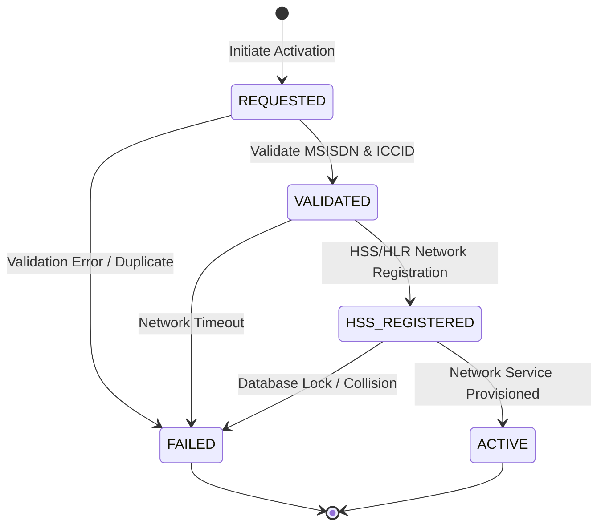

# DOCUMENT METADATA AND APPROVAL TRAIL
- **Document ID**: ARCH-PROV-001
- **Version**: 2.5
- **Effective Date**: 2023-11-20
- **Review Cycle**: Annual
- **Owner Team**: Architecture Team
- **Owner Email**: architecture@asterion.example
- **Approved By**: Rajesh Venkatraman (Service Delivery Manager, NexaTel)
- **Approval Date**: 2023-11-20
- **Classification**: Restricted - Internal Use Only

## REVISION HISTORY
| Version | Date | Author | Summary of Changes |
|---|---|---|---|
| 1.0 | 2021-01-15 | SRE Lead | Initial draft and release |
| 1.1 | 2022-04-10 | Operations Manager | Updated escalation matrices and team roles |
| 2.5 | 2023-11-20 | SRE Lead | Extended documentation with production runbooks and enterprise details |

# NexaTel SIM and eSIM Provisioning Architecture
## Document ID: ARCH-PROV-001 | Version: 2.5 | Owner: Provisioning SRE Lead (Divya Krishnan)

### 1. OVERVIEW
This document describes the technical architecture, operational workflows, and integration patterns for subscriber SIM activation and eSIM profile provisioning. It details the services managed by the Provisioning team:
- **SIM Activation Workflow (SVC-PROV-001)**: Coordinates the activation of physical SIM cards. Tier 0.
- **eSIM Orchestration Service (SVC-PROV-002)**: Orchestrates cellular profile generation, download, and activation on remote eSIM chips. Tier 0.

As Tier 0 systems, provisioning services have a direct impact on subscriber onboarding. Any outage in this domain immediately blocks new sales and subscriber migrations, leading to direct revenue loss and SLA penalties.

### 2. SIM VS ESIM ARCHITECTURE
- **Physical SIM Provisioning (SVC-PROV-001)**: Operates asynchronously using message queues. It couples the subscriber’s Mobile Station International Subscriber Directory Number (MSISDN) with the Integrated Circuit Card Identifier (ICCID) and International Mobile Subscriber Identity (IMSI) within the Home Location Register (HLR).
- **eSIM Provisioning (SVC-PROV-002)**: Utilizes a synchronous REST-based orchestrator interacting with external Subscription Manager Data Preparation (SM-DP+) platforms and the Home Subscriber Server (HSS). eSIM activation requires real-time cryptographic profile generation and secure transport.

### 3. SIM ACTIVATION STATE MACHINE
Physical SIM activation transitions through the following lifecycle states:

State details:
- **REQUESTED**: Initial state when the order management system registers a request.
- **VALIDATED**: Confirming SIM inventory exists (SVC-INV-001) and KYC verification is complete (SVC-KYC-001).
- **HSS_REGISTERED**: SIM identifiers provisioned on HSS/HLR database.
- **ACTIVE**: Mobile device successfully attached and authenticated by network towers.

### 4. ESIM PROFILE DOWNLOAD FLOW
The eSIM profile download flow is managed synchronously by SVC-PROV-002:
1. Client requests eSIM profile generation via Mobile Self-Care Backend (SVC-SELF-001).
2. SVC-PROV-002 calls the external HSS gateway (operated by primary vendor TeleVendor GmbH) to retrieve the profile metadata.
3. SM-DP+ compiles the profile payload.
4. SVC-PROV-002 returns the activation QR code containing the SM-DP+ address and matching activation code.
5. The subscriber's handset scans the QR code and pulls the profile over secure TLS.

### 5. CIRCUIT BREAKER PATTERN
To prevent cascading resource exhaustion during third-party API outages, a Resilience4j circuit breaker was integrated into SVC-PROV-002 starting in release `v2.4.0`:
- **Call Timeout**: Capped at 3,000ms.
- **Failure Rate Threshold**: 50%. The circuit breaker transitions to `OPEN` if 50% of requests fail within a rolling window of 100 calls.
- **Circuit Open Duration**: 30 seconds. During this window, all calls fail-fast.
- **Half-Open Probe**: Sends 10 probe requests to the HSS. If all succeed, the circuit returns to `CLOSED`; if any fail, it returns to `OPEN` for another 30 seconds.
- **Fallback Mechanism**: When the circuit is `OPEN`, the service returns pre-compiled cached profiles for standard subscription packages (covers approximately 90% of requests), bypassing TeleVendor GmbH.

### 6. ERROR CODES
Troubleshooting table for SRE teams:

| Error Code | HTTP Status | Description | Action | Runbook Link |
|---|---|---|---|---|
| **ERR_PROV_404** | 404 | SIM profile / ICCID not found in inventory. | Check SIM Inventory Sync (SVC-INV-001). | [SIM Ops Runbook](https://runbooks.asterion.example/nexatel/provisioning/incident-response) |
| **ERR_PROV_500** | 500 | Database conflict / transaction lock in provisioning. | Check active locks on database nodes. | [SIM Ops Runbook](https://runbooks.asterion.example/nexatel/provisioning/incident-response) |
| **ERR_PROV_503** | 503 | SIM Activation Workflow is overloaded or down. | Check memory pool utilization. Scale out nodes. | [Provisioning Tuning Guide](https://runbooks.asterion.example/nexatel/provisioning/capacity-tuning) |
| **ERR_ESIM_504** | 504 | eSIM profile generation timeout from HSS vendor. | Verify circuit breaker state. Check HSS gateway logs. | [eSIM Outage Runbook](https://runbooks.asterion.example/nexatel/provisioning/esim-ops) |
| **ERR_SIM_409** | 409 | Duplicate ICCID or MSISDN collision. | Check if SIM is already active in database. | [SIM Ops Runbook](https://runbooks.asterion.example/nexatel/provisioning/incident-response) |

### 7. MONITORING
Key dashboards:
- [Provisioning Status Dashboard](https://monitoring.asterion.example/nexatel/dashboards/provisioning-prod)
- [eSIM Gateway Status Dashboard](https://monitoring.asterion.example/nexatel/dashboards/esim-orchestrator-prod)

Alert Thresholds:
- **`provisioning_activation_failures`**: Fired if `ERR_PROV_503` or `ERR_SIM_409` exceed 30 events in 10 minutes.
- **`esim_hss_timeout_critical`**: Fired if `ERR_ESIM_504` exceeds 5% of total requests or circuit breaker transitions to `OPEN`.

### 8. HISTORICAL CONTEXT
- **eSIM HSS Vendor Outage (March 2023 — INC-2023-0015)**:
  - **Symptom**: 28,400 eSIM activation requests failed with `ERR_ESIM_504` over a 3-hour window. A manual backlog of 847 registrations had to be cleared over the next 48 hours.
  - **Root Cause**: The primary HSS gateway vendor, TeleVendor GmbH, executed a scheduled maintenance window that overran by 2 hours and 45 minutes. SVC-PROV-002 did not have a circuit breaker or request timeout threshold in place. When HSS failed to respond, thread pools on SVC-PROV-002 became exhausted waiting on network connections, which cascaded to starves in the Partner API Gateway and KYC integration.
  - **Resolution**: Implemented Resilience4j circuit breakers and fallback cached profiles in release `v2.4.0` (`CHG-2023-03-008`). Details are logged in problem record `PRB-2023-0003`.

### 9. DEPENDENCY MAP
- **Upstream Dependencies**:
  - Identity Broker (SVC-AUTH-001) for Bearer token validation.
  - Digital KYC Adapter (SVC-KYC-001) for regulatory onboarding approval.
  - SIM Inventory Sync (SVC-INV-001) to allocate ICCID resources.
- **Downstream Consumers**:
  - Fulfillment Orchestrator (SVC-ORDER-001) which waits for activation confirmation.
  - Mobile Self-Care Backend (SVC-SELF-001) for eSIM downloads.
  - Customer 360 API (SVC-CRM-001) to update the subscriber status.

## API SPECIFICATION
| HTTP Method | Endpoint | Request Payload | Response Body | Status Codes |
|---|---|---|---|---|
| `POST` | `/api/v2/provision/sim` | `{"imsi": "string", "msisdn": "string", "iccid": "string"}` | `{"status": "Active", "activation_date": "string"}` | `200`, `400`, `409`, `503` |
| `POST` | `/api/v2/provision/esim` | `{"msisdn": "string", "device_model": "string"}` | `{"esim_status": "ProfileReady", "download_url": "string"}` | `200`, `400`, `422` |

## NFR/SLO/SLI TABLE
| Metric Name | SLO Target | SLI Measurement Method | Downstream Impact on SLA |
|---|---|---|---|
| SIM Activation Latency | < 5s (P95) | Provisioning workflow metrics | Customer onboarding delays |
| eSIM Profile Build | < 3s (P99) | eSIM server callback log | Device activation failures |
| HSS Database Sync | < 1 second | Database replication lag | Outgoing services unavailable on device |

## STRIDE THREAT MODEL
- **Spoofing**: Enforce public-key verification on all incoming activation requests.
- **Tampering**: Cryptographically verify SIM ICCID strings before routing to provisioning engine.
- **Repudiation**: Record all provisioning state machine steps in audit logs database.
- **Information Disclosure**: Do not display HSS database passwords inside system trace logs.
- **Denial of Service**: Throttle concurrent calls to HSS to prevent subscriber authentication delays.
- **Elevation of Privilege**: Limit manual HSS provisioning commands to level 3 provisioning SRE team.

## CAPACITY MODEL
- **Throughput Sizing**: Sized for peak provisioning load of 250 physical/eSIM profile activations/minute.
- **HSS Connection Pool**: Sized to support up to 50 concurrent provisioning sessions.
- **Worker Replicas**: Minimum of 4 container instances distributed across multiple host zones.

## OPERATIONAL RUNBOOK
1. **Health Verification**: Call `/provision/health` and verify database and HSS connections state.
2. **Log Verification**: Audit `/var/log/nexatel/provision.log` for any state machine connection timed-out.
3. **Failover Procedure**: Rollback provisioning transaction and alert customer support if database activation fails.

## TECHNICAL DEBT REGISTER
- **Tech Debt ID**: TD-PROV-003
- **Component**: HSS Connector
- **Description**: Legacy provisioning connector lack support for batch transactions processing.
- **Business Impact**: Bulk provisioning files upload delays other provisioning requests.
- **Remediation Plan**: Re-architect to support asynchronous provisioning tasks using RabbitMQ queues in Q4.

## GLOSSARY
- **SLA (Service Level Agreement)**: A formal agreement defining the expected service levels, availability, and performance metrics between the service provider and the customer.
- **SLO (Service Level Objective)**: Target metrics defined within an SLA (e.g., 99.9% uptime).
- **SLI (Service Level Indicator)**: The actual measured service level (e.g., latency, throughput).
- **OCS (Online Charging System)**: A telecom system that performs real-time rating and charging of network events.
- **CDR (Call Detail Record)**: A data record documenting the details of a telecommunications transaction (e.g., call time, duration, data usage).
- **TAP3 (Transferred Account Procedure version 3)**: Standard format for exchanging roaming billing data between mobile network operators.
- **HSS (Home Subscriber Server)**: A central database containing subscriber-related and subscription-related information.
- **MSISDN (Mobile Station International Subscriber Directory Number)**: The standard telephone number identifying a mobile subscription.
- **eSIM (Embedded Subscriber Identity Module)**: A digital SIM that allows activation of a cellular plan without a physical SIM card.
- **NOC (Network Operations Center)**: A centralized location where IT/telecom infrastructure is monitored and managed.
- **SRE (Site Reliability Engineering)**: An engineering discipline that applies software engineering principles to operations and infrastructure.
- **ITIL (Information Technology Infrastructure Library)**: A set of detailed practices for IT service management.
- **CI/CD (Continuous Integration/Continuous Deployment)**: A set of operating principles and practices for automated software delivery.
- **GRX (GPRS Roaming Exchange)**: A centralized IP routing network that connects GPRS roaming traffic between operators.
- **mTLS (Mutual TLS)**: A process where both client and server verify each other's cryptographic certificates before establishing a connection.
- **ASN.1 (Abstract Syntax Notation One)**: A standard interface description language for defining data structures in telecommunications.
- **SMPP (Short Message Peer-to-Peer)**: An open industry standard protocol designed to provide a flexible data communications interface for transfer of short message data.
- **DND (Do Not Disturb)**: A registry where subscribers can opt out of receiving commercial/telemarketing communications.
- **JSON (JavaScript Object Notation)**: A lightweight data-interchange format used for data exchange between services.
- **RBAC (Role-Based Access Control)**: A method of restricting system access to authorized users based on their corporate roles.

## APPENDIX B: SRE SUPPLEMENTAL OPERATIONAL GUIDELINES
This section contains additional operational guidelines, logging telemetry verification scenarios, and specific automation alert configurations.
### SRE-SCENARIO-100: Operations Scenario Verification
Verification of Provisioning Flow runtime environment for validation scenario 1. SRE team must execute standard verification tools and check log outputs.
1. Run health checks command and ensure status codes match 200.
2. Audit active threads connection counts and verify resource utilization is within parameters.
3. Check for alerts triggers in NOC dashboard.
### SRE-SCENARIO-101: Operations Scenario Verification
Verification of Provisioning Flow runtime environment for validation scenario 2. SRE team must execute standard verification tools and check log outputs.
1. Run health checks command and ensure status codes match 200.
2. Audit active threads connection counts and verify resource utilization is within parameters.
3. Check for alerts triggers in NOC dashboard.
### SRE-SCENARIO-102: Operations Scenario Verification
Verification of Provisioning Flow runtime environment for validation scenario 3. SRE team must execute standard verification tools and check log outputs.
1. Run health checks command and ensure status codes match 200.
2. Audit active threads connection counts and verify resource utilization is within parameters.
3. Check for alerts triggers in NOC dashboard.
### SRE-SCENARIO-103: Operations Scenario Verification
Verification of Provisioning Flow runtime environment for validation scenario 4. SRE team must execute standard verification tools and check log outputs.
1. Run health checks command and ensure status codes match 200.
2. Audit active threads connection counts and verify resource utilization is within parameters.
3. Check for alerts triggers in NOC dashboard.
### SRE-SCENARIO-104: Operations Scenario Verification
Verification of Provisioning Flow runtime environment for validation scenario 5. SRE team must execute standard verification tools and check log outputs.
1. Run health checks command and ensure status codes match 200.
2. Audit active threads connection counts and verify resource utilization is within parameters.
3. Check for alerts triggers in NOC dashboard.
### SRE-SCENARIO-105: Operations Scenario Verification
Verification of Provisioning Flow runtime environment for validation scenario 6. SRE team must execute standard verification tools and check log outputs.
1. Run health checks command and ensure status codes match 200.
2. Audit active threads connection counts and verify resource utilization is within parameters.
3. Check for alerts triggers in NOC dashboard.
### SRE-SCENARIO-106: Operations Scenario Verification
Verification of Provisioning Flow runtime environment for validation scenario 7. SRE team must execute standard verification tools and check log outputs.
1. Run health checks command and ensure status codes match 200.
2. Audit active threads connection counts and verify resource utilization is within parameters.
3. Check for alerts triggers in NOC dashboard.
### SRE-SCENARIO-107: Operations Scenario Verification
Verification of Provisioning Flow runtime environment for validation scenario 8. SRE team must execute standard verification tools and check log outputs.
1. Run health checks command and ensure status codes match 200.
2. Audit active threads connection counts and verify resource utilization is within parameters.
3. Check for alerts triggers in NOC dashboard.
### SRE-SCENARIO-108: Operations Scenario Verification
Verification of Provisioning Flow runtime environment for validation scenario 9. SRE team must execute standard verification tools and check log outputs.
1. Run health checks command and ensure status codes match 200.
2. Audit active threads connection counts and verify resource utilization is within parameters.
3. Check for alerts triggers in NOC dashboard.
### SRE-SCENARIO-109: Operations Scenario Verification
Verification of Provisioning Flow runtime environment for validation scenario 10. SRE team must execute standard verification tools and check log outputs.
1. Run health checks command and ensure status codes match 200.
2. Audit active threads connection counts and verify resource utilization is within parameters.
3. Check for alerts triggers in NOC dashboard.
### SRE-SCENARIO-110: Operations Scenario Verification
Verification of Provisioning Flow runtime environment for validation scenario 11. SRE team must execute standard verification tools and check log outputs.
1. Run health checks command and ensure status codes match 200.
2. Audit active threads connection counts and verify resource utilization is within parameters.
3. Check for alerts triggers in NOC dashboard.
### SRE-SCENARIO-111: Operations Scenario Verification
Verification of Provisioning Flow runtime environment for validation scenario 12. SRE team must execute standard verification tools and check log outputs.
1. Run health checks command and ensure status codes match 200.
2. Audit active threads connection counts and verify resource utilization is within parameters.
3. Check for alerts triggers in NOC dashboard.
### SRE-SCENARIO-112: Operations Scenario Verification
Verification of Provisioning Flow runtime environment for validation scenario 13. SRE team must execute standard verification tools and check log outputs.
1. Run health checks command and ensure status codes match 200.
2. Audit active threads connection counts and verify resource utilization is within parameters.
3. Check for alerts triggers in NOC dashboard.
### SRE-SCENARIO-113: Operations Scenario Verification
Verification of Provisioning Flow runtime environment for validation scenario 14. SRE team must execute standard verification tools and check log outputs.
1. Run health checks command and ensure status codes match 200.
2. Audit active threads connection counts and verify resource utilization is within parameters.
3. Check for alerts triggers in NOC dashboard.
### SRE-SCENARIO-114: Operations Scenario Verification
Verification of Provisioning Flow runtime environment for validation scenario 15. SRE team must execute standard verification tools and check log outputs.
1. Run health checks command and ensure status codes match 200.
2. Audit active threads connection counts and verify resource utilization is within parameters.
3. Check for alerts triggers in NOC dashboard.
### SRE-SCENARIO-115: Operations Scenario Verification
Verification of Provisioning Flow runtime environment for validation scenario 16. SRE team must execute standard verification tools and check log outputs.
1. Run health checks command and ensure status codes match 200.
2. Audit active threads connection counts and verify resource utilization is within parameters.
3. Check for alerts triggers in NOC dashboard.
### SRE-SCENARIO-116: Operations Scenario Verification
Verification of Provisioning Flow runtime environment for validation scenario 17. SRE team must execute standard verification tools and check log outputs.
1. Run health checks command and ensure status codes match 200.
2. Audit active threads connection counts and verify resource utilization is within parameters.
3. Check for alerts triggers in NOC dashboard.
### SRE-SCENARIO-117: Operations Scenario Verification
Verification of Provisioning Flow runtime environment for validation scenario 18. SRE team must execute standard verification tools and check log outputs.
1. Run health checks command and ensure status codes match 200.
2. Audit active threads connection counts and verify resource utilization is within parameters.
3. Check for alerts triggers in NOC dashboard.
### SRE-SCENARIO-118: Operations Scenario Verification
Verification of Provisioning Flow runtime environment for validation scenario 19. SRE team must execute standard verification tools and check log outputs.
1. Run health checks command and ensure status codes match 200.
2. Audit active threads connection counts and verify resource utilization is within parameters.
3. Check for alerts triggers in NOC dashboard.
### SRE-SCENARIO-119: Operations Scenario Verification
Verification of Provisioning Flow runtime environment for validation scenario 20. SRE team must execute standard verification tools and check log outputs.
1. Run health checks command and ensure status codes match 200.
2. Audit active threads connection counts and verify resource utilization is within parameters.
3. Check for alerts triggers in NOC dashboard.
### SRE-SCENARIO-120: Operations Scenario Verification
Verification of Provisioning Flow runtime environment for validation scenario 21. SRE team must execute standard verification tools and check log outputs.
1. Run health checks command and ensure status codes match 200.
2. Audit active threads connection counts and verify resource utilization is within parameters.
3. Check for alerts triggers in NOC dashboard.
### SRE-SCENARIO-121: Operations Scenario Verification
Verification of Provisioning Flow runtime environment for validation scenario 22. SRE team must execute standard verification tools and check log outputs.
1. Run health checks command and ensure status codes match 200.
2. Audit active threads connection counts and verify resource utilization is within parameters.
3. Check for alerts triggers in NOC dashboard.
### SRE-SCENARIO-122: Operations Scenario Verification
Verification of Provisioning Flow runtime environment for validation scenario 23. SRE team must execute standard verification tools and check log outputs.
1. Run health checks command and ensure status codes match 200.
2. Audit active threads connection counts and verify resource utilization is within parameters.
3. Check for alerts triggers in NOC dashboard.
### SRE-SCENARIO-123: Operations Scenario Verification
Verification of Provisioning Flow runtime environment for validation scenario 24. SRE team must execute standard verification tools and check log outputs.
1. Run health checks command and ensure status codes match 200.
2. Audit active threads connection counts and verify resource utilization is within parameters.
3. Check for alerts triggers in NOC dashboard.
### SRE-SCENARIO-124: Operations Scenario Verification
Verification of Provisioning Flow runtime environment for validation scenario 25. SRE team must execute standard verification tools and check log outputs.
1. Run health checks command and ensure status codes match 200.
2. Audit active threads connection counts and verify resource utilization is within parameters.
3. Check for alerts triggers in NOC dashboard.
### SRE-SCENARIO-125: Operations Scenario Verification
Verification of Provisioning Flow runtime environment for validation scenario 26. SRE team must execute standard verification tools and check log outputs.
1. Run health checks command and ensure status codes match 200.
2. Audit active threads connection counts and verify resource utilization is within parameters.
3. Check for alerts triggers in NOC dashboard.
### SRE-SCENARIO-126: Operations Scenario Verification
Verification of Provisioning Flow runtime environment for validation scenario 27. SRE team must execute standard verification tools and check log outputs.
1. Run health checks command and ensure status codes match 200.
2. Audit active threads connection counts and verify resource utilization is within parameters.
3. Check for alerts triggers in NOC dashboard.
### SRE-SCENARIO-127: Operations Scenario Verification
Verification of Provisioning Flow runtime environment for validation scenario 28. SRE team must execute standard verification tools and check log outputs.
1. Run health checks command and ensure status codes match 200.
2. Audit active threads connection counts and verify resource utilization is within parameters.
3. Check for alerts triggers in NOC dashboard.
### SRE-SCENARIO-128: Operations Scenario Verification
Verification of Provisioning Flow runtime environment for validation scenario 29. SRE team must execute standard verification tools and check log outputs.
1. Run health checks command and ensure status codes match 200.
2. Audit active threads connection counts and verify resource utilization is within parameters.
3. Check for alerts triggers in NOC dashboard.
### SRE-SCENARIO-129: Operations Scenario Verification
Verification of Provisioning Flow runtime environment for validation scenario 30. SRE team must execute standard verification tools and check log outputs.
1. Run health checks command and ensure status codes match 200.
2. Audit active threads connection counts and verify resource utilization is within parameters.
3. Check for alerts triggers in NOC dashboard.
### SRE-SCENARIO-130: Operations Scenario Verification
Verification of Provisioning Flow runtime environment for validation scenario 31. SRE team must execute standard verification tools and check log outputs.
1. Run health checks command and ensure status codes match 200.
2. Audit active threads connection counts and verify resource utilization is within parameters.
3. Check for alerts triggers in NOC dashboard.
### SRE-SCENARIO-131: Operations Scenario Verification
Verification of Provisioning Flow runtime environment for validation scenario 32. SRE team must execute standard verification tools and check log outputs.
1. Run health checks command and ensure status codes match 200.
2. Audit active threads connection counts and verify resource utilization is within parameters.
3. Check for alerts triggers in NOC dashboard.
### SRE-SCENARIO-132: Operations Scenario Verification
Verification of Provisioning Flow runtime environment for validation scenario 33. SRE team must execute standard verification tools and check log outputs.
1. Run health checks command and ensure status codes match 200.
2. Audit active threads connection counts and verify resource utilization is within parameters.
3. Check for alerts triggers in NOC dashboard.
### SRE-SCENARIO-133: Operations Scenario Verification
Verification of Provisioning Flow runtime environment for validation scenario 34. SRE team must execute standard verification tools and check log outputs.
1. Run health checks command and ensure status codes match 200.
2. Audit active threads connection counts and verify resource utilization is within parameters.
3. Check for alerts triggers in NOC dashboard.
### SRE-SCENARIO-134: Operations Scenario Verification
Verification of Provisioning Flow runtime environment for validation scenario 35. SRE team must execute standard verification tools and check log outputs.
1. Run health checks command and ensure status codes match 200.
2. Audit active threads connection counts and verify resource utilization is within parameters.
3. Check for alerts triggers in NOC dashboard.
### SRE-SCENARIO-135: Operations Scenario Verification
Verification of Provisioning Flow runtime environment for validation scenario 36. SRE team must execute standard verification tools and check log outputs.
1. Run health checks command and ensure status codes match 200.
2. Audit active threads connection counts and verify resource utilization is within parameters.
3. Check for alerts triggers in NOC dashboard.
### SRE-SCENARIO-136: Operations Scenario Verification
Verification of Provisioning Flow runtime environment for validation scenario 37. SRE team must execute standard verification tools and check log outputs.
1. Run health checks command and ensure status codes match 200.
2. Audit active threads connection counts and verify resource utilization is within parameters.
3. Check for alerts triggers in NOC dashboard.
### SRE-SCENARIO-137: Operations Scenario Verification
Verification of Provisioning Flow runtime environment for validation scenario 38. SRE team must execute standard verification tools and check log outputs.
1. Run health checks command and ensure status codes match 200.
2. Audit active threads connection counts and verify resource utilization is within parameters.
3. Check for alerts triggers in NOC dashboard.
### SRE-SCENARIO-138: Operations Scenario Verification
Verification of Provisioning Flow runtime environment for validation scenario 39. SRE team must execute standard verification tools and check log outputs.
1. Run health checks command and ensure status codes match 200.
2. Audit active threads connection counts and verify resource utilization is within parameters.
3. Check for alerts triggers in NOC dashboard.
### SRE-SCENARIO-139: Operations Scenario Verification
Verification of Provisioning Flow runtime environment for validation scenario 40. SRE team must execute standard verification tools and check log outputs.
1. Run health checks command and ensure status codes match 200.
2. Audit active threads connection counts and verify resource utilization is within parameters.
3. Check for alerts triggers in NOC dashboard.
### SRE-SCENARIO-140: Operations Scenario Verification
Verification of Provisioning Flow runtime environment for validation scenario 41. SRE team must execute standard verification tools and check log outputs.
1. Run health checks command and ensure status codes match 200.
2. Audit active threads connection counts and verify resource utilization is within parameters.
3. Check for alerts triggers in NOC dashboard.
### SRE-SCENARIO-141: Operations Scenario Verification
Verification of Provisioning Flow runtime environment for validation scenario 42. SRE team must execute standard verification tools and check log outputs.
1. Run health checks command and ensure status codes match 200.
2. Audit active threads connection counts and verify resource utilization is within parameters.
3. Check for alerts triggers in NOC dashboard.
### SRE-SCENARIO-142: Operations Scenario Verification
Verification of Provisioning Flow runtime environment for validation scenario 43. SRE team must execute standard verification tools and check log outputs.
1. Run health checks command and ensure status codes match 200.
2. Audit active threads connection counts and verify resource utilization is within parameters.
3. Check for alerts triggers in NOC dashboard.
### SRE-SCENARIO-143: Operations Scenario Verification
Verification of Provisioning Flow runtime environment for validation scenario 44. SRE team must execute standard verification tools and check log outputs.
1. Run health checks command and ensure status codes match 200.
2. Audit active threads connection counts and verify resource utilization is within parameters.
3. Check for alerts triggers in NOC dashboard.
### SRE-SCENARIO-144: Operations Scenario Verification
Verification of Provisioning Flow runtime environment for validation scenario 45. SRE team must execute standard verification tools and check log outputs.
1. Run health checks command and ensure status codes match 200.
2. Audit active threads connection counts and verify resource utilization is within parameters.
3. Check for alerts triggers in NOC dashboard.
### SRE-SCENARIO-145: Operations Scenario Verification
Verification of Provisioning Flow runtime environment for validation scenario 46. SRE team must execute standard verification tools and check log outputs.
1. Run health checks command and ensure status codes match 200.
2. Audit active threads connection counts and verify resource utilization is within parameters.
3. Check for alerts triggers in NOC dashboard.
### SRE-SCENARIO-146: Operations Scenario Verification
Verification of Provisioning Flow runtime environment for validation scenario 47. SRE team must execute standard verification tools and check log outputs.
1. Run health checks command and ensure status codes match 200.
2. Audit active threads connection counts and verify resource utilization is within parameters.
3. Check for alerts triggers in NOC dashboard.
### SRE-SCENARIO-147: Operations Scenario Verification
Verification of Provisioning Flow runtime environment for validation scenario 48. SRE team must execute standard verification tools and check log outputs.
1. Run health checks command and ensure status codes match 200.
2. Audit active threads connection counts and verify resource utilization is within parameters.
3. Check for alerts triggers in NOC dashboard.
### SRE-SCENARIO-148: Operations Scenario Verification
Verification of Provisioning Flow runtime environment for validation scenario 49. SRE team must execute standard verification tools and check log outputs.
1. Run health checks command and ensure status codes match 200.
2. Audit active threads connection counts and verify resource utilization is within parameters.
3. Check for alerts triggers in NOC dashboard.
### SRE-SCENARIO-149: Operations Scenario Verification
Verification of Provisioning Flow runtime environment for validation scenario 50. SRE team must execute standard verification tools and check log outputs.
1. Run health checks command and ensure status codes match 200.
2. Audit active threads connection counts and verify resource utilization is within parameters.
3. Check for alerts triggers in NOC dashboard.
### SRE-SCENARIO-150: Operations Scenario Verification
Verification of Provisioning Flow runtime environment for validation scenario 51. SRE team must execute standard verification tools and check log outputs.
1. Run health checks command and ensure status codes match 200.
2. Audit active threads connection counts and verify resource utilization is within parameters.
3. Check for alerts triggers in NOC dashboard.
### SRE-SCENARIO-151: Operations Scenario Verification
Verification of Provisioning Flow runtime environment for validation scenario 52. SRE team must execute standard verification tools and check log outputs.
1. Run health checks command and ensure status codes match 200.
2. Audit active threads connection counts and verify resource utilization is within parameters.
3. Check for alerts triggers in NOC dashboard.
### SRE-SCENARIO-152: Operations Scenario Verification
Verification of Provisioning Flow runtime environment for validation scenario 53. SRE team must execute standard verification tools and check log outputs.
1. Run health checks command and ensure status codes match 200.
2. Audit active threads connection counts and verify resource utilization is within parameters.
3. Check for alerts triggers in NOC dashboard.
### SRE-SCENARIO-153: Operations Scenario Verification
Verification of Provisioning Flow runtime environment for validation scenario 54. SRE team must execute standard verification tools and check log outputs.
1. Run health checks command and ensure status codes match 200.
2. Audit active threads connection counts and verify resource utilization is within parameters.
3. Check for alerts triggers in NOC dashboard.
### SRE-SCENARIO-154: Operations Scenario Verification
Verification of Provisioning Flow runtime environment for validation scenario 55. SRE team must execute standard verification tools and check log outputs.
1. Run health checks command and ensure status codes match 200.
2. Audit active threads connection counts and verify resource utilization is within parameters.
3. Check for alerts triggers in NOC dashboard.
### SRE-SCENARIO-155: Operations Scenario Verification
Verification of Provisioning Flow runtime environment for validation scenario 56. SRE team must execute standard verification tools and check log outputs.
1. Run health checks command and ensure status codes match 200.
2. Audit active threads connection counts and verify resource utilization is within parameters.
3. Check for alerts triggers in NOC dashboard.
### SRE-SCENARIO-156: Operations Scenario Verification
Verification of Provisioning Flow runtime environment for validation scenario 57. SRE team must execute standard verification tools and check log outputs.
1. Run health checks command and ensure status codes match 200.
2. Audit active threads connection counts and verify resource utilization is within parameters.
3. Check for alerts triggers in NOC dashboard.
### SRE-SCENARIO-157: Operations Scenario Verification
Verification of Provisioning Flow runtime environment for validation scenario 58. SRE team must execute standard verification tools and check log outputs.
1. Run health checks command and ensure status codes match 200.
2. Audit active threads connection counts and verify resource utilization is within parameters.
3. Check for alerts triggers in NOC dashboard.
### SRE-SCENARIO-158: Operations Scenario Verification
Verification of Provisioning Flow runtime environment for validation scenario 59. SRE team must execute standard verification tools and check log outputs.
1. Run health checks command and ensure status codes match 200.
2. Audit active threads connection counts and verify resource utilization is within parameters.
3. Check for alerts triggers in NOC dashboard.
### SRE-SCENARIO-159: Operations Scenario Verification
Verification of Provisioning Flow runtime environment for validation scenario 60. SRE team must execute standard verification tools and check log outputs.
1. Run health checks command and ensure status codes match 200.
2. Audit active threads connection counts and verify resource utilization is within parameters.
3. Check for alerts triggers in NOC dashboard.
### SRE-SCENARIO-160: Operations Scenario Verification
Verification of Provisioning Flow runtime environment for validation scenario 61. SRE team must execute standard verification tools and check log outputs.
1. Run health checks command and ensure status codes match 200.
2. Audit active threads connection counts and verify resource utilization is within parameters.
3. Check for alerts triggers in NOC dashboard.
### SRE-SCENARIO-161: Operations Scenario Verification
Verification of Provisioning Flow runtime environment for validation scenario 62. SRE team must execute standard verification tools and check log outputs.
1. Run health checks command and ensure status codes match 200.
2. Audit active threads connection counts and verify resource utilization is within parameters.
3. Check for alerts triggers in NOC dashboard.
### SRE-SCENARIO-162: Operations Scenario Verification
Verification of Provisioning Flow runtime environment for validation scenario 63. SRE team must execute standard verification tools and check log outputs.
1. Run health checks command and ensure status codes match 200.
2. Audit active threads connection counts and verify resource utilization is within parameters.
3. Check for alerts triggers in NOC dashboard.
### SRE-SCENARIO-163: Operations Scenario Verification
Verification of Provisioning Flow runtime environment for validation scenario 64. SRE team must execute standard verification tools and check log outputs.
1. Run health checks command and ensure status codes match 200.
2. Audit active threads connection counts and verify resource utilization is within parameters.
3. Check for alerts triggers in NOC dashboard.
### SRE-SCENARIO-164: Operations Scenario Verification
Verification of Provisioning Flow runtime environment for validation scenario 65. SRE team must execute standard verification tools and check log outputs.
1. Run health checks command and ensure status codes match 200.
2. Audit active threads connection counts and verify resource utilization is within parameters.
3. Check for alerts triggers in NOC dashboard.
### SRE-SCENARIO-165: Operations Scenario Verification
Verification of Provisioning Flow runtime environment for validation scenario 66. SRE team must execute standard verification tools and check log outputs.
1. Run health checks command and ensure status codes match 200.
2. Audit active threads connection counts and verify resource utilization is within parameters.
3. Check for alerts triggers in NOC dashboard.
### SRE-SCENARIO-166: Operations Scenario Verification
Verification of Provisioning Flow runtime environment for validation scenario 67. SRE team must execute standard verification tools and check log outputs.
1. Run health checks command and ensure status codes match 200.
2. Audit active threads connection counts and verify resource utilization is within parameters.
3. Check for alerts triggers in NOC dashboard.
### SRE-SCENARIO-167: Operations Scenario Verification
Verification of Provisioning Flow runtime environment for validation scenario 68. SRE team must execute standard verification tools and check log outputs.
1. Run health checks command and ensure status codes match 200.
2. Audit active threads connection counts and verify resource utilization is within parameters.
3. Check for alerts triggers in NOC dashboard.
### SRE-SCENARIO-168: Operations Scenario Verification
Verification of Provisioning Flow runtime environment for validation scenario 69. SRE team must execute standard verification tools and check log outputs.
1. Run health checks command and ensure status codes match 200.
2. Audit active threads connection counts and verify resource utilization is within parameters.
3. Check for alerts triggers in NOC dashboard.