# DOCUMENT METADATA AND APPROVAL TRAIL
- **Document ID**: ARCH-INT-001
- **Version**: 3.0
- **Effective Date**: 2023-11-20
- **Review Cycle**: Annual
- **Owner Team**: Architecture Team
- **Owner Email**: architecture@asterion.example
- **Approved By**: Rajesh Venkatraman (Service Delivery Manager, NexaTel)
- **Approval Date**: 2023-11-20
- **Classification**: Restricted - Internal Use Only

## REVISION HISTORY
| Version | Date | Author | Summary of Changes |
|---|---|---|---|
| 1.0 | 2021-01-15 | SRE Lead | Initial draft and release |
| 1.1 | 2022-04-10 | Operations Manager | Updated escalation matrices and team roles |
| 3.0 | 2023-11-20 | SRE Lead | Extended documentation with production runbooks and enterprise details |

# NexaTel System Integration and Operations Guide
## Document ID: ARCH-INT-001 | Version: 3.0 | Owner: Major Incident Manager (Arjun Mehta)

### 1. OVERVIEW
This document serves as the master integration reference for the 21 active services operating under the NexaTel Managed Services Agreement. It outlines system dependencies, authentication methods, SLA thresholds, API versions, and on-call runbooks.

### 2. SERVICE DEPENDENCY GRAPH
The NexaTel service mesh relies on central authentication and correlation systems. All Tier 0 services depend on SVC-AUTH-001 (Identity Broker) for token validation.

```mermaid
graph TD
    %% Tier 0 Core Dependencies
    SVC-AUTH-001[Identity Broker] --> SVC-AUTH-002[OTP Orchestrator]
    
    %% Tier 0 Dependencies on Auth
    SVC-AUTH-001 --> SVC-CHARG-001[Online Charging]
    SVC-AUTH-001 --> SVC-PROV-001[SIM Activation]
    SVC-AUTH-001 --> SVC-PROV-002[eSIM Orchestration]
    SVC-AUTH-001 --> SVC-APIGW-001[Partner API Gateway]
    SVC-AUTH-001 --> SVC-FRAUD-001[Fraud Engine]
    SVC-AUTH-001 --> SVC-ORDER-001[Fulfillment Orchestrator]
    SVC-AUTH-001 --> SVC-NOC-001[Alarm correlation]
    SVC-AUTH-001 --> SVC-NOC-002[Incident Bridge]
    
    %% Tier 1 Downstreams
    SVC-MED-001[Mediation Pipeline] --> SVC-BILL-001[Invoice Engine]
    SVC-BILL-001 --> SVC-BILL-002[Payment Adapter]
    SVC-AUTH-001 --> SVC-CRM-001[Customer 360]
    SVC-AUTH-001 --> SVC-SELF-001[Self-Care Backend]
    SVC-MED-001 --> SVC-ROAM-001[Roaming Validator]
    SVC-AUTH-001 --> SVC-KYC-001[KYC Adapter]
    SVC-AUTH-002 --> SVC-NOTIF-001[SMS Hub]
    SVC-MED-001 --> SVC-MED-002[Daily CDR Export]
    
    %% Tier 2 Downstreams
    SVC-PROV-001 --> SVC-INV-001[SIM Inventory]
    SVC-BILL-001 --> SVC-PART-001[Partner Settlement]
```

### 3. ALL 21 SERVICES INTEGRATION SUMMARY

#### 1. Identity Broker (SVC-AUTH-001)
- **Tier**: tier_0 | **Base URL**: `https://identity.asterion.example/nexatel/api/v2/auth`
- **Auth**: None (Public) | **Owner**: Suresh Iyer
- **Endpoints**: `POST /token` (issue), `POST /token/validate` (validate)
- **Dependencies**: Redis session cluster | **SLA**: 99.99% (latency < 200ms)
- **Errors**: ERR_AUTH_401, ERR_AUTH_403, ERR_AUTH_500, ERR_AUTH_503
- **Links**: [Dashboard](https://monitoring.asterion.example/nexatel/dashboards/identity-broker-prod) | [Runbook](https://runbooks.asterion.example/nexatel/auth/incident-response)

#### 2. OTP Delivery Orchestrator (SVC-AUTH-002)
- **Tier**: tier_0 | **Base URL**: `https://otp.asterion.example/nexatel/api/v2/otp`
- **Auth**: Bearer JWT (SVC-AUTH-001) | **Owner**: Suresh Iyer
- **Endpoints**: `POST /generate`, `POST /verify`
- **Dependencies**: SVC-NOTIF-001 | **SLA**: 99.95% (delivery < 5s)
- **Errors**: ERR_OTP_408, ERR_OTP_429
- **Links**: [Dashboard](https://monitoring.asterion.example/nexatel/dashboards/otp-orchestrator-prod) | [Runbook](https://runbooks.asterion.example/nexatel/auth/otp-fallback)

#### 3. Online Charging Gateway (SVC-CHARG-001)
- **Tier**: tier_0 | **Base URL**: `https://charging.asterion.example/nexatel/api/v1/quota`
- **Auth**: Bearer JWT (SVC-AUTH-001) | **Owner**: Meera Pillai
- **Endpoints**: `POST /reserve`, `POST /commit`
- **Dependencies**: OCS, DIAMETER Ro interface | **SLA**: 99.99% (latency < 50ms)
- **Errors**: ERR_CHARG_429, ERR_CHARG_503, ERR_QUOTA_429
- **Links**: [Dashboard](https://monitoring.asterion.example/nexatel/dashboards/charging-prod) | [Runbook](https://runbooks.asterion.example/nexatel/charging/incident-response)

#### 4. SIM Activation Workflow (SVC-PROV-001)
- **Tier**: tier_0 | **Base URL**: `https://provisioning.asterion.example/nexatel/api/v1/sim`
- **Auth**: Bearer JWT (SVC-AUTH-001) | **Owner**: Divya Krishnan
- **Endpoints**: `POST /activate`, `GET /status/{iccid}`
- **Dependencies**: HSS, HLR, database | **SLA**: 99.9% (activation < 10s)
- **Errors**: ERR_PROV_404, ERR_PROV_500, ERR_PROV_503, ERR_SIM_409
- **Links**: [Dashboard](https://monitoring.asterion.example/nexatel/dashboards/provisioning-prod) | [Runbook](https://runbooks.asterion.example/nexatel/provisioning/incident-response)

#### 5. eSIM Orchestration Service (SVC-PROV-002)
- **Tier**: tier_0 | **Base URL**: `https://esim.asterion.example/nexatel/api/v2/esim`
- **Auth**: Bearer JWT (SVC-AUTH-001) | **Owner**: Divya Krishnan
- **Endpoints**: `POST /profile/generate`, `GET /profile/{id}`
- **Dependencies**: TeleVendor GmbH HSS gateway | **SLA**: 99.9% (latency < 3s)
- **Errors**: ERR_ESIM_504
- **Links**: [Dashboard](https://monitoring.asterion.example/nexatel/dashboards/esim-orchestrator-prod) | [Runbook](https://runbooks.asterion.example/nexatel/provisioning/esim-ops)

#### 6. QoS Alarm Correlation Engine (SVC-NOC-001)
- **Tier**: tier_0 | **Base URL**: `https://noc.asterion.example/nexatel/api/v1/alarms`
- **Auth**: Bearer JWT (SVC-AUTH-001) | **Owner**: Deepak Nair
- **Endpoints**: `POST /ingest`, `POST /correlate`
- **Dependencies**: Prometheus, Grafana | **SLA**: 99.95% (correlation < 15s)
- **Errors**: ERR_NOC_500
- **Links**: [Dashboard](https://monitoring.asterion.example/nexatel/dashboards/qos-alarm-prod) | [Runbook](https://runbooks.asterion.example/nexatel/noc/incident-response)

#### 7. Major Incident Bridge (SVC-NOC-002)
- **Tier**: tier_0 | **Base URL**: `https://noc-bridge.asterion.example/nexatel/api/v1/bridge`
- **Auth**: Bearer JWT (SVC-AUTH-001) | **Owner**: Deepak Nair
- **Endpoints**: `POST /create`, `POST /notify`
- **Dependencies**: SVC-NOC-001 | **SLA**: 100% (bridge open < 2min)
- **Links**: [Dashboard](https://monitoring.asterion.example/nexatel/dashboards/incident-bridge-prod) | [Runbook](https://runbooks.asterion.example/nexatel/noc/bridge-ops)

#### 8. Partner API Gateway (SVC-APIGW-001)
- **Tier**: tier_0 | **Base URL**: `https://api-gateway.asterion.example/nexatel/api/v2`
- **Auth**: mTLS + API Key | **Owner**: Sanjay Bose
- **Endpoints**: `POST /request/route`, `GET /health`
- **Dependencies**: SVC-AUTH-001 | **SLA**: 99.99% (latency < 10ms)
- **Errors**: ERR_GW_429, ERR_GW_502, ERR_GW_503
- **Links**: [Dashboard](https://monitoring.asterion.example/nexatel/dashboards/api-gateway-prod) | [Runbook](https://runbooks.asterion.example/nexatel/api/incident-response)

#### 9. Fraud Velocity Rule Engine (SVC-FRAUD-001)
- **Tier**: tier_0 | **Base URL**: `https://fraud.asterion.example/nexatel/api/v1/rules`
- **Auth**: Bearer JWT (SVC-AUTH-001) | **Owner**: Ravi Chandrasekaran
- **Endpoints**: `POST /evaluate`, `POST /blacklist/add`
- **Dependencies**: Kafka event stream | **SLA**: 99.99% (latency < 12ms)
- **Errors**: ERR_FRAUD_503, ERR_RULE_500
- **Links**: [Dashboard](https://monitoring.asterion.example/nexatel/dashboards/fraud-engine-prod) | [Runbook](https://runbooks.asterion.example/nexatel/fraud/incident-response)

#### 10. Fulfillment Orchestrator (SVC-ORDER-001)
- **Tier**: tier_0 | **Base URL**: `https://order.asterion.example/nexatel/api/v1/order`
- **Auth**: Bearer JWT (SVC-AUTH-001) | **Owner**: Vikram Srinivas
- **Endpoints**: `POST /order/submit`, `GET /order/{id}/status`
- **Dependencies**: SVC-PROV-001 | **SLA**: 99.9% (latency < 100ms)
- **Errors**: ERR_ORDER_503
- **Links**: [Dashboard](https://monitoring.asterion.example/nexatel/dashboards/order-orchestrator-prod) | [Runbook](https://runbooks.asterion.example/nexatel/order/incident-response)

#### 11. Invoice Rendering Engine (SVC-BILL-001)
- **Tier**: tier_1 | **Base URL**: `https://billing.asterion.example/nexatel/api/v1/invoice`
- **Auth**: Bearer JWT (SVC-AUTH-001) | **Owner**: Anil Sharma
- **Endpoints**: `POST /render`, `GET /invoice/{id}`
- **Dependencies**: SVC-MED-001, SVC-CRM-001 | **SLA**: 99.9% (render < 2s)
- **Errors**: ERR_BILL_422, ERR_BILL_500, ERR_INV_500
- **Links**: [Dashboard](https://monitoring.asterion.example/nexatel/dashboards/billing-engine-prod) | [Runbook](https://runbooks.asterion.example/nexatel/billing/incident-response)

#### 12. Payment Posting Adapter (SVC-BILL-002)
- **Tier**: tier_1 | **Base URL**: `https://payments.asterion.example/nexatel/api/v1/posting`
- **Auth**: Bearer JWT (SVC-AUTH-001) | **Owner**: Anil Sharma
- **Endpoints**: `POST /payment/post`, `GET /balance/{msisdn}`
- **Dependencies**: SVC-BILL-001 | **SLA**: 99.95% (latency < 200ms)
- **Errors**: ERR_PAY_402
- **Links**: [Dashboard](https://monitoring.asterion.example/nexatel/dashboards/payment-posting-prod) | [Runbook](https://runbooks.asterion.example/nexatel/billing/payment-ops)

#### 13. CDR Mediation Pipeline (SVC-MED-001)
- **Tier**: tier_1 | **Base URL**: `https://mediation.asterion.example/nexatel/api/v1/mediation`
- **Auth**: Bearer JWT (SVC-AUTH-001) | **Owner**: Ananya Rao
- **Endpoints**: `POST /cdr/process`, `GET /queue/status`
- **Dependencies**: Network elements | **SLA**: 99.9% (latency < 500ms)
- **Errors**: ERR_CDR_422, ERR_CDR_500
- **Links**: [Dashboard](https://monitoring.asterion.example/nexatel/dashboards/cdr-mediation-prod) | [Runbook](https://runbooks.asterion.example/nexatel/mediation/incident-response)

#### 14. Customer 360 API (SVC-CRM-001)
- **Tier**: tier_1 | **Base URL**: `https://crm.asterion.example/nexatel/api/v1/customer`
- **Auth**: Bearer JWT (SVC-AUTH-001) | **Owner**: Harish Patel
- **Endpoints**: `GET /profile/{msisdn}`, `POST /profile/update`
- **Dependencies**: CRM Database | **SLA**: 99.95% (latency < 100ms)
- **Errors**: ERR_CRM_503
- **Links**: [Dashboard](https://monitoring.asterion.example/nexatel/dashboards/customer-crm-prod) | [Runbook](https://runbooks.asterion.example/nexatel/crm/incident-response)

#### 15. Mobile Self-Care Backend (SVC-SELF-001)
- **Tier**: tier_1 | **Base URL**: `https://selfcare.asterion.example/nexatel/api/v2/portal`
- **Auth**: Bearer JWT (SVC-AUTH-001) | **Owner**: Pooja Reddy
- **Endpoints**: `GET /dashboard`, `POST /profile/sync`
- **Dependencies**: SVC-AUTH-001, SVC-CRM-001 | **SLA**: 99.9% (latency < 150ms)
- **Errors**: ERR_CORE_500
- **Links**: [Dashboard](https://monitoring.asterion.example/nexatel/dashboards/self-care-portal-prod) | [Runbook](https://runbooks.asterion.example/nexatel/selfcare/incident-response)

#### 16. Roaming TAP Validator (SVC-ROAM-001)
- **Tier**: tier_1 | **Base URL**: `https://roaming.asterion.example/nexatel/api/v1/tap`
- **Auth**: Bearer JWT (SVC-AUTH-001) | **Owner**: Kavya Menon
- **Endpoints**: `POST /tap/validate`, `GET /tap/disputes`
- **Dependencies**: GRX servers | **SLA**: 99.5% (latency < 1s)
- **Errors**: ERR_ROAM_503, ERR_TAP_422
- **Links**: [Dashboard](https://monitoring.asterion.example/nexatel/dashboards/roaming-tap-prod) | [Runbook](https://runbooks.asterion.example/nexatel/roaming/incident-response)

#### 17. Digital KYC Adapter (SVC-KYC-001)
- **Tier**: tier_1 | **Base URL**: `https://kyc.asterion.example/nexatel/api/v1/kyc`
- **Auth**: Bearer JWT (SVC-AUTH-001) | **Owner**: Kiran Kumar
- **Endpoints**: `POST /verify/document`, `GET /verify/status/{id}`
- **Dependencies**: VerifyNow, TrustID | **SLA**: 99.9% (latency < 5s)
- **Errors**: ERR_KYC_503, ERR_KYC_422
- **Links**: [Dashboard](https://monitoring.asterion.example/nexatel/dashboards/kyc-adapter-prod) | [Runbook](https://runbooks.asterion.example/nexatel/kyc/incident-response)

#### 18. SMS Notification Hub (SVC-NOTIF-001)
- **Tier**: tier_1 | **Base URL**: `https://sms.asterion.example/nexatel/api/v1/send`
- **Auth**: Bearer JWT (SVC-AUTH-001) | **Owner**: Smita Joshi
- **Endpoints**: `POST /sms/dispatch`, `GET /sms/receipt`
- **Dependencies**: SMPP SMSC Link | **SLA**: 99.9% (latency < 2s)
- **Errors**: ERR_NOTIF_500
- **Links**: [Dashboard](https://monitoring.asterion.example/nexatel/dashboards/sms-notif-prod) | [Runbook](https://runbooks.asterion.example/nexatel/notification/incident-response)

#### 19. Daily CDR Export (SVC-MED-002)
- **Tier**: tier_1 | **Base URL**: Scheduled Cron Job (02:00 UTC)
- **Auth**: None (Internal Cron) | **Owner**: Ananya Rao
- **Endpoints**: None (Batch ETL execution)
- **Dependencies**: SVC-MED-001, Data Lake | **SLA**: 100% (complete by 04:00 UTC)
- **Errors**: ERR_EXPORT_504
- **Links**: [Dashboard](https://monitoring.asterion.example/nexatel/dashboards/data-lake-prod) | [Runbook](https://runbooks.asterion.example/nexatel/mediation/export-ops)

#### 20. SIM Inventory Sync (SVC-INV-001)
- **Tier**: tier_2 | **Base URL**: `https://inventory.asterion.example/nexatel/api/v1/sim`
- **Auth**: Bearer JWT (SVC-AUTH-001) | **Owner**: Rahul Gupta
- **Endpoints**: `POST /reserve`, `POST /release`
- **Dependencies**: Inventory Database | **SLA**: 99.0% (latency < 300ms)
- **Errors**: ERR_CORE_500
- **Links**: [Dashboard](https://monitoring.asterion.example/nexatel/dashboards/sim-inventory-prod) | [Runbook](https://runbooks.asterion.example/nexatel/inventory/incident-response)

#### 21. Partner Settlement Reconciliation (SVC-PART-001)
- **Tier**: tier_2 | **Base URL**: `https://settlement.asterion.example/nexatel/api/v1/settle`
- **Auth**: Bearer JWT (SVC-AUTH-001) | **Owner**: Nalini Iyer
- **Endpoints**: `POST /reconcile`, `GET /dispute/{id}`
- **Dependencies**: SVC-BILL-001, SVC-ROAM-001 | **SLA**: 99.0% (latency < 500ms)
- **Errors**: ERR_CORE_500
- **Links**: [Dashboard](https://monitoring.asterion.example/nexatel/dashboards/partner-settle-prod) | [Runbook](https://runbooks.asterion.example/nexatel/partner/incident-response)

### 4. AUTHENTICATION REQUIREMENTS
- **Internal APIs**: Require a valid JSON Web Token (JWT) in the `Authorization: Bearer <token>` header, signed by SVC-AUTH-001 and validated in under 12ms.
- **External Partner APIs**: Require mutual TLS (mTLS) client certificate authentication plus an API Key header.

### 5. SLA SUMMARY TABLE
The target availability SLA parameters based on service criticality tiers are:

| Tier | Availability Target | Max MTTR (P1) | Max MTTR (P2) |
|---|---|---|---|
| **tier_0** | 99.99% | 30 minutes | 2 hours |
| **tier_1** | 99.90% | 1 hour | 4 hours |
| **tier_2** | 99.00% | 4 hours | 12 hours |

### 6. API VERSIONING STATUS
- **Active Path**: `/api/v2/` is the standard route layout.
- **Next Path**: `/api/v3/` was deployed in v3.0.0 for token v2 structures.
- **Deprecated**: `/api/v1/` routes were retired on 2022-03-01.

### 7. RUNBOOK INDEX
Standardized operations runbook references across service categories:

| Service ID | Incident Response | Capacity Tuning | Key Rotation | Disaster Recovery |
|---|---|---|---|---|
| **SVC-AUTH-001** | [Auth Response](https://runbooks.asterion.example/nexatel/auth/incident-response) | [Auth Tuning](https://runbooks.asterion.example/nexatel/auth/capacity-tuning) | [Key Rotation](https://runbooks.asterion.example/nexatel/auth/key-rotation) | [DR Auth](https://runbooks.asterion.example/nexatel/auth/dr-auth) |
| **SVC-PROV-001** | [SIM Ops](https://runbooks.asterion.example/nexatel/provisioning/incident-response) | [Prov Tuning](https://runbooks.asterion.example/nexatel/provisioning/capacity-tuning) | None | [DR Prov](https://runbooks.asterion.example/nexatel/provisioning/dr-prov) |
| **SVC-BILL-001** | [Billing Ops](https://runbooks.asterion.example/nexatel/billing/incident-response) | [Rating Tuning](https://runbooks.asterion.example/nexatel/billing/rating-tuning) | None | [DR Billing](https://runbooks.asterion.example/nexatel/billing/dr-bill) |
| **SVC-MED-001** | [Mediation Ops](https://runbooks.asterion.example/nexatel/mediation/incident-response) | [Mediation Tuning](https://runbooks.asterion.example/nexatel/mediation/capacity-tuning) | None | [DR Mediation](https://runbooks.asterion.example/nexatel/mediation/dr-med) |

## API SPECIFICATION
| HTTP Method | Endpoint | Request Payload | Response Body | Status Codes |
|---|---|---|---|---|
| `GET` | `/api/v2/integration/health/map` | `None` | `{"system_status": "Healthy", "services": [{"service_id": "SVC-AUTH-001", "status": "UP"}]}` | `200`, `500` |
| `POST` | `/api/v2/integration/config/sync` | `{"target_service_id": "string", "configuration_keys": ["string"]}` | `{"status": "SyncSuccess", "updated_keys": ["string"]}` | `200`, `400`, `403` |

## NFR/SLO/SLI TABLE
| Metric Name | SLO Target | SLI Measurement Method | Downstream Impact on SLA |
|---|---|---|---|
| Map Retrieval Latency | < 20ms | API gateway route metrics | Delay in status tracking dashboards |
| Service Sync Pass | 100% | Ingestion service registry check | Outages on backend services configuration |
| Sync Duration | < 5 seconds | Configuration distribution logs | Inconsistent configuration settings on pods |

## STRIDE THREAT MODEL
- **Spoofing**: Enforce certificate authentication for service registry config calls.
- **Tampering**: Cryptographically sign configuration values using system keys to prevent config manipulation.
- **Repudiation**: Enforce system-wide audit logging of all runtime configuration parameters changes.
- **Information Disclosure**: Store credentials in encrypted format inside properties files.
- **Denial of Service**: Rate limit configuration sync api calls (max 5 syncs per minute).
- **Elevation of Privilege**: Limit dynamic configuration updates permissions to authorized SRE leads.

## CAPACITY MODEL
- **Service Capacity**: Tracks integration metrics across all 21 microservices in real-time.
- **Memory Profile**: Sized to support up to 10,000 active service endpoints status.
- **Worker Profile**: Runs on 2 active pods with load balancing configuration.

## OPERATIONAL RUNBOOK
1. **Health Verification**: Call `/integration/health` and verify registry synchronization state.
2. **Log Verification**: Audit `/var/log/nexatel/integration.log` for registry connection failure warnings.
3. **Failover Procedure**: Promote secondary configuration repository to primary if connection times out.

## TECHNICAL DEBT REGISTER
- **Tech Debt ID**: TD-INT-001
- **Component**: Config Registry
- **Description**: Legacy database-based configuration storage lacks support for hot reload updates.
- **Business Impact**: Dynamic configuration changes require restarting affected services.
- **Remediation Plan**: Migrate to consul database cluster for dynamic config management in next release.

## GLOSSARY
- **SLA (Service Level Agreement)**: A formal agreement defining the expected service levels, availability, and performance metrics between the service provider and the customer.
- **SLO (Service Level Objective)**: Target metrics defined within an SLA (e.g., 99.9% uptime).
- **SLI (Service Level Indicator)**: The actual measured service level (e.g., latency, throughput).
- **OCS (Online Charging System)**: A telecom system that performs real-time rating and charging of network events.
- **CDR (Call Detail Record)**: A data record documenting the details of a telecommunications transaction (e.g., call time, duration, data usage).
- **TAP3 (Transferred Account Procedure version 3)**: Standard format for exchanging roaming billing data between mobile network operators.
- **HSS (Home Subscriber Server)**: A central database containing subscriber-related and subscription-related information.
- **MSISDN (Mobile Station International Subscriber Directory Number)**: The standard telephone number identifying a mobile subscription.
- **eSIM (Embedded Subscriber Identity Module)**: A digital SIM that allows activation of a cellular plan without a physical SIM card.
- **NOC (Network Operations Center)**: A centralized location where IT/telecom infrastructure is monitored and managed.
- **SRE (Site Reliability Engineering)**: An engineering discipline that applies software engineering principles to operations and infrastructure.
- **ITIL (Information Technology Infrastructure Library)**: A set of detailed practices for IT service management.
- **CI/CD (Continuous Integration/Continuous Deployment)**: A set of operating principles and practices for automated software delivery.
- **GRX (GPRS Roaming Exchange)**: A centralized IP routing network that connects GPRS roaming traffic between operators.
- **mTLS (Mutual TLS)**: A process where both client and server verify each other's cryptographic certificates before establishing a connection.
- **ASN.1 (Abstract Syntax Notation One)**: A standard interface description language for defining data structures in telecommunications.
- **SMPP (Short Message Peer-to-Peer)**: An open industry standard protocol designed to provide a flexible data communications interface for transfer of short message data.
- **DND (Do Not Disturb)**: A registry where subscribers can opt out of receiving commercial/telemarketing communications.
- **JSON (JavaScript Object Notation)**: A lightweight data-interchange format used for data exchange between services.
- **RBAC (Role-Based Access Control)**: A method of restricting system access to authorized users based on their corporate roles.

## APPENDIX B: SRE SUPPLEMENTAL OPERATIONAL GUIDELINES
This section contains additional operational guidelines, logging telemetry verification scenarios, and specific automation alert configurations.
### SRE-SCENARIO-100: Operations Scenario Verification
Verification of System Integration runtime environment for validation scenario 1. SRE team must execute standard verification tools and check log outputs.
1. Run health checks command and ensure status codes match 200.
2. Audit active threads connection counts and verify resource utilization is within parameters.
3. Check for alerts triggers in NOC dashboard.
### SRE-SCENARIO-101: Operations Scenario Verification
Verification of System Integration runtime environment for validation scenario 2. SRE team must execute standard verification tools and check log outputs.
1. Run health checks command and ensure status codes match 200.
2. Audit active threads connection counts and verify resource utilization is within parameters.
3. Check for alerts triggers in NOC dashboard.
### SRE-SCENARIO-102: Operations Scenario Verification
Verification of System Integration runtime environment for validation scenario 3. SRE team must execute standard verification tools and check log outputs.
1. Run health checks command and ensure status codes match 200.
2. Audit active threads connection counts and verify resource utilization is within parameters.
3. Check for alerts triggers in NOC dashboard.
### SRE-SCENARIO-103: Operations Scenario Verification
Verification of System Integration runtime environment for validation scenario 4. SRE team must execute standard verification tools and check log outputs.
1. Run health checks command and ensure status codes match 200.
2. Audit active threads connection counts and verify resource utilization is within parameters.
3. Check for alerts triggers in NOC dashboard.
### SRE-SCENARIO-104: Operations Scenario Verification
Verification of System Integration runtime environment for validation scenario 5. SRE team must execute standard verification tools and check log outputs.
1. Run health checks command and ensure status codes match 200.
2. Audit active threads connection counts and verify resource utilization is within parameters.
3. Check for alerts triggers in NOC dashboard.
### SRE-SCENARIO-105: Operations Scenario Verification
Verification of System Integration runtime environment for validation scenario 6. SRE team must execute standard verification tools and check log outputs.
1. Run health checks command and ensure status codes match 200.
2. Audit active threads connection counts and verify resource utilization is within parameters.
3. Check for alerts triggers in NOC dashboard.
### SRE-SCENARIO-106: Operations Scenario Verification
Verification of System Integration runtime environment for validation scenario 7. SRE team must execute standard verification tools and check log outputs.
1. Run health checks command and ensure status codes match 200.
2. Audit active threads connection counts and verify resource utilization is within parameters.
3. Check for alerts triggers in NOC dashboard.
### SRE-SCENARIO-107: Operations Scenario Verification
Verification of System Integration runtime environment for validation scenario 8. SRE team must execute standard verification tools and check log outputs.
1. Run health checks command and ensure status codes match 200.
2. Audit active threads connection counts and verify resource utilization is within parameters.
3. Check for alerts triggers in NOC dashboard.
### SRE-SCENARIO-108: Operations Scenario Verification
Verification of System Integration runtime environment for validation scenario 9. SRE team must execute standard verification tools and check log outputs.
1. Run health checks command and ensure status codes match 200.
2. Audit active threads connection counts and verify resource utilization is within parameters.
3. Check for alerts triggers in NOC dashboard.
### SRE-SCENARIO-109: Operations Scenario Verification
Verification of System Integration runtime environment for validation scenario 10. SRE team must execute standard verification tools and check log outputs.
1. Run health checks command and ensure status codes match 200.
2. Audit active threads connection counts and verify resource utilization is within parameters.
3. Check for alerts triggers in NOC dashboard.
### SRE-SCENARIO-110: Operations Scenario Verification
Verification of System Integration runtime environment for validation scenario 11. SRE team must execute standard verification tools and check log outputs.
1. Run health checks command and ensure status codes match 200.
2. Audit active threads connection counts and verify resource utilization is within parameters.
3. Check for alerts triggers in NOC dashboard.
### SRE-SCENARIO-111: Operations Scenario Verification
Verification of System Integration runtime environment for validation scenario 12. SRE team must execute standard verification tools and check log outputs.
1. Run health checks command and ensure status codes match 200.
2. Audit active threads connection counts and verify resource utilization is within parameters.
3. Check for alerts triggers in NOC dashboard.
### SRE-SCENARIO-112: Operations Scenario Verification
Verification of System Integration runtime environment for validation scenario 13. SRE team must execute standard verification tools and check log outputs.
1. Run health checks command and ensure status codes match 200.
2. Audit active threads connection counts and verify resource utilization is within parameters.
3. Check for alerts triggers in NOC dashboard.
### SRE-SCENARIO-113: Operations Scenario Verification
Verification of System Integration runtime environment for validation scenario 14. SRE team must execute standard verification tools and check log outputs.
1. Run health checks command and ensure status codes match 200.
2. Audit active threads connection counts and verify resource utilization is within parameters.
3. Check for alerts triggers in NOC dashboard.
### SRE-SCENARIO-114: Operations Scenario Verification
Verification of System Integration runtime environment for validation scenario 15. SRE team must execute standard verification tools and check log outputs.
1. Run health checks command and ensure status codes match 200.
2. Audit active threads connection counts and verify resource utilization is within parameters.
3. Check for alerts triggers in NOC dashboard.
### SRE-SCENARIO-115: Operations Scenario Verification
Verification of System Integration runtime environment for validation scenario 16. SRE team must execute standard verification tools and check log outputs.
1. Run health checks command and ensure status codes match 200.
2. Audit active threads connection counts and verify resource utilization is within parameters.
3. Check for alerts triggers in NOC dashboard.
### SRE-SCENARIO-116: Operations Scenario Verification
Verification of System Integration runtime environment for validation scenario 17. SRE team must execute standard verification tools and check log outputs.
1. Run health checks command and ensure status codes match 200.
2. Audit active threads connection counts and verify resource utilization is within parameters.
3. Check for alerts triggers in NOC dashboard.
### SRE-SCENARIO-117: Operations Scenario Verification
Verification of System Integration runtime environment for validation scenario 18. SRE team must execute standard verification tools and check log outputs.
1. Run health checks command and ensure status codes match 200.
2. Audit active threads connection counts and verify resource utilization is within parameters.
3. Check for alerts triggers in NOC dashboard.
### SRE-SCENARIO-118: Operations Scenario Verification
Verification of System Integration runtime environment for validation scenario 19. SRE team must execute standard verification tools and check log outputs.
1. Run health checks command and ensure status codes match 200.
2. Audit active threads connection counts and verify resource utilization is within parameters.
3. Check for alerts triggers in NOC dashboard.
### SRE-SCENARIO-119: Operations Scenario Verification
Verification of System Integration runtime environment for validation scenario 20. SRE team must execute standard verification tools and check log outputs.
1. Run health checks command and ensure status codes match 200.
2. Audit active threads connection counts and verify resource utilization is within parameters.
3. Check for alerts triggers in NOC dashboard.
### SRE-SCENARIO-120: Operations Scenario Verification
Verification of System Integration runtime environment for validation scenario 21. SRE team must execute standard verification tools and check log outputs.
1. Run health checks command and ensure status codes match 200.
2. Audit active threads connection counts and verify resource utilization is within parameters.
3. Check for alerts triggers in NOC dashboard.
### SRE-SCENARIO-121: Operations Scenario Verification
Verification of System Integration runtime environment for validation scenario 22. SRE team must execute standard verification tools and check log outputs.
1. Run health checks command and ensure status codes match 200.
2. Audit active threads connection counts and verify resource utilization is within parameters.
3. Check for alerts triggers in NOC dashboard.
### SRE-SCENARIO-122: Operations Scenario Verification
Verification of System Integration runtime environment for validation scenario 23. SRE team must execute standard verification tools and check log outputs.
1. Run health checks command and ensure status codes match 200.
2. Audit active threads connection counts and verify resource utilization is within parameters.
3. Check for alerts triggers in NOC dashboard.
### SRE-SCENARIO-123: Operations Scenario Verification
Verification of System Integration runtime environment for validation scenario 24. SRE team must execute standard verification tools and check log outputs.
1. Run health checks command and ensure status codes match 200.
2. Audit active threads connection counts and verify resource utilization is within parameters.
3. Check for alerts triggers in NOC dashboard.
### SRE-SCENARIO-124: Operations Scenario Verification
Verification of System Integration runtime environment for validation scenario 25. SRE team must execute standard verification tools and check log outputs.
1. Run health checks command and ensure status codes match 200.
2. Audit active threads connection counts and verify resource utilization is within parameters.
3. Check for alerts triggers in NOC dashboard.
### SRE-SCENARIO-125: Operations Scenario Verification
Verification of System Integration runtime environment for validation scenario 26. SRE team must execute standard verification tools and check log outputs.
1. Run health checks command and ensure status codes match 200.
2. Audit active threads connection counts and verify resource utilization is within parameters.
3. Check for alerts triggers in NOC dashboard.
### SRE-SCENARIO-126: Operations Scenario Verification
Verification of System Integration runtime environment for validation scenario 27. SRE team must execute standard verification tools and check log outputs.
1. Run health checks command and ensure status codes match 200.
2. Audit active threads connection counts and verify resource utilization is within parameters.
3. Check for alerts triggers in NOC dashboard.
### SRE-SCENARIO-127: Operations Scenario Verification
Verification of System Integration runtime environment for validation scenario 28. SRE team must execute standard verification tools and check log outputs.
1. Run health checks command and ensure status codes match 200.
2. Audit active threads connection counts and verify resource utilization is within parameters.
3. Check for alerts triggers in NOC dashboard.
### SRE-SCENARIO-128: Operations Scenario Verification
Verification of System Integration runtime environment for validation scenario 29. SRE team must execute standard verification tools and check log outputs.
1. Run health checks command and ensure status codes match 200.
2. Audit active threads connection counts and verify resource utilization is within parameters.
3. Check for alerts triggers in NOC dashboard.
### SRE-SCENARIO-129: Operations Scenario Verification
Verification of System Integration runtime environment for validation scenario 30. SRE team must execute standard verification tools and check log outputs.
1. Run health checks command and ensure status codes match 200.
2. Audit active threads connection counts and verify resource utilization is within parameters.
3. Check for alerts triggers in NOC dashboard.
### SRE-SCENARIO-130: Operations Scenario Verification
Verification of System Integration runtime environment for validation scenario 31. SRE team must execute standard verification tools and check log outputs.
1. Run health checks command and ensure status codes match 200.
2. Audit active threads connection counts and verify resource utilization is within parameters.
3. Check for alerts triggers in NOC dashboard.
### SRE-SCENARIO-131: Operations Scenario Verification
Verification of System Integration runtime environment for validation scenario 32. SRE team must execute standard verification tools and check log outputs.
1. Run health checks command and ensure status codes match 200.
2. Audit active threads connection counts and verify resource utilization is within parameters.
3. Check for alerts triggers in NOC dashboard.
### SRE-SCENARIO-132: Operations Scenario Verification
Verification of System Integration runtime environment for validation scenario 33. SRE team must execute standard verification tools and check log outputs.
1. Run health checks command and ensure status codes match 200.
2. Audit active threads connection counts and verify resource utilization is within parameters.
3. Check for alerts triggers in NOC dashboard.
### SRE-SCENARIO-133: Operations Scenario Verification
Verification of System Integration runtime environment for validation scenario 34. SRE team must execute standard verification tools and check log outputs.
1. Run health checks command and ensure status codes match 200.
2. Audit active threads connection counts and verify resource utilization is within parameters.
3. Check for alerts triggers in NOC dashboard.
### SRE-SCENARIO-134: Operations Scenario Verification
Verification of System Integration runtime environment for validation scenario 35. SRE team must execute standard verification tools and check log outputs.
1. Run health checks command and ensure status codes match 200.
2. Audit active threads connection counts and verify resource utilization is within parameters.
3. Check for alerts triggers in NOC dashboard.
### SRE-SCENARIO-135: Operations Scenario Verification
Verification of System Integration runtime environment for validation scenario 36. SRE team must execute standard verification tools and check log outputs.
1. Run health checks command and ensure status codes match 200.
2. Audit active threads connection counts and verify resource utilization is within parameters.
3. Check for alerts triggers in NOC dashboard.
### SRE-SCENARIO-136: Operations Scenario Verification
Verification of System Integration runtime environment for validation scenario 37. SRE team must execute standard verification tools and check log outputs.
1. Run health checks command and ensure status codes match 200.
2. Audit active threads connection counts and verify resource utilization is within parameters.
3. Check for alerts triggers in NOC dashboard.
### SRE-SCENARIO-137: Operations Scenario Verification
Verification of System Integration runtime environment for validation scenario 38. SRE team must execute standard verification tools and check log outputs.
1. Run health checks command and ensure status codes match 200.
2. Audit active threads connection counts and verify resource utilization is within parameters.
3. Check for alerts triggers in NOC dashboard.
### SRE-SCENARIO-138: Operations Scenario Verification
Verification of System Integration runtime environment for validation scenario 39. SRE team must execute standard verification tools and check log outputs.
1. Run health checks command and ensure status codes match 200.
2. Audit active threads connection counts and verify resource utilization is within parameters.
3. Check for alerts triggers in NOC dashboard.