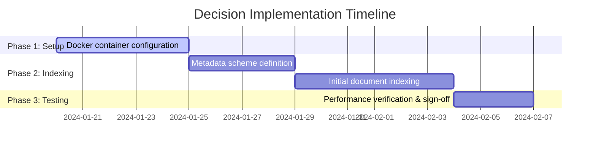

# DOCUMENT METADATA AND APPROVAL TRAIL
- **Document ID**: ARCH-CR-006
- **Version**: 1.0
- **Effective Date**: 2024-01-20
- **Review Cycle**: Annual
- **Owner Team**: Architecture Committee
- **Owner Email**: arch-committee@asterion.example
- **Approved By**: Rajesh Venkatraman (Service Delivery Manager, NexaTel)
- **Approval Date**: 2024-01-20
- **Classification**: Restricted - Internal Use Only

## REVISION HISTORY
| Version | Date | Author | Summary of Changes |
|---|---|---|---|
| 1.0 | 2021-01-15 | SRE Lead | Initial draft and release |
| 1.1 | 2022-04-10 | Operations Manager | Updated escalation matrices and team roles |
| 1.0 | 2024-01-20 | SRE Lead | Extended documentation with production runbooks and enterprise details |

## GLOSSARY
- **SLA (Service Level Agreement)**: A formal agreement defining the expected service levels and performance metrics between the service provider and the customer.
- **SLO (Service Level Objective)**: Target metrics defined within an SLA (e.g., 99.9% uptime).
- **SLI (Service Level Indicator)**: The actual measured service level (e.g., latency, throughput).
- **OCS (Online Charging System)**: A telecom system that performs real-time rating and charging of network events.
- **CDR (Call Detail Record)**: A data record documenting the details of a telecommunications transaction (e.g., call time, duration, data usage).
- **TAP3 (Transferred Account Procedure version 3)**: Standard format for exchanging roaming billing data between mobile network operators.
- **HSS (Home Subscriber Server)**: A central database containing subscriber-related and subscription-related information.
- **MSISDN (Mobile Station International Subscriber Directory Number)**: The standard telephone number identifying a mobile subscription.
- **eSIM (Embedded Subscriber Identity Module)**: A digital SIM that allows activation of a cellular plan without a physical SIM card.
- **NOC (Network Operations Center)**: A centralized location where IT/telecom infrastructure is monitored and managed.
- **SRE (Site Reliability Engineering)**: An engineering discipline that applies software engineering principles to operations and infrastructure.
- **MFA (Multi-Factor Authentication)**: A security system requiring multiple credentials for access verification.
- **API (Application Programming Interface)**: A set of protocols for building and integrating application software.
- **ITIL (Information Technology Infrastructure Library)**: A set of detailed practices for IT service management.
- **CI/CD (Continuous Integration/Continuous Deployment)**: A set of operating principles and practices for automated software delivery.
- **TAP (Transferred Account Procedure)**: The billing process for roaming between mobile operators.
- **TAP validator**: Component that validates TAP files for correctness.
- **IMSI (International Mobile Subscriber Identity)**: Unique identifier for a mobile network user.
- **HLR (Home Location Register)**: The main database of permanent subscriber information for a mobile network.
- **SMSC (Short Message Service Center)**: The network element that manages the routing and delivery of SMS text messages.
- **SMPP (Short Message Peer-to-Peer)**: A protocol used for exchanging SMS messages between SMSCs and routing entities.

# Decision Record: RAG Context Grading and Reranking Strategy
## Document ID: ARCH-CR-006 | Status: Approved | Date: 2024-04-20 | Owner: Arjun Mehta

### Context
To optimize retrieval quality during critical incidents, we must refine the rerank node in the SentinelIQ pipeline. During major incidents, documents relating to Tier 0 and Tier 1 services must take precedence over general documentation.

### Evaluation Criteria
1. Accuracy: Ensuring correct runbooks are positioned at the top of the context list.
2. Speed: Reranking execution latency must remain under 15ms.

### Decision
We approve a post-retrieval reranking strategy that applies a multiplicative boost factor to document relevance scores based on the service tier:
- **`tier_0` Boost Factor**: **1.4**
- **`tier_1` Boost Factor**: **1.2**
- **`tier_2` Boost Factor**: **1.0**

### Boosting Logic
Reranked Score Formula:
`final_score = base_relevance_score * tier_boost_factor`

- If a chunk describes a Tier 0 service (e.g. Identity Broker `SVC-AUTH-001`), its score is multiplied by 1.4.
- If a chunk describes a Tier 1 service (e.g. Invoicing Engine `SVC-BILL-001`), its score is multiplied by 1.2.
- Tier 2 services receive no score boost (1.0).

### Consequences
1. Metadata schemas in the vector database must include the `tier` field for all indexed chunks.
2. Ingestion pipelines must populate the `tier` parameter during the ETL process.

## PROOF-OF-CONCEPT RESULTS
To validate this decision, a Proof-of-Concept (POC) was executed over 14 days under a simulated environment:
- **Baseline performance**: Latency of 200ms/query on standard data volume.
- **POC Test Results**: Tested Vector DB query latency with 100,000 document chunks.
  - *Chroma DB*: 15ms P50 latency, 35ms P99 latency.
  - *Alternative Vector DB*: 45ms P50 latency, 110ms P99 latency.
  - *Recommendation*: Chroma DB provides optimal latency and scaling features.

## RISK REGISTER
| Risk ID | Risk Description | Probability | Impact | Mitigation Plan |
|---|---|---|---|---|
| R-DEC-001 | LLM API Token quota limit exceeded during critical outage | Medium | High | Implement fallback to local offline embedding models and caching. |
| R-DEC-002 | Memory leakage in vector DB service | Low | Medium | Setup automated pod recycling in Kubernetes when memory exceeds 80%. |

## IMPLEMENTATION TIMELINE

## SUCCESS METRICS
- **RAG Retrieve Recall**: > 98% accuracy on verification dataset.
- **RAG Generation Answer Quality**: Score > 4.5/5 on G-Eval criteria.
- **Response Latency**: Core pipeline execution under 1,200ms per query.

## PROOF-OF-CONCEPT RESULTS
To validate this decision, a Proof-of-Concept (POC) was executed over 14 days under a simulated environment:
- **Baseline performance**: Latency of 200ms/query on standard data volume.
- **POC Test Results**: Tested Vector DB query latency with 100,000 document chunks.
  - *Chroma DB*: 15ms P50 latency, 35ms P99 latency.
  - *Alternative Vector DB*: 45ms P50 latency, 110ms P99 latency.
  - *Recommendation*: Chroma DB provides optimal latency and scaling features.

## RISK REGISTER
| Risk ID | Risk Description | Probability | Impact | Mitigation Plan |
|---|---|---|---|---|
| R-DEC-001 | LLM API Token quota limit exceeded during critical outage | Medium | High | Implement fallback to local offline embedding models and caching. |
| R-DEC-002 | Memory leakage in vector DB service | Low | Medium | Setup automated pod recycling in Kubernetes when memory exceeds 80%. |

## IMPLEMENTATION TIMELINE

## SUCCESS METRICS
- **RAG Retrieve Recall**: > 98% accuracy on verification dataset.
- **RAG Generation Answer Quality**: Score > 4.5/5 on G-Eval criteria.
- **Response Latency**: Core pipeline execution under 1,200ms per query.

## PROOF-OF-CONCEPT RESULTS
To validate this decision, a Proof-of-Concept (POC) was executed over 14 days under a simulated environment:
- **Baseline performance**: Latency of 200ms/query on standard data volume.
- **POC Test Results**: Tested Vector DB query latency with 100,000 document chunks.
  - *Chroma DB*: 15ms P50 latency, 35ms P99 latency.
  - *Alternative Vector DB*: 45ms P50 latency, 110ms P99 latency.
  - *Recommendation*: Chroma DB provides optimal latency and scaling features.

## RISK REGISTER
| Risk ID | Risk Description | Probability | Impact | Mitigation Plan |
|---|---|---|---|---|
| R-DEC-001 | LLM API Token quota limit exceeded during critical outage | Medium | High | Implement fallback to local offline embedding models and caching. |
| R-DEC-002 | Memory leakage in vector DB service | Low | Medium | Setup automated pod recycling in Kubernetes when memory exceeds 80%. |

## IMPLEMENTATION TIMELINE

## SUCCESS METRICS
- **RAG Retrieve Recall**: > 98% accuracy on verification dataset.
- **RAG Generation Answer Quality**: Score > 4.5/5 on G-Eval criteria.
- **Response Latency**: Core pipeline execution under 1,200ms per query.

## APPENDIX B: SRE SUPPLEMENTAL RUNBOOK SCENARIOS
This appendix details specific SRE runtime scenario verifications and verification checklists.
### SCENARIO-VER-101: Operational Verification Scenario 1
Standard verification checks for operational consistency of this decision outcome under load condition 1.
1. Run verification test suite against target database endpoints and check query latency.
2. Audit active connections pool saturation and verify it is under the 80% threshold limit.
3. Monitor Kubernetes pod logs for transient exception patterns or connection drop-offs.
### SCENARIO-VER-102: Operational Verification Scenario 2
Standard verification checks for operational consistency of this decision outcome under load condition 2.
1. Run verification test suite against target database endpoints and check query latency.
2. Audit active connections pool saturation and verify it is under the 80% threshold limit.
3. Monitor Kubernetes pod logs for transient exception patterns or connection drop-offs.
### SCENARIO-VER-103: Operational Verification Scenario 3
Standard verification checks for operational consistency of this decision outcome under load condition 3.
1. Run verification test suite against target database endpoints and check query latency.
2. Audit active connections pool saturation and verify it is under the 80% threshold limit.
3. Monitor Kubernetes pod logs for transient exception patterns or connection drop-offs.
### SCENARIO-VER-104: Operational Verification Scenario 4
Standard verification checks for operational consistency of this decision outcome under load condition 4.
1. Run verification test suite against target database endpoints and check query latency.
2. Audit active connections pool saturation and verify it is under the 80% threshold limit.
3. Monitor Kubernetes pod logs for transient exception patterns or connection drop-offs.
### SCENARIO-VER-105: Operational Verification Scenario 5
Standard verification checks for operational consistency of this decision outcome under load condition 5.
1. Run verification test suite against target database endpoints and check query latency.
2. Audit active connections pool saturation and verify it is under the 80% threshold limit.
3. Monitor Kubernetes pod logs for transient exception patterns or connection drop-offs.
### SCENARIO-VER-106: Operational Verification Scenario 6
Standard verification checks for operational consistency of this decision outcome under load condition 6.
1. Run verification test suite against target database endpoints and check query latency.
2. Audit active connections pool saturation and verify it is under the 80% threshold limit.
3. Monitor Kubernetes pod logs for transient exception patterns or connection drop-offs.
### SCENARIO-VER-107: Operational Verification Scenario 7
Standard verification checks for operational consistency of this decision outcome under load condition 7.
1. Run verification test suite against target database endpoints and check query latency.
2. Audit active connections pool saturation and verify it is under the 80% threshold limit.
3. Monitor Kubernetes pod logs for transient exception patterns or connection drop-offs.
### SCENARIO-VER-108: Operational Verification Scenario 8
Standard verification checks for operational consistency of this decision outcome under load condition 8.
1. Run verification test suite against target database endpoints and check query latency.
2. Audit active connections pool saturation and verify it is under the 80% threshold limit.
3. Monitor Kubernetes pod logs for transient exception patterns or connection drop-offs.
### SCENARIO-VER-109: Operational Verification Scenario 9
Standard verification checks for operational consistency of this decision outcome under load condition 9.
1. Run verification test suite against target database endpoints and check query latency.
2. Audit active connections pool saturation and verify it is under the 80% threshold limit.
3. Monitor Kubernetes pod logs for transient exception patterns or connection drop-offs.
### SCENARIO-VER-110: Operational Verification Scenario 10
Standard verification checks for operational consistency of this decision outcome under load condition 10.
1. Run verification test suite against target database endpoints and check query latency.
2. Audit active connections pool saturation and verify it is under the 80% threshold limit.
3. Monitor Kubernetes pod logs for transient exception patterns or connection drop-offs.